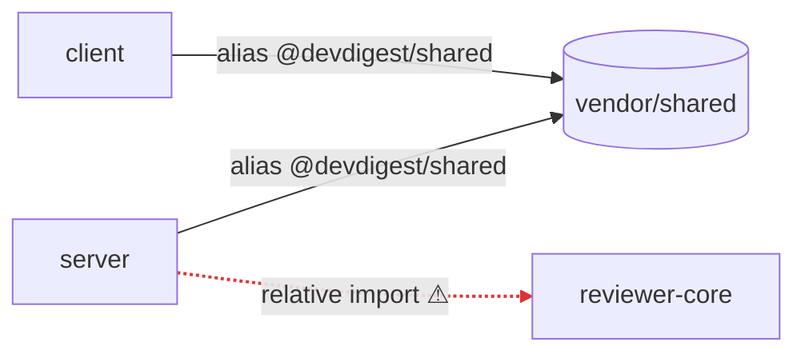

# dependency-checker — what do we depend on, what does it cost, what to fix first

Read-only audit. The only thing it may write is the report, and only if the
user asks for a file (default: answer in chat). It never edits a
`package.json`, never runs an install/remove/upgrade, never touches a lock
file.

Arguments: `$ARGUMENTS` — optional package names (`server client`) to limit
scope; `--no-size` skips size measurement; `--deep` also greps transitive
usage hints. No arguments → all packages that have a `package.json`.

## Principles

1. **Numbers come from the script, judgement from you.** Sizes, usage counts
   and drift are produced by `assets/collect.mjs`; never estimate a size by
   eye. A claim you can't source is marked `hypothesis`.
2. **Two kinds of dependency, never mixed.** *External* = npm packages in a
   `package.json`. *Internal* = code shared between this repo's packages.
   This repo is **not a monorepo** (no pnpm workspaces, no `workspace:*`);
   internal links are tsconfig path aliases (`@devdigest/shared` → hand-copied
   `vendor/shared`) and relative imports. Never describe them as workspace
   links.
3. **Every finding names a package/dependency and a file.** "Consider
   optimizing dependencies" is not a finding.
4. **Recommend, don't execute.** Phrase removals and upgrades as "recommend
   removing `moment` from `server/package.json` — confirm?".
5. **Say what the script can't see.** Usage detection is an import-string
   match; dynamic imports, CLI-only tools and transitive use are invisible,
   so `unused` is always "candidate" until a human confirms.

## Phase 1 — Collect

```sh
node .claude/skills/dependency-checker/assets/collect.mjs [--pkg server --pkg client]
```

Output is JSON: per package the manager (pnpm/npm), `node_modules` size and
each dep with `spec`, `kind`, `size_kb`, `used_in {src, tests,
config_or_scripts}`, `unused_candidate`; plus `drift` (same name, different
spec across packages), `duplicated_across_packages`, `internal_edges`
(counts per `from -> to (via)`), `internal_edge_samples` and `limits`.

If a package has no `node_modules`, its sizes are `null`: report "not
installed — size unknown" and name the install command from its
`AGENTS.md` (pnpm vs npm differs). If the script fails, report that and stop
— don't reconstruct numbers from memory.

Then, only where a finding needs it, read the cited files (the importing
file, `package.json`, `tsconfig.json`). Don't read lock files.

## Phase 2 — Judge

Work through the checks in order; write "nothing found" rather than skipping.

| # | Check | Evidence | Typical tier |
|---|---|---|---|
| 1 | **Boundary violation** — a package imports another's source by relative path instead of its alias/public entry (`../../reviewer-core/src/...`) | `internal_edge_samples` | P0 |
| 2 | **Vendored contract drift** — `server/src/vendor/shared` vs `client/src/vendor/shared` out of sync | `./scripts/check-shared-sync.sh` | P0 |
| 3 | **Version drift** — same dependency, different version across packages (esp. `zod`, `typescript`, `vitest`) | `drift` | P1 (runtime dep) / P2 (dev) |
| 4 | **Unused candidate** — declared, zero imports in src/tests/config | `unused_candidate` | P1 if large, else P2 |
| 5 | **Heavy dependency** — top size contributors; a heavy dep with a light alternative or used by one file (`moment`, full `lodash`) | `size_kb` | P1 / P2 |
| 6 | **Misplaced kind** — runtime import of a `devDependency`, or a build/test tool under `dependencies` | `kind` vs `used_in` | P1 |
| 7 | **Duplicated across packages** — same dep in several packages (expected for `typescript`; suspicious for runtime libs) | `duplicated_across_packages` | Info / P2 |
| 8 | **Manager mismatch** — `server`/`client` pnpm, `reviewer-core`/`e2e` npm is *by design* (see root `AGENTS.md`) | `manager` | Info only |

Severity tiers (use exactly these labels):

- **P0** — breaks an architectural rule or can break a build/runtime
  (boundary violation, contract drift, a runtime import that isn't declared).
- **P1** — real cost or risk: runtime version drift, large unused dep,
  misplaced dependency kind.
- **P2** — hygiene: dev-only drift, small unused dep, avoidable duplication.
- **Info** — observations that need no action (expected duplication, manager
  split by design).

Prioritize inside a tier by `size_kb` descending, then by number of packages
affected.

## Phase 3 — Report

Produce the report in **exactly these six sections, in this order**. Keep
tables compact; one row per item, no "and others".

### 1. Scope
Packages analyzed (client, server, reviewer-core, mcp-server, e2e, evals),
package manager of each, which have `node_modules` (size known) and which
don't, date, and the script's `limits` in one line.

### 2. Dependency graph
A Mermaid `flowchart` (see [mermaid-diagram](../mermaid-diagram/SKILL.md)).
Rules: one node per package; **solid arrows = internal links** labelled with
the mechanism (`alias @devdigest/shared`, `relative import`); **dashed arrows
= shared external libs** (only for libs declared in ≥3 packages, e.g.
`zod`); heavy external deps (≥ 10 MB) as a separate node style. Flag
violating edges red with `linkStyle`. Under the diagram, one sentence on how
to read it.



### 3. Size breakdown
Per package: total `node_modules` size, then a table of its top 8
dependencies.

| Package | Dependency | Version | Kind | Installed size | Used in |
|---|---|---|---|---|---|
| client | next | 15.0.3 | dep | 132 MB | 41 files |

Below the tables: the top 5 heaviest dependencies repo-wide and the share of
total they represent. Sizes are the dependency itself, not its transitive
tree — say so once.

### 4. Internal vs external dependencies
Two short lists, never merged:
- **Internal** — each `from → to (via)` edge with a count; mark compliant
  (alias) vs violating (relative import into another package's `src`).
- **External** — count per package and the drift / duplication table
  (`dep | package → version`).

### 5. Findings & priorities
Grouped under `### P0`, `### P1`, `### P2`, `### Info` (omit an empty tier
with "none"). Every finding is one block:

```
- **[P1] moment — unused runtime dependency** · server/package.json
  Evidence: 0 imports in server/src, 4.2 MB installed.
  Recommendation: remove `moment` from server/package.json (confirm first).
  Effort: S
```

Fields: tier, short title, location (file), evidence (a number or a
`file:line`), recommendation (a concrete action), effort S/M/L.

### 6. Summary
3–5 takeaways ordered by priority, each one line and each naming a
package: the single most important fix first, then what to do this sprint,
then what can wait. End with the question of which recommendations to apply;
apply nothing until the user answers.

## Anti-patterns

- Claiming the packages are linked by `workspace:*` or pnpm workspaces.
- Calling a dependency "unused" without the `candidate` caveat, or deleting
  it yourself.
- Reporting sizes for packages with no `node_modules` instead of "unknown".
- Unranked finding lists, or a tier label that isn't P0/P1/P2/Info.
- Flagging the pnpm-vs-npm split as a defect — it is by design.
- Reading lock files or whole `node_modules` trees into context.
