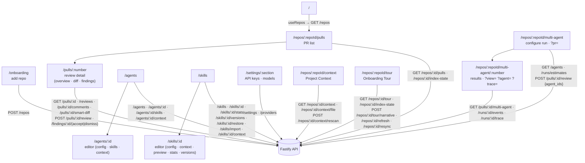

# `@devdigest/web` — the studio (Next.js 15)

The DevDigest UI: import repos, browse pull requests, run and read AI reviews,
and author agents and skills. App Router + React Server/Client components,
data via **TanStack Query** hooks over the Fastify API. (This is the starter
surface plus L02's Skills Lab; course lessons add Memory, Eval, Blast/Brief,
multi-agent, CI, and dashboard screens.)

- **Stack:** Next.js 15 (App Router), React 19, TanStack Query, `next-intl`
  (messages in `messages/<locale>/*.json`), `recharts`, `mermaid`,
  `react-markdown`. UI primitives are vendored under `src/vendor/ui`
  (`@devdigest/ui`) and shared Zod contracts under `src/vendor/shared`
  (`@devdigest/shared`).
- **API base:** `NEXT_PUBLIC_API_BASE` (default `http://localhost:3001`), used by
  `src/lib/api.ts`. Every data hook lives in `src/lib/hooks/*`.
- **Run:** `pnpm dev` (`:3000`). **Test:** `pnpm test` (vitest + jsdom, fetch
  mocked — no API needed). **Typecheck:** `pnpm typecheck`.

## UI route map

Routes (`src/app/**/page.tsx`) and the API surface each leans on (via
`src/lib/hooks/*` → `src/lib/api.ts`):

`/repos/:repoId/tour` (`src/app/repos/[repoId]/tour/`) is the Onboarding Tour:
five facts-built sections, an "On this page" rail, an optional AI narrative and
Markdown export. Behaviour: [specs/pages.md](specs/pages.md#reposrepoidtour);
wiring: [docs/ui-architecture.md](docs/ui-architecture.md#onboarding-tour-hooks-and-view).

`/repos/:repoId/multi-agent` (`src/app/repos/[repoId]/multi-agent/`) configures a
parallel run of 2+ agents on one PR; `?pr=<number>` preselects the PR
(`multi-agent/helpers.ts:36`). `/repos/:repoId/multi-agent/:number`
(`multi-agent/[number]/`) shows the PR's latest group. Its URL state:
`?view=columns|tabs` (default `columns`), `?agent=<run_id>` (selected tab; first
column if unknown), `?trace=<run_id>` (opens that member's trace; only runs of
the group are accepted) (`[number]/helpers.ts:13-28`). The sidebar entry
"Multi-Agent Review" sits in the GLOBAL nav section and links to
`/repos/:repoId/multi-agent` (`src/vendor/ui/nav.ts:41-45`). Server contract:
[api-contracts](../server/docs/api-contracts.md#multi-agent-review).

`/repos/:repoId/context` (`src/app/repos/[repoId]/context/`) is the read-only
Project Context page: document list with category chips and a filter, a safe
Markdown preview, a freshness footer and Rescan. Filter, chips and the selected
document live in the URL. Hooks: `src/lib/hooks/context.ts`. Each row shows
"Used by N agents · M skills" (or "Not used", or "Usage unavailable" when
`used_by` is `null`); activating it opens a scrollable list of links to
`/agents/:id?tab=context` and `/skills/:id?tab=context`
(`ProjectContextView/_components/UsedBy/`).

### Context tabs (attachments)

The agent editor and the skill editor each have a **Context** tab
(`agents/[id]/_components/AgentEditor/_components/ContextTab/`,
`skills/_components/SkillsView/_components/SkillEditor/_components/ContextTab/`)
that attaches and orders Project Context documents. The shared list,
reorder logic and budget meter live in `src/components/context-attachments/`
(`AttachList`, `AttachRow`, `BudgetMeter`, `TokenEstimate`; it may not import
from `app/`). Data comes from `useAgentContext` / `useSetAgentContext` /
`useSkillContext` / `useSetSkillContext` (`src/lib/hooks/context.ts`) over the
[attachments routes](../server/docs/api-contracts.md#project-context-attachments).

- A repository selector (defaults to the active repository) filters the list;
  a save sends the **full** ordered list across all repositories.
- Reorder with the drag handle or the Move up / Move down buttons; there is no
  reorder shortcut. A failed save reverts to the last server-confirmed list and
  shows Retry; "Saved" is announced in a `role="status"` region.
- The agent tab adds a read-only "Inherited from skills" section and the budget
  meter "≈ T / 8,000 tokens" with the documents a run would skip. The skill tab
  adds "Serializes as", the exact block the skill's documents produce.
- Long paths are middle-truncated to 56 visible characters; the full path stays
  the title and the checkbox's accessible name.

**Gotcha: tab validation lives in two page-level lists.** An editor tab is
reachable through `?tab=` only if its key is also in the page's `VALID_TABS`:
`agents/[id]/page.tsx:15` and `skills/_components/SkillsView/constants.ts:4`.
A tab added only to the editor's own `TABS` silently falls back to Config and
breaks every "Used by" link. `SkillsView/constants.test.ts` asserts each editor
tab is in `VALID_TABS` and that Context is second.

### Run drawer: project context

The run trace drawer (`pulls/[number]/_components/RunTraceDrawer/`) labels the
block "Project context — attached specs (untrusted)", shows each "Specs read"
path as a link to `/repos/:repoId/context?doc=` with the run's short SHA, shows
per-block "≈ N tokens · estimate" (the project-context block uses the server's
`project_context.total_est_tokens`) and the run total as "actual". The
fullscreen prompt modal lists skipped documents and a jump list of `###`
headings above the stored text. Traces without `project_context` render
"Specs read: none" as before. The fullscreen prompt dialog has its own focus
handling (`PromptBlock/useModalFocus.ts`: focus in, Escape, Tab wrap, focus
return). The vendored `Modal` is unchanged, so the other dialogs built on it
still lack Escape and focus handling (known gap).

Cross-cutting chrome lives in `src/components/app-shell` (nav, breadcrumbs,
`g`-then-key shortcuts). Pages are thin; feature logic sits in colocated
`_components/<Name>/` folders, each with its own `*.test.tsx`.

## Testing

Component/interaction tests (`*.test.tsx`) run under vitest + jsdom with `fetch`
mocked, so they need neither the API nor a browser. The real browser journeys
(client + API + seeded DB) are covered by the deterministic agent-browser suite
in [`../e2e`](../e2e/README.md) and the `e2e-web.yml` workflow. See
[`../TESTING.md`](../TESTING.md).
