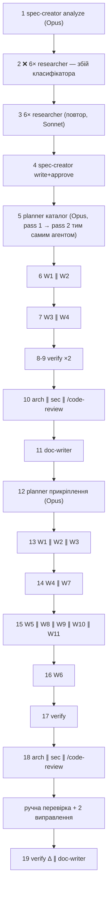

# Retro: Project Context (каталог + прикріплення) — 2026-09-30
Session: 39ee7e48 · Workflow: spec-creator (analyze) → 6× researcher → spec-creator (write, approve) → planner → /impl (каталог, 2 хвилі) → planner → /impl (прикріплення, 4 хвилі) + 2 раунди рев'ю, ручна перевірка в браузері, doc-writer, /pr-self-review

## Підсумок
Tokens: 6 118k нового входу · 241 333k cache-read · 449k виводу (thinking ≈ 25 % виводу) · Cost: — (у `prices.json` ставок немає) · Agents: 39 транскриптів з 41 запуску (6 невдалих, усі в одному пакеті) ·
Active/wall: головна сесія 171 хв / 28.7 год; субагенти разом 112 хв · Biggest cost: головна сесія (36 % нового входу, 82 % cache-read, 81 % виводу), серед субагентів — два планувальники (892k нового входу, 14.9M cache-read) ·
Biggest lesson: дорогий не пул агентів, а довга головна сесія з контекстом, який несе весь ланцюжок; а помилки, що дійшли до верифікації, походять із прогалин у *плані* (тести-споживачі, реєстри вкладок, припущення про `Modal`), а не з коду агентів.

## Метрики  (таблиці скрипта `collect.mjs`, без змін)

## Totals
- Main session: 2211k in-new · 197750k cache-read · 365k out (cache hit 99%), 377 assistant turns, active 2.8h / wall 28.7h
- Subagents: 3907k in-new · 43583k cache-read · 84k out
- **All: 6118k in-new · 241333k cache-read · 449k out**  (thinking inside output: 110k)
- Agent launches: 41 in 19 batch(es); started 39; **launch failures 6**
- "in-new" = fresh input + cache writes; cache-read is re-read context, billed far cheaper. Cost appears only for models with rates in assets/prices.json.

## Launch order
| # | batch | agent | task | model | prompt | shared prompt lines | result |
|---|---|---|---|---|---|---|---|
| 1 | 1 | spec-creator | Spec analyze: Project Context | opus-5-5 | 6.6k chars | — | ✔ started |
| 2 | 2 | researcher | RQ1: e2e clone fixtures | — | 691 chars | — | ❌ The server-side auto mode classifier gave no verdict (error) |
| 3 | 2 | researcher | RQ2: clone read path safety | — | 936 chars | — | ❌ The server-side auto mode classifier gave no verdict (error) |
| 4 | 2 | researcher | RQ3: resync atomicity | — | 843 chars | — | ❌ The server-side auto mode classifier gave no verdict (error) |
| 5 | 2 | researcher | RQ4: react-markdown safety | — | 741 chars | — | ❌ The server-side auto mode classifier gave no verdict (error) |
| 6 | 2 | researcher | RQ5: token estimator drift | — | 850 chars | — | ❌ The server-side auto mode classifier gave no verdict (error) |
| 7 | 2 | researcher | RQ6: model context windows | — | 845 chars | — | ❌ The server-side auto mode classifier gave no verdict (error) |
| 8 | 3 | researcher | RQ1: e2e clone fixtures | sonnet-5-5 | 691 chars | 0% | ✔ started |
| 9 | 3 | researcher | RQ2: clone read path safety | sonnet-5-5 | 929 chars | 0% | ✔ started |
| 10 | 3 | researcher | RQ3: resync atomicity | sonnet-5-5 | 843 chars | 0% | ✔ started |
| 11 | 3 | researcher | RQ4: react-markdown safety | sonnet-5-5 | 741 chars | 0% | ✔ started |
| 12 | 3 | researcher | RQ5: token estimator drift | sonnet-5-5 | 850 chars | 0% | ✔ started |
| 13 | 3 | researcher | RQ6: model context windows | sonnet-5-5 | 845 chars | 0% | ✔ started |
| 14 | 4 | spec-creator | Approve both Project Context specs | opus-5-5 | 762 chars | — | ✔ started |
| 15 | 5 | implementation-planner | Planner pass 1: catalog spec | opus-5-5 | 3.2k chars | — | ✔ started |
| 16 | 6 | implementer | Implement W1: contracts | sonnet-5-5 | 597 chars | 0% | ✔ started |
| 17 | 6 | implementer | Implement W2: server foundation | sonnet-5-5 | 775 chars | 0% | ✔ started |
| 18 | 7 | implementer | Implement W3: server module | sonnet-5-5 | 1.2k chars | 0% | ✔ started |
| 19 | 7 | implementer | Implement W4: client | sonnet-5-5 | 1.3k chars | 0% | ✔ started |
| 20 | 8 | plan-verifier | Verify implementation against plan | sonnet-5-5 | 2.2k chars | — | ✔ started |
| 21 | 9 | plan-verifier | Re-verify fixed rows | sonnet-5-5 | 2.1k chars | — | ✔ started |
| 22 | 10 | architecture-reviewer | Architecture review of the diff | sonnet-5-5 | 1.9k chars | 0% | ✔ started |
| 23 | 10 | security-reviewer | Security review of the diff | sonnet-5-5 | 2.1k chars | 0% | ✔ started |
| 24 | 11 | doc-writer | Document the Project Context catalog | sonnet-5-5 | 3.2k chars | — | ✔ started |
| 25 | 12 | implementation-planner | Planner pass 1: attachments spec | opus-5-5 | 4.7k chars | — | ✔ started |
| 26 | 13 | implementer | Implement W1: contracts | sonnet-5-5 | 1.3k chars | 0% | ✔ started |
| 27 | 13 | implementer | Implement W2: attachments schema | sonnet-5-5 | 1.3k chars | 0% | ✔ started |
| 28 | 13 | implementer | Implement W3: reviewer-core engine | sonnet-5-5 | 1.1k chars | 0% | ✔ started |
| 29 | 14 | implementer | Implement W4: server data + catalog port | sonnet-5-5 | 2.0k chars | 0% | ✔ started |
| 30 | 14 | implementer | Implement W7: client base | sonnet-5-5 | 1.9k chars | 0% | ✔ started |
| 31 | 15 | implementer | Implement W5: context-attachments module | sonnet-5-5 | 2.6k chars | 0% | ✔ started |
| 32 | 15 | implementer | Implement W8: Agent Context tab | sonnet-5-5 | 2.3k chars | 0% | ✔ started |
| 33 | 15 | implementer | Implement W9: Skill Context tab | sonnet-5-5 | 2.4k chars | 0% | ✔ started |
| 34 | 15 | implementer | Implement W10: run drawer changes | sonnet-5-5 | 2.2k chars | 0% | ✔ started |
| 35 | 15 | implementer | Implement W11: Used by on catalog page | sonnet-5-5 | 2.0k chars | 0% | ✔ started |
| 36 | 16 | implementer | Implement W6: run injection | sonnet-5-5 | 3.6k chars | — | ✔ started |
| 37 | 17 | plan-verifier | Verify attachments implementation | sonnet-5-5 | 4.4k chars | — | ✔ started |
| 38 | 18 | architecture-reviewer | Architecture review of attachments | sonnet-5-5 | 2.7k chars | 0% | ✔ started |
| 39 | 18 | security-reviewer | Security review of attachments | sonnet-5-5 | 2.7k chars | 0% | ✔ started |
| 40 | 19 | plan-verifier | Delta verify after manual fixes | sonnet-5-5 | 2.6k chars | 0% | ✔ started |
| 41 | 19 | doc-writer | Document the attachments feature | sonnet-5-5 | 5.2k chars | 0% | ✔ started |

## Per agent
| agent | task | active | wall | tool uses | errors | resumed | tokens | cache hit | cost |
|---|---|---|---|---|---|---|---|---|---|
| spec-creator:a12cd0 | Spec analyze: Project Context | 13m | 16.4h | 56 | 2 | 2× | 503k in-new · 3974k cache-read · 37k out | 89% | — |
| researcher:adf7ef | RQ1: e2e clone fixtures | 61s | 61s | 6 | 0 | 0× | 25k in-new · 108k cache-read · 307 out | 81% | — |
| researcher:ab74bb | RQ2: clone read path safety | 51s | 51s | 6 | 0 | 0× | 23k in-new · 99k cache-read · 106 out | 81% | — |
| researcher:a56233 | RQ3: resync atomicity | 54s | 54s | 5 | 0 | 0× | 25k in-new · 85k cache-read · 64 out | 77% | — |
| researcher:a92b7f | RQ4: react-markdown safety | 34s | 34s | 4 | 0 | 0× | 19k in-new · 58k cache-read · 82 out | 75% | — |
| researcher:a905a7 | RQ5: token estimator drift | 63s | 63s | 8 | 0 | 0× | 39k in-new · 98k cache-read · 74 out | 71% | — |
| researcher:ae3c46 | RQ6: model context windows | 53s | 53s | 6 | 0 | 0× | 31k in-new · 99k cache-read · 88 out | 76% | — |
| spec-creator:a3411f | Approve both Project Context specs | 62s | 62s | 8 | 0 | 0× | 62k in-new · 205k cache-read · 4.2k out | 77% | — |
| implementation-planner:ac9df7 | Planner pass 1: catalog spec | 12m | 4.9h | 47 | 1 | 1× | 402k in-new · 6648k cache-read · 3.5k out | 94% | — |
| implementer:a247dd | Implement W1: contracts | 44s | 44s | 9 | 1 | 0× | 47k in-new · 231k cache-read · 1.0k out | 83% | — |
| implementer:a9539d | Implement W2: server foundation | 2m | 2m | 19 | 0 | 0× | 84k in-new · 659k cache-read · 1.4k out | 89% | — |
| implementer:a65891 | Implement W3: server module | 5m | 5m | 24 | 0 | 0× | 141k in-new · 1894k cache-read · 1.7k out | 93% | — |
| implementer:a8fb80 | Implement W4: client | 5m | 5m | 27 | 0 | 0× | 111k in-new · 1877k cache-read · 1.5k out | 94% | — |
| plan-verifier:a9b3bd | Verify implementation against plan | 3m | 3m | 27 | 0 | 0× | 124k in-new · 967k cache-read · 1.3k out | 89% | — |
| plan-verifier:ad63e4 | Re-verify fixed rows | 2m | 2m | 28 | 1 | 0× | 50k in-new · 430k cache-read · 1.1k out | 90% | — |
| architecture-reviewer:aacd8b | Architecture review of the diff | 63s | 63s | 7 | 0 | 0× | 36k in-new · 116k cache-read · 307 out | 76% | — |
| security-reviewer:ae5bbc | Security review of the diff | 50s | 50s | 8 | 0 | 0× | 44k in-new · 256k cache-read · 749 out | 85% | — |
| general-purpose:abd2d0 | /code-review medium | 47s | 47s | 5 | 0 | 0× | 63k in-new · 201k cache-read · 2.2k out | 76% | — |
| general-purpose:a55c8b | /code-review medium server/src/modules/project-co… | 31s | 31s | 4 | 0 | 0× | 33k in-new · 146k cache-read · 799 out | 82% | — |
| doc-writer:a71dca | Document the Project Context catalog | 2m | 2m | 16 | 0 | 0× | 82k in-new · 622k cache-read · 110 out | 88% | — |
| implementation-planner:a2cf36 | Planner pass 1: attachments spec | 14m | 27m | 50 | 0 | 1× | 490k in-new · 8250k cache-read · 3.3k out | 94% | — |
| implementer:a91a10 | Implement W1: contracts | 64s | 64s | 12 | 0 | 0× | 48k in-new · 282k cache-read · 1.3k out | 85% | — |
| implementer:ae2ff4 | Implement W2: attachments schema | 45s | 45s | 10 | 0 | 0× | 43k in-new · 258k cache-read · 521 out | 86% | — |
| implementer:a0ff05 | Implement W3: reviewer-core engine | 2m | 2m | 24 | 0 | 0× | 80k in-new · 832k cache-read · 1.6k out | 91% | — |
| implementer:ac7992 | Implement W4: server data + catalog port | 4m | 4m | 27 | 0 | 0× | 107k in-new · 1892k cache-read · 1.4k out | 95% | — |
| implementer:a2610a | Implement W7: client base | 4m | 4m | 17 | 0 | 0× | 80k in-new · 896k cache-read · 161 out | 92% | — |
| implementer:adcb35 | Implement W5: context-attachments module | 5m | 5m | 27 | 0 | 0× | 121k in-new · 1925k cache-read · 1.1k out | 94% | — |
| implementer:ab5f1b | Implement W8: Agent Context tab | 3m | 3m | 16 | 0 | 0× | 71k in-new · 752k cache-read · 837 out | 91% | — |
| implementer:a8835b | Implement W9: Skill Context tab | 3m | 3m | 14 | 0 | 0× | 53k in-new · 542k cache-read · 776 out | 91% | — |
| implementer:a3591e | Implement W10: run drawer changes | 4m | 4m | 25 | 0 | 0× | 85k in-new · 1356k cache-read · 1.1k out | 94% | — |
| implementer:a21c8a | Implement W11: Used by on catalog page | 2m | 2m | 8 | 1 | 0× | 43k in-new · 256k cache-read · 929 out | 86% | — |
| implementer:a4c7c0 | Implement W6: run injection | 3m | 3m | 28 | 0 | 0× | 119k in-new · 1537k cache-read · 2.1k out | 93% | — |
| plan-verifier:ac3047 | Verify attachments implementation | 4m | 4m | 43 | 0 | 0× | 169k in-new · 1839k cache-read · 1.5k out | 92% | — |
| architecture-reviewer:acbeac | Architecture review of attachments | 2m | 2m | 14 | 0 | 0× | 46k in-new · 372k cache-read · 690 out | 89% | — |
| security-reviewer:a82ab9 | Security review of attachments | 57s | 57s | 8 | 0 | 0× | 63k in-new · 300k cache-read · 1.1k out | 83% | — |
| general-purpose:afe0bb | /code-review medium | 54s | 54s | 8 | 0 | 0× | 86k in-new · 328k cache-read · 3.4k out | 79% | — |
| general-purpose:a0b404 | /code-review medium client/src/app/repos/[repoId]… | 31s | 31s | 5 | 0 | 0× | 51k in-new · 228k cache-read · 1.0k out | 82% | — |
| plan-verifier:ac2b38 | Delta verify after manual fixes | 2m | 2m | 20 | 0 | 0× | 59k in-new · 646k cache-read · 1.3k out | 92% | — |
| doc-writer:aa6124 | Document the attachments feature | 4m | 4m | 24 | 1 | 0× | 148k in-new · 2320k cache-read · 1.9k out | 94% | — |

Обмеження скрипта, яке видно в цих даних: стовпець «shared prompt lines» дорівнює 0 % у всіх пакетах, бо рахує збіг цілих рядків, а абзаци-шаблони в промптах implementer'ів (читати SKILL.md, не комітити, перевірка тестів) довгі й не збігаються побуквено; це метрика, а не доказ відсутності дублювання. Список «файли кількох агентів» — евристика за рядками шляхів: містить хибні збіги на кшталт `.devdigest/specs/a.md` (фікстура в тестах) і `.it.test.ts` (шаблон у Bash-команді).

Перші рядки списку файлів, якими займалося кілька агентів:

## Files touched by more than one agent (duplicated reading, heuristic)
- `client/src/app/repos/[repoId]/context/_components/ProjectContextView/helpers.ts` — general-purpose:a0b404, implementer:a21c8a, implementer:a2610a, implementer:a3591e, implementer:a65891, security-reviewer:a82ab9, implementer:a8835b, researcher:a905a7, doc-writer:aa6124, implementer:ab5f1b, general-purpose:abd2d0, security-reviewer:ae5bbc, implementation-planner:a2cf36, plan-verifier:a9b3bd, plan-verifier:ad63e4
- `docs/plans/project-context-attachments.md` — implementer:a0ff05, implementer:a21c8a, implementer:a3591e, implementer:a4c7c0, security-reviewer:a82ab9, implementer:a8835b, implementer:a91a10, doc-writer:aa6124, implementer:ab5f1b, plan-verifier:ac2b38, plan-verifier:ac3047, implementer:ac7992, implementer:adcb35, implementer:ae2ff4, implementer:a2610a
- `server/src/modules/context-attachments/service.ts` — implementation-planner:a2cf36, implementer:a65891, doc-writer:a71dca, security-reviewer:a82ab9, doc-writer:aa6124, general-purpose:abd2d0, implementer:ac7992, security-reviewer:ae5bbc, implementer:a4c7c0, plan-verifier:ac3047, general-purpose:afe0bb, architecture-reviewer:acbeac, implementer:adcb35
- `server/src/platform/container.ts` — implementation-planner:a2cf36, implementer:a65891, doc-writer:a71dca, doc-writer:aa6124, implementation-planner:ac9df7, architecture-reviewer:acbeac, implementer:a4c7c0, security-reviewer:a82ab9, plan-verifier:a9b3bd, architecture-reviewer:aacd8b, plan-verifier:ac3047, implementer:ac7992, implementer:adcb35
- `../reviewer-core/src/prompt.ts` — implementer:a0ff05, spec-creator:a12cd0, implementation-planner:a2cf36, implementer:a3591e, implementer:a4c7c0, security-reviewer:a82ab9, doc-writer:aa6124, plan-verifier:ac3047, architecture-reviewer:acbeac, researcher:ae3c46, general-purpose:afe0bb, implementer:adcb35
- `server/INSIGHTS.md` — spec-creator:a12cd0, implementer:a247dd, implementation-planner:a2cf36, implementer:a4c7c0, implementer:a65891, implementer:a9539d, doc-writer:aa6124, plan-verifier:ac3047, implementer:ac7992, implementation-planner:ac9df7, implementer:adcb35, implementer:ae2ff4
- `client/src/app/skills/_components/SkillsView/_components/SkillEditor/constants.ts` — spec-creator:a12cd0, implementer:a21c8a, implementation-planner:a2cf36, implementer:a65891, doc-writer:a71dca, implementer:a8835b, doc-writer:aa6124, implementer:ab5f1b, general-purpose:abd2d0, security-reviewer:ae5bbc, plan-verifier:ac3047
- `../../client/src/lib/hooks/context.ts` — implementer:a2610a, doc-writer:a71dca, architecture-reviewer:aacd8b, general-purpose:abd2d0, plan-verifier:ad63e4, general-purpose:afe0bb, implementer:a8835b, implementer:a8fb80, doc-writer:aa6124, implementer:ab5f1b, security-reviewer:ae5bbc

## Порядок запуску

Критичний шлях: кожен план → хвилі W (залежності за контрактами й схемою) → верифікація → рев'ю → ручна перевірка. Пакети 6/7 (каталог) і 13–16 (прикріплення) розбиті за залежністю контрактів, а не штучно; W7 (клієнт) міг стартувати разом із W1, але залежав від його DTO. Пакет 19 уже паралелить verify з doc-writer.

Пакети: 1 — аналіз; 2 — 6 researcher не стартували (classifier, transient), 3 — повтор, усі вдалися; 4 — затвердження спеків; 5 — планувальник; 6–7 — хвилі каталогу; 8–9 — верифікація й повторна; 10 — рев'ю; 11 — документація; 12 — другий планувальник; 13–16 — хвилі прикріплень; 17 — верифікація; 18 — рев'ю; 19 — дельта-верифікація і документація.

Час очікування користувача: wall 28.7 год − active 2.8 год ≈ 26 год — це паузи користувача (читання спеків/планів, відповіді на питання, ніч), а не повільні кроки: найдовші субагенти працювали 12–14 хв (планувальники) і 5 хв (implementer'и). Wall `spec-creator:a12cd0` (16.4 год) і `implementation-planner:ac9df7` (4.9 год) — теж очікування відповідей; їхня активна робота 13 і 12 хв.

## Що було складно

| R# | Спостереження | Доказ | Вплив | Агент |
|---|---|---|---|---|
| R-B1 | 6 researcher не стартували одночасно (класифікатор без вердикту), повтор одразу вдався | пакет 2, 6 помилок у «Errors in the main session» | один зайвий раунд; без втрати даних | researcher ×6 |
| R-B2 | Повна перевірка після хвилі 1 знайшла тест, якого не було в плані (`server/test/prompt-structured.test.ts` ще передавав `specs: string[]`) | виправлено в головній сесії; `test/**` не тайпчекається | виявлено лише запуском повного набору | implementer W3 (план не назвав файл) |
| R-B3 | Вкладки Context були недосяжні: список `VALID_TABS` живе ще на рівні сторінки, а не лише в редакторі; знайшов W8 (звіт) для агентів і я через grep для skills | `agents/[id]/page.tsx`, `SkillsView/constants.ts` | «Used by» вів би на Config | implementer W8/W9 + план |
| R-B4 | Вигадка «Modal вже тримає фокус» виявилась хибною: спільний `Modal` не має Esc/фокусу; план (C17) це припускав | знайдено лише живим запуском | доступність NFR-6, виправлено лише локально | implementer W10 + план |
| R-B5 | Браузерна автоматизація у прихованій вкладці: 3 таймаути CDP по 45 с, одна помилка групи вкладок, застарілі знімки | «Errors in the main session», ~10 викликів на відновлення | втрачений час; F4 не підтверджено наживо | головна сесія |
| R-B6 | `/impl` не можна запустити через Skill (зарезервовано для користувача) | помилка в списку; користувач запустив сам | один зайвий крок | головна сесія |
| R-B7 | `spec-creator:a12cd0` відновлювали 2 рази, накопичив 3.97M cache-read; `implementation-planner` — по одному відновленню (pass 1 → pass 2) і 6.6M / 8.3M cache-read | таблиця «Per agent» | найдорожчі субагенти | spec-creator, planner ×2 |

## Що далося легко

- **researcher ×6 (повтор):** 34–63 с, 4–8 викликів, 0 помилок, 19–39k нового входу кожен. Причина: вузьке питання з названими файлами й чітким форматом виходу. Шаблон, який варто копіювати.
- **implementer'и хвиль:** 14 з 15 без помилок, 44 с – 5 хв, 43–141k нового входу; у промпті — шлях до плану, номер пакета й «читай лише Constraints, свій рядок і кроки». Проблеми траплялись там, де *план* не називав файл, а не де агент «поводився погано».
- **рев'ювери (arch, sec, /code-review):** 31–63 с, 0 помилок; знахідки прийнято або оспорено без переробок (F1–F7).
- **plan-verifier:** 4 запуски, 0 `unmet` рядків; дельта-режим (`Rows to re-check`) дешевий (50–59k нового входу проти 124–169k для повного).

## Дублювання

| R# | Що | Доказ | Вплив |
|---|---|---|---|
| R-D1 | Весь план прикріплень (774 рядки, ≈62 KB) читали 15 агентів, хоч промпт велить «лише Constraints, свій рядок і кроки»; `Read` повертає файл цілком | overlap: `docs/plans/project-context-attachments.md` — 15 агентів | гіпотеза: 15 × ≈16–20k токенів ≈ 250–300k нового входу; не виміряно |
| R-D2 | `server/INSIGHTS.md` — 12 агентів, `server/AGENTS.md` — 10, `reviewer-core/INSIGHTS.md` — 9 | overlap | частково виправдано (правила проєкту), але кожен читає весь файл |
| R-D3 | Абзаци-шаблони в 15 промптах implementer'ів (читати SKILL.md, не комітити, грепнути `test/**`, перевірити компіляцію тестів) | промпти вручну (метрика скрипта = 0 %, див. обмеження) | токенів небагато, але вони не закріплені в `implementer.md`, тож залежать від того, чи згадаю їх у промпті; першого разу W2/W3 пропустили читання skills |
| R-D4 | Одні й ті самі знахідки повторювалися в звітах агентів і знову в моєму переказі (наприклад, «`BlobTooLargeError`», «`used_by` завжди null», «/resync без власника») | звіти | читання користувача, а не токени; прийнятне |

## Що пропустили

**Таблиця закриття прогалин** (з розділу скрипта «Gaps the agents reported themselves» та звітів):

| Агент | Прогалина | Закрито ким | Статус |
|---|---|---|---|
| spec-creator:a12cd0 | скріншоти були лише текстом, контраст, розміри цілей, hover/focus не перевірено | ніким | open-deferred (пройшло в NFR-6 manual; зображення існували як файли, див. R6) |
| spec-creator:a12cd0 | `readClone` не дочитано | researcher RQ2 | closed |
| researcher RQ1 | `walkClone`/потрібен `.git`, flow 01–05,07,08 не читано | втратило сенс (без e2e) | closed |
| researcher RQ2 | тестів на symlink немає; `toSampledFile` не читано; `CONFIG_SAMPLE_PATHS` читає без захисту від symlink | ніким (є порада про тікет) | open-deferred — тікет не заведено |
| researcher RQ3 | чи може `--depth 50` зробити SHA недосяжним; `runIncremental` не читано | рішення в спеку (404 `commit_unavailable`) | closed як поведінка, не перевірено gc |
| researcher RQ4 | документацію `react-markdown` не звірено | тести T14 + живий запуск | closed |
| researcher RQ5 | реальні документи не вимірювались | рішення «≈ + tooltip ±10–30 %» | open-deferred |
| researcher RQ6 | контекстне вікно `deepseek-v4-flash` невідоме | рішення про фіксований бюджет | closed як рішення |
| planner 1 | не було юніт-тесту `ReviewRunExecutor` | implementer W6 (T10) | closed |
| planner 1 | AC-28 не бачить перейменувань/видалень у diff (немає старого шляху) | ніким | open-deferred — відома межа |
| W3 (server) | `test/agents-versions.it.test.ts:227` не проходить tsc (тести не тайпчекаються) | ніким | open-deferred — не заведено |
| W8 / W9 | `VALID_TABS` у сторінках поза `owns:` | головна сесія | closed |
| W10 | мертві i18n-ключі, відсутній маркер «unavailable» | головна сесія (ключі прибрано; маркер не потрібен за AC-24) | closed |
| plan-verifier ×3 | T11 без кейсів AC-23, NFR-1, MCP-маршруту; немає тестів AC-30/32, EC-13/16, Copy | головна сесія (окрім T11) | closed, T11 — open-deferred |
| plan-verifier | NFR-6 (axe, контраст, скрінрідер, drag мишею), реальний прогін рев'ю | ніким | open-deferred |
| рев'ю | F3 (`BlobTooLargeError`), спільний `Modal`, дрейф документації skill `onion-architecture` | пропущено/оспорено користувачем | open-deferred |

**Пізніше знайшли те, що мало б раніше:**
- Планувальник каталогу знайшов 12 прогалин спека/коду (resync ховає помилки, немає single-flight, немає порту для байтів/`ls-tree`, область токенайзера, статус «scanning» не зберігається): частина мала б бути в аналізі спека.
- Планувальник прикріплень знайшов 2 дефекти *спека*: map-reduce множить блок (суперечить NFR-2) і невідповідність GET/PUT для кількох репо; дві з його десяти прогалин (G1, G2) мав би побачити `spec-creator`.
- План не назвав: `prompt-structured.test.ts`, два файли `VALID_TABS`, припущення про `Modal` (див. R-B2–B4).
- Користувач виправив: назва спека «дата + фіча» (агент мав «SPEC-NN» у визначенні) — змінено як правило.

## Порівняння з попередніми запусками

Перше ретро, попередніх рядків у `docs/retros/README.md` немає — цей запуск стає базою.

## Рекомендації

| R# | Зміна | Де | Очікуваний ефект | Вартість | Впевненість |
|---|---|---|---|---|---|
| R1 | Планувальник пише план ще й зрізами за пакетами (`docs/plans/<slug>.W#.md`: Constraints + рядок пакета + кроки), а implementer'ам дають шлях до зрізу | `.claude/agents/implementation-planner.md`, `.claude/skills/impl/SKILL.md` | гіпотеза: менше читань 774-рядкового плану (15 агентів); ≈ −150…300k нового входу на запуск | середня (формат виходу планувальника) | середня — не виміряно |
| R2 | У «Locate» планувальника додати крок «споживачі змінюваного»: grep змінюваних інтерфейсів у `test/**`, і реєстрів (списки вкладок/маршрутів/ключів), що мають знати про нове; у `Test plan` — файли, а не лише T# | `.claude/agents/implementation-planner.md` | не повторюються R-B2, R-B3 | мала | висока (3 випадки в цій сесії) |
| R3 | Закріпити в `implementer.md` чотири правила: прочитай SKILL.md кроку; grep `test/**` для змінених інтерфейсів і доведи компіляцію тестів тимчасовим tsconfig; не комітити; звіт із відхиленнями | `.claude/agents/implementer.md` | промпти коротші, правила не залежать від пам'яті головної сесії | мала | висока |
| R4 | Запускати фази в окремих чатах: спека → план → `/impl` (каталог) → `/impl` (прикріплення) → ретро; стан уже лежить у `docs/plans/*.impl.md` і `*.reports.md` | `.claude/skills/impl/SKILL.md` (додати «початок у свіжому чаті»), `docs/plans/agent-token-optimization.md` | головна сесія = 82 % cache-read (198M проти 43M усіх субагентів); свіжий чат скидає цей хвіст | нульова | середньо-висока — залежить від відновлення зі стану |
| R5 | Другий прохід планувальника — свіжий агент, що читає файл питань/відповідей, замість відновлення великого контексту (6.6M / 8.3M cache-read) | `.claude/agents/implementation-planner.md` | гіпотеза: дешевший pass 2; ризик — повторне читання коду | середня | низька — перевірити на наступному запуску |
| R6 | Передавати `spec-creator` шляхи до файлів зображень дизайну (вони були: `/private/tmp/.../images/*.png`), а не текстовий опис | `.claude/agents/spec-creator.md`, `.claude/skills/ux-design-review/SKILL.md` | закриває «не перевірено: контраст, розміри цілей, стани» | мала | висока (агент сам назвав цю прогалину) |
| R7 | Чекліст аналізу спека: «зіставити NFR із режимами розгалуження (map-reduce, паралельні виклики)» і «GET/PUT: чи форма запиту покриває те, що клієнт може надіслати» | `.claude/agents/spec-creator.md`, `.claude/skills/ears-requirements/SKILL.md` | пілот: 2 дефекти спека (G1, G2) були б знайдені до плану | мала | середня |
| R8 | Тримати список відкладеного (`docs/followups.md`: тікет про symlink у `conventions`, `/resync` без власника, `agents-versions.it.test.ts:227`, спільний `Modal`, дрейф onion-скіла, T11) | новий `docs/followups.md` | 6 open-deferred рядків мають власника й місце | мала | висока |
| R9 | Поліпшити `collect.mjs`: метрика спільності промптів на рівні абзаців/речень і фільтр хибних збігів у списку файлів (фікстури, шаблони) | `.claude/skills/workflow-retro/assets/collect.mjs` | метрика не показує 0 % при очевидному шаблоні | мала | висока |
| R10 | Описати у фазі 4 `/impl` два уроки: браузерна автоматизація — лише одноразові JS-зонди й окремі кроки очікування; пакет ≥5 паралельних запусків — повторити, а за другої невдачі розбити | `.claude/skills/impl/SKILL.md` (Phase 1, Phase 4) | менше втрат на таймаути й відновлення | мала | середня |

## Не перевірено

- Вартість у доларах: у `assets/prices.json` немає ставок, тож стовпець «cost» — «—». Не вгадувалась.
- Оцінка економії R1 (≈250–300k) — гіпотеза: кількість токенів однієї читки плану не вимірювалась, лише кількість читань.
- «Головна сесія» у скрипті рахується за транскриптом цього чату; чотири форки `/code-review` потрапили до субагентів як `general-purpose`.
- Час очікування користувача обчислено як wall − active (паузи понад 5 хв відкидаються); що саме користувач робив у ці години, скрипт не знає.
- Метрика «shared prompt lines» не виявляє абзаців-шаблонів (див. вище); оцінка R-D3 — ручна.
- Перегляд окремих транскриптів агентів не виконувався (лише звіти й метрики): причини повільності планувальників не вивчались.

## Застосовано після ретро (за вибором користувача)

| R# | Що змінено | Файл |
|---|---|---|
| R2 | у «Locate» планувальника: споживачі змінюваного (grep у `server/test/**`, `client/**/*.test.*`, реєстри вкладок/маршрутів/i18n), файли — в `files:` відповідного кроку | `.claude/agents/implementation-planner.md` |
| R3 | implementer: читати `SKILL.md` інструментом Read (інакше — відхилення); перед «готово» — grep споживачів і доведення компіляції тестів тимчасовим tsconfig | `.claude/agents/implementer.md` |
| R6 | spec-creator просить шлях до зображення замість опису; в README флоу — головна сесія передає шляхи файлів дизайну | `.claude/agents/spec-creator.md`, `.claude/agents/README.md` |
| R8 | список відкладеного (8 пунктів) із джерелом і причиною | `docs/followups.md` (новий) |
| R9 | метрика спільності — за реченнями; список повторюваних речень по сесії; у списку файлів лише ті, що існують (`--all-files` повертає решту); `--json` і `--handback` пишуть синхронно (раніше JSON обрізався на пайпі) | `.claude/skills/workflow-retro/assets/collect.mjs`, `SKILL.md` |
| R10 | `/impl`: повтор невдалого пакета запусків і правила браузерної автоматизації (одноразові зонди, окремі кроки очікування, зупинка після 3 збоїв) | `.claude/skills/impl/SKILL.md` |

Не застосовано (лишаються нотатками вище): R1 (план зрізами за пакетами), R4 (окремі чати для фаз), R5 (другий прохід планувальника свіжим агентом), R7 (чекліст аналізу спека).

Перевірка змін: `node --check` на `collect.mjs`; повторний запуск на цій сесії показав 47–61 % спільних речень для W8–W11 (раніше 0 %), 6 повторюваних шаблонів, 15 файлів у списку перетину (раніше з фікстурами `.devdigest/specs/a.md` і шаблоном `.it.test.ts`), валідний JSON через пайп.
