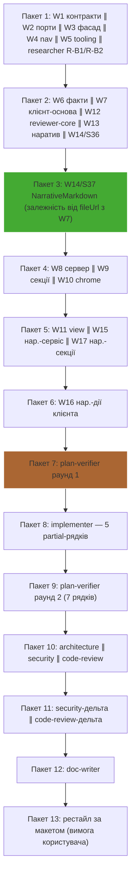

# Retro: /run-plan «Onboarding Tour» (факти A + AI-наратив B) — 2026-10-02
Session: 5db7d14b · Workflow: /run-plan від затвердженого плану → 5 хвиль implementer ×17 W# → plan-verifier ×2 → architecture ∥ security ∥ code-review ×2 раунди → ручна перевірка в браузері → doc-writer → /pr-self-review → рестайл за макетом → коміт

## Підсумок
Tokens: 2 946k in-new / 62 272k cache-read / 136k out · Agents: 29 стартувало / 27 запусків (13 пакетів, 0 невдалих) · Active: ≈72 хв агентів (сума з таблиці) + 60 хв головної сесії; wall 12,4 год (переважно паузи користувача) · Biggest cost: головна сесія (56 % cache-read, 83 % output); серед субагентів — plan-verifier (223k in-new, 6 740k cache-read) · Biggest lesson: макет (5.png) жодного разу не дійшов до виконавців як зображення, тож невідповідність верстки знайшов користувач після зеленого PR-gate.

## Метрики (таблиці скрипта, дослівно)

### Totals
- Main session: 968k in-new · 35078k cache-read · 113k out (cache hit 97%), 149 assistant turns, active 60m / wall 12.4h
- Subagents: 1978k in-new · 27194k cache-read · 23k out
- **All: 2946k in-new · 62272k cache-read · 136k out**  (thinking inside output: 31k)
- Agent launches: 27 in 13 batch(es); started 29; **launch failures 0**
- "in-new" = fresh input + cache writes; cache-read is re-read context, billed far cheaper. Cost appears only for models with rates in assets/prices.json.

### Launch order
| # | batch | agent | task | model | prompt | shared prompt sentences | result |
|---|---|---|---|---|---|---|---|
| 1 | 1 | implementer | W1 contracts A+B | sonnet-5-5 | 478 chars | 0% | ✔ started |
| 2 | 1 | implementer | W2 git+LLM ports | sonnet-5-5 | 344 chars | 50% | ✔ started |
| 3 | 1 | implementer | W3 repo-intel facade | sonnet-5-5 | 344 chars | 50% | ✔ started |
| 4 | 1 | implementer | W4 nav and URL | sonnet-5-5 | 344 chars | 50% | ✔ started |
| 5 | 1 | implementer | W5 tooling rules | sonnet-5-5 | 353 chars | 0% | ✔ started |
| 6 | 1 | researcher | Research R-B1 and R-B2 | sonnet-5-5 | 928 chars | 0% | ✔ started |
| 7 | 2 | implementer | W6 pure facts (A) | sonnet-5-5 | 772 chars | 14% | ✔ started |
| 8 | 2 | implementer | W7 client foundation (A) | sonnet-5-5 | 765 chars | 0% | ✔ started |
| 9 | 2 | implementer | W12 reviewer-core LLM (B) | sonnet-5-5 | 1.7k chars | 0% | ✔ started |
| 10 | 2 | implementer | W13 pure narrative (B) | sonnet-5-5 | 684 chars | 13% | ✔ started |
| 11 | 2 | implementer | W14 MermaidDiagram onInvalid | sonnet-5-5 | 399 chars | 0% | ✔ started |
| 12 | 3 | implementer | W14 S37 NarrativeMarkdown | sonnet-5-5 | 1.1k chars | — | ✔ started |
| 13 | 4 | implementer | W8 server module (A) | sonnet-5-5 | 1.3k chars | 0% | ✔ started |
| 14 | 4 | implementer | W9 section components (A) | sonnet-5-5 | 979 chars | 29% | ✔ started |
| 15 | 4 | implementer | W10 chrome components (A) | sonnet-5-5 | 981 chars | 25% | ✔ started |
| 16 | 5 | implementer | W11 view and route (A) | sonnet-5-5 | 1.5k chars | 0% | ✔ started |
| 17 | 5 | implementer | W15 server narrative integration (B) | sonnet-5-5 | 2.0k chars | 0% | ✔ started |
| 18 | 5 | implementer | W17 narrative in sections (B) | sonnet-5-5 | 1.3k chars | 0% | ✔ started |
| 19 | 6 | implementer | W16 client narrative actions (B) | sonnet-5-5 | 2.4k chars | — | ✔ started |
| 20 | 7 | plan-verifier | Verify against plan and specs | sonnet-5-5 | 1.9k chars | — | ✔ started |
| 21 | 8 | implementer | Fix verifier partial rows | sonnet-5-5 | 2.7k chars | — | ✔ started |
| 22 | 9 | plan-verifier | Re-verify fixed rows | sonnet-5-5 | 983 chars | — | ✔ started |
| 23 | 10 | architecture-reviewer | Architecture review round 1 | sonnet-5-5 | 625 chars | 0% | ✔ started |
| 24 | 10 | security-reviewer | Security review round 1 | sonnet-5-5 | 772 chars | 0% | ✔ started |
| 25 | 11 | security-reviewer | Security delta re-review F1 | sonnet-5-5 | 1.0k chars | — | ✔ started |
| 26 | 12 | doc-writer | Write feature docs | sonnet-5-5 | 2.9k chars | — | ✔ started |
| 27 | 13 | implementer | Restyle tour to match mockup | sonnet-5-5 | 7.0k chars | — | ✔ started |

### Per agent
| agent | task | active | wall | tool uses | errors | resumed | tokens | cache hit | cost |
|---|---|---|---|---|---|---|---|---|---|
| implementer:afaf6b | W1 contracts A+B | 81s | 81s | 13 | 0 | 0× | 52k in-new · 323k cache-read · 682 out | 86% | — |
| implementer:a80279 | W2 git+LLM ports | 2m | 2m | 18 | 0 | 0× | 84k in-new · 935k cache-read · 833 out | 92% | — |
| implementer:a34b8a | W3 repo-intel facade | 79s | 79s | 14 | 0 | 0× | 58k in-new · 464k cache-read · 438 out | 89% | — |
| implementer:aae98c | W4 nav and URL | 34s | 34s | 6 | 0 | 0× | 31k in-new · 83k cache-read · 661 out | 73% | — |
| implementer:a97022 | W5 tooling rules | 50s | 50s | 7 | 0 | 0× | 33k in-new · 108k cache-read · 320 out | 77% | — |
| researcher:a74226 | Research R-B1 and R-B2 | 62s | 62s | 11 | 0 | 0× | 24k in-new · 116k cache-read · 86 out | 83% | — |
| implementer:ac9366 | W6 pure facts (A) | 8m | 8m | 28 | 0 | 0× | 146k in-new · 1940k cache-read · 851 out | 93% | — |
| implementer:adac0f | W7 client foundation (A) | 4m | 4m | 27 | 0 | 0× | 90k in-new · 1318k cache-read · 391 out | 94% | — |
| implementer:a18bd3 | W12 reviewer-core LLM (B) | 79s | 79s | 7 | 0 | 0× | 28k in-new · 173k cache-read · 117 out | 86% | — |
| implementer:a8cb62 | W13 pure narrative (B) | 5m | 5m | 25 | 0 | 0× | 78k in-new · 1085k cache-read · 589 out | 93% | — |
| implementer:a44f1c | W14 MermaidDiagram onInvalid | 48s | 48s | 9 | 0 | 0× | 27k in-new · 108k cache-read · 760 out | 80% | — |
| implementer:a230f9 | W14 S37 NarrativeMarkdown | 62s | 62s | 10 | 0 | 1× | 18k in-new · 198k cache-read · 612 out | 91% | — |
| implementer:ad55be | W8 server module (A) | 3m | 3m | 22 | 0 | 0× | 76k in-new · 1060k cache-read · 705 out | 93% | — |
| implementer:adb176 | W9 section components (A) | 4m | 4m | 20 | 2 | 0× | 64k in-new · 999k cache-read · 294 out | 94% | — |
| implementer:ac6c87 | W10 chrome components (A) | 2m | 2m | 12 | 0 | 0× | 52k in-new · 320k cache-read · 608 out | 86% | — |
| implementer:a0d1dd | W11 view and route (A) | 3m | 3m | 17 | 0 | 0× | 83k in-new · 1086k cache-read · 217 out | 93% | — |
| implementer:aa7246 | W15 server narrative integration (B) | 4m | 4m | 27 | 0 | 0× | 111k in-new · 1875k cache-read · 6.6k out | 94% | — |
| implementer:ad143a | W17 narrative in sections (B) | 2m | 2m | 11 | 0 | 0× | 46k in-new · 385k cache-read · 206 out | 89% | — |
| implementer:a0083e | W16 client narrative actions (B) | 4m | 4m | 20 | 0 | 0× | 66k in-new · 823k cache-read · 188 out | 93% | — |
| plan-verifier:afda55 | Verify against plan and specs | 7m | 7m | 61 | 0 | 0× | 223k in-new · 6740k cache-read · 2.0k out | 97% | — |
| implementer:abee51 | Fix verifier partial rows | 3m | 3m | 15 | 0 | 0× | 45k in-new · 405k cache-read · 224 out | 90% | — |
| plan-verifier:a20c8a | Re-verify fixed rows | 31s | 31s | 9 | 0 | 0× | 35k in-new · 175k cache-read · 97 out | 84% | — |
| architecture-reviewer:aea9f9 | Architecture review round 1 | 65s | 65s | 9 | 0 | 0× | 39k in-new · 158k cache-read · 38 out | 80% | — |
| security-reviewer:acfcd8 | Security review round 1 | 59s | 59s | 10 | 0 | 0× | 56k in-new · 247k cache-read · 79 out | 81% | — |
| general-purpose:ad93ff | /code-review medium | 46s | 46s | 9 | 0 | 0× | 83k in-new · 352k cache-read · 1.6k out | 81% | — |
| security-reviewer:a729f2 | Security delta re-review F1 | 17s | 17s | 3 | 0 | 0× | 28k in-new · 46k cache-read · 162 out | 62% | — |
| general-purpose:ad82b6 | /code-review medium server/src/modules/onboarding… | 21s | 21s | 2 | 0 | 0× | 51k in-new · 36k cache-read · 2.4k out | 41% | — |
| doc-writer:adf957 | Write feature docs | 4m | 4m | 41 | 0 | 0× | 160k in-new · 4202k cache-read · 662 out | 96% | — |
| implementer:a7af55 | Restyle tour to match mockup | 5m | 5m | 22 | 0 | 0× | 90k in-new · 1433k cache-read · 218 out | 94% | — |

### Повторюваний boilerplate у промптах
- ×5 (~235 chars) "docs/specs/2026-10-01-onboarding-tour-facts.md."
- ×3 (~219 chars) "Run targeted checks, then return the Implementation Report per plan step."

### Файли, прочитані більш ніж одним агентом
- `../docs/plans/onboarding-tour.md` — implementer:a0083e, implementer:a0d1dd, implementer:a34b8a, implementer:a8cb62, implementer:a97022, implementer:aa7246, implementer:aae98c, implementer:ac6c87, implementer:ac9366, implementer:ad143a, implementer:ad55be, implementer:adac0f, implementer:adb176, implementer:a18bd3, implementer:a230f9, implementer:a44f1c, implementer:a80279, doc-writer:adf957, architecture-reviewer:aea9f9, implementer:afaf6b, plan-verifier:afda55, researcher:a74226
- `../../docs/plans/onboarding-tour.reports.md` — implementer:a0083e, implementer:a0d1dd, implementer:aa7246, implementer:ac6c87, implementer:ad143a, implementer:ad55be, implementer:adb176, plan-verifier:a20c8a, implementer:ac9366, doc-writer:adf957, plan-verifier:afda55
- `client/src/vendor/shared/contracts/knowledge.ts` — implementer:a0083e, implementer:ac6c87, implementer:ad143a, implementer:adac0f, implementer:ad55be, plan-verifier:afda55, implementer:a0d1dd, implementer:a8cb62, implementer:aa7246, implementer:adb176, doc-writer:adf957
- `../../docs/specs/2026-10-01-onboarding-tour-facts.md` — implementer:a0d1dd, plan-verifier:a20c8a, implementer:a34b8a, implementer:a80279, implementer:ac6c87, implementer:ac9366, implementer:adac0f, implementer:adb176, doc-writer:adf957, implementer:afaf6b, plan-verifier:afda55
- `server/src/modules/onboarding/service.ts` — plan-verifier:a20c8a, implementer:abee51, security-reviewer:acfcd8, doc-writer:adf957, plan-verifier:afda55, implementer:a34b8a, implementer:ad55be, general-purpose:ad93ff, implementer:a97022, implementer:aa7246, architecture-reviewer:aea9f9
- `../../server/src/vendor/shared/adapters.ts` — implementer:a18bd3, implementer:a80279, doc-writer:adf957, architecture-reviewer:aea9f9, plan-verifier:afda55, implementer:aa7246, implementer:ac9366, implementer:ad55be, general-purpose:ad93ff
- `reviewer-core/src/llm/openrouter.ts` — implementer:a18bd3, security-reviewer:a729f2, implementer:aa7246, security-reviewer:acfcd8, general-purpose:ad82b6, doc-writer:adf957, architecture-reviewer:aea9f9, researcher:a74226
- `client/src/lib/hooks/repo-intel.ts` — implementer:a0083e, implementer:a0d1dd, plan-verifier:afda55, plan-verifier:a20c8a, implementer:abee51, implementer:adac0f, doc-writer:adf957
- `client/src/lib/types.ts` — implementer:a0083e, plan-verifier:afda55, implementer:a0d1dd, architecture-reviewer:aea9f9, implementer:ad143a, implementer:adac0f, implementer:afaf6b
- `reviewer-core/src/index.ts` — implementer:a18bd3, implementer:aa7246, doc-writer:adf957, architecture-reviewer:aea9f9, implementer:ac9366, implementer:ad55be, implementer:adac0f
- `server/src/modules/onboarding/narrative-service.ts` — plan-verifier:a20c8a, implementer:abee51, architecture-reviewer:aea9f9, plan-verifier:afda55, security-reviewer:acfcd8, general-purpose:ad93ff, doc-writer:adf957
- `client/src/components/mermaid-diagram/MermaidDiagram.tsx` — implementer:a44f1c, security-reviewer:acfcd8, architecture-reviewer:aea9f9, implementer:a7af55, implementer:adb176, doc-writer:adf957, plan-verifier:afda55
- `server/src/modules/onboarding/routes.ts` — implementer:aa7246, doc-writer:adf957, security-reviewer:acfcd8, implementer:ad55be, general-purpose:ad93ff, architecture-reviewer:aea9f9, plan-verifier:afda55
- `client/src/lib/hooks/tour.ts` — implementer:a0d1dd, doc-writer:adf957, architecture-reviewer:aea9f9, plan-verifier:afda55, plan-verifier:a20c8a, implementer:abee51
- `../reviewer-core/src/llm/errors.ts` — implementer:a18bd3, implementer:aa7246, general-purpose:ad82b6, doc-writer:adf957, architecture-reviewer:aea9f9, plan-verifier:afda55

### Помилки в головній сесії
- Exit code 1 sed: 1: "docs/plans/onboarding-t ...": extra characters at the end of d command
- Can't interact with browser-internal or unparseable URLs. Navigate to a web page first.
- Exit code 1 # Report — the contract between the skill and the gate The skill writes; [`assets/gate.sh`](assets/gate.sh) reads. Two files per
- Exit code 1 H05 1 .claude/agents 1 .claude/skills 1 client/AGENTS.md 1 client/docs 1 client/INSIGHTS.md 1 client/messages 1 client/README.md

## Порядок запуску

Критичний шлях: W1 → W7 → W9 → W11 → W16 (клієнтський ланцюг, 5 хвиль) → verify → review. Найдовші агенти: W6 (8 хв), plan-verifier (7 хв), W13 (5 хв), рестайл (5 хв).
Пакет 3 (одинокий S37) — наслідок прогалини плану: S37 залежить від S16, але лежить у тій самій хвилі.

## Що було складно / що далося легко / Дублювання / Що пропустили

### Складно
- R-B1 — **plan-verifier**: 61 tool uses (медіана агентів ≈12), 7 хв, 6 740k cache-read — 11 % усього cache-read; 216 AC/EC/NFR + 29 C + 44 T в одному запуску. Результат корисний (0 unmet), але роздутий.
- R-B2 — **doc-writer**: 41 tool uses, 160k in-new, 4 202k cache-read; запис у 20+ файлів з перевіркою посилань.
- R-B3 — **W6** (28 uses, 8 хв, 146k in-new) і **W15** (27 uses, 111k in-new, найбільший output серед субагентів 6,6k): найбільші обсяги коду; повторних запусків не було.
- R-B4 — **Дефекти, які не впіймали тести, а знайшов хтось пізніше**: F1 (експоненційний backtracking glob — security-review, раунд 1), F12 («On this page» не sticky — моя ручна перевірка в Phase 4), F13 (верстка ≠ макет — користувач після PASS). Всі три пройшли 100 % зелених unit-перевірок.
- R-B5 — **Помилки головної сесії (4)**: `sed -i` у BSD-синтаксисі, `echo "====="` у zsh, стан вкладки браузера, `gate.sh check` BLOCKED (застарілий звіт). Дрібні, але вони з'їли ходи.
- R-B6 — **Нестабільне середовище**: один перший прогін клієнтських тестів у W16 завершився з кодом 1 без видимої причини; повтор ×3 був стабільним (причину не знайдено).

### Легко
- W1, W4, W5, W12, W14/S36 — 6–13 tool uses, 34–81 с, без помилок. Спільне: вузьке питання, названі файли, готова відповідь у промпті (W12 отримав результат researcher з конкретним правилом мапінгу), фіксований формат звіту.
- Повторна верифікація (`Rows to re-check` + fingerprint): 31 с, 9 uses; security-дельта: 17 с, 3 uses. Це шаблон для копіювання.
- Нуль невдалих запусків при пакетах до 6 агентів; кожному W# дано непересічні `owns:`, конфліктів у файлах не було (єдиний дотик: W11 правив тест W9 — тривіально злито).

### Дублювання
- План (1 013 рядків ≈ 36k токенів, Read обрізає на ~600 рядків) прочитали 22 агенти попри «читай лише Constraints і свій W#». Частку в сумарному in-new не виміряно (`hypothesis`: 20–35 % від 1 978k).
- `reports.md` (росте після кожної хвилі) прочитали 11 агентів; специфікації — по 11; `knowledge.ts` — 11 (це легітимно: контракт).
- Boilerplate у промптах мізерний (2 речення ≥3 разів): проблема не тут.
- Той самий звіт існує тричі: hand-back у контексті → мій передрук у `reports.md` → підсумок користувачу. Основний наслідок — вихід головної сесії 113k = 83 % усього output.
- Повторне читання контексту: головна сесія 35M cache-read за 149 ходів (≈235k на хід) = 56 % усього cache-read; жоден субагент не відновлювався більше 1 разу (S37 — 1× через SendMessage).

### Що пропустили (і де це випливло)
- **Макет не дійшов до виконавців.** Специфікація посилається на дизайн (5.png), але W7/W9/W10/W11/W16 отримували лише текстовий опис; Phase 4 не мав зображення для порівняння; користувач сам приклав скрін після `PASS`. Рестайл-промпт — 7 тис. символів текстового опису макета, а агент прямо зазначив, що в браузері нічого не перевіряв.
- **Прогалина плану**: S37 (W14) залежить від S16 (W7) у тій самій хвилі — виявлено лише під час запуску хвилі 2 (+1 пакет, обхідний шлях).
- **W11 відхилився від D1**: банер `StatusBanner` підключив до `useRefreshRepo`, хоча план каже `POST /resync`; виявив я після звіту.
- **Fingerprint і службові файли**: `docs/plans/*.impl.md|reports.md` входять у fingerprint (untracked-вміст рахується), тому plan-verifier побачив розбіжність `0992e3f4…` ≠ `c883d81e…`, а `gate.sh check` став BLOCKED перед комітом; довелося б ще раз проганяти /pr-self-review.
- **Code-review дельта читала файли цілком**: з 4 знахідок 3 — старий код (F8–F10), користувач відхилив усі.
- **«SKILL.md не відкривав»** повторюється у звітах W4, W7, W9, W10, W11, W12, W13, W15, W16, W17, фікс-раунду й рестайлу — інструкція `implementer.md` і поведінка розходяться (причинного впливу на дефекти не доведено).

### Таблиця закриття прогалин (self-reported gaps)
| Агент | Прогалина | Закрито ким | Статус |
|---|---|---|---|
| researcher | Статус/тіло відповіді OpenRouter для «no endpoint» офіційно не задокументовані | W12 (мапінг за текстом); живий виклик — ніхто | open-deferred |
| researcher | Сторінку structured-outputs не завантажено | ніхто | open-deferred (дрібне) |
| plan-verifier | B:AC-102/EC-22 без живого виклику | ніхто (= рядок вище) | open-deferred |
| plan-verifier | B:AC-91, B:EC-18, T43 без тесту refetchInterval | implementer (фікс-раунд) | closed |
| plan-verifier | A:AC-72 інтервал 1,5 с без асерту | implementer (фікс-раунд) | closed |
| plan-verifier | B:AC-85 без тесту після interrupted | implementer (фікс-раунд) | closed |
| plan-verifier | A:NFR-7 бракує лічильників і причини деградації в логах | implementer (фікс-раунд); B:NFR-7 `source_sha` додано | closed |
| architecture-reviewer | `arch:report` не запускав; тести, `docs/`, зміст промпту, internals simple-git не рев'юїв | simple-git — security; решта — ніхто | open-deferred |
| security-reviewer | Залежності react-markdown/remark-gfm/mermaid не підтверджено | plan-verifier (C19: package.json без змін) + моя перевірка lucide | closed |
| security-reviewer | Запис в INSIGHTS (glob) | doc-writer | closed |
| doc-writer | Немає e2e-покриття `/tour`, рядків у `e2e/specs/coverage.md` | користувач: «поки що не треба e2e» | open-deferred |
| doc-writer | `.claude/skills/onion-architecture/enforcement.md` і промпт рев'ювера не знають правила `pure-folders-are-pure` | ніхто (агент не має права на `.claude/**`) | **open, без власника** |
| (поза скриптом) | Жива генерація наративу з реальним ключем; a11y зі скрінрідером; *.it.test.ts | ніхто / користувач відклав | open-deferred |

## Порівняння з попередніми запусками
Попередній рядок індексу: 2026-09-30 «spec → planner → /impl ×2», 6 118k in-new / 241 333k cache-read / 449k out, 41 запуск із 6 невдалими, main 171 хв + субагенти 112 хв, wall 28,7 год.
Цей запуск: 2 946k / 62 272k / 136k (−52 % / −74 % / −70 %), 27 запусків, 0 невдалих, main 60 хв + субагенти ≈72 хв, wall 12,4 год.
Дешевше, але **не порівнянно один до одного**: тут немає стадій spec і planner (старт від затвердженого плану) і одна фіча замість двох. Найімовірніше пояснення різниці — обсяг робіт (`hypothesis`); окремо видно ефект пакетів ≤6 агентів і непересічних `owns:` (0 невдалих запусків проти 6). Ціну в USD не пораховано: `assets/prices.json` без тарифів.

## Рекомендації
| R# | Зміна | Де | Очікуваний ефект | Вартість | Впевненість |
|---|---|---|---|---|---|
| R1 | Якщо специфікація/план посилається на макет — передавати шлях до файлу зображення UI-виконавцям і додати в Phase 4 крок «порівняти скріншот із макетом» (список відмінностей → F#) | `.claude/skills/run-plan/SKILL.md` (Phase 4), `.claude/agents/implementation-planner.md` (поле «Design refs» у W# з UI) | Прибирає клас F13: тут це 1 повний цикл рестайлу (90k in-new, 1 433k cache-read, 7k-символьний промпт) і фідбек користувача після PASS | малий | висока |
| R2 | Вивести службові файли run-plan (`*.impl.md`, `*.reports.md`) із fingerprint — виключення в `gate.sh` або зберігання в git-ignored теці | `.claude/skills/pr-self-review/assets/gate.sh`, нотатка в `run-plan` («Check table») | Менше застарілих звітів і зайвих повторів /pr-self-review; працює правило «verifier перезапускає лише при зміні fingerprint» | малий | середня |
| R3 | Phase 0: перевірка `depends-on` кроку — кожна залежність має бути в ранішій хвилі, інакше зупинка | `.claude/skills/run-plan/SKILL.md` (Phase 0, п. 2), `implementation-planner.md` (правило для DAG) | Без одинокого пакета й ручного обходу (тут S37→S16) | малий | висока |
| R4 | Implementer пише свій звіт у `docs/plans/<slug>.reports/<W#>.md` і повертає ≤15 рядків-покажчик; головна сесія не передруковує звіти | `.claude/agents/implementer.md` (формат виходу), `run-plan` Phase 1 | Головна сесія — 56 % cache-read і 83 % output; hand-back'и по 1–4k токенів ×29 лишаються у контексті. Очікується помітне зменшення, але міру не виміряно | середня | середня |
| R5 | Planner (або run-plan Phase 1) нарізає план на файли `docs/plans/<slug>/{constraints,W#}.md`; implementer читає лише їх | `implementation-planner.md`, `run-plan` Phase 1 | План читали 22 агенти, а Read обрізає на ~600 рядків; економія — `hypothesis` 20–35 % субагентського in-new | середня | низька–середня |
| R6 | Вирішити розбіжність «Read SKILL.md кроку»: або перевіряти (звіт має перелік прочитаних SKILL.md), або замінити на короткі витяги правил у кроці плану | `.claude/agents/implementer.md` | Інструкція перестане розходитися з поведінкою (≥11 звітів із відхиленням) | малий | низька (вплив на якість не доведено) |
| R7 | Для дельта-`/code-review` передавати діапазон/hunks змінених рядків і писати «лише змінені рядки» | `.claude/skills/run-plan/SKILL.md` (Phase 3, раунд 2+) | Тут 3 з 4 знахідок були старим кодом → зайве питання користувачу й ~134k in-new на два форки | малий | середня |
| R8 | Phase 0/4: якщо ручна перевірка потребує живого LLM-ключа/витрат — спитати один раз на вході (ключ, ліміт витрат); додати до нотаток Phase 4: `div#S:0` дублює DOM у прихованій вкладці, `resize_window` може не змінити viewport → перевіряти ширину через same-origin iframe | `run-plan` SKILL.md (Phase 0, Phase 4 notes) | Ключова функція B лишилась неперевіреною наприкінці; ~6 зайвих зондів браузера | малий | середня |

## Не перевірено
- Вартість у USD (немає тарифів у `prices.json`); частка читання плану в in-new (скрипт рахує лише перетини файлів, не токени по файлах).
- Активний час округлено скриптом до хвилин; сума ≈72 хв — моя; wall 12,4 год містить паузи користувача (скрипт не відокремлює їх від повільних кроків).
- Порівняння з попереднім рядком нерівне (інший тип workflow); причинність — `hypothesis`.
- Гіпотеза про роль hand-back'ів у cache-read головної сесії не перевірена вимірюванням окремих ходів.
