# Retro: /run-plan PR Brief (Why + Risk brief на Overview) — 2026-10-03
Session: 33902f1d · Workflow: /run-plan → 6× implementer (3 хвилі) → plan-verifier ×6 → fix ×2 → architecture ∥ security ∥ /code-review → ручна перевірка → фікс тестів

## Підсумок (5 рядків максимум)
Tokens: 3 124k in-new / 64 594k cache-read / 204k out (головна сесія: 1 327k / 40 070k / 131k) · Agents: 17 стартувало / 16 запусків (0 невдалих) ·
Wall/active: 16,8 год / main 1,6 год + агенти ≈ 50 хв · Biggest cost: plan-verifier (6 запусків ≈ 701k in-new, 22 % усіх in-new) і головна сесія (62 % cache-read) ·
Biggest lesson: макет і критерії тестів не дійшли до виконавців → 17 partial-рядків у першій верифікації та 15+ позапланових UI-файлів; повторні повні верифікації дорожчі за точкові вдвічі–вшестеро.

## Метрики
Таблиці скрипта `collect.mjs` дослівно (ціна не рахується: `assets/prices.json` без ставок, тож «—» означає «немає ставки», а не «безкоштовно»).

### Totals
- Main session: 1327k in-new · 40070k cache-read · 131k out (cache hit 97%), 164 assistant turns, active 1.6h / wall 16.8h
- Subagents: 1798k in-new · 24523k cache-read · 72k out
- **All: 3124k in-new · 64594k cache-read · 204k out**  (thinking inside output: 40k)
- Agent launches: 16 in 10 batch(es); started 17; **launch failures 0**
- "in-new" = fresh input + cache writes; cache-read is re-read context, billed far cheaper. Cost appears only for models with rates in assets/prices.json.

### Launch order
| # | batch | agent | task | model | prompt | shared prompt sentences | result |
|---|---|---|---|---|---|---|---|
| 1 | 1 | implementer | Implement W1 contracts + i18n | sonnet-5-5 | 469 chars | 33% | ✔ started |
| 2 | 1 | implementer | Implement W3 adapters + attachments | sonnet-5-5 | 468 chars | 33% | ✔ started |
| 3 | 2 | implementer | Implement W2 brief pure logic | sonnet-5-5 | 537 chars | 25% | ✔ started |
| 4 | 2 | implementer | Implement W5 client Overview | sonnet-5-5 | 528 chars | 25% | ✔ started |
| 5 | 3 | implementer | Implement W4 service, routes, DI | sonnet-5-5 | 892 chars | 25% | ✔ started |
| 6 | 3 | implementer | Implement W6 client navigation | sonnet-5-5 | 753 chars | 29% | ✔ started |
| 7 | 4 | plan-verifier | Verify PR Brief against plan | sonnet-5-5 | 1.4k chars | — | ✔ started |
| 8 | 5 | implementer | Fix server verifier gaps | sonnet-5-5 | 1.9k chars | 13% | ✔ started |
| 9 | 5 | implementer | Fix client verifier gaps | sonnet-5-5 | 1.8k chars | 13% | ✔ started |
| 10 | 6 | plan-verifier | Verifier round 2 on open rows | sonnet-5-5 | 770 chars | 0% | ✔ started |
| 11 | 6 | architecture-reviewer | Architecture review of PR Brief | sonnet-5-5 | 339 chars | 50% | ✔ started |
| 12 | 6 | security-reviewer | Security review of PR Brief | sonnet-5-5 | 352 chars | 50% | ✔ started |
| 13 | 7 | plan-verifier | Final plan-verifier full pass | sonnet-5-5 | 2.4k chars | — | ✔ started |
| 14 | 8 | plan-verifier | Final verifier pass after user fixes | sonnet-5-5 | 2.6k chars | — | ✔ started |
| 15 | 9 | plan-verifier | Final verifier pass with live evidence | sonnet-5-5 | 2.7k chars | — | ✔ started |
| 16 | 10 | plan-verifier | Delta verify AC-108, S10, T8 | sonnet-5-5 | 1.3k chars | — | ✔ started |

### Per agent
| agent | task | active | wall | tool uses | errors | resumed | tokens | cache hit | cost |
|---|---|---|---|---|---|---|---|---|---|
| implementer:a67bbd | Implement W1 contracts + i18n | 87s | 87s | 11 | 0 | 0× | 60k in-new · 369k cache-read · 186 out | 86% | — |
| implementer:a41110 | Implement W3 adapters + attachments | 2m | 2m | 17 | 0 | 0× | 100k in-new · 588k cache-read · 766 out | 85% | — |
| implementer:ad790a | Implement W2 brief pure logic | 7m | 7m | 33 | 0 | 0× | 144k in-new · 2681k cache-read · 38k out | 95% | — |
| implementer:ac9df1 | Implement W5 client Overview | 6m | 6m | 35 | 1 | 0× | 131k in-new · 3123k cache-read · 793 out | 96% | — |
| implementer:a8e101 | Implement W4 service, routes, DI | 5m | 5m | 43 | 0 | 0× | 182k in-new · 3853k cache-read · 26k out | 95% | — |
| implementer:a1b23e | Implement W6 client navigation | 6m | 6m | 34 | 0 | 0× | 141k in-new · 2967k cache-read · 1.4k out | 95% | — |
| plan-verifier:a1c462 | Verify PR Brief against plan | 4m | 4m | 34 | 1 | 0× | 169k in-new · 2690k cache-read · 2.0k out | 94% | — |
| implementer:accec8 | Fix server verifier gaps | 58s | 58s | 9 | 0 | 0× | 55k in-new · 259k cache-read · 154 out | 82% | — |
| implementer:af6abe | Fix client verifier gaps | 4m | 33m | 13 | 1 | 0× | 112k in-new · 453k cache-read · 425 out | 80% | — |
| plan-verifier:aee9f5 | Verifier round 2 on open rows | 41s | 41s | 13 | 0 | 0× | 68k in-new · 191k cache-read · 60 out | 74% | — |
| architecture-reviewer:aa7b07 | Architecture review of PR Brief | 63s | 63s | 7 | 0 | 0× | 36k in-new · 113k cache-read · 63 out | 76% | — |
| security-reviewer:a07e91 | Security review of PR Brief | 41s | 41s | 11 | 0 | 0× | 58k in-new · 346k cache-read · 149 out | 86% | — |
| general-purpose:a90b98 | /code-review medium | 33s | 33s | 7 | 0 | 0× | 77k in-new · 351k cache-read · 1.1k out | 82% | — |
| plan-verifier:a5356d | Final plan-verifier full pass | 3m | 3m | 29 | 1 | 0× | 149k in-new · 2741k cache-read · 839 out | 95% | — |
| plan-verifier:a8ebb2 | Final verifier pass after user fixes | 3m | 3m | 28 | 0 | 0× | 147k in-new · 1993k cache-read · 452 out | 93% | — |
| plan-verifier:aaaff3 | Final verifier pass with live evidence | 4m | 4m | 26 | 0 | 0× | 144k in-new · 1751k cache-read · 126 out | 92% | — |
| plan-verifier:abf62f | Delta verify AC-108, S10, T8 | 15s | 15s | 5 | 0 | 0× | 24k in-new · 55k cache-read · 354 out | 69% | — |

### Repeated prompt boilerplate (sentences in ≥3 launch prompts, biggest first)
- ×6 (~282 chars) "Return the Implementation Report per plan step."

### Files touched by more than one agent (duplicated reading; only files that exist in the working tree — `--all-files` keeps the rest)
- `../docs/plans/pr-brief.md` — security-reviewer:a07e91, implementer:a1b23e, plan-verifier:a1c462, implementer:a41110, plan-verifier:a5356d, implementer:a67bbd, implementer:a8e101, plan-verifier:a8ebb2, plan-verifier:aaaff3, plan-verifier:abf62f, implementer:ac9df1, implementer:ad790a, plan-verifier:aee9f5
- `docs/specs/2026-10-02-pr-brief.md` — implementer:a1b23e, plan-verifier:a1c462, plan-verifier:a5356d, implementer:a67bbd, plan-verifier:a8ebb2, plan-verifier:aaaff3, plan-verifier:abf62f, implementer:ac9df1, plan-verifier:aee9f5, implementer:a8e101, implementer:ad790a
- `server/src/modules/brief/service.ts` — security-reviewer:a07e91, plan-verifier:a1c462, plan-verifier:a5356d, implementer:a8e101, plan-verifier:a8ebb2, plan-verifier:aaaff3, implementer:accec8, plan-verifier:aee9f5, architecture-reviewer:aa7b07
- `server/src/modules/intent/helpers.ts` — implementer:a1b23e, plan-verifier:a1c462, plan-verifier:a5356d, plan-verifier:aaaff3, implementer:ac9df1, implementer:accec8, implementer:af6abe, implementer:a8e101, implementer:ad790a
- `.claude/skills/pr-self-review/assets/gate.sh` — security-reviewer:a07e91, plan-verifier:a1c462, plan-verifier:a5356d, plan-verifier:a8ebb2, architecture-reviewer:aa7b07, plan-verifier:aaaff3, plan-verifier:abf62f, plan-verifier:aee9f5
- `server/src/modules/brief/routes.ts` — security-reviewer:a07e91, plan-verifier:a1c462, plan-verifier:aaaff3, plan-verifier:a5356d, architecture-reviewer:aa7b07, implementer:a8e101, general-purpose:a90b98, plan-verifier:a8ebb2
- `server/src/modules/brief/prompt.ts` — security-reviewer:a07e91, plan-verifier:a8ebb2, plan-verifier:aaaff3, plan-verifier:a1c462, implementer:accec8, plan-verifier:a5356d, implementer:ad790a, implementer:a8e101
- `client/messages/en/brief.json` — implementer:a1b23e, plan-verifier:a1c462, plan-verifier:a5356d, implementer:a67bbd, plan-verifier:a8ebb2, plan-verifier:aaaff3, implementer:ac9df1, plan-verifier:aee9f5
- `client/src/app/repos/[repoId]/pulls/[number]/_components/DiffTab/useDiffTarget.ts` — implementer:a1b23e, plan-verifier:a1c462, plan-verifier:a5356d, plan-verifier:aaaff3, plan-verifier:a8ebb2, general-purpose:a90b98, architecture-reviewer:aa7b07, plan-verifier:aee9f5
- `../../server/INSIGHTS.md` — plan-verifier:a1c462, implementer:accec8, implementer:a41110, plan-verifier:a5356d, implementer:a67bbd, implementer:a8e101, plan-verifier:aaaff3, implementer:ad790a
- `server/src/platform/container.ts` — security-reviewer:a07e91, plan-verifier:a1c462, plan-verifier:aaaff3, plan-verifier:a5356d, implementer:a8e101, architecture-reviewer:aa7b07, plan-verifier:a8ebb2
- `docs/plans/pr-brief.reports.md` — implementer:a1b23e, plan-verifier:a1c462, plan-verifier:a5356d, implementer:a8e101, plan-verifier:a8ebb2, plan-verifier:aaaff3, plan-verifier:aee9f5
- `client/src/app/repos/[repoId]/pulls/[number]/page.tsx` — implementer:a1b23e, plan-verifier:a1c462, plan-verifier:a5356d, plan-verifier:a8ebb2, plan-verifier:aaaff3, implementer:af6abe, implementer:ac9df1
- `client/src/components/diff-viewer/DiffViewer/DiffViewer.test.tsx` — implementer:a1b23e, plan-verifier:a1c462, plan-verifier:a5356d, plan-verifier:a8ebb2, plan-verifier:aaaff3, plan-verifier:aee9f5, implementer:af6abe
- `client/src/app/repos/[repoId]/pulls/[number]/_components/OverviewTab/OverviewTab.tsx` — implementer:a1b23e, plan-verifier:a8ebb2, plan-verifier:aaaff3, implementer:af6abe, plan-verifier:a1c462, plan-verifier:a5356d, implementer:ac9df1

### Errors in the main session
- Exit code 1 GET sorted (38th of 40 = p95): 0.004129 0.005670 0.006837 0.008374 POST 1 http=200 time=37.714553 model openai/gpt-oss-20b cost 
- JavaScript execution error: TypeError: Cannot read properties of undefined (reading 'querySelectorAll') at <anonymous>:1:130 at <anonymous>:

### Gaps the agents reported themselves
- **plan-verifier:a1c462 — Not found / gaps**
  - AC-62: no test for the loading state (skeleton, no Generate button).
  - AC-92: no test for the reduced-motion branch.
  - AC-104 / NFR-9: relative time in the provenance line is not from `brief.json` (`OverviewTab/helpers.ts:25-34`).
  - AC-106 / NFR-7 / C6 / S13 / T9: the log record is split across two entries on success; the failure entry lacks provider, model, est, budget and missing; no field-level te
  - EC-24: no restart test.
- **implementer:accec8 — Implementation Report: PR Brief, plan-verifier round 1 server gaps**
- **implementer:af6abe — Implementation Report: PR Brief client gaps (AC-62, AC-92, AC-104/NFR-9, C13)**
- **plan-verifier:aee9f5 — Not found / gaps**
  - AC-39: the `resolved.sha` to catalog-scan-SHA link was not traced.
- **architecture-reviewer:aa7b07 — Not found / gaps**
  - Nothing to record in INSIGHTS. I cannot write one in any case.
- **security-reviewer:a07e91 — Not found / gaps**
  - Residual concern, not reported (LOW confidence, defence-in-depth): spec doc text from the repo is concatenated into the user prompt. Prompt injection is mitigated only by
  - Rate limiting and single-flight are in process memory only. The plan accepts that a restart resets them (EC-24).
  - No dependency changes, so there is nothing to note for A06. CVE status could not be checked anyway (no network access).
  - I did not open `docs/plans/pr-brief.reports.md`.
  - Nothing worth recording in an INSIGHTS file. I have no write access in any case.
- **plan-verifier:a5356d — Not found / gaps**
  - AC-82: no test asserts the `llm_error`, `invalid_output` or `no_diff_data` messages. Add the three cases to `BriefHeader.test.tsx` or `OverviewTab.test.tsx`.
  - AC-97: no automated assertion of the Back transition (only the push is asserted).
  - C13: `DiffTab` has 9 props. C23 and S19: `IntentCard` without `children` is restructured, not identical.
  - The unplanned `BlastRadiusCard`, `BlastSymbolGroup`, `PriorPrsSection` and `VerdictBanner` edits are not named by any plan step or reported deviation. They need a user de
  - AC-33, AC-34, AC-106 and similar rows are tagged "integration" in the spec but are evidenced by service-level unit tests with fakes. `brief.it.test.ts` covers the HTTP ha
- **plan-verifier:a8ebb2 — Gaps**
  - No unmet or partial requirement rows.
  - Open housekeeping:
  - the C23/S19 text versus the addendum (*Report discrepancies* 2);
  - the AC-71 conflict;
  - the unplanned UI files, which no step owns.
- **plan-verifier:aaaff3 — Not found / gaps**
  - AC-108: no test covers ReviewFocus rendering a path long enough to truncate (partial).
  - `page.tsx` has no test (accepted in plan *Not found / gaps*); AC-87/AC-95 wiring rests on the hook tests, the page code and the live click recorded in the run log.
  - Rows relying on service-level tests where the spec says `verify: integration` (AC-31 to AC-35, AC-45, AC-46, AC-47): `brief-service.test.ts` follows plan T9; `brief.it.te

## Порядок запуску

```mermaid
flowchart TD
  B1["B1: W1 контракти+i18n ∥ W3 адаптери+attachments"] --> B2["B2: W2 чиста логіка ∥ W5 клієнт Overview"]
  B2 --> B3["B3: W4 сервіс/маршрути/DI ∥ W6 навігація"]
  B3 --> GATE["gate: *.it.test.ts (main) — 5 червоних, baseline на чистому HEAD"]
  GATE --> B4["B4: plan-verifier, повний прохід (17 partial)"]
  B4 --> B5["B5: fix server ∥ fix client"]
  B5 --> B6["B6: verifier r2 ∥ architecture ∥ security ∥ /code-review"]
  B6 --> MAN["ручна перевірка в браузері (main)"]
  MAN --> B7["B7–B9: 3× повний verifier (після правок користувача, з live-доказами)"]
  B7 --> B10["B10: delta verifier AC-108/S10/T8"]
  classDef crit fill:#3a2a00,stroke:#d9a400
  class B3,B4,B5,B7 crit
```

Критичний шлях: B1 → B2 → B3 → B4 → B5 → B7 (залежність хвиль за планом; W2 чекав W1, W4 чекав W1+W2+W3).
- B1–B3: по два імплементери паралельно, між хвилями повний набір перевірок у головній сесії; 0 невдалих запусків.
- B4: перший verifier запущено після gate; gate виявив 5 падінь, які існують і на чистому HEAD (baseline у `git worktree`).
- B5–B6: фікси двох пакетів паралельно; verifier r2 разом з трьома рев'юерами (один повідомлення).
- B7–B10: чотири verifier-прогони підряд (три повні, один точковий).

## Що було складно
- **R1 · Повторні повні верифікації.** Чотири повні матриці по ≈200 рядків: `a1c462` 169k, `a5356d` 149k, `a8ebb2` 147k, `aaaff3` 144k in-new; точкові: `aee9f5` 68k, `abf62f` 24k. Усі шість verifier-ів = 701k in-new (22 % від 3 124k). Кожен перечитував план (13 агентів загалом), спеку (11) і `service.ts`. Агент: plan-verifier.
- **R2 · Верифікатор змінює правду після правок поза потоком.** Користувач виправив partial-рядки іншим інструментом і змінив сам план (розділ *Post-implementation UI alignment*); три наступні повні проходи довелося доводити до відповідності (AC-71, C23/S19). Evidence: `a8ebb2`/`aaaff3` «Report discrepancies», `docs/plans/pr-brief.md` addendum.
- **R3 · Складні виконавці.** Tool uses: W4 43, W5 35, W6 34, W2 33 проти 11–17 у W1/W3/фіксів. W2 найдорожчий за output (38k) — писав `helpers.ts`, `prompt.ts` і два тест-файли. Не помилки, а розмір пакета; W2 повідомив про вимушене відхилення (побудова бюджету: 15 с CPU на CJK → мемоїзація).
- **R4 · Червоний gate був не про фічу.** 5 `*.it.test.ts` падали й на чистому HEAD; справжня причина знайдена лише наприкінці (тести читали `~/.devdigest/secrets.json` користувача: реальний OpenRouter, реальні гроші; виправлено в `9af546d`). Evidence: gate-вивід, baseline-worktree, `server/INSIGHTS.md`.
- **R5 · Ручна фаза частково зірвана.** Overview PR на 318 файлів у вкладці автоматизації вантажився 20–40 с і зрештою зупинився; NFR-6 (reflow, цілі, клавіатура, скрінрідер) лишився not-verifiable. Evidence: `pr-brief.reports.md` Phase 4, помилка JS у головній сесії.
- Помилки tool: по 1 у `ac9df1`, `a1c462`, `af6abe`, `a5356d`; у головній сесії 2 (мій curl-цикл упав на 502-відповіді без `risks`; JS без `main`).

## Що далося легко
- W1 (87 с, 11 tool uses), W3 (2 хв, 17), точковий verifier (15 с, 5), `architecture-reviewer` (63 с, 7) і `security-reviewer` (41 с, 11): вузьке питання, шлях до плану/звіту, фіксований формат виходу.
- Фікс-раунд сервера (`accec8`, 58 с, 9 tool uses): три конкретні прогалини з file:line від верифікатора.
- Відновлення після паузи на ключ провайдера: стан у `docs/plans/pr-brief.impl.md` дозволив продовжити без повторного аналізу.

## Дублювання
- Файли, які читали ≥2 агенти (скрипт): план — 13 агентів, спека — 11, `service.ts` — 9, `intent/helpers.ts` — 9, `gate.sh` — 8. Для verifier-ів це необхідне перечитування; для імплементерів план/спека повинні були бути «Constraints + свій W#» (вже так за `/run-plan`).
- **R6 · Boilerplate у промптах verifier-а.** Перелік waived-тестів, ручних рядків і «що змінилося» повторено у п'яти промптах (1,4k → 2,7k символів). У скрипті повторюється лише «Return the Implementation Report per plan step.» ×6 (~282 символи, дрібниця).
- **R7 · Один повний звіт verifier-а входить у контекст головної сесії, а потім я тричі перепечатував його у файл** (≈26k символів × 3). Головна сесія: 131k out (64 % усього output) і 40M cache-read.
- Контекст перечитується: головна сесія 62 % від усього cache-read (40 070k з 64 594k), 164 ходи.

## Що пропустили
Gap-closure table (з «gaps the agents reported themselves»):

| agent | gap | closed by | status |
|---|---|---|---|
| plan-verifier:a1c462 | AC-62 немає тесту стану завантаження | implementer:af6abe | closed |
| plan-verifier:a1c462 | AC-92 немає тесту reduced-motion | implementer:af6abe | closed |
| plan-verifier:a1c462 | AC-104/NFR-9 час через `Intl`, не з `brief.json` | implementer:af6abe | closed |
| plan-verifier:a1c462 | AC-106/NFR-7/C6 лог розбитий на два записи | implementer:accec8 | closed |
| plan-verifier:a1c462 | EC-24 немає тесту перезапуску | implementer:accec8 | closed |
| plan-verifier:aee9f5 | AC-39: чи `resolved.sha` = catalog scan SHA | main (простежив `project-context/service.ts`) | closed |
| plan-verifier:a5356d | AC-82 повідомлення `llm_error`/`invalid_output`/`no_diff_data` без тестів | user (інший інструмент) → перевірив a8ebb2 | closed |
| plan-verifier:a5356d | AC-97 немає перевірки Back | user → a8ebb2 | closed |
| plan-verifier:a5356d | C13: `DiffTab` 9 пропсів | user → a8ebb2 | closed |
| plan-verifier:a5356d / a8ebb2 | C23/S19 «ідентичний рендер» суперечить addendum | main (правка тексту плану) | closed |
| plan-verifier:aaaff3 | AC-108 немає тесту довгого шляху | main → delta abf62f | closed |
| plan-verifier:a8ebb2 / aaaff3 | AC-71: «numbered» у спеці проти нумерації-ні в дизайні | ніхто (потрібна ревізія спеки через spec-creator) | open-blocking для рядка AC-71 |
| plan-verifier:a8ebb2 / aaaff3 | позапланові UI-файли без кроку плану | ніхто (рішення користувача: прийняти чи повернути) | open-deferred |
| plan-verifier:a5356d | AC-33/34/45–47 доведені service-тестами, не integration | accepted планом (T9) | open-deferred |
| plan-verifier:aaaff3 | NFR-1 (seeded DB, `durationMs`), NFR-6 (reflow, клавіатура, скрінрідер) | ніхто | open-deferred |

- **R8 · Критерії `covers:` без іменованого тесту.** План вказував `AC-62`, `AC-92`, `AC-106` у `covers:`, але жоден рядок T# не називав відповідного assertion → 17 partial у першому проході верифікатора й два фікс-імплементери (55k + 112k in-new) плюс verifier r2 (68k) ≈ 235k in-new.
- **R9 · Макет не дійшов до виконавців зображенням.** Вимоги до візуалу — лише текст у спеці/плані; скріншот-макет надійшов у чаті після хвилі 3, а розділ *Post-implementation UI alignment* зафіксував звіряння з макетом постфактум. Наслідок: 15+ позапланових файлів (`AppShell`, `Topbar`, `VerdictBanner`, `BlastRadiusCard` тощо), які verifier позначив як unplanned. Це **той самий урок**, що в retro 2026-10-02 (Onboarding Tour: «макет не дійшов як зображення»).
- Вимоги користувача без власника: «Фінальний звіт plan-verifier додається до PR і не містить незакритих вимог» — файл і додаток створено, але «без незакритих вимог» не досягнуто (див. open-рядки вище).

## Порівняння з попередніми запусками
| Запуск | in-new | cache-read | out | агентів (старт/запуск) | main active + агенти | wall |
|---|---|---|---|---|---|---|
| 2026-09-30 Project Context (×2 /impl) | 6 118k | 241 333k | 449k | 39 / 41 (6 невдалих) | 171 хв + 112 хв | 28,7 год |
| 2026-10-02 Onboarding Tour | 2 946k | 62 272k | 136k | 29 / 27 (0 невдалих) | 60 хв + ≈72 хв | 12,4 год |
| **2026-10-03 PR Brief (цей)** | **3 124k** | **64 594k** | **204k** | **17 / 16 (0 невдалих)** | **96 хв + ≈50 хв** | **16,8 год** |

Проти Onboarding Tour: in-new +6 %, cache-read +4 %, output +50 %, агентів на 12 менше. Дорожче за output, а не за input: найбільші відмінності — W2 (38k) і W4 (26k) output, тобто великий серверний модуль писали агенти (hypothesis: ця фіча важча на серверну логіку, ніж попередня). Головна сесія активна довше (96 проти 60 хв) через чотири повні верифікації й ручну фазу. Проти 09-30 — значно дешевше (−49 % in-new, −73 % cache-read).
Урок «макет не дійшов як зображення» повторюється з retro 2026-10-02 → за чеклістом його треба **просувати** в файли агентів, а не нотувати знову (R9).

## Рекомендації
| R# | Зміна | Де | Очікуваний ефект | Вартість | Впевненість |
|---|---|---|---|---|---|
| R1 | Після першого повного проходу verifier-а — лише `Rows to re-check` + список змінених файлів; повний прохід один раз перед PR | `.claude/skills/run-plan/SKILL.md` (Phase 2, Phase 6) | у цьому запуску ≈ −400k in-new (3 повні замість 1 повного + 2 точкових) | мінімальна: одне правило в потоці | середня |
| R2 | Дозволити `plan-verifier` писати лише `docs/plans/<slug>.verification.md` і повертати вердикт + відкриті рядки; головна сесія не передруковує матрицю | `.claude/agents/plan-verifier.md`, `/run-plan` Phase 2 | ≈ −25k output і −35k контексту головної сесії на кожен повний прохід | послаблює інваріант «read-only» до одного шляху (як у spec-creator) | середня |
| R3 | Кожен `covers:` AC має іменований assertion у рядку T#; implementer самоперевіряє `covers:` проти тестів перед звітом; planner перелічує «AC → тест-кейс» | `.claude/agents/implementation-planner.md`, `.claude/agents/implementer.md` | менше фікс-раундів (≈ −235k in-new тут) | трохи довший план | середня |
| R4 | Gate: червоний `*.it` → спершу baseline у чистому worktree, потім тріаж; тести сервера герметичні (зроблено `9af546d`) | `.claude/skills/run-plan/SKILL.md` (Phase 1 gate) | хвилини на кожен червоний gate; жодних реальних LLM-витрат у тестах | одна фраза у потоці | висока |
| R5 | У плані *Manual verification* називати конкретний невеликий seeded PR, а не «PR із 300+ файлів» | шаблон плану (`implementation-planner`) | NFR-6 і NFR-1 вдається закрити в автоматизованій вкладці | пам'ятати id seeded PR | середня |
| R6 | Waived/manual-only/«що змінилося» тримати у `docs/plans/<slug>.impl.md`; промпт verifier-а = шляхи + `Rows to re-check` | `/run-plan` Phase 2, state file | промпти −50 % (2,7k → ≈1,3k символів), немає розбіжностей між прогонами | мінімальна | середня |
| R7 | Не тягнути повний звіт verifier-а у контекст: звіт у файл (R2) + у відповіді лише 10 рядків | `.claude/agents/plan-verifier.md` | менше cache-read головної сесії (62 % від усього) | залежить від R2 | середня |
| R8 | (з «Що пропустили») `/code-review medium` перевіряв за 33 с і «лише проглянув» клієнтські компоненти; для нових серверних модулів — рівень `high` або явні файли | `/run-plan` Phase 3 | глибша перевірка нового коду (hypothesis) | +токени на рев'ю | низька |
| R9 | **Просунути урок про макет:** у плані секція *Design* зі шляхами до зображень; implementer читає зображення (Read) перед UI-кроком; postfactum-розділ допускається лише для змін, які макет не охоплює | `.claude/agents/implementation-planner.md`, `.claude/agents/implementer.md`, `/run-plan` Phase 0 | менше позапланових файлів (15+ тут) і перероблень UI | потрібно мати зображення в `docs/` | висока |

## Не перевірено
- Ціна в USD не рахується: `assets/prices.json` без ставок для `sonnet`; «—» означає «немає ставки». Потрібна ставка (input, cache_write, cache_read, output за 1M токенів), щоб отримати cost report у доларах.
- Active time відкидає паузи понад 5 хв; wall 16,8 год включає ніч і очікування користувача (додавання ключа, власні виправлення іншим інструментом).
- Retro охоплює лише цей чат: правки користувача, зроблені поза ним (виправлення partial-рядків і UI-вирівнювання), видно лише за наслідками (unplanned changes, discrepancies verifier-а).
- Перелік файлів, прочитаних кількома агентами, — евристика за рядками шляхів; `/code-review` (форкований агент) у таблиці позначений як `general-purpose`.
- Прогін `./scripts/e2e.sh` не робився; живу генерацію виконано на моделі OpenRouter `gpt-oss-20b` (≈ $0,0007 сумарно).
