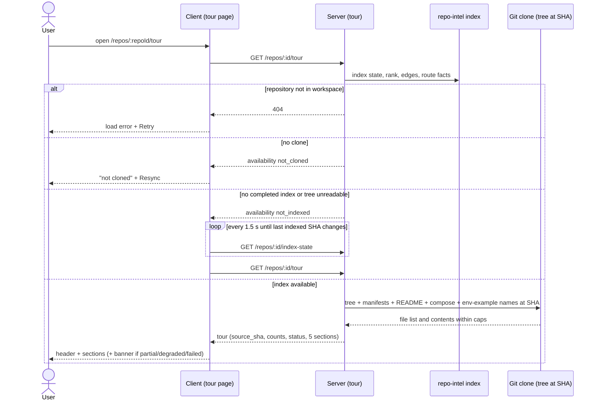
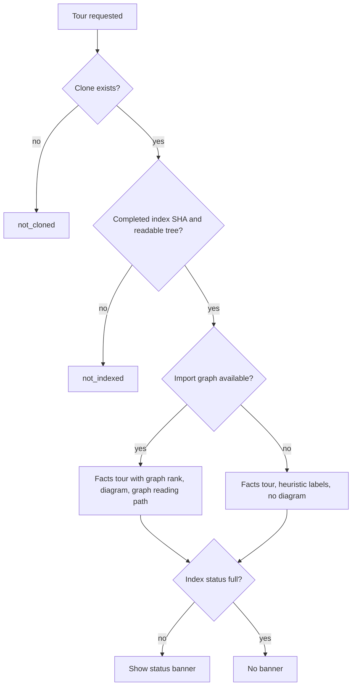

# Spec: Onboarding Tour — deterministic facts and page
Spec ID: 2026-10-01-onboarding-tour-facts
Status: implemented
Supersedes: none
Modules: server, client, e2e

## Problem and user

A DevDigest user imports a repository they don't know, usually so they can
review its pull requests. Before they can judge a PR, they have to work out
how the codebase is built, which files matter, how to run it, where to start
reading and what a safe first change looks like. Today the studio offers
nothing for this:

- The sidebar has a reserved "Onboarding Tour" label
  (`client/messages/en/shell.json:19`) but no nav item
  (`client/src/vendor/ui/nav.ts:21-28`).
- No server endpoint exists.
- A shared `Onboarding` contract, an `onboarding` store and an onboarding
  prompt exist but nothing reads them (see *Inputs and provenance*).

So the user reads the repository blind, often in a language or ecosystem the
indexer doesn't parse. The indexer parses only JS/TS
(`server/src/adapters/astgrep/index.ts:32`), so for Python, Go, Java, PHP,
.NET or Rust repos the studio currently knows almost nothing about structure.

This spec covers the **deterministic** tour: all five sections are built only
from repository facts, with no LLM. The AI-written narrative, Generate and
Regenerate, and staleness of the narrative are in
[2026-10-01-onboarding-tour-narrative](2026-10-01-onboarding-tour-narrative.md),
which depends on this spec.

## Goals / Non-goals

Goals
- A repo-scoped page "Onboarding for <repo>" with five sections:
  Architecture overview, Critical paths, How to run locally, Guided reading
  path, First tasks. Every section is built from facts taken at one commit.
- The facts are language-agnostic. Ecosystem rules (Appendix A) and
  criticality heuristics (Appendix B) work without an import graph, and the
  graph improves them where it exists (JS/TS).
- Honest status:
  - which commit the tour was built from;
  - how many files were indexed out of how many exist;
  - whether the index is full, partial or degraded;
  - whether an import graph exists;
  - what each command and critical file is based on (provenance).
- Every UI state is defined: loading, error, not cloned, not indexed,
  partial, degraded, empty section, long content.
- Navigation: sticky "On this page" anchors with deep links, collapsible
  sections, a "Jump to" select on narrow screens.
- Actions: copy a command, open a file on GitHub at the tour's commit, copy
  a link to the page or section, export the tour as Markdown.

Non-goals
- Any LLM call, narrative text, Generate or Regenerate, "Outdated" chip for
  narrative — all in 2026-10-01-onboarding-tour-narrative.
- **Hotness / git churn in ranking.** Rank stays PageRank only. Clones are
  shallow: 1 commit after clone, at most about 50 after a resync (RQ1).
  Deeper history (`--shallow-since` plus one log pass) is deferred to a
  separate future spec (Q9 → REC-9; confirmed by the user in the
  2026-10-01 revise, Q-1 closed).
- Reading-path progress checkboxes (UX-5) and a "Copy all commands" action
  (UX-6) — out of scope for v1 (Q-4 closed in the 2026-10-01 revise).
- A public, hosted or authenticated share link. The design's "Share link" is
  replaced by "Copy link" and "Export as Markdown" (Q27 → REC-27).
- A tour for a repository without a clone. No tree is fetched from the
  GitHub API (Q15 → REC-15).
- Changing the indexer's file cap, its walk order (first 5000 files in walk
  order), or its JS/TS-only parsing (Q11 → REC-11).
- Per-package tours or a package picker for monorepos (Q13 → REC-13).
- An in-app file preview drawer for "Open" (Q28 → REC-28: GitHub in v1).
- Version history of tours (Q5 → REC-5). This tour is computed, not stored.
- An MCP tool exposing the tour (Q30 → REC-30).
- A `g`-prefixed keyboard shortcut for the page (Q31 → REC-31).
- Persisting collapse state across visits (Q29 → REC-29).
- Executing, validating or dry-running any discovered command.
- Translating the page into other languages (Q10 → REC-10).
- The "GLOBAL" and "MORE SCREENS" sidebar groups shown in the design.

## User stories

- US-1 [must]: As a studio user exploring an imported repository, I want one page with an architecture overview, critical files, run commands, a reading path and first tasks built from the repository's own files, so that I can orient myself without reading the repository blind.
- US-2 [must]: As a studio user, I want to see what each item is based on, from which commit, and how much of the repository was indexed, so that I can judge how much to trust it.
- US-3 [must]: As a studio user whose repository is not cloned, not indexed, partially indexed or not JS/TS, I want the page to say so plainly and still show everything that can be derived, so that I'm never shown a blank or misleading page.
- US-4 [must]: As a keyboard or small-screen user, I want to move between sections, collapse them and deep-link to one, so that I can use the page without a mouse or a wide screen.
- US-5 [should]: As a studio user, I want to copy a command, open a file on GitHub, copy a link to the page and export the tour as Markdown, so that I can act on it and pass it on.
- US-6 [must]: As a studio user, I want to reach the tour from the WORKSPACE sidebar without disturbing the Add-repository page, so that navigation stays predictable.

## Acceptance criteria (EARS)

Navigation and routing
- AC-1 [ubiquitous, US-6, must, verify: unit] The studio sidebar shall show an "Onboarding Tour" item in the WORKSPACE group, between "Pull Requests" and "Project Context", that links to `/repos/:repoId/tour` for the active repository.
- AC-2 [event, US-6, must, verify: unit] КОЛИ the current path is `/repos/:repoId/tour`, the sidebar shall mark "Onboarding Tour" as the active item.
- AC-3 [unwanted, US-6, must, verify: unit] ЯКЩО the current path is the Add-repository route `/onboarding`, ТОДІ the sidebar shall not mark "Onboarding Tour" as the active item.
- AC-4 [ubiquitous, US-6, must, verify: e2e] The Add-repository form shall keep rendering at `/onboarding` (flow `06-onboarding` keeps passing).

Server read
- AC-5 [event, US-1, must, verify: integration] КОЛИ the client requests `GET /repos/:id/tour`, the server shall return the tour built only from deterministic facts, without making any LLM call.
- ~~AC-6 [ubiquitous, US-2, must, verify: integration] The server shall derive every fact in one tour response from the single commit recorded as the index's last indexed SHA, and shall return that commit as `source_sha`.~~ — split for single response (2026-10-01) → AC-56, AC-57.
- AC-7 [unwanted, US-1, must, verify: integration] ЯКЩО the repository does not exist in the caller's workspace, ТОДІ the server shall respond `404`.
- AC-8 [ubiquitous, US-2, must, verify: integration] The tour response shall include the index status (`full | partial | degraded | failed`), the number of files indexed, the number of files in the repository tree at `source_sha`, and whether an import graph is available.
- AC-9 [unwanted, US-3, must, verify: integration] ЯКЩО the repository has no clone, ТОДІ the server shall return `availability: not_cloned` with no sections.
- AC-10 [unwanted, US-3, must, verify: integration] ЯКЩО the repository has a clone but no completed index, or its tree at the index SHA cannot be read, ТОДІ the server shall return `availability: not_indexed` with no sections.
- AC-54 [ubiquitous, US-1, must, verify: integration] While building the tour, the server shall never execute, install or evaluate any script, command or file from the repository.
- ~~AC-55 [unwanted, US-2, must, verify: integration] ЯКЩО a manifest, README, compose or env-example file exceeds 512 KB, or more than 50 manifest files are found, ТОДІ the server shall skip the excess files and report how many were skipped in the response.~~ — split for single response (2026-10-01) → AC-96, AC-97.

Architecture overview
- AC-11 [ubiquitous, US-1, must, verify: unit] The architecture section shall list the detected stack entries (ecosystem, package manager, framework), each with the path of the file that evidences it, detected by the Appendix A rules.
- AC-12 [ubiquitous, US-1, must, verify: unit] The architecture section shall list the repository's top-level modules (top-level directories and workspace members) with the number of files in each at `source_sha`.
- AC-13 [ubiquitous, US-1, must, verify: unit] The architecture section shall show a one-paragraph summary assembled from a fixed message template over the stack entries, the entry points and the module count.
- AC-14 [state, US-1, must, verify: unit] ПОКИ an import graph is available, the architecture section shall show a module diagram whose nodes are top-level modules and whose edges are import edges aggregated between them, limited to at most 20 nodes, the largest by file count.
- AC-15 [state, US-3, must, verify: unit] ПОКИ no import graph is available, the architecture section shall show the module list without a diagram, labelled "No import graph — heuristic structure".

Critical paths
- AC-16 [ubiquitous, US-1, must, verify: unit] The critical-paths section shall list at most 8 files, ordered by criticality score (the sum of the Appendix B tag weights), with ties broken by import-graph rank descending and then path ascending.
- AC-17 [ubiquitous, US-2, must, verify: unit] Each critical file shall show its Appendix B reason tags as text labels.
- ~~AC-18 [ubiquitous, US-2, must, verify: unit] Each critical file shall show its declared-route count and its importer count from the index, and shall show no number when the index holds none for that file.~~ — split for single response (2026-10-01) → AC-58, AC-59.
- AC-19 [ubiquitous, US-1, must, verify: unit] The critical-paths and reading-path sections shall exclude every path that matches the Appendix B exclusions.

How to run locally
- AC-20 [ubiquitous, US-1, must, verify: unit] The run-locally section shall show only commands derived by the Appendix A rules from manifests, workspace markers, lockfiles, env-example files, compose files and fenced shell blocks under a README heading about setup, installation, running or getting started, read at `source_sha`.
- AC-21 [ubiquitous, US-2, must, verify: unit] Each command shall show its source as a file path plus key or heading (e.g. `package.json › scripts.dev`, `README.md › Getting started`).
- AC-22 [ubiquitous, US-2, must, verify: unit] A command that is not declared in a file but derived from an ecosystem convention (an Appendix A row marked U) shall carry the label "By convention — verify".
- ~~AC-23 [ubiquitous, US-1, must, verify: unit] The run-locally section shall order commands install → environment → infrastructure → dev/start → test, numbered from 1 within each group.~~ — split for single response (2026-10-01) → AC-60, AC-61.
- ~~AC-24 [state, US-1, must, verify: unit] ПОКИ the repository has more than one package, the run-locally section shall group commands by package directory. Packages are workspace members of a root workspace marker, or else manifests in the top two directory levels. The section shall show the root group plus at most 3 packages with the most files, and at most 10 commands per group.~~ — split for single response (2026-10-01) → AC-62, AC-63, AC-64.
- AC-25 [unwanted, US-2, must, verify: unit] ЯКЩО a command triggers a package lifecycle or build hook (npm/pnpm `preinstall`, `install`, `postinstall`, `prepare`; .NET `PreBuild`/`PostBuild` `Exec`), ТОДІ the section shall show a warning naming each hook that will execute.
- AC-26 [unwanted, US-2, must, verify: unit] ЯКЩО a command pipes downloaded content into a shell or interpreter (e.g. `curl … | sh`), ТОДІ the section shall show the command with a "Downloads and runs remote code" warning.
- ~~AC-27 [ubiquitous, US-1, must, verify: unit] For an env-example file, the run-locally section shall show the copy command and the variable names only, and the response shall contain no variable values.~~ — split for single response (2026-10-01) → AC-65, AC-66.

Guided reading path
- AC-28 [state, US-1, must, verify: unit] ПОКИ an import graph is available, the reading path shall start with the detected entry points by rank descending, then follow import edges from the files already listed to the files they import, highest rank first, up to 7 items.
- AC-29 [state, US-3, must, verify: unit] ПОКИ no import graph is available, the reading path shall list the entry points followed by critical files in score order, up to 7 items, labelled "Heuristic order — no import graph".
- AC-30 [ubiquitous, US-2, must, verify: unit] Each reading-path item shall show its position and the reason it was included: entry point, imported by item N, or its critical tag.

First tasks
- AC-31 [ubiquitous, US-1, should, verify: unit] The first-tasks section shall list at most 4 tasks drawn from these deterministic signals, in this order: `TODO`/`FIXME` comments, top-ranked source files with no test file, files that declare routes but have no test file, and a README with no setup/run section.
- AC-32 [ubiquitous, US-1, should, verify: unit] Each task shall show a title from a fixed message template, the path of a file or directory that exists at `source_sha`, and complexity `low` (TODO/FIXME, README section) or `medium` (missing test, route without test).

Header and labels
- AC-33 [ubiquitous, US-2, must, verify: unit] The page header shall show "Onboarding for <repository name>", the 7-character `source_sha`, "<indexed> indexed of <total> files", and an index-status chip with a text label.
- AC-34 [ubiquitous, US-2, must, verify: unit] Each section shall carry the label "From repository facts".

Page states
- ~~AC-35 [state, US-3, must, verify: unit] ПОКИ the tour request is in flight, the page shall show a placeholder skeleton per section and shall keep the "On this page" navigation operable.~~ — split for single response (2026-10-01) → AC-67, AC-68.
- ~~AC-36 [unwanted, US-3, must, verify: unit] ЯКЩО the tour request fails, ТОДІ the page shall show "The tour could not be loaded" with a Retry action, and shall keep any tour already on screen.~~ — split for single response (2026-10-01) → AC-69, AC-70.
- AC-37 [state, US-3, must, verify: unit] ПОКИ the tour is `not_cloned`, the page shall show "This repository is not cloned yet" with a Resync action that calls the existing resync endpoint.
- ~~AC-38 [state, US-3, must, verify: unit] ПОКИ the tour is `not_indexed`, the page shall show "Indexing — the tour appears when the index is ready", poll the index state every 1.5 s, and reload the tour once the last indexed SHA changes.~~ — split for single response (2026-10-01) → AC-71, AC-72, AC-73.
- AC-39 [state, US-3, must, verify: unit] ПОКИ the index status is `partial`, `degraded` or `failed`, the page shall show a banner naming the status, the reason, the indexed and total file counts, and a Resync action.
- ~~AC-40 [unwanted, US-3, must, verify: unit] ЯКЩО a section has no items, ТОДІ the page shall show that section with a section-specific empty message explaining why and keep its anchor (e.g. "No run commands found in manifests or README").~~ — split for single response (2026-10-01) → AC-74, AC-75.

Navigation within the page
- ~~AC-41 [event, US-4, must, verify: unit] КОЛИ the user activates an "On this page" anchor, the page shall expand the target section if it is collapsed, scroll it into view, move focus to its heading and set the URL hash to the section id.~~ — split for single response (2026-10-01) → AC-76, AC-77, AC-78, AC-79.
- AC-42 [event, US-4, must, verify: unit] КОЛИ the page opens with the hash of a known section, the page shall scroll that section into view once the tour has loaded.
- AC-43 [unwanted, US-4, should, verify: unit] ЯКЩО the page opens with an unknown hash, ТОДІ the page shall stay at the top.
- AC-44 [state, US-4, should, verify: manual — scroll behaviour in a real browser] ПОКИ the user scrolls, the "On this page" item of the section at the top of the viewport shall be marked current (`aria-current`).
- ~~AC-45 [ubiquitous, US-4, must, verify: unit] Every section shall render expanded on load, and its collapse control shall be a button that exposes `aria-expanded` and the accessible name "Collapse <section>" or "Expand <section>".~~ — split for single response (2026-10-01) → AC-80, AC-81.
- AC-46 [state, US-4, should, verify: manual — viewport resize] ПОКИ the viewport is narrower than 1024 CSS px, the page shall replace the sticky "On this page" panel with a "Jump to" select at the top of the content.

Actions
- ~~AC-47 [event, US-5, must, verify: unit] КОЛИ the user activates a command's copy button, the page shall copy exactly the command text and announce "Copied" through a polite live region.~~ — split for single response (2026-10-01) → AC-82, AC-83.
- ~~AC-48 [unwanted, US-5, must, verify: unit] ЯКЩО writing to the clipboard fails, ТОДІ the page shall select the command text and show "Press ⌘C / Ctrl+C to copy".~~ — split for single response (2026-10-01) → AC-84, AC-85.
- AC-49 [event, US-5, must, verify: unit] КОЛИ the user activates Open on a file, the page shall open the repository's GitHub file URL at `source_sha` in a new tab, with each path segment URL-encoded.
- ~~AC-50 [event, US-5, should, verify: unit] КОЛИ the user activates "Copy link", the page shall copy the tour URL, including the current section hash, and announce "Link copied".~~ — split for single response (2026-10-01) → AC-86, AC-87.
- ~~AC-51 [event, US-5, should, verify: unit] КОЛИ the user activates "Export as Markdown", the page shall download `<repo-name>-onboarding-<sha7>.md`. The file shall contain the header facts and all five sections, with commands in fenced code blocks whose fence is longer than any backtick run inside the command.~~ — split for single response (2026-10-01) → AC-88, AC-89, AC-90.

Long content
- ~~AC-52 [ubiquitous, US-1, must, verify: unit] A path longer than its row shall be truncated in the middle, with the full path available as tooltip text and as the accessible name.~~ — split for single response (2026-10-01) → AC-91, AC-92, AC-93.
- ~~AC-53 [ubiquitous, US-1, must, verify: unit] A command shall never be truncated. A command wider than its row shall wrap or scroll horizontally.~~ — split for single response (2026-10-01) → AC-94, AC-95.

Split ACs (2026-10-01 revise — one response per AC; behaviour, story, priority and verify kind inherited from the struck parent)
- AC-56 [ubiquitous, US-2, must, verify: integration] The server shall derive every fact in one tour response from the single commit recorded as the index's last indexed SHA. (from AC-6)
- AC-57 [ubiquitous, US-2, must, verify: integration] The tour response shall return that commit as `source_sha`. (from AC-6)
- AC-58 [ubiquitous, US-2, must, verify: unit] Each critical file shall show its declared-route count and its importer count from the index. (from AC-18)
- AC-59 [unwanted, US-2, must, verify: unit] ЯКЩО the index holds no route or importer count for a critical file, ТОДІ the page shall show no number for that count. (from AC-18)
- AC-60 [ubiquitous, US-1, must, verify: unit] The run-locally section shall order commands install → environment → infrastructure → dev/start → test. (from AC-23)
- AC-61 [ubiquitous, US-1, must, verify: unit] The run-locally section shall number commands from 1 within each group. (from AC-23)
- AC-62 [state, US-1, must, verify: unit] ПОКИ the repository has more than one package (workspace members of a root workspace marker, or else manifests in the top two directory levels), the run-locally section shall group commands by package directory. (from AC-24)
- AC-63 [state, US-1, must, verify: unit] ПОКИ the repository has more than one package, the run-locally section shall show the root group plus at most 3 packages with the most files. (from AC-24)
- AC-64 [state, US-1, must, verify: unit] ПОКИ the repository has more than one package, the run-locally section shall show at most 10 commands per group. (from AC-24)
- AC-65 [ubiquitous, US-1, must, verify: unit] For an env-example file, the run-locally section shall show the copy command and the variable names only. (from AC-27)
- AC-66 [ubiquitous, US-1, must, verify: unit] The tour response shall contain no env variable values. (from AC-27)
- AC-67 [state, US-3, must, verify: unit] ПОКИ the tour request is in flight, the page shall show a placeholder skeleton per section. (from AC-35)
- AC-68 [state, US-3, must, verify: unit] ПОКИ the tour request is in flight, the page shall keep the "On this page" navigation operable. (from AC-35)
- AC-69 [unwanted, US-3, must, verify: unit] ЯКЩО the tour request fails, ТОДІ the page shall show "The tour could not be loaded" with a Retry action. (from AC-36)
- AC-70 [unwanted, US-3, must, verify: unit] ЯКЩО the tour request fails, ТОДІ the page shall keep any tour already on screen. (from AC-36)
- AC-71 [state, US-3, must, verify: unit] ПОКИ the tour is `not_indexed`, the page shall show "Indexing — the tour appears when the index is ready". (from AC-38)
- AC-72 [state, US-3, must, verify: unit] ПОКИ the tour is `not_indexed`, the page shall poll the index state every 1.5 s. (from AC-38)
- AC-73 [complex, US-3, must, verify: unit] ПОКИ the tour is `not_indexed`, КОЛИ the last indexed SHA changes, the page shall reload the tour. (from AC-38)
- AC-74 [unwanted, US-3, must, verify: unit] ЯКЩО a section has no items, ТОДІ the page shall show that section with a section-specific empty message explaining why (e.g. "No run commands found in manifests or README"). (from AC-40)
- AC-75 [unwanted, US-3, must, verify: unit] ЯКЩО a section has no items, ТОДІ the page shall keep that section's "On this page" anchor. (from AC-40)
- AC-76 [event, US-4, must, verify: unit] КОЛИ the user activates an "On this page" anchor, the page shall expand the target section if it is collapsed. (from AC-41)
- AC-77 [event, US-4, must, verify: unit] КОЛИ the user activates an "On this page" anchor, the page shall scroll the target section into view. (from AC-41)
- AC-78 [event, US-4, must, verify: unit] КОЛИ the user activates an "On this page" anchor, the page shall move focus to the target section's heading. (from AC-41)
- AC-79 [event, US-4, must, verify: unit] КОЛИ the user activates an "On this page" anchor, the page shall set the URL hash to the section id. (from AC-41)
- AC-80 [ubiquitous, US-4, must, verify: unit] Every section shall render expanded on page load. (from AC-45)
- AC-81 [ubiquitous, US-4, must, verify: unit] Each section's collapse control shall be a button exposing `aria-expanded` with the accessible name "Collapse <section>" or "Expand <section>". (from AC-45)
- AC-82 [event, US-5, must, verify: unit] КОЛИ the user activates a command's copy button, the page shall copy exactly the command text to the clipboard. (from AC-47)
- AC-83 [event, US-5, must, verify: unit] КОЛИ a command has been copied, the page shall announce "Copied" through a polite live region. (from AC-47)
- AC-84 [unwanted, US-5, must, verify: unit] ЯКЩО writing to the clipboard fails, ТОДІ the page shall select the command text. (from AC-48)
- AC-85 [unwanted, US-5, must, verify: unit] ЯКЩО writing to the clipboard fails, ТОДІ the page shall show "Press ⌘C / Ctrl+C to copy". (from AC-48)
- AC-86 [event, US-5, should, verify: unit] КОЛИ the user activates "Copy link", the page shall copy the tour URL, including the current section hash. (from AC-50)
- AC-87 [event, US-5, should, verify: unit] КОЛИ the tour link has been copied, the page shall announce "Link copied" through a polite live region. (from AC-50)
- AC-88 [event, US-5, should, verify: unit] КОЛИ the user activates "Export as Markdown", the page shall download a file named `<repo-name>-onboarding-<sha7>.md`. (from AC-51)
- AC-89 [ubiquitous, US-5, should, verify: unit] The exported Markdown file shall contain the header facts and all five sections. (from AC-51)
- AC-90 [ubiquitous, US-5, should, verify: unit] The exported Markdown file shall put each command in a fenced code block whose fence is longer than any backtick run inside the command. (from AC-51)
- AC-91 [ubiquitous, US-1, must, verify: unit] A path longer than its row shall be truncated in the middle. (from AC-52)
- AC-92 [ubiquitous, US-1, must, verify: unit] A truncated path shall expose the full path as tooltip text. (from AC-52)
- AC-93 [ubiquitous, US-1, must, verify: unit] A truncated path shall expose the full path as its accessible name. (from AC-52)
- AC-94 [ubiquitous, US-1, must, verify: unit] A command shall never be truncated. (from AC-53)
- AC-95 [ubiquitous, US-1, must, verify: unit] A command wider than its row shall wrap or scroll horizontally. (from AC-53)
- AC-96 [unwanted, US-2, must, verify: integration] ЯКЩО a manifest, README, compose or env-example file exceeds 512 KB, or more than 50 manifest files are found, ТОДІ the server shall skip the excess files. (from AC-55)
- AC-97 [unwanted, US-2, must, verify: integration] ЯКЩО the server skipped files because of the size or count cap, ТОДІ the tour response shall report how many were skipped. (from AC-55)

## Edge cases

UI state matrix (screen × state from `ux-design-review`; source design `5.png`):

| Component | Default | Empty | Loading | Partial / streaming | Error | Degraded | No access / no token | First run | Long content | Stale |
|---|---|---|---|---|---|---|---|---|---|---|
| Header (title, sha, counts, chip, Copy link, Export) | AC-33 | n/a | AC-67 | AC-39 | AC-69, AC-70 | AC-39 | n/a — no LLM key or GitHub token used | AC-37, AC-71–AC-73 | AC-91–AC-93 | n/a — computed from the current index (AC-56) |
| On this page / Jump to | AC-76–AC-79 | AC-75 | AC-68 | n/a | n/a | n/a | n/a | n/a | AC-46 | n/a |
| Architecture | AC-11–AC-14 | AC-74 | AC-67 | AC-39 | AC-69, AC-70 | AC-15 | n/a | AC-37, AC-71–AC-73 | EC-17 | n/a |
| Critical paths | AC-16, AC-17, AC-58, AC-59 | AC-74 | AC-67 | AC-39 | AC-69, AC-70 | AC-15, EC-2 | n/a | AC-37, AC-71–AC-73 | AC-91–AC-93 | n/a |
| How to run locally | AC-20–AC-22, AC-25, AC-26, AC-60–AC-66 | AC-74 | AC-67 | n/a | AC-84, AC-85 | AC-22 | n/a | AC-37, AC-71–AC-73 | AC-62–AC-64, AC-94, AC-95 | n/a |
| Guided reading path | AC-28, AC-30 | AC-74 | AC-67 | n/a | AC-69, AC-70 | AC-29 | n/a | AC-37, AC-71–AC-73 | AC-91–AC-93 | n/a |
| First tasks | AC-31, AC-32 | AC-74 | AC-67 | n/a | AC-69, AC-70 | AC-31 | n/a | AC-37, AC-71–AC-73 | AC-91–AC-93 | n/a |
| Whole page | AC-5 | AC-74 | AC-67 | AC-39 | AC-69, AC-70, AC-7 | AC-39 | n/a | AC-37, AC-71–AC-73 | n/a | n/a |

- EC-1: The repository has no clone (clone failed or not finished) → `not_cloned` state with Resync (→ AC-9, AC-37).
- EC-2: The repository has no JS/TS files, so the index holds 0 files and no graph → the tour is built from tree, manifests and README. Graph-dependent parts are labelled heuristic (→ AC-15, AC-29, AC-39).
- EC-3: The repository has more than 5000 parseable files, or indexing stopped at its time budget → the tour comes from the partial index and the banner shows the counts (→ AC-8, AC-39).
- EC-4: A resync or reindex runs while the page is open → the tour keeps showing the last completed index SHA. The next load after the index advances reflects the new SHA (→ AC-56, AC-57, AC-73).
- EC-5: The index failed and has never completed → `not_indexed` (→ AC-10, AC-71, AC-72). The index failed after an earlier success → the tour comes from the last indexed SHA, with the status banner (→ AC-39).
- EC-6: No manifest and no README run section → the run-locally empty message (→ AC-74).
- EC-7: A monorepo without a workspace tool (several manifests in subdirectories, like this repository) → commands grouped per package (→ AC-62, AC-63, AC-64).
- EC-8: A README contains a "setup" block with `curl https://… | sh` → shown with the remote-code warning, never executed (→ AC-26, AC-54).
- EC-9: An env-example file contains real-looking secret values → only names are shown or returned (→ AC-65, AC-66).
- EC-10: A manifest declares `postinstall`, or a project file declares a `PreBuild` `Exec` → the install/build command shows the hook warning (→ AC-25).
- EC-11: A manifest or README is larger than 512 KB, or there are more than 50 manifests → skipped and counted (→ AC-96, AC-97).
- EC-12: Very long repository names, paths or commands → middle truncation for paths, wrapping for commands (→ AC-91, AC-94, AC-95).
- EC-13: The clipboard API is denied or the context is not secure → select text plus a hint (→ AC-84, AC-85).
- EC-14: A deep link targets a section that is collapsed or empty → it expands and scrolls there (→ AC-76, AC-77, AC-42). An unknown hash → stay at the top (→ AC-43).
- EC-15: A path contains spaces, `#`, `?` or non-ASCII characters → each segment is encoded in the GitHub URL (→ AC-49).
- EC-16: The repository is removed while the page is open → the next request gets `404` and the page shows the load error (→ AC-7, AC-69).
- EC-17: A flat repository with no top-level directories → the module list shows the root only, and no diagram is drawn when fewer than 2 modules exist (→ AC-12, AC-14).
- EC-18: More than 7 entry points (e.g. many `cmd/*/main.go`) → the reading path is capped at 7 (→ AC-28).
- EC-19: A first-task signal points to a directory (e.g. a missing-docs task at `docs/`) → allowed, because the directory exists at `source_sha` (→ AC-32).

## Non-functional requirements

- NFR-1 [performance, verify: integration + manual timing on the seeded DB] `GET /repos/:id/tour` shall respond within p95 ≤ 2 s the first time it is called for a given `source_sha` on a repository with 5000 indexed files. Repeated calls for the same `source_sha` shall respond within p95 ≤ 300 ms.
- NFR-2 [LLM cost, verify: integration] n/a — this spec makes 0 LLM calls (AC-5). LLM cost lives in 2026-10-01-onboarding-tour-narrative.
- NFR-3 [limits, verify: unit] The list caps are: critical files ≤ 8, reading path ≤ 7, packages ≤ 3 plus root, commands ≤ 10 per group, tasks ≤ 4, diagram ≤ 20 nodes. File reads are capped at 512 KB per file and 50 manifests (AC-96, AC-97). Excess is dropped deterministically and counted.
- NFR-4 [reliability, verify: unit] For the same `source_sha` and the same index contents, the tour sections shall be identical on every call, with ordering fully determined by Appendix B tie-breaks. The tour stores no state of its own, so a server restart loses nothing.
- NFR-5 [security, verify: integration + unit] Every repository-derived input is handled as listed in *Untrusted inputs*. Repository text is rendered as plain text, never as HTML, and no repository content is executed (AC-54).
- NFR-6 [accessibility, verify: manual — keyboard + axe + contrast checker; unit for roles/names] The page shall meet these WCAG 2.2 AA items:
  - every action (anchors, collapse, Copy, Open, Copy link, Export, Resync, Retry) is reachable and operable by keyboard, in visual order;
  - focus is visible and never hidden by the sticky panel (2.4.11);
  - interactive targets are ≥ 24 × 24 CSS px (2.5.8);
  - secondary text has ≥ 4.5:1 contrast (1.4.3), and icons and borders ≥ 3:1 (1.4.11);
  - status and complexity are conveyed by text, not colour alone (1.4.1);
  - content reflows at 320 CSS px and 200 % zoom (1.4.10);
  - the diagram has the module list as its text alternative (1.1.1);
  - copy and link confirmations use a polite live region (4.1.3).
- NFR-7 [observability, verify: integration] Each tour computation shall log repository id, `source_sha`, duration, item counts per section, skipped-file count and the degradation reason. It shall never log file contents, README text or env values.
- NFR-8 [compatibility, verify: integration + unit] `GET /repos/:id/index-state`, `POST /repos/:id/resync` and the `/onboarding` route keep their behaviour. The `Onboarding` contract is replaced in all three vendored copies (server, client, mcp-server), which have no runtime consumer. No seeded onboarding data exists to migrate.
- NFR-9 [i18n, verify: unit] All user-visible strings, including the summary and task-title templates, shall come from `client/messages/en`. Repository-derived text (paths, commands, names) is shown verbatim and never translated. No message string contains `<word>`-style text (client/INSIGHTS.md:39).

## Workflow and module communication

Page load (happy path and failure branches):



Availability decision:



## Contracts

- `GET /repos/:id/tour` — **new**. `200` returns the `Onboarding` body below, `404` when the repository is not in the workspace, and `422` when `id` is not a UUID.
- `Onboarding` shared contract — **changed** (replaced in place, Q32 → REC-32). The old shape was `sections[{kind,title,body,diagram,links}]`.
  - Consumers: client (new tour page), server contract test, and the mcp-server vendored copy (no runtime use).
  - **Not breaking**: no endpoint served the old shape (`server/test/contracts.test.ts:151-155` is the only user).

```
Onboarding {
  repo_id: string
  availability: "available" | "not_cloned" | "not_indexed"
  source_sha: string | null            // null unless available
  computed_at: string (ISO date-time)
  index: {
    status: "full" | "partial" | "degraded" | "failed"
    reason: string | null
    files_indexed: integer
    files_in_repo: integer | null
    graph_available: boolean
    files_skipped_by_tour: integer     // AC-97
  }
  sections: null | {
    architecture: {
      origin: "facts"
      summary: string                  // template-built, AC-13
      stack: [{ kind: "ecosystem" | "package_manager" | "framework", name: string, evidence_path: string, confidence: "verified" | "convention" }]
      modules: [{ path: string, file_count: integer }]
      diagram: null | { nodes: [{ id: string, path: string }], edges: [{ from: string, to: string, import_count: integer }] }
    }
    critical_paths: {
      origin: "facts", graph_based: boolean
      items: [{ path: string, score: number, tags: CriticalTag[], route_count: integer | null, importer_count: integer | null }]
    }
    run_locally: {
      origin: "facts"
      groups: [{ package_path: string, ecosystem: string | null,
                 commands: [{ id: string, position: integer, phase: "install" | "environment" | "infrastructure" | "dev" | "test",
                              command: string, source_path: string | null, source_key: string | null,
                              by_convention: boolean, env_names: string[] | null,
                              warnings: [{ kind: "lifecycle_hook" | "remote_code", detail: string }] }] }]
    }
    reading_path: {
      origin: "facts", graph_based: boolean
      items: [{ position: integer, path: string, reason: "entry_point" | "imported_by" | "critical", imported_by_position: integer | null, tags: CriticalTag[] }]
    }
    first_tasks: {
      origin: "facts"
      items: [{ id: string, signal: "todo_comment" | "missing_test" | "route_without_test" | "readme_missing_setup",
                path: string, path_kind: "file" | "directory", line: integer | null, complexity: "low" | "medium" }]
    }
  }
}
CriticalTag = "entry_point" | "public_surface" | "high_fan_in" | "security_sensitive" | "data_schema" | "runtime_config" | "docs"
```

- `GET /repos/:id/index-state`, `POST /repos/:id/resync` — **unchanged**. Used by the not-indexed polling (AC-72) and Resync actions (AC-37, AC-39).

## Rollout and compatibility

- **Existing data:** no seeded onboarding rows exist. Any previously stored onboarding data is neither read nor shown by this spec. The tour is computed from the current index on every load.
- **Existing consumers:** the old `Onboarding` contract had no endpoint or runtime consumer. All three vendored copies change together, guarded by `scripts/check-shared-sync.sh`.
- **Migration:** this spec needs no migration of its own. If the planner adds a cache, migrations remain manual (`pnpm db:migrate`).
- **No flag.** The page is always available. When `REPO_INTEL_ENABLED` is off, the facade returns empty graph and rank data, so the tour shows the heuristic labels (AC-15, AC-29).
- **First use after upgrade:** the new sidebar item appears and opening it shows the facts tour at once. A repository indexed under an older indexer version shows whatever its index holds, plus the status banner.
- **Dependent spec:** 2026-10-01-onboarding-tour-narrative overlays AI-written text onto this response and adds a `narrative` field.

## Inputs and provenance

- **User request** (2026-10-01): the five sections, sidebar item, sticky anchors, collapsible sections, Regenerate and Share link buttons, and the subtitle. Also: define critical-file criteria across project types; cover large repos and the no-clone case; give AC IDs that stay stable through the SDD pipeline. Implementation idea used as context only: deterministic facts via `repoIntel.*`, reading path from the import graph, a skeleton with honest status.
- **Design** `/private/tmp/claude-501/-Users-sdiachenko-web-dev-cource-projects-dev-digest/1133b83c-89fc-4ef8-9dfd-1de02897271f/images/5.png`. Taken from it:
  - layout, header and subtitle;
  - the 5 sections and their item shapes (path + reason + Open; numbered commands + copy; numbered reading items; task cards with path and Low/Medium badge);
  - the sidebar position;
  - the "On this page" panel.
  - Only the default state is drawn. All other states come from analysis D-GAP-1..22.
- **User answers:** the user accepted every recommendation REC-1..REC-32 unchanged ("Приймаю всі REC"). The ones applied here:
  - Q1 → split into this spec and the narrative spec;
  - Q2 → the studio user is the audience;
  - Q3 → route `/repos/:repoId/tour`, `/onboarding` unchanged;
  - Q4/Q5 → no stored history in this spec;
  - Q6 → deterministic task signals with `low | medium`;
  - Q7 → flat list scored by tags;
  - Q8 → entry points first, then imports;
  - Q9 → no hotness;
  - Q10 → English;
  - Q11 → "X indexed of Y" plus partial chip;
  - Q13 → root plus ≤ 3 packages;
  - Q14 → caps;
  - Q15 → no-clone state;
  - Q16 → tree/manifest heuristics;
  - Q20 → provenance and warnings;
  - Q27 → Copy link plus Export Markdown;
  - Q28 → GitHub at SHA;
  - Q29 → anchors, hash, scroll-spy, Jump-to;
  - Q30/Q31 → non-goals;
  - Q32 → contract replaced in place.
  - Analysis items applied as decisions: D-GAP-1..22, EC-1..22 and UX-1, -2, -3, -7, -9.
- **Research:**
  - RQ1 → after a clone the log has 1 commit; after a resync, at most about 50 (a count limit, not a 180-day window). `file_rank.hotness` exists but is always 0, and the rank computation has no churn input. GitHub `listCommitsForPath` needs at least 1 call per file and has no `since`. Hotness is therefore deferred to a separate future spec (Non-goals; Q-1 closed).
  - RQ2 → the ecosystem catalogue in Appendix A, with V/U marks carried over. Lifecycle scripts and .NET build `Exec` are documented execution vectors (AC-25). Monorepo rule: a root workspace marker means iterate the members.
  - RQ3 → structure is available via tree listing at the index SHA plus the repo map. Routes exist only per file in the index; there is no repo-wide read. The Project Context catalog holds only Markdown in the specs/insights/docs categories, with no README/ARCHITECTURE/ADR type. Stack detection and manifest scripts are absent. The catalog's scanned SHA can differ from the index SHA, so AC-56 requires a single SHA and docs are read from the tree at that SHA. Placement of the new facts is the planner's decision.
- **Code facts:**
  - indexer scope and caps: `server/src/adapters/astgrep/index.ts:32`, `server/src/modules/repo-intel/constants.ts:22-31,57-61`, `server/src/modules/repo-intel/pipeline/walk.ts:10-12,65-67`;
  - no-files partial index: `server/src/modules/repo-intel/pipeline/full.ts:100-112`;
  - rank = PageRank: `server/src/modules/repo-intel/pipeline/rank.ts:4-7`;
  - existing samplers: `server/src/modules/repo-intel/service.ts:653-750`;
  - index-state surface: `server/src/modules/repo-intel/routes.ts:30-101`;
  - client polling precedent: `client/src/lib/hooks/repo-intel.ts:26-37`;
  - old contract: `server/src/vendor/shared/contracts/knowledge.ts:28-47`;
  - sidebar: `client/src/vendor/ui/nav.ts:21-28`, `client/src/components/app-shell/helpers.ts:29`;
  - Add-repo route: `client/specs/pages.md:142-145`, `e2e/specs/06-onboarding.flow.json`;
  - GitHub URL helper: `client/src/lib/github-urls.ts:21-31`;
  - workspace scoping: `server/src/modules/_shared/context.ts:14-23`.
- **INSIGHTS:**
  - `client/INSIGHTS.md:39` (no `<tag>` text in messages);
  - `client/INSIGHTS.md:45` (sticky element offsets need a mounted-node measurement — relevant to the sticky panel);
  - `server/INSIGHTS.md:53-55` (import repo-intel types only through the facade port).
- **Numbers this spec chose, not given by the user:** 1024 px breakpoint, 512 KB per file, 50 manifests, NFR-1 latencies, Appendix B weights and keywords. The user accepted them as written in the 2026-10-01 revise ("підтверджую рекомендації по відкритим питанням"; Q-2 closed).

## Untrusted inputs

| Input | Source | OWASP | Required handling |
|---|---|---|---|
| Manifests, lockfiles, compose, project files | repository at `source_sha` | A05 Injection, A08 Integrity | Parsed as data only and never executed (AC-54); ≤ 512 KB per file, ≤ 50 manifests (AC-96, AC-97); parse failure → the file is skipped and counted, never a 500 |
| README fenced shell blocks | repository | A05 (social-engineering command injection) | Shown verbatim with source (AC-21); remote-code pipes flagged (AC-26); rendered as plain text |
| Lifecycle / build hooks | manifests, project files | A05, A08 | Warning naming each hook (AC-25) |
| Env-example files | repository | A04 / A09 secret exposure | Names only; values never in the response, logs or export (AC-65, AC-66, NFR-7) |
| File paths and names | tree, index | A05 (URL/markup injection) | Plain text in the DOM; per-segment encoding in GitHub URLs (AC-49); export uses fences that can't be escaped (AC-90) |
| Repository id in route | client | A01 Broken Access Control | Resolved inside the caller's workspace, `404` otherwise (AC-7) |
| Logs | server | A09 | Counts and ids only (NFR-7) |

## Traceability

| Story | AC | EC | NFR | Verify |
|---|---|---|---|---|
| US-1 | AC-5, AC-7, AC-11, AC-12, AC-13, AC-14, AC-16, AC-19, AC-20, AC-28, AC-31, AC-32, AC-54, AC-60, AC-61, AC-62, AC-63, AC-64, AC-65, AC-66, AC-91, AC-92, AC-93, AC-94, AC-95 | EC-6, EC-7, EC-9, EC-12, EC-16, EC-17, EC-18, EC-19 | NFR-1, NFR-2, NFR-3, NFR-4, NFR-7 | integration, unit |
| US-2 | AC-8, AC-17, AC-21, AC-22, AC-25, AC-26, AC-30, AC-33, AC-34, AC-56, AC-57, AC-58, AC-59, AC-96, AC-97 | EC-8, EC-10, EC-11 | NFR-5, NFR-7 | integration, unit |
| US-3 | AC-9, AC-10, AC-15, AC-29, AC-37, AC-39, AC-67, AC-68, AC-69, AC-70, AC-71, AC-72, AC-73, AC-74, AC-75 | EC-1, EC-2, EC-3, EC-4, EC-5 | NFR-4 | integration, unit |
| US-4 | AC-42, AC-43, AC-44, AC-46, AC-76, AC-77, AC-78, AC-79, AC-80, AC-81 | EC-14 | NFR-6, NFR-9 | unit, manual |
| US-5 | AC-49, AC-82, AC-83, AC-84, AC-85, AC-86, AC-87, AC-88, AC-89, AC-90 | EC-13, EC-15 | NFR-6 | unit |
| US-6 | AC-1, AC-2, AC-3, AC-4 | — | NFR-8 | unit, e2e |

Struck (split for single response, 2026-10-01; each replaced by the IDs shown):
- AC-6 → AC-56, AC-57
- AC-18 → AC-58, AC-59
- AC-23 → AC-60, AC-61
- AC-24 → AC-62–AC-64
- AC-27 → AC-65, AC-66
- AC-35 → AC-67, AC-68
- AC-36 → AC-69, AC-70
- AC-38 → AC-71–AC-73
- AC-40 → AC-74, AC-75
- AC-41 → AC-76–AC-79
- AC-45 → AC-80, AC-81
- AC-47 → AC-82, AC-83
- AC-48 → AC-84, AC-85
- AC-50 → AC-86, AC-87
- AC-51 → AC-88–AC-90
- AC-52 → AC-91–AC-93
- AC-53 → AC-94, AC-95
- AC-55 → AC-96, AC-97

## Open questions

- ~~Q-1~~ — closed 2026-10-01: hotness/churn is deferred to a separate future spec (candidate approach from RQ1: a shallow-since fetch plus one name-only log pass). Recorded in Non-goals.
- ~~Q-2~~ — closed 2026-10-01: the user accepted the numbers as written (1024 px, 512 KB, 50 manifests, NFR-1 latencies, Appendix B weights and keywords).
- Q-3: Appendix A rows marked U (Rails, Bundler, Yarn/Bun, npm workspaces, Nx/Turbo, `go.work`, Flask/FastAPI, Cargo workspaces, most "run locally" sequences) are heuristics that need verification before they can count as declared facts. Until then they surface only with the "By convention — verify" label (AC-22) — for: researcher — blocking: no.
- ~~Q-4~~ — closed 2026-10-01: UX-5 and UX-6 are out of scope for v1. Recorded in Non-goals.

### Changelog
- **2026-10-01 — revise (still `draft`, not approved).** The user confirmed the recommendations for all open questions ("підтверджую рекомендації по відкритим питанням"). Q-1, Q-2 and Q-4 are closed. Q-3 stays open (non-blocking, for researcher). Non-goals gained UX-5/UX-6, and the hotness Non-goal now cites the closed Q-1. No US/AC/EC/NFR was added, removed or renumbered.
- **2026-10-01 — revise: split for single response.** 18 compound ACs were struck and replaced by single-response ACs AC-56..AC-97 (map under *Traceability*). Behaviour, story, priority and verify kind are unchanged; AC-73 changed pattern from state to complex because its trigger is an event inside a state. Updated: UI state matrix, EC references, NFR-3, contract comment, *Untrusted inputs*, Appendix A reference, Traceability. No existing ID was renumbered.
- **2026-10-01 — approved by the user** ("Approve обидва spec…"), after the final self-check passed. `Status: draft` → `approved`.

## Appendix A — Ecosystem rules (normative heuristics, not facts)

Confidence column: **V** = verified against official documentation (RQ2). **U** = unverified convention. A U row may only produce items labelled "By convention — verify" (AC-22) or stack entries with `confidence: convention`, and needs verification (Q-3) before it is treated as V.

**Monorepo rule (V):** a root manifest with a workspace marker → iterate its members and apply this table to each member. With no marker, every manifest in the top two directory levels is a package (AC-62).

| Ecosystem | Detect by (stack evidence) | Entry points (tag `entry_point`) | Commands | Members | Conf. |
|---|---|---|---|---|---|
| JS/TS | `package.json` | `main`, `exports`, `bin` fields | `package.json` `scripts` (install/setup/dev/start/serve/test/db-related names), invoked with the detected package manager | `pnpm-workspace.yaml` packages | V |
| JS/TS package manager | `pnpm-lock.yaml` → pnpm; `package-lock.json` → npm | — | `<pm> install`; lifecycle hooks `preinstall`/`install`/`postinstall`/`prepare` → AC-25 | — | V |
| JS/TS (conventions) | `yarn.lock` → yarn, `bun.lockb` → bun; `nx.json`, `turbo.json` | `src/index.*`, `src/main.*`, `src/server.*`, `src/app.*` | — | `package.json` `workspaces`, Nx/Turbo projects | U |
| Python | `pyproject.toml` | `[project.scripts]` targets | — | — | V |
| Django | `manage.py`, `*/settings.py` | `manage.py`, `*/wsgi.py`, `*/asgi.py`; `*/urls.py` → `public_surface` | `python manage.py runserver` (sequence) | — | V (files) / U (sequence) |
| FastAPI / Flask | dependency name in manifest | module creating the app | `uvicorn …` / `flask run` | — | U |
| Go | `go.mod` | files with `package main`; `cmd/<name>/main.go`; `internal/` = private packages (structure only) | `go run ./cmd/<name>`, `go test ./...` | `go.work` | V (files) / U (commands, go.work) |
| Rust | `Cargo.toml` | `src/main.rs`, `src/lib.rs`, `src/bin/*` | `cargo run`, `cargo test` | `[workspace]` members | V (files) / U (commands, workspace) |
| Java/Kotlin – Maven | `pom.xml` | class annotated `@SpringBootApplication` | `mvn …` | `<modules>` | V (files, modules, Spring marker) / U (commands) |
| Java/Kotlin – Gradle | `settings.gradle(.kts)`, `build.gradle(.kts)` | as above | `./gradlew …` | `include(...)` in settings | V (settings include) / U (commands) |
| PHP – Composer | `composer.json` | `bin` entries; `autoload` roots (structure) | `composer install`; `composer run <script>` for `scripts` | — | V (fields) / U (sequence) |
| Laravel | `artisan`, `public/index.php` | `public/index.php`; `routes/*.php` → `public_surface`; `app/Http/**` → `public_surface`; `app/Policies/**` → `security_sensitive`; `config/**` → `runtime_config`; `database/migrations/` → `data_schema` (directory) | `php artisan serve` | — | V (files) / U (command) |
| .NET | `*.csproj` with `Sdk` attribute, `global.json`, `Directory.Build.props` | project with an output type of executable | `dotnet run`, `dotnet test`; `PreBuild`/`PostBuild` `Exec` → AC-25 | solution projects | V (files, hooks) / U (commands) |
| Ruby / Rails | `Gemfile`; `config/routes.rb`, `bin/rails` | `config.ru`, `bin/rails`; `config/routes.rb` → `public_surface` | `bundle install`, `bin/rails server` | — | U |
| Container / infra | `Dockerfile`, `docker-compose*.y(a)ml`, `compose*.y(a)ml` | — | `docker compose up -d` (phase infrastructure) | — | U |
| Env example | `.env.example`, `.env.sample` | — | `cp <file> .env` + variable names (phase environment) | — | U |
| README | `README*` at repository or package root | — | fenced `sh`/`bash`/`shell`/`console` blocks under a heading about setup, install, run, getting started or development | — | heuristic (always shows its source, AC-21) |

## Appendix B — Criticality heuristics (normative)

| Tag | Weight | A file gets the tag when… | Needs graph |
|---|---|---|---|
| `entry_point` | 5 | it is an entry point by Appendix A | no |
| `public_surface` | 4 | the index records ≥ 1 HTTP route or cron in it, or Appendix A marks it as a route file | no (index route facts are JS/TS only) |
| `high_fan_in` | 4 | its import-graph rank percentile is ≥ 90 | yes |
| `security_sensitive` | 3 | a path segment or file stem contains, case-insensitively at a word boundary, one of: `auth`, `session`, `token`, `crypto`, `permission`, `acl`, `policy`, `payment`, `billing`, `webhook`, `middleware`, `secret`, `password` | no |
| `data_schema` | 3 | it is a schema/model/entity file (a path segment `schema`, `schemas`, `models`, `entities`), a `*.proto`, `openapi.*`, `swagger.*` or `*.graphql` file, or the migrations **directory** (one item) | no |
| `runtime_config` | 2 | it is a manifest, `Dockerfile`, compose file, `.github/workflows/*` file or env-example file | no |
| `docs` | 1 | it is `README*`, `CONTRIBUTING*`, `ARCHITECTURE*` or under `docs/adr/` | no |

- **Score** is the sum of the weights of a file's tags. A file needs ≥ 1 tag to be listed.
- **Ties** are broken by import-graph rank descending (0 when no graph), then by path ascending.
- **Exclusions** for critical paths and the reading path:
  - tests: `.test.`, `.spec.`, `__tests__/`, `/test/`, `/tests/`;
  - mocks and fixtures: `__mocks__/`, `__fixtures__/`;
  - `.d.ts` files;
  - generated or vendored dirs: `node_modules`, `dist`, `build`, `coverage`, `.next`, `out`, `vendor`, `.git`;
  - lockfiles;
  - individual migration files (the migrations directory itself may appear once).
