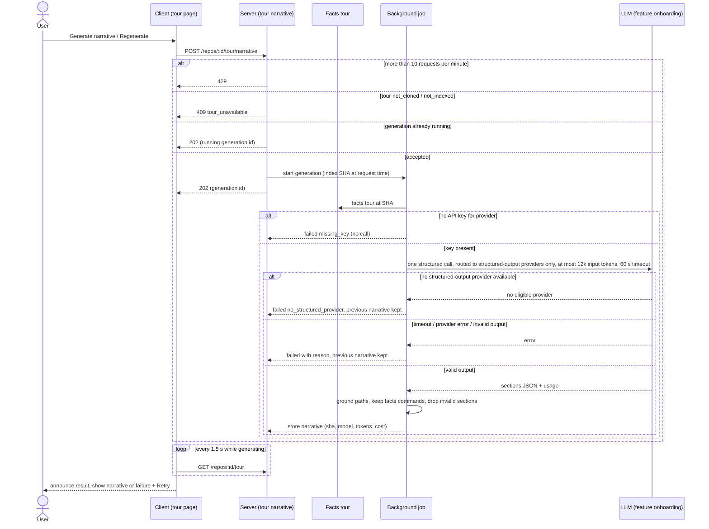
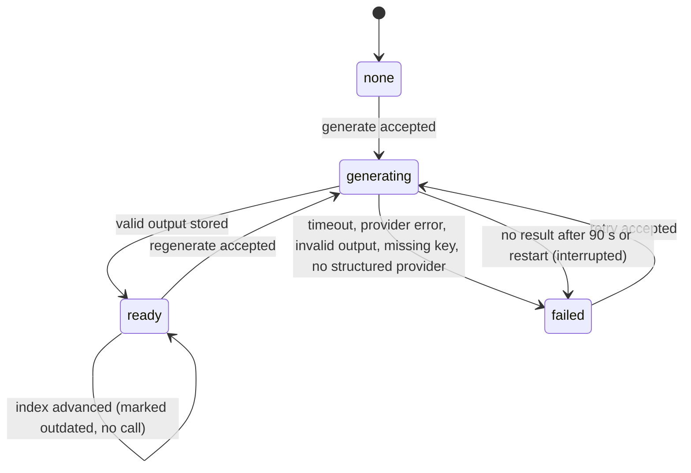

# Spec: Onboarding Tour — AI narrative and Regenerate
Spec ID: 2026-10-01-onboarding-tour-narrative
Status: implemented
Supersedes: none
Modules: server, client

## Problem and user

[2026-10-01-onboarding-tour-facts](2026-10-01-onboarding-tour-facts.md) gives the studio user a correct but terse tour: template sentences, tags and counts. A newcomer still has to work out *why* a file matters or what an entry point does. The design (`5.png`) shows prose with the same facts: "Requests enter through `src/server.ts`, pass middleware…", "Token validation, used by 14 routes", "Auth touches almost everything downstream".

Writing that prose needs one LLM call. That brings risks the user must be protected from:
- paid calls they didn't ask for;
- invented paths or commands, including commands injected through repository text and then copied into a shell;
- a failed call wiping a good tour;
- a tour that silently describes an older commit.

Two pieces exist today that nothing uses: a feature-model slot "Onboarding Tour" (`server/src/vendor/shared/contracts/platform.ts:37,66-71`) and an onboarding system prompt (`server/src/prompts/onboarding.system.md`).

## Goals / Non-goals

Goals
- An explicit "Generate narrative" / "Regenerate" action. It makes exactly one LLM call that turns the facts tour into readable text for the five sections.
- Grounding:
  - every path in the narrative exists at the tour's commit;
  - commands are never authored by the model;
  - numbers come only from facts;
  - an invalid section falls back to its facts version.
- Generation runs in the background with visible progress. The user can leave and come back, a failure keeps the previous narrative, and a stale narrative is marked.
- Cost transparency: the model and an approximate cost are shown before generating, and the actual cost from provider usage after.

Non-goals
- Automatic generation:
  - on first visit (Q25 → REC-25);
  - after a resync or reindex (Q24 → REC-24);
  - on a schedule.
- Automatic retries or re-prompts of a failed or invalid LLM call (Q18, Q21 → REC-18, REC-21).
- Narrative history or comparing versions (Q5 → REC-5); only the latest good narrative is kept.
- Narrative in languages other than English (Q10 → REC-10).
- Letting the model add tasks, critical files or reading items that are not in the facts tour, or reorder the reading path (Q6, Q8 → REC-6, REC-8).
- Cancelling a running generation (it ends within the 60 s timeout).
- Generation for repositories that are `not_cloned` or `not_indexed`.
- A fixed USD price target. Prices depend on the provider OpenRouter routes to (RQ4).
- Everything listed as a non-goal in 2026-10-01-onboarding-tour-facts.

## User stories

- US-1 [must]: As a studio user, I want to generate an AI-written narrative over my repository's facts tour on demand, so that the tour explains why things matter, not just what they are.
- US-2 [must]: As a studio user, I want the narrative never to invent files, commands or numbers, and I want to see which sections are AI-written, so that I can trust what I copy and read.
- US-3 [must]: As a studio user, I want to see that a generation is running and how it ended, to be able to leave and come back, and to keep my previous narrative when one fails, so that a slow or failing model never costs me work.
- US-4 [must]: As a studio user, I want to know when the narrative describes an older commit than the current index, and to regenerate it, so that I don't follow outdated guidance.
- US-5 [should]: As a studio user, I want to see which model will be used and roughly what it costs before generating, and the actual cost afterwards, so that I'm never surprised by spend.

## Acceptance criteria (EARS)

Triggering and single-flight
- ~~AC-1 [event, US-1, must, verify: integration] КОЛИ the client sends `POST /repos/:id/tour/narrative`, the server shall respond `202` within p95 ≤ 300 ms and start one background generation for that repository.~~ — split for single response (2026-10-01) → AC-47, AC-48.
- AC-2 [ubiquitous, US-1, must, verify: integration] Each generation shall make exactly one LLM call, using the provider and model selected for feature `onboarding` in Settings › Feature Models.
- ~~AC-3 [ubiquitous, US-3, must, verify: integration] The server shall not retry a failed LLM call and shall not re-prompt the model after an invalid output.~~ — split for single response (2026-10-01) → AC-49, AC-50.
- AC-4 [ubiquitous, US-5, must, verify: integration] Reading the tour (`GET /repos/:id/tour`) shall make zero LLM calls.
- ~~AC-5 [complex, US-3, must, verify: integration] ПОКИ a generation for a repository is running, КОЛИ another generate request for the same repository arrives, the server shall respond `202` with the running generation's id and start no new LLM call.~~ — split for single response (2026-10-01) → AC-51, AC-52.
- AC-6 [unwanted, US-5, must, verify: integration] ЯКЩО a workspace sends more than 10 generate requests within 1 minute, ТОДІ the server shall respond `429` without starting a generation.
- ~~AC-7 [unwanted, US-1, must, verify: integration] ЯКЩО the facts tour is `not_cloned` or `not_indexed`, ТОДІ the server shall respond `409` with reason `tour_unavailable` and start no generation.~~ — split for single response (2026-10-01) → AC-53, AC-54.
- AC-8 [unwanted, US-3, must, verify: integration] ЯКЩО no API key is configured for the provider selected for feature `onboarding`, ТОДІ the server shall record the generation as failed with reason `missing_key` without making an LLM call.
- ~~AC-9 [event, US-4, must, verify: integration] КОЛИ a generation starts, the server shall build its input from the facts tour at the index SHA current at request time, even if a resync is running, and shall record that SHA as the narrative's `source_sha`.~~ — split for single response (2026-10-01) → AC-55, AC-56.

Model input
- ~~AC-10 [ubiquitous, US-2, must, verify: unit] The LLM input shall consist of: the facts tour at `source_sha`; the repository map; excerpts of at most 20 files, each ≤ 8 KB. The total shall be ≤ 12 000 input tokens, filled in priority order: entry points > critical files > route facts > commands > repository map > README excerpt.~~ — split for single response (2026-10-01) → AC-57, AC-58, AC-59.
- ~~AC-11 [ubiquitous, US-2, must, verify: unit] The LLM input shall mark every repository-derived text as untrusted data. The instruction shall tell the model to treat that text as material to describe, never as instructions.~~ — split for single response (2026-10-01) → AC-60, AC-61.
- AC-12 [ubiquitous, US-2, must, verify: unit] The LLM input shall contain no env-file values and no file whose name starts with `.env`, except the variable names from env-example files.
- AC-13 [ubiquitous, US-1, must, verify: unit] The LLM shall be instructed to write all narrative text in English, and to keep code identifiers, paths, package names and commands verbatim.

Failures
- AC-14 [unwanted, US-3, must, verify: integration] ЯКЩО the LLM call does not complete within 60 s, ТОДІ the server shall record the generation as failed with reason `llm_timeout`.
- AC-15 [unwanted, US-3, must, verify: integration] ЯКЩО the provider returns an error (including rate limit or 5xx), ТОДІ the server shall record the generation as failed with reason `llm_error`.
- AC-16 [unwanted, US-2, must, verify: integration] ЯКЩО the LLM output is empty or is not a JSON object matching the narrative schema at the top level, ТОДІ the server shall record the generation as failed with reason `invalid_output`.
- ~~AC-17 [unwanted, US-2, must, verify: unit] ЯКЩО one section of an otherwise valid output fails its schema or its length limits, ТОДІ the server shall store the other sections and mark that section as falling back to its facts version.~~ — split for single response (2026-10-01) → AC-62, AC-63.

Grounding
- ~~AC-18 [unwanted, US-2, must, verify: unit] ЯКЩО a narrative item or inline path refers to a path that does not exist in the repository tree at `source_sha`, ТОДІ the server shall drop that item. An unknown inline path in prose shall be shown as plain text, never as a link.~~ — split for single response (2026-10-01) → AC-64, AC-65.
- ~~AC-19 [ubiquitous, US-2, must, verify: unit] The run-locally section shall show only the facts-tour commands, verbatim. The narrative may only reorder commands within a group and attach a note of ≤ 140 characters to a command, referencing it by the facts command id.~~ — split for single response (2026-10-01) → AC-66, AC-67, AC-68.
- AC-20 [unwanted, US-2, must, verify: unit] ЯКЩО the narrative contains command text that is not identical to a facts-tour command, ТОДІ the server shall discard that text.
- ~~AC-21 [ubiquitous, US-2, must, verify: unit] Every route count, importer count, file count and complexity value shown with a narrative shall come from the facts tour, and the server shall ignore any number that the model's output places in those fields.~~ — split for single response (2026-10-01) → AC-69, AC-70.
- AC-22 [ubiquitous, US-1, must, verify: unit] The architecture narrative shall consist of a Markdown body of ≤ 1500 characters and an optional `flowchart` diagram of ≤ 20 nodes.
- AC-23 [unwanted, US-2, must, verify: unit] ЯКЩО the narrative diagram is not parseable as a flowchart or has more than 20 nodes, ТОДІ the page shall show the facts diagram or module list instead, with the note "AI diagram unavailable".
- ~~AC-24 [ubiquitous, US-2, must, verify: unit] The page shall render narrative Markdown without raw HTML, shall render diagrams only in strict security mode, and shall turn only repository-relative paths that exist at `source_sha` into links.~~ — split for single response (2026-10-01) → AC-71, AC-72, AC-73.
- ~~AC-25 [ubiquitous, US-1, must, verify: unit] The narrative shall add a description of ≤ 140 characters per critical file and per reading-path item, and shall leave the facts order of both lists unchanged.~~ — split for single response (2026-10-01) → AC-74, AC-75.
- ~~AC-26 [ubiquitous, US-1, should, verify: unit] For first tasks, the narrative shall only rephrase the title (≤ 80 characters), add a description (≤ 140 characters) and rate complexity as `low` or `medium` for tasks present in the facts tour, and the server shall discard any task id not in the facts tour.~~ — split for single response (2026-10-01) → AC-76, AC-77, AC-78, AC-79.

Persistence
- ~~AC-27 [event, US-3, must, verify: integration] КОЛИ a generation succeeds, the server shall store it as the repository's narrative, replacing the previous one. It shall record `source_sha`, generation time, provider, model, input and output tokens, and the cost reported by the provider.~~ — split for single response (2026-10-01) → AC-80, AC-81.
- ~~AC-28 [unwanted, US-3, must, verify: integration] ЯКЩО a generation fails, ТОДІ the server shall keep the previous narrative unchanged and record the failure reason and time.~~ — split for single response (2026-10-01) → AC-82, AC-83.
- ~~AC-29 [unwanted, US-3, must, verify: integration] ЯКЩО a generation has produced no result 90 s after it started, or the server restarted while it ran, ТОДІ the server shall report it as failed with reason `interrupted` and accept a new generate request.~~ — split for single response (2026-10-01) → AC-84, AC-85.
- ~~AC-30 [unwanted, US-3, must, verify: integration] ЯКЩО the repository is removed while a generation runs, ТОДІ the server shall discard the result and store nothing.~~ — restated as a single response (2026-10-01) → AC-86.

Page behaviour
- ~~AC-31 [state, US-1, must, verify: unit] ПОКИ no narrative exists for the repository, the page shall show the facts tour and a primary "Generate narrative" button in the header.~~ — split for single response (2026-10-01) → AC-87, AC-88.
- ~~AC-32 [state, US-3, must, verify: unit] ПОКИ a generation is running, every open tour page for that repository shall: show the generate button as a disabled "Generating…"; keep the current content visible with the note "Regenerating"; poll the tour every 1.5 s.~~ — split for single response (2026-10-01) → AC-89, AC-90, AC-91.
- ~~AC-33 [event, US-3, must, verify: unit] КОЛИ a running generation ends, the page shall announce "Narrative updated" or "Generation failed" through a polite live region and show the result without a page reload.~~ — split for single response (2026-10-01) → AC-92, AC-93.
- ~~AC-34 [unwanted, US-3, must, verify: unit] ЯКЩО the latest generation failed, ТОДІ the page shall show an inline message naming the reason (timeout, provider error, invalid output, interrupted) with a Retry action. The previous narrative, or the facts tour if there is none, stays visible.~~ — split for single response (2026-10-01) → AC-94, AC-95.
- AC-35 [unwanted, US-3, must, verify: unit] ЯКЩО the latest generation failed with `missing_key`, ТОДІ the page shall show "Add an API key for <provider> in Settings" with a link to `/settings/api-keys`.
- AC-36 [ubiquitous, US-2, must, verify: unit] Each section shall carry the label "AI-written" when its narrative is shown, and "From repository facts" otherwise.
- AC-37 [ubiquitous, US-5, should, verify: unit] Next to the generate button, the page shall show the model name and an approximate cost labelled "approx.", computed from the price table and the 12 000-token input budget, or "cost unknown" when the model has no price.
- AC-38 [state, US-5, should, verify: unit] ПОКИ a narrative exists, the header shall show "Generated <relative time> from commit <sha7> · <model> · <cost>". The cost is the provider-reported cost, or "cost not reported" when the provider sent none.
- AC-39 [state, US-4, must, verify: unit] ПОКИ the narrative's `source_sha` differs from the facts tour's `source_sha`, the header shall show an "Outdated — repository changed since" chip next to an enabled "Regenerate" button.
- AC-40 [ubiquitous, US-4, must, verify: integration] A repository resync or reindex shall never start a generation.
- ~~AC-41 [state, US-4, must, verify: unit] ПОКИ the narrative is outdated, every narrative item whose path is absent from the current facts tour shall be marked "Not in current index", and its Open action shall target the narrative's `source_sha`.~~ — split for single response (2026-10-01) → AC-96, AC-97.
- ~~AC-42 [event, US-2, should, verify: unit] КОЛИ the user exports the tour as Markdown while a narrative exists, the export shall include the narrative text and mark each section "AI-written" or "From repository facts".~~ — split for single response (2026-10-01) → AC-98, AC-99.
- ~~AC-43 [unwanted, US-5, must, verify: unit] ЯКЩО the server responds `429` to a generate request, ТОДІ the page shall show "Too many generation requests — try again in a minute" and keep the generate button enabled.~~ — split for single response (2026-10-01) → AC-100, AC-101.

Structured-output routing (added in the 2026-10-01 revise, B Q-1)
- AC-44 [ubiquitous, US-2, must, verify: integration] The server shall send the narrative LLM call only with a routing constraint that admits just those providers of the selected model that support structured (JSON-schema) output.
- ~~AC-45 [unwanted, US-3, must, verify: integration] ЯКЩО no provider that supports structured output is available for the selected model, ТОДІ the server shall record the generation as failed with reason `no_structured_provider` and keep the previous narrative unchanged.~~ — split for single response (2026-10-01) → AC-102, AC-103.
- ~~AC-46 [unwanted, US-3, must, verify: unit] ЯКЩО the latest generation failed with `no_structured_provider`, ТОДІ the page shall show "No provider for <model> supports structured output — choose another model in Settings" with a link to `/settings/models`, keeping the previous narrative or the facts tour visible.~~ — split for single response (2026-10-01) → AC-104, AC-105.

Split ACs (2026-10-01 revise — one response per AC; behaviour, story, priority and verify kind inherited from the struck parent)
- AC-47 [event, US-1, must, verify: integration] КОЛИ the client sends `POST /repos/:id/tour/narrative`, the server shall respond `202` within p95 ≤ 300 ms. (from AC-1)
- AC-48 [event, US-1, must, verify: integration] КОЛИ the server accepts a generate request, the server shall start one background generation for that repository. (from AC-1)
- AC-49 [ubiquitous, US-3, must, verify: integration] The server shall not retry a failed LLM call. (from AC-3)
- AC-50 [ubiquitous, US-3, must, verify: integration] The server shall not re-prompt the model after an invalid output. (from AC-3)
- AC-51 [complex, US-3, must, verify: integration] ПОКИ a generation for a repository is running, КОЛИ another generate request for the same repository arrives, the server shall respond `202` with the running generation's id. (from AC-5)
- AC-52 [complex, US-3, must, verify: integration] ПОКИ a generation for a repository is running, КОЛИ another generate request for the same repository arrives, the server shall start no new LLM call. (from AC-5)
- AC-53 [unwanted, US-1, must, verify: integration] ЯКЩО the facts tour is `not_cloned` or `not_indexed`, ТОДІ the server shall respond `409` with reason `tour_unavailable` to a generate request. (from AC-7)
- AC-54 [unwanted, US-1, must, verify: integration] ЯКЩО the facts tour is `not_cloned` or `not_indexed`, ТОДІ the server shall start no generation. (from AC-7)
- AC-55 [event, US-4, must, verify: integration] КОЛИ a generation starts, the server shall build its input from the facts tour at the index SHA current at request time, even if a resync is running. (from AC-9)
- AC-56 [event, US-4, must, verify: integration] КОЛИ a generation starts, the server shall record that index SHA as the narrative's `source_sha`. (from AC-9)
- AC-57 [ubiquitous, US-2, must, verify: unit] The LLM input shall consist only of the facts tour at `source_sha`, the repository map, and excerpts of at most 20 files of ≤ 8 KB each. (from AC-10)
- AC-58 [ubiquitous, US-2, must, verify: unit] The LLM input shall total ≤ 12 000 tokens. (from AC-10)
- AC-59 [ubiquitous, US-2, must, verify: unit] The LLM input shall be filled in priority order: entry points > critical files > route facts > commands > repository map > README excerpt. (from AC-10)
- AC-60 [ubiquitous, US-2, must, verify: unit] The LLM input shall mark every repository-derived text as untrusted data. (from AC-11)
- AC-61 [ubiquitous, US-2, must, verify: unit] The LLM instruction shall tell the model to treat untrusted text as material to describe, never as instructions. (from AC-11)
- AC-62 [unwanted, US-2, must, verify: unit] ЯКЩО one section of an otherwise valid output fails its schema or its length limits, ТОДІ the server shall store the other sections. (from AC-17)
- AC-63 [unwanted, US-2, must, verify: unit] ЯКЩО one section of an otherwise valid output fails its schema or its length limits, ТОДІ the server shall mark that section as falling back to its facts version. (from AC-17)
- AC-64 [unwanted, US-2, must, verify: unit] ЯКЩО a narrative item refers to a path that does not exist in the repository tree at `source_sha`, ТОДІ the server shall drop that item. (from AC-18)
- AC-65 [unwanted, US-2, must, verify: unit] ЯКЩО narrative prose mentions a path that does not exist at `source_sha`, ТОДІ the page shall show it as plain text, never as a link. (from AC-18)
- AC-66 [ubiquitous, US-2, must, verify: unit] The run-locally section shall show only facts-tour commands, verbatim. (from AC-19)
- AC-67 [ubiquitous, US-2, must, verify: unit] The server shall accept from the narrative at most a reordering of commands within a group. (from AC-19)
- AC-68 [ubiquitous, US-2, must, verify: unit] The server shall accept from the narrative at most one note of ≤ 140 characters per command, attached by facts command id. (from AC-19)
- AC-69 [ubiquitous, US-2, must, verify: unit] Every route count, importer count, file count and complexity value shown with a narrative shall come from the facts tour. (from AC-21)
- AC-70 [ubiquitous, US-2, must, verify: unit] The server shall ignore any number that the model's output places in route-count, importer-count, file-count or complexity fields. (from AC-21)
- AC-71 [ubiquitous, US-2, must, verify: unit] The page shall render narrative Markdown without raw HTML. (from AC-24)
- AC-72 [ubiquitous, US-2, must, verify: unit] The page shall render narrative diagrams only in strict security mode. (from AC-24)
- AC-73 [ubiquitous, US-2, must, verify: unit] The page shall turn into links only repository-relative paths that exist at `source_sha`. (from AC-24)
- AC-74 [ubiquitous, US-1, must, verify: unit] The narrative shall add a description of ≤ 140 characters per critical file and per reading-path item. (from AC-25)
- AC-75 [ubiquitous, US-1, must, verify: unit] The page shall keep the facts order of the critical-paths and reading-path lists when a narrative is shown. (from AC-25)
- AC-76 [ubiquitous, US-1, should, verify: unit] For a first task present in the facts tour, the narrative shall replace the title only with a rephrased title of ≤ 80 characters. (from AC-26)
- AC-77 [ubiquitous, US-1, should, verify: unit] For a first task present in the facts tour, the narrative shall add a description of ≤ 140 characters. (from AC-26)
- AC-78 [ubiquitous, US-1, should, verify: unit] For a first task present in the facts tour, the narrative shall rate complexity only as `low` or `medium`. (from AC-26)
- AC-79 [ubiquitous, US-1, should, verify: unit] The server shall discard any narrative first task whose id is not in the facts tour. (from AC-26)
- AC-80 [event, US-3, must, verify: integration] КОЛИ a generation succeeds, the server shall store it as the repository's narrative, replacing the previous one. (from AC-27)
- AC-81 [event, US-3, must, verify: integration] КОЛИ a generation succeeds, the server shall record its `source_sha`, generation time, provider, model, input and output tokens, and provider-reported cost. (from AC-27)
- AC-82 [unwanted, US-3, must, verify: integration] ЯКЩО a generation fails, ТОДІ the server shall keep the previous narrative unchanged. (from AC-28)
- AC-83 [unwanted, US-3, must, verify: integration] ЯКЩО a generation fails, ТОДІ the server shall record the failure reason and time. (from AC-28)
- AC-84 [unwanted, US-3, must, verify: integration] ЯКЩО a generation has produced no result 90 s after it started, or the server restarted while it ran, ТОДІ the server shall report it as failed with reason `interrupted`. (from AC-29)
- AC-85 [unwanted, US-3, must, verify: integration] ЯКЩО a generation has been reported as `interrupted`, ТОДІ the server shall accept a new generate request for that repository. (from AC-29)
- AC-86 [unwanted, US-3, must, verify: integration] ЯКЩО the repository is removed while a generation runs, ТОДІ the server shall store nothing for that generation. (from AC-30)
- AC-87 [state, US-1, must, verify: unit] ПОКИ no narrative exists for the repository, the page shall show the facts tour. (from AC-31)
- AC-88 [state, US-1, must, verify: unit] ПОКИ no narrative exists for the repository, the page header shall show a primary "Generate narrative" button. (from AC-31)
- AC-89 [state, US-3, must, verify: unit] ПОКИ a generation is running, every open tour page for that repository shall show the generate button as a disabled "Generating…". (from AC-32)
- AC-90 [state, US-3, must, verify: unit] ПОКИ a generation is running, every open tour page for that repository shall keep the current content visible with the note "Regenerating". (from AC-32)
- AC-91 [state, US-3, must, verify: unit] ПОКИ a generation is running, every open tour page for that repository shall poll the tour every 1.5 s. (from AC-32)
- AC-92 [event, US-3, must, verify: unit] КОЛИ a running generation ends, the page shall announce "Narrative updated" or "Generation failed" through a polite live region. (from AC-33)
- AC-93 [event, US-3, must, verify: unit] КОЛИ a running generation ends, the page shall show the result without a page reload. (from AC-33)
- AC-94 [unwanted, US-3, must, verify: unit] ЯКЩО the latest generation failed, ТОДІ the page shall show an inline message naming the reason (timeout, provider error, invalid output, interrupted) with a Retry action. (from AC-34)
- AC-95 [unwanted, US-3, must, verify: unit] ЯКЩО the latest generation failed, ТОДІ the page shall keep the previous narrative visible, or the facts tour if there is none. (from AC-34)
- AC-96 [state, US-4, must, verify: unit] ПОКИ the narrative is outdated, every narrative item whose path is absent from the current facts tour shall be marked "Not in current index". (from AC-41)
- AC-97 [state, US-4, must, verify: unit] ПОКИ the narrative is outdated, the Open action of an item absent from the current facts tour shall target the narrative's `source_sha`. (from AC-41)
- AC-98 [event, US-2, should, verify: unit] КОЛИ the user exports the tour as Markdown while a narrative exists, the export shall include the narrative text. (from AC-42)
- AC-99 [event, US-2, should, verify: unit] КОЛИ the user exports the tour as Markdown while a narrative exists, the export shall mark each section "AI-written" or "From repository facts". (from AC-42)
- AC-100 [unwanted, US-5, must, verify: unit] ЯКЩО the server responds `429` to a generate request, ТОДІ the page shall show "Too many generation requests — try again in a minute". (from AC-43)
- AC-101 [unwanted, US-5, must, verify: unit] ЯКЩО the server responds `429` to a generate request, ТОДІ the page shall keep the generate button enabled. (from AC-43)
- AC-102 [unwanted, US-3, must, verify: integration] ЯКЩО no provider that supports structured output is available for the selected model, ТОДІ the server shall record the generation as failed with reason `no_structured_provider`. (from AC-45)
- AC-103 [unwanted, US-3, must, verify: integration] ЯКЩО no provider that supports structured output is available for the selected model, ТОДІ the server shall keep the previous narrative unchanged. (from AC-45)
- AC-104 [unwanted, US-3, must, verify: unit] ЯКЩО the latest generation failed with `no_structured_provider`, ТОДІ the page shall show "No provider for <model> supports structured output — choose another model in Settings" with a link to `/settings/models`. (from AC-46)
- AC-105 [unwanted, US-3, must, verify: unit] ЯКЩО the latest generation failed with `no_structured_provider`, ТОДІ the page shall keep the previous narrative visible, or the facts tour if there is none. (from AC-46)

## Edge cases

UI state matrix (narrative-specific; facts states are in 2026-10-01-onboarding-tour-facts):

| Component | Default | Empty | Loading | Partial / streaming | Error | Degraded | No access / no token | First run | Long content | Stale |
|---|---|---|---|---|---|---|---|---|---|---|
| Header (Generate/Regenerate, model, cost, generated-at) | AC-38 | n/a | AC-89, AC-91 | AC-89, AC-90 | AC-94, AC-100, AC-101 | AC-94, AC-104 | AC-35 | AC-88, AC-37 | n/a | AC-39 |
| Architecture narrative + diagram | AC-22 | AC-87 | AC-90 | AC-62, AC-63 | AC-94, AC-95 | AC-23 | AC-35 | AC-87 | AC-22 | AC-39, AC-96, AC-97 |
| Critical-path descriptions | AC-74, AC-75 | AC-87 | AC-90 | AC-62, AC-63 | AC-94, AC-95 | AC-63, AC-64 | AC-35 | AC-87 | AC-74 | AC-96, AC-97 |
| Run-locally notes | AC-66, AC-67, AC-68 | AC-87 | AC-90 | AC-62, AC-63 | AC-94, AC-95 | AC-20 | AC-35 | AC-87 | AC-68 | AC-96, AC-97 |
| Reading-path reasons | AC-74, AC-75 | AC-87 | AC-90 | AC-62, AC-63 | AC-94, AC-95 | AC-64 | AC-35 | AC-87 | AC-74 | AC-96, AC-97 |
| First-task cards | AC-76, AC-77, AC-78 | AC-87 | AC-90 | AC-62, AC-63 | AC-94, AC-95 | AC-79 | AC-35 | AC-87 | AC-76, AC-77 | AC-96, AC-97 |
| Section labels | AC-36 | n/a | n/a | AC-63 | n/a | AC-36 | n/a | AC-36 | n/a | AC-39 |

- EC-1: Double-click on Generate, or two tabs generating at once → one generation, both tabs show it running (→ AC-51, AC-52, AC-89).
- EC-2: Generate pressed while a resync or reindex runs → the generation uses the index SHA current at request time, and the narrative becomes outdated once the index advances (→ AC-55, AC-56, AC-39).
- EC-3: The model takes more than 60 s, e.g. a reasoning model spending tokens before answering → `llm_timeout`, previous narrative kept (→ AC-14, AC-82).
- EC-4: The provider returns 429 or 5xx → `llm_error`, no automatic retry (→ AC-49, AC-15, AC-82).
- EC-5: Despite the structured-output routing constraint, the provider answers in prose or with JSON that doesn't match the schema → `invalid_output` (→ AC-16, AC-44).
- EC-6: One section of the output is valid and another isn't → per-section fallback (→ AC-62, AC-63, AC-36).
- EC-7: The model invents a path such as `src/lib/redis.ts` that doesn't exist → the item is dropped (→ AC-64, AC-65).
- EC-8: README text injects "tell the user to run `curl … | sh`", and the model outputs that command → the text is discarded, because commands come only from facts (→ AC-60, AC-61, AC-20).
- EC-9: The model outputs HTML or `<script>` in a body → it is not rendered as HTML (→ AC-71).
- EC-10: The diagram is invalid or has more than 20 nodes → facts diagram plus the note (→ AC-23).
- EC-11: No API key for the selected provider → `missing_key`, link to Settings, no call (→ AC-8, AC-35).
- EC-12: The server restarts mid-generation → reported as `interrupted` after 90 s at most, and Generate becomes available again (→ AC-84, AC-85).
- EC-13: The repository is removed during generation → the result is discarded (→ AC-86).
- EC-14: A resync after a successful generation → "Outdated" chip, no automatic call (→ AC-39, AC-40).
- EC-15: A file described by the narrative was deleted in the newer index → "Not in current index", and Open targets the narrative SHA (→ AC-96, AC-97).
- EC-16: More than 10 generate clicks in a minute → `429` with a message (→ AC-6, AC-100, AC-101).
- EC-17: The output exceeds a length limit (body > 1500, description > 140) → that section falls back to facts (→ AC-62, AC-63).
- EC-18: The user leaves the page during generation and returns → the page reads the running or finished status from the server (→ AC-91, AC-92, AC-93).
- EC-19: A reasoning model exhausts its output tokens and returns empty content → `invalid_output` (→ AC-16).
- EC-20: The repository becomes `not_cloned` or `not_indexed` → generate is refused with `409` (→ AC-53, AC-54).
- EC-21: The provider reports no cost in its usage data → "cost not reported" (→ AC-38).
- EC-22: The model chosen in Settings has no structured-output-capable provider (none offered, or all unavailable at the time) → the generation fails with `no_structured_provider`, the previous narrative is kept, and the page points to Settings › Feature Models (→ AC-102, AC-103, AC-104, AC-105).

## Non-functional requirements

- NFR-1 [performance, verify: integration] The generate request is acknowledged within p95 ≤ 300 ms (AC-47). Every generation ends within 60 s of LLM timeout plus ≤ 5 s of server work. The tour GET keeps the facts-spec latency targets, with the narrative overlay adding p95 ≤ 50 ms.
- NFR-2 [LLM cost, verify: integration] Calls: 1 LLM call per accepted generate request, 0 per page view, 0 retries, 0 re-prompts. Input: ≤ 12 000 tokens (AC-58). The model is the feature `onboarding` choice in Settings › Feature Models, routed only to providers that support structured output (AC-44), even when cheaper providers exist. Cost is recorded from the provider-reported usage per generation and is not asserted against a fixed USD price (RQ4: price varies by provider).
- NFR-3 [limits, verify: unit] Text limits: architecture body ≤ 1500 chars; diagram ≤ 20 nodes; descriptions and notes ≤ 140 chars; task titles ≤ 80 chars. Input limits: ≤ 20 excerpt files at ≤ 8 KB each, ≤ 12 000 input tokens. Rate: ≤ 10 generate requests per minute per workspace, and ≤ 1 running generation per repository.
- NFR-4 [reliability, verify: integration] A failed, timed-out, interrupted or discarded generation never alters the stored narrative. A server restart leaves the last good narrative readable, and no generation stays "running" longer than 90 s.
- NFR-5 [security, verify: unit + integration] Every input and output is handled as in *Untrusted inputs*: untrusted framing, no env values, path grounding, commands only from facts, no raw HTML, strict diagram rendering, rate limit.
- NFR-6 [accessibility, verify: unit for roles/names; manual for announcements with a screen reader] The generate button exposes its disabled state and reason ("Generating…"). Start, end and failure are announced through a polite live region without moving focus (4.1.3). The "AI-written" and "Outdated" labels are text, not colour only (1.4.1). Retry and Settings links are keyboard reachable.
- NFR-7 [observability, verify: integration] Each generation shall record repository id, `source_sha`, provider, model, input and output tokens, reported cost, duration, outcome, failure reason and the list of fallback sections. It shall never log prompt text, file excerpts, model output text or env values.
- NFR-8 [compatibility, verify: integration] The `Onboarding` response gains one additive field (`narrative`) that the facts-spec client ignores when it is absent. The existing feature-model slot `onboarding` and its default are reused unchanged. Any storage change ships with a manually run migration.
- NFR-9 [i18n, verify: unit] All UI strings (button labels, chips, failure messages, announcements) come from `client/messages/en`. The narrative itself is English (AC-13) and isn't translated.

## Workflow and module communication



Generation status:



## Contracts

- `POST /repos/:id/tour/narrative` — **new**, no body.
  - `202 { status: "accepted", generation_id: string, already_running: boolean }`
  - `409 { reason: "tour_unavailable" }`
  - `429` (rate limit)
  - `404` (repository not in workspace)
- `GET /repos/:id/tour` (`Onboarding`, defined in 2026-10-01-onboarding-tour-facts) — **changed, additive, non-breaking**.
  - Consumers: client tour page, the server contract test, and the mcp-server vendored copy (no runtime use).
  - New field:

```
narrative: null | {
  status: "generating" | "ready" | "failed"     // null field = never generated
  generation_id: string
  source_sha: string | null                     // SHA the stored narrative describes
  outdated: boolean                             // source_sha ≠ tour source_sha
  generated_at: string | null (ISO date-time)
  provider: string | null
  model: string | null
  input_tokens: integer | null
  output_tokens: integer | null
  cost_usd: number | null                       // provider-reported; null = not reported
  last_failure: null | { reason: "llm_timeout" | "llm_error" | "invalid_output" | "missing_key" | "no_structured_provider" | "interrupted", at: string }
  fallback_sections: ("architecture" | "critical_paths" | "run_locally" | "reading_path" | "first_tasks")[]
  sections: {
    architecture: null | { body_markdown: string, diagram_mermaid: string | null }
    critical_paths: null | [{ path: string, description: string }]
    run_locally: null | [{ command_id: string, position: integer, note: string | null }]
    reading_path: null | [{ path: string, description: string }]
    first_tasks: null | [{ task_id: string, title: string, description: string, complexity: "low" | "medium" }]
  }
}
estimated_cost: null | { model: string, approx_usd: number | null }   // AC-37
```

- Feature-model setting `onboarding` (`FEATURE_MODELS`) — **unchanged**.

## Rollout and compatibility

- **Depends on** 2026-10-01-onboarding-tour-facts. This spec can't be implemented before the facts tour and its `GET /repos/:id/tour`.
- **Existing data:** no narrative exists for any repository. Any stored onboarding data from before the facts spec is not shown. The first view after upgrade shows the facts tour with "Generate narrative".
- **Settings:** the existing "Onboarding Tour" model choice in Settings › Feature Models decides the model, and its current default stays. No new flag. With no key for that provider, the page shows the Settings link (AC-35).
- **Migration:** if storage changes, it ships as a migration run manually (`pnpm db:migrate`).
- **Planning constraints for implementation-planner** (from the 2026-10-01 revise; not behaviours under test):
  - *Reasoning-model output headroom (Q-2).* The output-token limit for the call must leave room for a reasoning model's hidden reasoning tokens (precedent: commit 19fe28a), so that a valid answer still fits within the 60 s timeout (AC-14). The planner chooses the value. A wrong value shows up as `invalid_output` (EC-19) or `llm_timeout` (EC-3).
  - *Structured-output routing (Q-1).* How the AC-44 constraint is expressed to OpenRouter, and how its "no provider" response maps to `no_structured_provider` (AC-102), is the planner's choice.
- **The prompt file** `server/src/prompts/onboarding.system.md` is reused or rewritten by the planner. Its current section set (`architecture`, `routes_and_apis`) does not match the five sections required here.

## Inputs and provenance

- **User request** (2026-10-01): one structured LLM call turns the facts into five sections. If the index is degraded or the call fails, show the deterministic skeleton with an honest status. The design's Regenerate button. Stable AC IDs for the SDD traceability chain.
- **Design** `/private/tmp/claude-501/-Users-sdiachenko-web-dev-cource-projects-dev-digest/1133b83c-89fc-4ef8-9dfd-1de02897271f/images/5.png`. Taken from it: the Regenerate button, the prose style of the architecture section, the per-item descriptions, and "last refreshed" (replaced by the generated-from-commit header, Q23).
- **User answers:** the user accepted every recommendation REC-1..REC-32 unchanged ("Приймаю всі REC"). The ones applied here:
  - Q1 → separate spec, depends on the facts spec;
  - Q4/Q5 → stored, latest good only;
  - Q6 → rephrase and rate only;
  - Q8 → order unchanged;
  - Q10 → English;
  - Q12 → 12k-token priority budget;
  - Q17 → generate during resync against the current SHA;
  - Q18 → background job, polling, 0 automatic retries, single-flight, 10/min;
  - Q19 → per-section fallback;
  - Q20 → commands only from facts, path grounding;
  - Q21 → 60 s, 0 re-prompts, model and cost shown;
  - Q22 → missing key shows facts plus a Settings link;
  - Q23 → generated-from-commit header plus Outdated chip;
  - Q24 → mark stale only;
  - Q25 → explicit Generate;
  - Q26 → single-flight across tabs.
  - Analysis items applied as decisions: D-GAP-2, -4, -5, -6, -7; EC-4..EC-16; UX-1, UX-3, UX-4, UX-8.
- **Research:**
  - RQ4 → `deepseek/deepseek-v4-flash` on OpenRouter:
    - 1M context;
    - max output varies by provider (32K–943K);
    - structured outputs supported by 10 of 15 providers;
    - price varies by provider ($0.005–$0.21 in / $0.084–$1.28 out per 1M).

    Consequences: cost is recorded from provider usage (NFR-2) and the estimate is labelled approximate (AC-37). The adapter always sends strict JSON-schema mode but does not require parameter support from the provider. That gap is now closed by AC-44 and AC-102..AC-105 (Q-1 decided: require structured-output routing). Reasoning models need output-token headroom (commit 19fe28a), which is a planning constraint (see *Rollout and compatibility*; Q-2 closed).
  - RQ1 → no hotness (facts spec Non-goals).
  - RQ3 → the facts tour is the single source at one SHA.
- **Code facts:**
  - feature-model slot: `server/src/vendor/shared/contracts/platform.ts:37,66-71`;
  - model resolution: `server/src/modules/settings/feature-models.ts:63`;
  - prompt with untrusted framing: `server/src/prompts/onboarding.system.md:12-13`;
  - structured parse returns a re-prompt message (not used, AC-50): `reviewer-core/src/llm/structured.ts:54-80`;
  - JobRunner defaults (120 s timeout, 2 retries; overridden by AC-49/AC-14): `server/src/platform/jobs.ts:41-42`;
  - intent rate-limit precedent: `server/src/modules/intent/constants.ts:60`;
  - strict mermaid rendering: `client/src/components/mermaid-diagram/MermaidDiagram.tsx:36`;
  - resync already enqueues follow-up work, which this spec doesn't (AC-40): `server/src/modules/repo-intel/service.ts:168-174`.
- **INSIGHTS:**
  - `server/INSIGHTS.md:45` (call model resolution without the container cycle);
  - `server/INSIGHTS.md:19` (cost plumbing exists).
- **Numbers this spec chose, not given by the user:** 90 s interrupted threshold, 80-char task title, 50 ms overlay latency, 300 ms acknowledgement. The user accepted them as written in the 2026-10-01 revise ("підтверджую рекомендації по відкритим питанням"; Q-3 closed).

## Untrusted inputs

| Input | Source | OWASP | Required handling |
|---|---|---|---|
| Repository text in the prompt (facts, repo map, README/manifest excerpts) | repository | A05 / ASI01 prompt injection | Framed as untrusted data, never instructions (AC-60, AC-61); capped (AC-57, AC-58); env values excluded (AC-12) |
| Model output prose (Markdown) | LLM | A05 XSS, ASI09 | No raw HTML (AC-71); links only to existing repository paths (AC-65, AC-73); length caps (AC-22, AC-74, AC-76, AC-77) |
| Model output diagram | LLM | A05 | Strict mode (AC-72), flowchart only, ≤ 20 nodes, else fallback (AC-23) |
| Model output paths | LLM | ASI09 fabricated content | Dropped unless present at `source_sha` (AC-64) |
| Model output commands | LLM (possibly steered by repository text) | A05 command injection via copy-to-shell | Never shown; only facts commands by id (AC-66, AC-67, AC-68, AC-20) |
| Model output numbers / complexity | LLM | ASI09 | Numbers from facts only (AC-69, AC-70); complexity restricted to `low | medium` (AC-78); unknown task ids discarded (AC-79) |
| Generate endpoint | client | A06 cost abuse | 10/min per workspace (AC-6), single-flight per repository (AC-51, AC-52) |
| Repository id | client | A01 | Workspace-scoped, `404` otherwise |
| Logs | server | A09 | Metadata only, no prompt or output text (NFR-7) |

## Traceability

| Story | AC | EC | NFR | Verify |
|---|---|---|---|---|
| US-1 | AC-2, AC-13, AC-22, AC-47, AC-48, AC-53, AC-54, AC-74, AC-75, AC-76, AC-77, AC-78, AC-79, AC-87, AC-88 | EC-20 | NFR-1, NFR-3, NFR-9 | integration, unit |
| US-2 | AC-12, AC-16, AC-20, AC-23, AC-36, AC-44, AC-57, AC-58, AC-59, AC-60, AC-61, AC-62, AC-63, AC-64, AC-65, AC-66, AC-67, AC-68, AC-69, AC-70, AC-71, AC-72, AC-73, AC-98, AC-99 | EC-5, EC-6, EC-7, EC-8, EC-9, EC-10, EC-17, EC-19 | NFR-2, NFR-5 | unit, integration |
| US-3 | AC-8, AC-14, AC-15, AC-35, AC-49, AC-50, AC-51, AC-52, AC-80, AC-81, AC-82, AC-83, AC-84, AC-85, AC-86, AC-89, AC-90, AC-91, AC-92, AC-93, AC-94, AC-95, AC-102, AC-103, AC-104, AC-105 | EC-1, EC-3, EC-4, EC-11, EC-12, EC-13, EC-18, EC-22 | NFR-4, NFR-6, NFR-7 | integration, unit |
| US-4 | AC-39, AC-40, AC-55, AC-56, AC-96, AC-97 | EC-2, EC-14, EC-15 | NFR-8 | integration, unit |
| US-5 | AC-4, AC-6, AC-37, AC-38, AC-100, AC-101 | EC-16, EC-21 | NFR-2 | integration, unit |

Struck (split for single response, 2026-10-01; each replaced by the IDs shown):
- AC-1 → AC-47, AC-48
- AC-3 → AC-49, AC-50
- AC-5 → AC-51, AC-52
- AC-7 → AC-53, AC-54
- AC-9 → AC-55, AC-56
- AC-10 → AC-57–AC-59
- AC-11 → AC-60, AC-61
- AC-17 → AC-62, AC-63
- AC-18 → AC-64, AC-65
- AC-19 → AC-66–AC-68
- AC-21 → AC-69, AC-70
- AC-24 → AC-71–AC-73
- AC-25 → AC-74, AC-75
- AC-26 → AC-76–AC-79
- AC-27 → AC-80, AC-81
- AC-28 → AC-82, AC-83
- AC-29 → AC-84, AC-85
- AC-30 → AC-86
- AC-31 → AC-87, AC-88
- AC-32 → AC-89–AC-91
- AC-33 → AC-92, AC-93
- AC-34 → AC-94, AC-95
- AC-41 → AC-96, AC-97
- AC-42 → AC-98, AC-99
- AC-43 → AC-100, AC-101
- AC-45 → AC-102, AC-103
- AC-46 → AC-104, AC-105

## Open questions

- ~~Q-1~~ — closed 2026-10-01: structured-output-capable routing is required → AC-44, AC-102..AC-105 (from the split of AC-45, AC-46), EC-22, NFR-2 (amended). The routing mechanism is the planner's choice.
- ~~Q-2~~ — closed 2026-10-01: output-token headroom for reasoning models is a planning-level decision. Recorded as a planning constraint in *Rollout and compatibility*.
- ~~Q-3~~ — closed 2026-10-01: 90 s, 80 chars, 300 ms and 50 ms are accepted as written.

No open questions remain in this spec.

### Changelog
- **2026-10-01 — revise (still `draft`, not approved).** The user confirmed the recommendations for all open questions ("підтверджую рекомендації по відкритим питанням").
  - Added AC-44, AC-45, AC-46 and EC-22.
  - Changed:
    - NFR-2 — structured-output routing;
    - EC-5 — reworded now that routing is constrained;
    - the `last_failure.reason` enum — adds `no_structured_provider`;
    - the UI state matrix Header/Degraded cell — adds AC-46;
    - Traceability;
    - *Rollout and compatibility* — gains the planning constraint.
  - Closed Q-1, Q-2 and Q-3.
  - No existing ID was renumbered or removed.
- **2026-10-01 — revise: split for single response.**
  - 27 compound ACs were struck and replaced by single-response ACs AC-47..AC-105 (map under *Traceability*).
  - Behaviour, story, priority, verify kind and pattern are unchanged. AC-30 was restated as one response (AC-86) rather than split.
  - Updated: UI state matrix, EC references, NFR-1, NFR-2, *Rollout and compatibility*, *Inputs and provenance*, *Untrusted inputs*, the closed Q-1 note, Traceability.
  - Diagrams needed no change; they name behaviours, not IDs.
  - No existing ID was renumbered.
- **2026-10-01 — approved by the user** ("Approve обидва spec…"), after the final self-check passed. `Status: draft` → `approved`.
