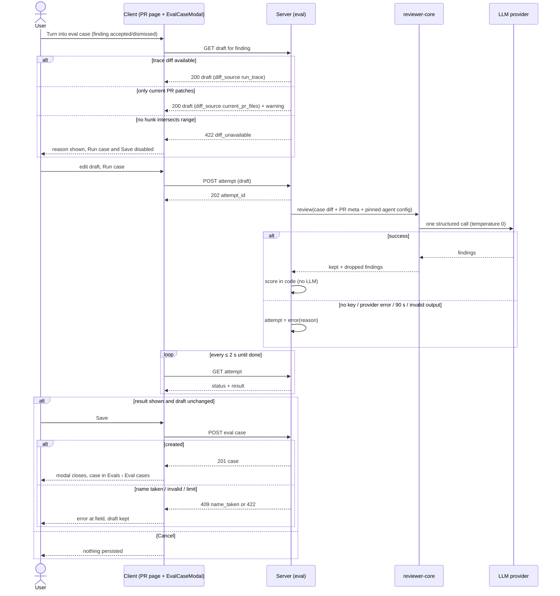
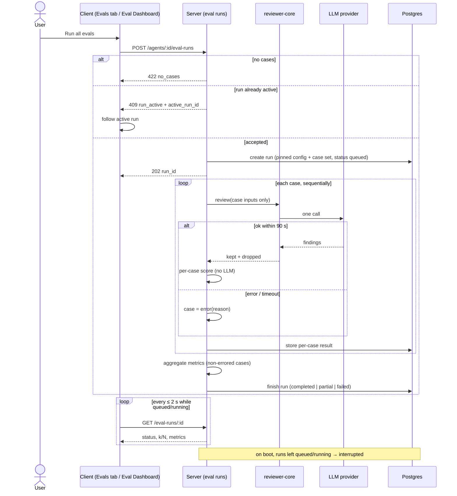
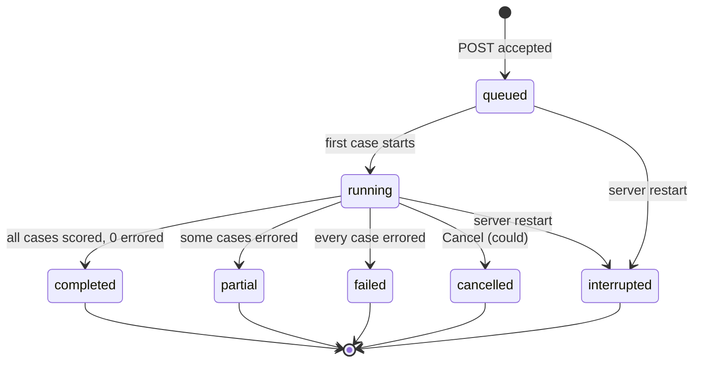
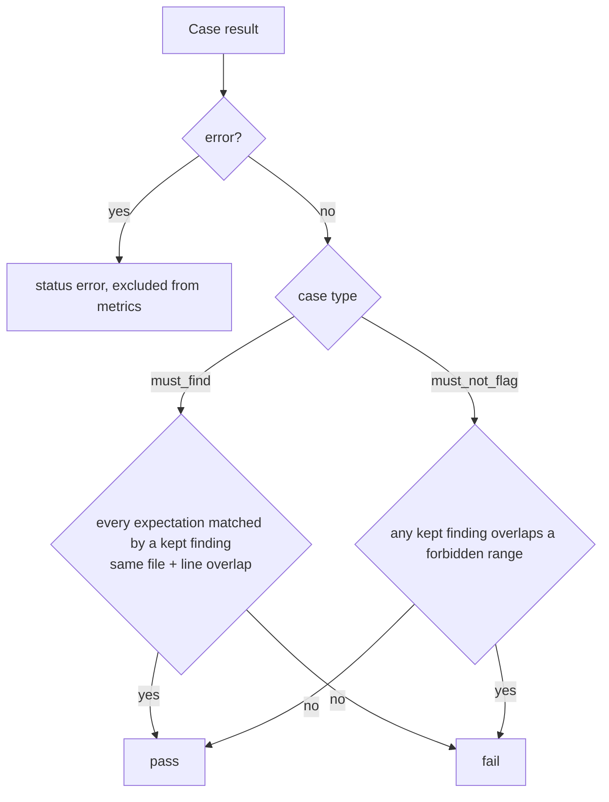

# Spec: Eval Pipeline — eval cases from findings, agent suite runs, metrics, Eval Dashboard and run comparison
Spec ID: 2026-10-08-eval-pipeline
Status: approved
Supersedes: none
Modules: server, client, reviewer-core, e2e

## Problem and user

The owner of a reviewer agent changes its system prompt, its model or a linked skill. Today they cannot tell whether the agent got better or worse. The only signal is opening PRs again and reading findings by eye. That costs a full manual re-review per change, and a regression (a new false positive, a missed secret) goes unnoticed until it hits a real PR.

The ground truth already exists. Every finding the user accepted or dismissed in L01–L05 (`findings.accepted_at` / `dismissed_at`, `server/src/db/schema/reviews.ts:44-45`, set through `POST /findings/:id/(accept|dismiss)`, `server/src/modules/reviews/findings.ts:11-34`) says:
- accepted: "the agent must find this";
- dismissed: "the agent must not say this".

Nothing turns those decisions into a repeatable test. Supporting pieces exist, but nothing uses them:
- tables `eval_cases` and `eval_runs` (`server/src/db/schema/eval.ts:7-35`);
- Zod contracts `EvalCase`, `EvalRun` (`server/src/vendor/shared/contracts/knowledge.ts:293-327`);
- `EvalCaseInput`, `EvalRunRecord`, `EvalDashboard` (`server/src/vendor/shared/contracts/eval-ci.ts:20-89`).

They cannot yet represent a "run of the whole set" or the agent version it ran with.

A bad eval case is worse than none. A case that is always red or always green measures nothing. So a case must be checked against the agent before it is saved.

## Goals / Non-goals

Goals:
- On a FindingCard, "Turn into eval case" is available for accepted and dismissed findings only. It opens an EvalCaseModal prefilled from the finding: diff fragment, PR meta, name, expectation. In the modal the user edits the draft, runs it against the agent ("Run case"), sees the actual result with pass/fail, repeats, and only then saves or cancels.
- Agents › Evals tab:
  - the agent's eval cases (view, edit, delete);
  - metrics of the latest run;
  - the last 10 runs;
  - "Run all evals".
- A suite run executes the agent on every case of its set with fixed inputs. Its config and case set are pinned at start, so runs of different versions are comparable.
- Scoring is code only, with no LLM call. It produces recall, precision and citation_accuracy, plus a per-case pass/fail.
- Eval Dashboard, a new sidebar page:
  - every agent's latest run;
  - a cross-agent feed of recent runs;
  - a per-agent view with metric cards, trend and run history;
  - a side-by-side comparison of two runs, including a system-prompt diff and per-case flips.
- Course deliverables: `pnpm verify:l06` green; at least 8 cases of both types created from findings; a prompt change visibly moves recall or precision; a deliberately broken prompt lowers precision.

Non-goals:
- Eval cases for skills and an Evals tab in the Skill Editor. The `owner_kind: skill` value stays in the contract unchanged. A later spec may add this; the teacher made it optional.
- "Run on save" toggle and "Promote vB" button (see *Design deviations*).
- Inputs tab "Files" (`input_files`) and the "Linked issue" PR-meta field in the modal.
- Pasting an arbitrary diff into a draft built from a finding. A manual diff exists only in the `could` "New eval case" flow.
- Replaying the full PR-review context in evals: repo-intel, PR intent, Project Context, memory.
- Repeating a case N times per run to average out model noise. Each case runs once per suite run.
- Resuming an interrupted suite run. The user starts a new run.
- Bitwise-reproducible model output. No vendor guarantees it (RQ2).
- FindingCard "Learn" and "Reply to author" buttons shown in the mock. They belong to other lessons.
- Cross-agent comparison. Comparison is between two runs of the same agent.
- Fixing the studio-wide `--text-muted` contrast token. Only the new screens must meet the contrast NFR.
- The harness evals in `evals/` (the Claude Code skill/agent eval system). That is a different system and is not touched.

## Design deviations

The product follows the mocks in `~/Downloads/Dev Digest 08-10/` (the newest design export) except for the items below. Each deviation was decided by the user (answers D20–D23, A6, B12).

| # | Mock element (where) | What the product does instead | Why |
|---|---|---|---|
| DD-1 | EvalCaseModal footer toggle "Run on save", on by default (`screen_cizruns.jsx:64`) | **Not implemented.** The footer shows Cancel, Run case, Save. Save is enabled only after a completed Run case on the current draft (AC-43). | The teacher's rule is to warm a case up before saving. Run-on-save would let an unchecked case in. |
| DD-2 | RunCompare footer "Promote vB" (`screen_skills.jsx:324`) | **Not implemented.** The footer shows Close only. | The mock gives no semantics (revert agent? mark baseline?). |
| DD-3 | "traces", "20-trace gold set", "Traces passed" (`screen_skills.jsx:321,429`, `screen_agents.jsx:168`) | "cases": subtitle "Regression harness · N runs on M cases"; tile "Cases passed". | One term for one thing (Nielsen #4). The product has cases, not traces. |
| DD-4 | Labels "Citation" / "Cite" (`screen_skills.jsx:329,378,463`) | "Citation accuracy" in every tile, column, compare tile and overview card. | One name for one metric. |
| DD-5 | Two labels for one action: "Run all evals" (tab, `screen_agents.jsx:198`) and "Run eval" (dashboard, `screen_skills.jsx:435`) | "Run all evals" in both places. | Same action, same label. |
| DD-6 | Evals tab has no run history (`screen_agents.jsx:180-201`) | Adds a "Runs" section: last 10 runs with date, version, recall, precision, citation accuracy, cases passed, cost and status, plus "View full dashboard →". | The homework requires run history in the Evals tab. |
| DD-7 | "Turn into eval case" enabled for an open finding (`findings.jsx:24,99`) | Disabled for an open finding, with the reason as tooltip and accessible description (AC-1). | Teacher's rule: accepted or dismissed only. |
| DD-8 | Negative seed expected output `[]  // dismissed …` with no location (`findings.jsx:41-42`) | A structured expectation with file and forbidden line range. The list badge still reads "empty []". | Scoring needs the location to know where the agent must stay silent. |
| DD-9 | Positive seed with `start_line` only (`findings.jsx:43`) | Every expectation has `file`, `start_line`, `end_line`. Severity, category and title are informational. | Line-range overlap needs a range. |
| DD-10 | Modal Input tabs Diff / Files / PR meta with "Linked issue" (`screen_cizruns.jsx:80-92`) | Tabs Diff and PR meta (Title, Body) only. | Fixed inputs are diff + PR title/body (B7). |
| DD-11 | Dashboard agent view falls back to another agent's run when the agent has none (`screen_skills.jsx:403`); shows a delta of 0 with no previous run (`:406`) | Empty state for 0 runs (AC-163, AC-164); no delta badge with 1 run (AC-176). | The mock shows wrong information. |
| DD-12 | Regression alert text claims a cause ("a new false positive slipped in. Recall and citation both up.", `screen_skills.jsx:439`) | Computed text only, e.g. "Precision −5 pts on v7 vs v6", shown when recall or precision drops ≥ 5 pts (AC-113). | The code cannot know the cause. |
| DD-13 | Run selection is a clickable row with a drawn box (`screen_skills.jsx:466-468`); case and recent-run rows are clickable `div`s; case actions appear on hover at 40 % opacity (`components2.jsx:96`) | Real checkboxes; rows are keyboard-operable; row actions are visible on hover and on keyboard focus (AC-173, AC-174, AC-120, NFR-10). | WCAG 2.1.1, 4.1.2. |
| DD-14 | Case status shown by a coloured icon only (`components2.jsx:76-77`) | Icon plus text label (pass, fail, error, never run). | WCAG 1.4.1. |
| DD-15 | Case Delete with no confirmation (`components2.jsx:99`) | Confirmation that names the case and what is removed (AC-64). | Destructive action. |
| DD-16 | No notes about variability or diff provenance | Adds the note "Scores come from one model call per case and can vary between runs" (AC-95). Adds a warning when a draft's diff comes from the current PR files (AC-13). | Honest status (Nielsen #1). |
| DD-17 | Muted label colour `--text-muted` ≈ 3.1:1 dark / 3.4:1 light (`styles.css:10,16,49,55`) | Text on the new screens meets 4.5:1 (NFR-12). | WCAG 1.4.3. |

The mock's "New eval case", "Run all agents" and "Finding skeleton" are kept at priority `could`. "30 days", "Metric trend" and the case-row Run are `should`.

## User stories

- US-1 [must]: As an agent owner, I want to turn an accepted or dismissed finding into an eval case through a modal where I can run and adjust it before saving, so that only cases that really measure the agent enter its set.
- US-2 [must]: As an agent owner, I want to see, edit and delete every eval case of an agent in its Evals tab, so that I keep the set meaningful.
- US-3 [must]: As an agent owner, I want to run the agent on all its cases with fixed inputs, so that runs of different prompt, model or skill versions are comparable.
- US-4 [must]: As an agent owner, I want recall, precision and citation accuracy computed by code without any model call, so that the numbers are cheap, repeatable and trustworthy.
- US-5 [must]: As an agent owner, I want to open the run history and compare two runs side by side, so that I can see whether a change ("old prompt vs new") broke or improved the agent.
- US-6 [must]: As an agent owner, I want an Eval Dashboard page in the sidebar showing every agent's latest runs, so that I see regressions across agents in one place.
- US-7 [must]: As a course participant, I want the homework acceptance criteria to be checkable (verify command, case count, prompt experiment), so that the lesson can be graded.

## Acceptance criteria (EARS)

Turn into eval case — FindingCard (client)
- AC-1 [state, US-1, must, verify: e2e] ПОКИ a finding has neither `accepted_at` nor `dismissed_at`, the FindingCard shall render the "Turn into eval case" button disabled, with the reason "Accept or dismiss this finding first" as a tooltip and as the button's accessible description.
- AC-2 [state, US-1, must, verify: e2e] ПОКИ a finding has `accepted_at` or `dismissed_at`, the FindingCard shall render the "Turn into eval case" button enabled, including on the muted card of a dismissed finding.
- AC-3 [ubiquitous, US-1, must, verify: unit] The FindingCard shall show the "Turn into eval case" button with the FlaskConical icon in its action row, after Accept and Dismiss, in every place the card renders: the Review runs findings panel, inline in the diff, and the outside-diff findings list.
- AC-4 [unwanted, US-1, must, verify: unit] ЯКЩО the finding's review has no agent or that agent no longer exists in the workspace, ТОДІ the FindingCard shall render the button disabled with the reason "The agent that produced this finding no longer exists".
- AC-5 [event, US-1, must, verify: e2e] КОЛИ the user activates the enabled "Turn into eval case" button, the client shall open the EvalCaseModal for that finding without creating an eval case.

Draft from a finding (server)
- AC-6 [event, US-1, must, verify: integration] КОЛИ the client requests the eval-case draft for a finding, the server shall return a draft with these fields:
  - owner: the agent of the finding's review;
  - type: `must_find` for an accepted finding, `must_not_flag` for a dismissed one;
  - a name, PR meta (title, body), a diff fragment, one expectation, and the source finding id.
- AC-7 [ubiquitous, US-1, must, verify: unit] The draft expectation shall carry the finding's `file`, `start_line` and `end_line`, plus its `severity`, `category` and `title` as informational fields.
- AC-8 [ubiquitous, US-1, must, verify: unit] The draft name shall be `must-find-<slug>` for a `must_find` draft and `no-<slug>` for a `must_not_flag` draft, where `<slug>` is the finding title in lowercase kebab-case and the whole name is cut to 120 characters.
- AC-9 [ubiquitous, US-1, must, verify: unit] The draft diff fragment shall consist of exactly the hunks — with their file and hunk headers — of the finding's file that intersect the finding's line range, so that new-side line numbers equal those of the reviewed diff. (Reworded in revise 2 as one response; meaning unchanged.)
- AC-10 [optional, US-1, must, verify: unit] ДЕ the finding is of a full-file kind (`secret_leak`, `lethal_trifecta`, `phantom`, `hook`), the draft diff fragment shall contain every hunk of the finding's file.
- AC-11 [ubiquitous, US-1, must, verify: integration] The server shall return a draft whose fragment is cut from the diff recorded in the run trace of the review that produced the finding, labelled `diff_source: run_trace`. (Reworded in revise 2 as one response; meaning unchanged.)
- AC-12 [unwanted, US-1, must, verify: integration] ЯКЩО that run trace holds no diff, ТОДІ the server shall return a draft whose fragment is cut from the PR's stored file patches, labelled `diff_source: current_pr_files`. (Reworded in revise 2 as one response; meaning unchanged.)
- AC-13 [unwanted, US-1, must, verify: unit] ЯКЩО a draft has `diff_source: current_pr_files`, ТОДІ the EvalCaseModal shall show the warning "Built from the current PR diff — it may differ from what the agent reviewed".
- AC-14 [unwanted, US-1, must, verify: integration] ЯКЩО neither source yields a hunk that intersects the finding's line range, ТОДІ the server shall respond `422` with error code `diff_unavailable`.
- ~~AC-15~~ — split into AC-143 (reason shown) and AC-144 (Run case and Save disabled), one response each, per user (revise 1).
- AC-16 [unwanted, US-1, should, verify: integration] ЯКЩО an eval case created from the same finding already exists, ТОДІ the server shall include that case's id and name in the draft.
- ~~AC-17~~ — split into AC-153 (warning with link) and AC-154 (Save not blocked by the duplicate), one response each, per user (revise 2).

Fixed inputs of an eval review (server, reviewer-core consumed)
- AC-18 [ubiquitous, US-3, must, verify: unit] Every eval review — a Run case attempt or one case of a suite run — shall give the review engine only these inputs:
  - the case diff;
  - the case PR title and body;
  - the agent's system prompt, model, strategy and linked enabled skills, as pinned for that attempt or run.
- AC-19 [ubiquitous, US-3, must, verify: unit] Every eval review shall omit repo-intel context, PR intent, Project Context documents and memory from the prompt.
- AC-20 [ubiquitous, US-3, must, verify: unit] Every eval review shall pass the case diff and PR meta to the model as untrusted content, through the same delimiter wrapping and injection guard as a PR review.
- AC-21 [ubiquitous, US-3, must, verify: integration] Every eval review shall make exactly one review-engine invocation per case.
- ~~AC-22~~ — split into AC-167 (no review/finding/agent-run record) and AC-168 (PR reviewed state unchanged), one response each, per user (revise 3).
- AC-23 [unwanted, US-3, must, verify: unit] ЯКЩО the review of one case has not finished 90 s after it started, ТОДІ the server shall end that case as `error` with reason `timeout`.
- ~~AC-24~~ — split into AC-169 (temperature 0 requested) and AC-170 (model id and parameters recorded), one response each, per user (revise 3).

Scoring (server — code only)
- AC-25 [ubiquitous, US-4, must, verify: unit] A kept finding shall match an expectation only when its file equals the expectation's file and its inclusive line range intersects the expectation's inclusive line range.
- AC-26 [optional, US-4, must, verify: unit] ДЕ a kept finding is of a full-file kind, the scorer shall match it to an expectation on file equality alone.
- AC-27 [ubiquitous, US-4, must, verify: unit] The scorer shall mark a `must_find` case `pass` when every expectation of the case is matched by at least one kept finding, and `fail` otherwise.
- AC-28 [ubiquitous, US-4, must, verify: unit] The scorer shall mark a `must_not_flag` case `pass` when no kept finding intersects any of its forbidden ranges, and `fail` otherwise.
- AC-29 [ubiquitous, US-4, must, verify: unit] The scorer shall compute recall as the number of matched `must_find` expectations divided by the number of all `must_find` expectations, over the non-errored cases of the run.
- AC-30 [ubiquitous, US-4, must, verify: unit] The scorer shall compute precision as the number of kept findings that match a `must_find` expectation divided by the number of all kept findings, over the non-errored cases of the run.
  - Documented limitation: a legitimate finding that no case labels counts as noise.
- AC-31 [ubiquitous, US-4, must, verify: unit] The scorer shall compute citation accuracy as kept findings divided by kept plus grounding-dropped findings, over the non-errored cases of the run.
- AC-32 [ubiquitous, US-4, must, verify: unit] The scorer shall compute "cases passed" as the number of `pass` cases out of the non-errored cases of the run.
- AC-33 [unwanted, US-4, must, verify: unit] ЯКЩО a metric's denominator is 0, ТОДІ the scorer shall return `null` for that metric.
- AC-34 [ubiquitous, US-4, must, verify: unit] The scorer shall make no LLM call (evidence: a test with a spying LLM provider observes 0 calls during scoring). (Reworded in revise 2: the second sentence is the verification method, not a second response.)
- ~~AC-35~~ — split into AC-171 (errored case never `pass`) and AC-172 (errored case excluded from metrics), one response each, per user (revise 3).

EvalCaseModal (client + server)
- AC-36 [ubiquitous, US-1, must, verify: unit] The EvalCaseModal shall show:
  - the title "Eval case · <name>";
  - the subtitle "<agent name> · simulate a PR and assert the expected output";
  - a Positive / Negative case banner with the assertion ("MUST find '<title>' at <file>:<range>" or "MUST NOT comment on <file>:<range>");
  - a required Name field;
  - an Input area with Diff and PR meta tabs;
  - an Expected output editor with a validity badge;
  - a result panel;
  - footer buttons Cancel, Run case and Save.
- AC-37 [ubiquitous, US-1, must, verify: unit] The EvalCaseModal shall show the owning agent as read-only text.
- ~~AC-38~~ — split into AC-145 (error shown at the field) and AC-146 (Run case and Save disabled), one response each, per user (revise 1).
- AC-39 [event, US-1, must, verify: integration] КОЛИ the user activates Run case on a valid draft, the server shall produce an unpersisted attempt result: one run of the owning agent on the draft under AC-18–AC-23 and AC-167–AC-170, scored under AC-25–AC-34 and AC-171–AC-172, with no case or run stored. (Reworded in revise 3 as one response; meaning unchanged.)
- ~~AC-40~~ — split into AC-147 (progress indicator) and AC-148 (Run case and Save disabled), one response each, per user (revise 1).
- AC-41 [event, US-1, must, verify: unit] КОЛИ a Run case completes, the EvalCaseModal shall show "Last run passed" or "Last run failed", with "expected N, got M", the duration in seconds and the cost in USD ("—" when the cost is unknown).
- AC-42 [event, US-1, should, verify: unit] КОЛИ a Run case completes, the EvalCaseModal shall list the agent's kept findings, each marked `matched`, `unmatched` or `forbidden hit`, and the grounding-dropped findings with their reason.
- AC-43 [state, US-1, must, verify: unit] ПОКИ no Run case has completed on the current content of the diff, PR meta and expected output, the EvalCaseModal shall keep Save disabled with the reason "Run the case first".
- AC-44 [event, US-1, must, verify: unit] КОЛИ the user edits the diff, PR meta or expected output after a completed Run case, the EvalCaseModal shall mark the shown result "Outdated — run again".
- AC-45 [ubiquitous, US-1, must, verify: unit] The EvalCaseModal shall keep Save enabled after a completed Run case whose result is `fail`.
- AC-46 [unwanted, US-1, must, verify: integration] ЯКЩО a Run case cannot finish, ТОДІ the server shall report the attempt as `error` with a reason code (`missing_key`, `provider_error`, `timeout`, `invalid_output`) and no pass/fail. The cases are:
  - no LLM key for the agent's provider;
  - a provider error;
  - the 90 s limit;
  - invalid structured output after repair.
- ~~AC-47~~ — split into AC-149 (reason shown) and AC-150 (Settings › API keys link for `missing_key`), one response each, per user (revise 1).
- AC-48 [event, US-1, must, verify: integration] КОЛИ the user activates Save, the server shall create the eval case in the owning agent's set.
- ~~AC-49~~ — split into AC-155 (modal closes) and AC-156 (case listed as "never run"), one response each, per user (revise 2).
- AC-50 [unwanted, US-1, must, verify: integration] ЯКЩО the name already exists in the agent's set, ТОДІ the server shall respond `409` with code `name_taken`.
- ~~AC-51~~ — split into AC-157 (error at Name) and AC-158 (draft kept), one response each, per user (revise 2).
- AC-52 [unwanted, US-1, must, verify: integration] ЯКЩО a saved case breaks a rule of AC-145 or a limit of NFR-3, ТОДІ the server shall respond `422` naming the failing field or limit.
- AC-53 [unwanted, US-1, must, verify: unit] ЯКЩО the user activates Save while a save request is pending, ТОДІ the client shall send no second request.
- AC-54 [event, US-1, must, verify: e2e] КОЛИ the user activates Cancel or closes the modal, the client shall persist nothing.
- AC-55 [event, US-1, should, verify: unit] КОЛИ the user cancels a draft whose content differs from the seed, the EvalCaseModal shall ask for confirmation before discarding it.
- AC-56 [event, US-1, must, verify: unit] КОЛИ the modal closes while a Run case is in flight, the client shall discard that attempt's result.
- AC-57 [event, US-1, must, verify: integration] КОЛИ the client starts a Run case, the server shall respond `202` with an attempt id and report the attempt's status and result on request.
- ~~AC-58~~ — split into AC-159 ("Run interrupted" message) and AC-160 (Save disabled), one response each, per user (revise 2).

Agents › Evals tab — Eval cases (client + server)
- AC-59 [ubiquitous, US-2, must, verify: unit] The Agent editor shall have an Evals tab after Context, opened by `/agents/:id?tab=evals`.
- AC-60 [ubiquitous, US-2, must, verify: unit] The Eval cases section shall list every case of the agent's set. Each row shows:
  - a status icon plus text: pass, fail, error, never run;
  - the name in monospace;
  - a `must find` / `must not flag` tag;
  - the last result line "expected N findings, got M";
  - an expectation badge: "SEVERITY · category" for `must_find`, "empty []" for `must_not_flag`.
- AC-61 [ubiquitous, US-2, must, verify: unit] The Eval cases header shall show "x / y passing", counted over the cases that have a result in the latest completed or partial run, and "N cases".
- AC-62 [event, US-2, must, verify: unit] КОЛИ the user activates a case row or its Edit action, the client shall open the EvalCaseModal on the saved case, with the Save rules of AC-43–AC-45.
- AC-63 [event, US-2, must, verify: integration] КОЛИ the user saves an edited case, the server shall update that case in place.
- AC-64 [event, US-2, must, verify: unit] КОЛИ the user activates Delete on a case, the client shall ask for confirmation. The confirmation names the case and states that its per-case history is removed, while recorded run metrics stay.
- AC-65 [event, US-2, must, verify: integration] КОЛИ the user confirms Delete, the server shall remove the case and its per-case results.
- ~~AC-66~~ — split into AC-173 (row opens with Enter/Space) and AC-174 (labelled row actions visible on hover and focus), one response each, per user (revise 3).
- AC-67 [event, US-2, should, verify: unit] КОЛИ the user activates Run on a case row, the client shall show that one case's attempt result (AC-57) in the row, outside run history. (Reworded in revise 3 as one response; meaning unchanged.)
- AC-68 [state, US-2, must, verify: unit] ПОКИ the agent has no eval cases, the Eval cases section shall show "No eval cases yet — accept or dismiss findings on a PR, then use Turn into eval case".
- AC-69 [ubiquitous, US-2, should, verify: unit] A case created from a finding shall show its provenance "From finding '<title>' · PR #n · accepted|dismissed", with a link to that PR.
- AC-70 [state, US-2, should, verify: unit] ПОКИ the agent's set has fewer than 8 cases or only one of the two case types, the Evals tab shall show the hint "Small or one-sided set — metrics are noisy".
- AC-71 [event, US-2, could, verify: unit] КОЛИ the user activates "New eval case", the client shall open an empty EvalCaseModal with a pasted diff (`diff_source: manual`) and the Save rules of AC-43–AC-45.

Suite runs (server + client)
- AC-72 [event, US-3, must, verify: integration] КОЛИ the client sends `POST /agents/:id/eval-runs` for an agent with at least 1 case and no active run, the server shall respond `202` with the new run id.
- AC-73 [event, US-3, must, verify: integration] КОЛИ a suite run starts, the server shall record with it the agent version, provider, model, strategy, system prompt and linked enabled skills (id and version) in effect at that moment.
- AC-74 [state, US-3, must, verify: integration] ПОКИ a suite run is active, the server shall run it with the agent configuration recorded at its start, even if the agent is edited.
- AC-75 [state, US-3, must, verify: integration] ПОКИ a suite run is active, the server shall run exactly the case set captured at its start, even if cases are added, edited or deleted.
- AC-76 [ubiquitous, US-3, must, verify: integration] The server shall run the cases of a suite run one after another.
- ~~AC-77~~ — split into AC-161 (case recorded as `error`) and AC-162 (run continues with the next case), one response each, per user (revise 2).
- AC-78 [unwanted, US-3, must, verify: integration] ЯКЩО at least one but not every case of a run ended in `error`, ТОДІ the server shall finish the run with status `partial` and the count of errored cases.
- AC-79 [unwanted, US-3, must, verify: integration] ЯКЩО every case of a run ended in `error`, ТОДІ the server shall finish the run with status `failed` and `null` metrics.
- AC-80 [unwanted, US-3, must, verify: integration] ЯКЩО the agent has no eval cases, ТОДІ the server shall respond `422` with code `no_cases` to `POST /agents/:id/eval-runs`.
- AC-81 [state, US-3, must, verify: unit] ПОКИ the agent has no eval cases, the client shall render "Run all evals" disabled with the reason "Add a case first".
- AC-82 [unwanted, US-3, must, verify: integration] ЯКЩО the agent already has a queued or running suite run, ТОДІ the server shall respond `409` with code `run_active` and the active run's id.
- AC-83 [event, US-3, must, verify: unit] КОЛИ the client receives `409 run_active`, the client shall show the progress of the active run named in the response.
- ~~AC-84~~ — split into AC-151 ("k / N cases" progress) and AC-152 ("Run all evals" disabled), one response each, per user (revise 1).
- AC-85 [state, US-3, should, verify: unit] ПОКИ a suite run is running, the Eval cases list shall show each case's status in that run (queued, running, pass, fail, error).
- AC-86 [event, US-3, must, verify: unit] КОЛИ a suite run finishes, the client shall announce its final status and metrics through a polite status region without moving focus.
- AC-87 [unwanted, US-3, must, verify: integration] ЯКЩО the server starts while a suite run is recorded as queued or running, ТОДІ the server shall mark that run `interrupted` with `null` metrics before accepting requests.
- AC-88 [event, US-3, must, verify: integration] КОЛИ a case of a suite run finishes, the server shall store with the run, for that case:
  - the actual kept findings;
  - the grounding-dropped findings with reasons;
  - pass/fail/error and the error reason;
  - duration and cost.
  It shall store no prompt text.
- AC-89 [ubiquitous, US-3, must, verify: integration] The server shall never change the recorded metrics of a finished run. In particular, deleting a case or editing the agent leaves them unchanged.
- AC-90 [unwanted, US-3, must, verify: unit] ЯКЩО no case of a run reported a cost, ТОДІ the server shall record the run cost as `null`, not `0`.
- AC-91 [event, US-3, could, verify: integration] КОЛИ the user activates Cancel on a running suite run, the server shall stop before the next case and finish the run with status `cancelled` and no metrics.
- AC-92 [ubiquitous, US-3, must, verify: unit] The client shall label the action that starts a suite run "Run all evals" in the Evals tab and on the Eval Dashboard.

Evals tab — metrics and Runs section (client)
- AC-93 [ubiquitous, US-4, must, verify: unit] The Evals tab shall show tiles Recall, Precision, Citation accuracy (as %) and Cases passed (as x/y), taken from the agent's latest completed or partial run.
- ~~AC-94~~ — split into AC-175 (change vs previous run) and AC-176 (no marker without a previous run), one response each, per user (revise 3).
- AC-95 [ubiquitous, US-4, must, verify: unit] The Evals tab shall show two notes: "Scoring is mechanical — a finding counts when file matches and line ranges overlap. No model call in the scorer." and "Scores come from one model call per case and can vary between runs."
- AC-96 [ubiquitous, US-5, must, verify: unit] The Evals tab shall show a Runs section with the agent's last 10 runs, newest first. Each row has ran at, version, recall, precision, citation accuracy, cases passed, cost and status.
- AC-97 [event, US-6, must, verify: unit] КОЛИ the user activates "View full dashboard →" in the Evals tab, the client shall open `/eval?agent=<agent id>`.
- ~~AC-98~~ — split into AC-177 (tiles show "—") and AC-178 (Runs section empty message), one response each, per user (revise 3).
- AC-99 [unwanted, US-4, must, verify: unit] ЯКЩО a metric is `null`, ТОДІ the client shall show "—" with a tooltip naming the reason: "no must-find cases" for recall, "no findings" for precision and citation accuracy.

Eval Dashboard (client + server)
- AC-100 [ubiquitous, US-6, must, verify: unit] The sidebar shall show an "Eval Dashboard" item with the Gauge icon in the SKILLS LAB section, directly after Conventions. It has no keyboard shortcut.
- AC-101 [ubiquitous, US-6, must, verify: unit] The Eval Dashboard shall be served at `/eval` as a Skills Lab page, i.e. with its sidebar item marked active and the breadcrumb "Skills Lab › Eval Dashboard". (Reworded in revise 3: route, active item and breadcrumb are one navigation placement; meaning unchanged.)
- AC-102 [ubiquitous, US-6, must, verify: unit] The `/eval` overview shall show:
  - the heading "Eval Dashboard";
  - the subtitle "Regression harness across all reviewer agents · pick an agent to see its runs";
  - an AGENTS section with one card per agent of the workspace;
  - a section "Recent eval runs · all agents".
- AC-103 [ubiquitous, US-6, must, verify: unit] Each agent card shall show:
  - the agent name and a model badge;
  - "Last run v<version> · <date time> · x/y pass", or "No eval runs yet";
  - a sparkline of recall over the agent's finished runs;
  - Recall, Precision and Citation accuracy in %;
  - a chevron.
- AC-104 [event, US-6, must, verify: unit] КОЛИ the user activates an agent card or a recent-run row, the client shall open `/eval?agent=<agent id>`.
- AC-105 [ubiquitous, US-6, must, verify: integration] The "Recent eval runs · all agents" section shall list the 6 newest runs across agents. Each row has agent, date, version, recall, precision and citation accuracy as bars with %, and x/y pass.
- AC-106 [ubiquitous, US-6, must, verify: unit] The agent view of the Eval Dashboard shall show:
  - "‹ All agents";
  - the agent name with a model badge;
  - "Regression harness · N runs on M cases";
  - an agent dropdown;
  - "Run all evals";
  - three MetricCards (RECALL, PRECISION, CITATION ACCURACY) with %, change in points and a sparkline;
  - a "Recent runs" table.
- AC-107 [ubiquitous, US-5, must, verify: unit] The "Recent runs" table shall show, per run, a checkbox, ran at, version, recall, precision, citation accuracy (bar with %), cases passed x/y, cost and status.
- AC-108 [event, US-6, must, verify: unit] КОЛИ the user picks another agent in the agent dropdown, the client shall switch the view to that agent and update `?agent=` in the URL.
- ~~AC-109~~ — split into AC-163 (empty state) and AC-164 (no other agent's data), one response each, per user (revise 2).
- AC-110 [state, US-6, must, verify: e2e] ПОКИ the workspace has no agents or no agent has a run, the overview shall show an empty state that says why it is empty and links to Agents.
- AC-111 [optional, US-5, should, verify: unit] ДЕ a run-range filter is selected (allowed values: "30 days" = runs started in the last 30 days; "All" = every run), the agent view shall show only the runs inside the selected range. (Reworded in revise 3: one filtering response over an enumerated value set; meaning unchanged.)
- AC-112 [ubiquitous, US-5, should, verify: unit] The agent view shall show a "Metric trend" line chart with one point per finished run for Recall, Precision and Citation accuracy. Each point's tooltip shows the version and cost.
- AC-113 [unwanted, US-5, should, verify: unit] ЯКЩО recall or precision of the agent's latest finished run is at least 5 points below the previous finished run, ТОДІ the agent view shall show an alert with computed text only, e.g. "Precision −5 pts on v7 vs v6".
- AC-114 [event, US-6, could, verify: integration] КОЛИ the user activates "Run all agents", the server shall start one suite run for every agent that has at least 1 case and no active run.
- AC-115 [unwanted, US-6, must, verify: unit] ЯКЩО `?agent=` names no agent of the workspace, ТОДІ the client shall show the overview with the notice "Agent not found".
- AC-116 [state, US-6, must, verify: unit] ПОКИ eval data is loading, the Evals tab and the Eval Dashboard shall show skeletons in place of tiles, lists and tables.
- ~~AC-117~~ — split into AC-179 (error with Retry) and AC-180 (already-shown data kept), one response each, per user (revise 3).
- AC-118 [ubiquitous, US-6, must, verify: unit] The client shall render every case, agent and file name that exceeds its column as an ellipsis-truncated label whose full value is disclosed on hover and on keyboard focus. (Reworded in revise 2 as one presentation response; meaning unchanged.)

Run comparison (client + server)
- AC-119 [ubiquitous, US-5, must, verify: unit] The "Recent runs" header shall show "Select two runs to compare" when nothing is selected, otherwise "N selected", and a Compare button enabled only when exactly two runs are selected.
- AC-120 [event, US-5, must, verify: unit] КОЛИ the user checks a third run, the client shall uncheck the earliest-checked run.
- AC-121 [state, US-5, must, verify: unit] ПОКИ a run has status `failed`, `interrupted`, `cancelled`, `queued` or `running`, its checkbox shall be disabled with the reason "No metrics for this run".
- AC-122 [event, US-5, must, verify: e2e] КОЛИ the user activates Compare, the client shall open the modal "Compare runs · v<older> → v<newer>" with the subtitle "Old prompt vs new — metric deltas and prompt diff", ordering the two runs by start time.
- AC-123 [ubiquitous, US-5, must, verify: unit] The compare modal shall show tiles Recall, Precision, Citation accuracy and Cost. Each shows old → new and the change with ▲ or ▼, in points for metrics and in USD for cost.
- AC-124 [ubiquitous, US-5, must, verify: unit] The compare modal shall show a word-level "System prompt diff" between the system prompts recorded with the two runs, with an old/new legend.
- AC-125 [unwanted, US-5, must, verify: unit] ЯКЩО both runs recorded the same configuration, ТОДІ the compare modal shall show "Identical configuration — differences come from model variability".
- ~~AC-126~~ — split into AC-165 (server reports added/removed ids) and AC-166 (modal banner), one response each, per user (revise 2).
- AC-127 [ubiquitous, US-5, must, verify: integration] The comparison shall return one row per case giving its outcome in both runs (pass, fail, error, absent) and a flip marker (pass→fail, fail→pass, none). (Reworded in revise 2 as one response; meaning unchanged.)
- AC-128 [event, US-5, must, verify: unit] КОЛИ the user opens `/eval?agent=<id>&compare=<run a>,<run b>`, the client shall open the compare modal for those two runs.
- AC-129 [unwanted, US-5, must, verify: unit] ЯКЩО a `compare=` id is unknown or has no metrics, ТОДІ the client shall show the agent view without the modal and the notice "Run not available for comparison".
- AC-130 [unwanted, US-5, must, verify: integration] ЯКЩО the two runs belong to different agents, ТОДІ the server shall respond `422` with code `different_agents`.
- AC-131 [event, US-5, must, verify: unit] КОЛИ the user activates Close or presses Escape in the compare modal, the client shall dismiss the modal with focus restored to the Compare button. (Reworded in revise 2: restoring focus is part of dismissing a dialog, per NFR-9; meaning unchanged.)

Data lifecycle and access (server + client)
- AC-132 [event, US-2, must, verify: integration] КОЛИ an agent is deleted, the server shall delete that agent's eval cases and suite runs.
- AC-133 [unwanted, US-2, must, verify: integration] ЯКЩО an eval endpoint receives an agent, case, attempt or run id that is not in the caller's workspace, ТОДІ the server shall respond `404`.
- AC-134 [ubiquitous, US-4, must, verify: integration] The eval contracts in `server/src/vendor/shared` and `client/src/vendor/shared` shall be identical, as checked by the contract-parity test and `scripts/check-shared-sync.sh`.
- AC-135 [ubiquitous, US-2, must, verify: integration] A saved case shall keep its type, diff and expectations when its source finding is later re-triaged or its PR changes.
- AC-136 [event, US-2, must, verify: unit] КОЛИ the user saves, edits or deletes a case, the client shall refresh that agent's case list, Evals tab metrics and Eval Dashboard data.

Course acceptance (homework L06)
- AC-137 [ubiquitous, US-7, must, verify: integration] `server/package.json` shall define a `verify:l06` script that runs the eval pipeline's tests and exits 0. The tests cover:
  - scoring;
  - fixed inputs;
  - the suite-run executor;
  - contract parity between the server and client `vendor/shared` copies;
  - contracts;
  - one DB integration test.
- AC-138 [ubiquitous, US-7, must, verify: unit] The `verify:l06` test set shall include the test of AC-34 proving that scoring makes no LLM call.
- AC-139 [ubiquitous, US-7, must, verify: manual — needs real triage and a real LLM] The demo agent's eval set shall hold at least 8 cases created from findings, including at least one `must_find` and at least one `must_not_flag` case.
- AC-140 [event, US-7, must, verify: integration] КОЛИ a case is saved from an accepted finding and another from a dismissed finding, the server shall store them as `must_find` and `must_not_flag` respectively, each with the source finding id.
- AC-141 [event, US-7, must, verify: manual — needs a real LLM] КОЛИ two suite runs of the same agent and case set use different system prompts, the compare modal shall show a non-zero change in recall or precision.
- AC-142 [event, US-7, must, verify: manual — needs a real LLM] КОЛИ a suite run uses a deliberately broken system prompt (one that asks the agent to flag every changed line), its precision shall be lower than that of the baseline run on the same case set.

Split requirements (revise 1 — one response per AC; replaces AC-15, AC-38, AC-40, AC-47, AC-84)
- AC-143 [unwanted, US-1, must, verify: unit] ЯКЩО the draft request fails with `diff_unavailable`, ТОДІ the EvalCaseModal shall show the reason returned by the server.
- AC-144 [unwanted, US-1, must, verify: unit] ЯКЩО the draft request fails with `diff_unavailable`, ТОДІ the EvalCaseModal shall keep Run case and Save disabled.
- AC-145 [unwanted, US-1, must, verify: unit] ЯКЩО the expected output has any of these defects, ТОДІ the EvalCaseModal shall show the error at the Expected output field:
  - it is not valid JSON;
  - it has no expectation for a `must_find` case;
  - an expectation has `end_line` below `start_line`;
  - it names a file absent from the diff fragment;
  - it names lines outside every hunk of that file.
- AC-146 [unwanted, US-1, must, verify: unit] ЯКЩО the expected output has any defect listed in AC-145, ТОДІ the EvalCaseModal shall keep Run case and Save disabled.
- AC-147 [state, US-1, must, verify: unit] ПОКИ a Run case is in flight, the EvalCaseModal shall show a progress indicator with elapsed seconds.
- AC-148 [state, US-1, must, verify: unit] ПОКИ a Run case is in flight, the EvalCaseModal shall keep Run case and Save disabled.
- AC-149 [unwanted, US-1, must, verify: unit] ЯКЩО a Run case ends in `error`, ТОДІ the EvalCaseModal shall show the error reason.
- AC-150 [unwanted, US-1, must, verify: unit] ЯКЩО a Run case ends in `error` with reason `missing_key`, ТОДІ the EvalCaseModal shall show a link to Settings › API keys.
- AC-151 [state, US-3, must, verify: unit] ПОКИ a suite run of the agent is queued or running, the Evals tab and the Eval Dashboard shall show "k / N cases" progress.
- AC-152 [state, US-3, must, verify: unit] ПОКИ a suite run of the agent is queued or running, the Evals tab and the Eval Dashboard shall keep "Run all evals" disabled.

Split requirements (revise 2 — one response per AC; replaces AC-17, AC-49, AC-51, AC-58, AC-77, AC-109, AC-126)
- AC-153 [event, US-1, should, verify: unit] КОЛИ a draft names an existing case from the same finding, the EvalCaseModal shall show a warning that links to that case.
- AC-154 [event, US-1, should, verify: unit] КОЛИ a draft names an existing case from the same finding, the EvalCaseModal shall leave Save governed only by AC-43–AC-45, so the duplicate alone does not disable it.
- AC-155 [event, US-1, must, verify: unit] КОЛИ Save succeeds, the client shall close the EvalCaseModal.
- AC-156 [event, US-1, must, verify: unit] КОЛИ Save succeeds, the client shall show the new case in Agents › Evals › Eval cases with status "never run".
- AC-157 [unwanted, US-1, must, verify: unit] ЯКЩО Save returns `409 name_taken`, ТОДІ the EvalCaseModal shall show the error at the Name field.
- AC-158 [unwanted, US-1, must, verify: unit] ЯКЩО Save returns `409 name_taken`, ТОДІ the EvalCaseModal shall keep the draft's content unchanged.
- AC-159 [unwanted, US-1, must, verify: unit] ЯКЩО the attempt is no longer known to the server (`404 attempt_not_found`, e.g. after a restart), ТОДІ the EvalCaseModal shall show "Run interrupted — run again".
- AC-160 [unwanted, US-1, must, verify: unit] ЯКЩО the attempt is no longer known to the server (`404 attempt_not_found`), ТОДІ the EvalCaseModal shall keep Save disabled.
- AC-161 [unwanted, US-3, must, verify: integration] ЯКЩО a case's review fails for a reason of AC-23 or AC-46, ТОДІ the server shall record that case as `error` with its reason.
- AC-162 [unwanted, US-3, must, verify: integration] ЯКЩО a case's review fails for a reason of AC-23 or AC-46, ТОДІ the server shall continue the suite run with the next case.
- AC-163 [state, US-6, must, verify: e2e] ПОКИ the selected agent has no runs, the agent view shall show "No eval runs for <agent> yet" with "Run all evals".
- AC-164 [state, US-6, must, verify: unit] ПОКИ the selected agent has no runs, the agent view shall show no metric, run or chart data of any other agent.
- AC-165 [unwanted, US-5, must, verify: integration] ЯКЩО the two runs' case sets differ, ТОДІ the comparison shall report the added and removed case ids.
- AC-166 [unwanted, US-5, must, verify: unit] ЯКЩО the two runs' case sets differ, ТОДІ the compare modal shall show the banner "Case sets differ: +N added, −M removed".

Split requirements (revise 3 — one response per AC; replaces AC-22, AC-24, AC-35, AC-66, AC-94, AC-98, AC-117)
- AC-167 [ubiquitous, US-3, must, verify: integration] An eval review shall create no review, finding or agent-run record.
- AC-168 [ubiquitous, US-3, must, verify: integration] An eval review shall leave every PR's reviewed state unchanged.
- AC-169 [ubiquitous, US-3, should, verify: unit] Every eval review shall request temperature 0 explicitly.
- AC-170 [ubiquitous, US-3, should, verify: unit] Every eval review shall record the model id and request parameters actually sent.
- AC-171 [unwanted, US-4, must, verify: unit] ЯКЩО a case ended in `error`, ТОДІ the scorer shall never mark it `pass`.
- AC-172 [unwanted, US-4, must, verify: unit] ЯКЩО a case ended in `error`, ТОДІ the scorer shall exclude it from every metric.
- AC-173 [ubiquitous, US-2, must, verify: unit] Every case row shall open its case with Enter or Space.
- AC-174 [ubiquitous, US-2, must, verify: unit] The Run, Edit and Delete actions of every case row shall be labelled buttons visible on hover and on keyboard focus.
- AC-175 [ubiquitous, US-5, must, verify: unit] Each metric tile shall show the change versus the previous completed or partial run in points, with ▲ or ▼.
- AC-176 [unwanted, US-5, must, verify: unit] ЯКЩО no previous completed or partial run exists, ТОДІ each metric tile shall show no change marker.
- AC-177 [state, US-4, must, verify: unit] ПОКИ the agent has no finished run, the metric tiles shall show "—".
- AC-178 [state, US-4, must, verify: unit] ПОКИ the agent has no finished run, the Runs section shall show "No runs yet — Run all evals".
- AC-179 [unwanted, US-6, must, verify: unit] ЯКЩО an eval read request fails, ТОДІ the client shall show an error with a Retry action.
- AC-180 [unwanted, US-6, must, verify: unit] ЯКЩО an eval read request fails, ТОДІ the client shall keep any data already shown.

## Edge cases

UI state matrix (screen × state). Each cell maps to an AC/EC or is `n/a` with a reason.

| Screen / component | Default | Empty | Loading | Partial / streaming | Error | Degraded | No access / no token | First run | Long content | Stale |
|---|---|---|---|---|---|---|---|---|---|---|
| FindingCard › Turn into eval case | AC-2, AC-3 | n/a — single button | AC-1 (disabled while untriaged); pending accept/dismiss keeps the prior state | n/a — no streaming | AC-143, AC-144 | AC-4 | n/a — no extra access | AC-1 | n/a — fixed label | EC-4 → AC-12, AC-13 |
| EvalCaseModal | AC-36, AC-37 | AC-143, AC-144 | AC-116 | AC-147, AC-148 | AC-145, AC-146, AC-149, AC-157, AC-158, AC-159, AC-160 | AC-13, AC-149 | AC-150 (`missing_key`) | AC-5 | AC-118, NFR-3 | AC-44 |
| Evals tab › metric tiles | AC-93, AC-175, AC-176 | AC-177 | AC-116 | AC-151, AC-152 | AC-179, AC-180 | AC-99 | n/a — read-only data | AC-177 | n/a — numbers | AC-175 (delta vs previous), EC-15 |
| Evals tab › Eval cases list | AC-60, AC-61, AC-173, AC-174 | AC-68 | AC-116 | AC-85 | AC-179, AC-180 | AC-70 | n/a — read-only data | AC-68 | AC-118, NFR-3 | AC-136 |
| Evals tab › Runs section | AC-96 | AC-178 | AC-116 | AC-151, AC-152 | AC-179, AC-180 | AC-78 (partial status shown) | n/a — read-only data | AC-178 | n/a — last 10 only | AC-136 |
| Eval Dashboard › overview | AC-102, AC-103, AC-105 | AC-110 | AC-116 | AC-151, AC-152 | AC-179, AC-180 | AC-99 | n/a — read-only data | AC-110 | AC-118 | AC-136 |
| Eval Dashboard › agent view | AC-106, AC-107, AC-112 | AC-163, AC-164 | AC-116 | AC-151, AC-152 | AC-179, AC-180, AC-115 | AC-99, AC-113 | n/a — read-only data | AC-163 | AC-111, AC-118 | AC-175 |
| Compare modal | AC-122, AC-123, AC-124 | n/a — needs two runs (AC-119) | AC-116 | AC-121 | AC-129, AC-130 | AC-125 | n/a — read-only data | AC-119 | AC-118, NFR-13 | AC-165, AC-166 |

Edge cases:
- EC-1: The finding is open (neither accepted nor dismissed) → button disabled with reason (→ AC-1).
- EC-2: The source finding is re-triaged (accept ↔ dismiss) while the modal is open or after Save → the case keeps the type captured when the draft was built (→ AC-6, AC-135).
- EC-3: The finding's review has no agent, or the agent was deleted → button disabled (→ AC-4).
- EC-4: The run trace holds no diff (older run, failed trace) → fallback to the current PR patches with a warning. If those lack the range too → `diff_unavailable` (→ AC-12, AC-13, AC-14, AC-143, AC-144).
- EC-5: Full-file finding kinds → whole-file fragment and file-only matching (→ AC-10, AC-26).
- EC-6: Expected output is invalid JSON, an empty must-find list, a reversed range, a wrong file, or lines outside the hunks → inline error in the client and `422` on the server (→ AC-145, AC-146, AC-52).
- EC-7: The user edits the diff so it no longer contains the expected range → same validation (→ AC-145, AC-146).
- EC-8: Save double-clicked, or Save from two tabs → no second request from one modal (→ AC-53). A second tab gets `409 name_taken` (→ AC-50).
- EC-9: Duplicate name in the agent's set (→ AC-50, AC-157, AC-158).
- EC-10: The same finding is turned into a case again → warning plus link; Save allowed (→ AC-16, AC-153, AC-154).
- EC-11: Run case clicked again while in flight, or the modal is closed mid-run → button disabled; result discarded (→ AC-148, AC-56).
- EC-12: No LLM key, provider error, 90 s timeout, invalid structured output → `error`, never pass/fail (→ AC-23, AC-46, AC-149, AC-150, AC-161).
- EC-13: Suite run requested with 0 cases (→ AC-80, AC-81).
- EC-14: Second suite run for the same agent from a double-click or another tab (→ AC-82, AC-83).
- EC-15: Agent edited during a run → the run uses the config pinned at start (→ AC-73, AC-74).
- EC-16: Cases added, edited or deleted during a run → the run uses the case set captured at start (→ AC-75).
- EC-17: Some cases error → `partial`; all error → `failed` (→ AC-161, AC-162, AC-78, AC-79).
- EC-18: Server restart during a suite run or a Run case attempt (→ AC-87, AC-159, AC-160).
- EC-19: Zero denominators → `null` and "—" with the reason (→ AC-33, AC-99).
- EC-20: Compared runs have different case sets (→ AC-165, AC-166, AC-127).
- EC-21: Comparing two runs of the same version as a noise check (→ AC-125, NFR-7).
- EC-22: The agent has exactly one finished run → no delta, Compare needs two (→ AC-176, AC-119).
- EC-23: A case is deleted after runs used it → recorded metrics unchanged (→ AC-65, AC-89).
- EC-24: An agent is deleted (→ AC-132).
- EC-25: The agent cites lines outside the fragment → grounding drops the finding. It lowers citation accuracy and counts toward neither recall nor precision (→ AC-25, AC-31).
- EC-26: Oversize diff, too many cases, too many expectations, or a long name (→ AC-52, NFR-3).
- EC-27: Model output varies between identical runs (reasoning models may ignore temperature) → recorded as measured, with a variability note (→ AC-169, AC-170, AC-95, NFR-7).
- EC-28: A case is saved in tab A while tab B shows the list → tab B refreshes on its own next mutation or navigation. Tab A refreshes immediately (→ AC-136).
- EC-29: Very long names and paths (→ AC-118).
- EC-30: A dismissed finding renders as a muted card → the button is still enabled (→ AC-2).
- EC-31: A legitimate finding no case labels → counted as noise in precision. This is a documented limitation (→ AC-30).
- EC-32: Fewer than 8 cases, or a one-sided set → hint, but running is allowed from 1 case (→ AC-70, AC-72).
- EC-33: The user tries to compare a failed, interrupted or still-running run (→ AC-121).
- EC-34: Invalid `?agent=` or `compare=` deep links (→ AC-115, AC-129).

## Non-functional requirements

- NFR-1 [Performance, verify: integration] p95 ≤ 300 ms for reading an agent's case list, an agent's run list and the dashboard overview, with 200 cases × 50 runs on a local Postgres.
- NFR-2 [Performance, verify: unit] Scoring a 200-case suite run takes ≤ 100 ms of CPU.
- NFR-3 [Limits, verify: integration] The server enforces these limits; exceeding one gives `422` (AC-52), and a second run gives `409` (AC-82):
  - diff fragment ≤ 64 KB;
  - ≤ 200 cases per agent;
  - ≤ 20 expectations per case;
  - case name ≤ 120 characters;
  - ≤ 1 queued or running suite run per agent.
- NFR-4 [LLM cost, verify: integration] Model calls:
  - a Run case attempt makes exactly 1 review-engine invocation;
  - a suite run makes exactly 1 per case;
  - scoring makes 0;
  - the model is the agent's own pinned model, not a feature-model setting;
  - a suite run is never retried automatically after a failure;
  - an unknown cost is `null`, never `0`.
- NFR-5 [Reliability, verify: unit] Per case:
  - LLM budget 60 s, with HTTP retries disabled and at most 2 structured-output re-prompts;
  - an outer cap of 90 s, after which the case is `error/timeout` (AC-23).
- NFR-6 [Reliability, verify: integration] Suite runs:
  - one active run per agent (AC-82);
  - a run left queued or running at boot becomes `interrupted` (AC-87) and is not resumed;
  - finished runs are immutable (AC-89);
  - while a run is active the client polls its status every ≤ 2 s.
- NFR-7 [Reproducibility, verify: unit] Each eval review:
  - requests temperature 0;
  - pins the agent's exact model id;
  - records the model id and parameters actually sent (AC-169, AC-170).
  Identical output across runs is **not** required. Comparing two runs of the same version is the supported way to see noise (AC-125).
- NFR-8 [Security, verify: integration] Every untrusted input is handled as in *Untrusted inputs*. Every eval endpoint is scoped to the caller's workspace (AC-133).
- NFR-9 [Accessibility, verify: unit] The EvalCaseModal, the Delete confirmation and the compare modal:
  - move focus into the dialog on open;
  - keep Tab inside it;
  - close on Escape;
  - return focus to the control that opened it (WCAG 2.1.1, 2.4.3).
- NFR-10 [Accessibility, verify: e2e] Keyboard-only paths work end to end:
  - triaged finding → Turn into eval case → Run case → Save;
  - select two runs with checkboxes → Compare.
  Case rows open with Enter or Space. Row actions are visible on focus (WCAG 2.1.1, 2.4.7, 4.1.2).
- NFR-11 [Accessibility, verify: unit] The following are announced through a polite status region without moving focus (WCAG 4.1.3):
  - Run case progress and completion;
  - suite-run progress ("k / N cases") and completion.
- NFR-12 [Accessibility, verify: manual — visual contrast check in both themes] On the new screens:
  - text ≥ 4.5:1 (large text ≥ 3:1);
  - metric bars, sparklines, chart lines, checkboxes and focus rings ≥ 3:1;
  - pass/fail/error and ▲/▼ never conveyed by colour alone;
  - targets ≥ 24 × 24 CSS px (WCAG 1.4.1, 1.4.3, 1.4.11, 2.5.8).
- NFR-13 [Accessibility, verify: manual — browser at 320 px and 200 % zoom] The EvalCaseModal, the compare modal and both dashboard views reflow to one column at 320 CSS px and at 200 % zoom with no horizontal scrolling of text (WCAG 1.4.10, 1.4.4).
- NFR-14 [Observability, verify: unit] What is logged and what is never logged:
  - each suite run logs run id, agent id, agent version, case count, final status, metrics, total duration and cost;
  - each case logs case id, status, duration and cost;
  - diff content, PR body, system prompt, expected output and raw model output are never logged.
- NFR-15 [Compatibility, verify: integration] Contracts, data and APIs:
  - changed eval contracts are edited in both `vendor/shared` copies, and `scripts/check-shared-sync.sh` passes;
  - the existing `PluginEvalCase` export shape (`server/src/vendor/shared/contracts/productionize.ts:48-58`) stays unchanged;
  - the schema change ships as a generated migration applied manually with `pnpm db:migrate`;
  - existing review, accept/dismiss and agent APIs keep their current request and response shapes.
- NFR-16 [i18n, verify: unit] Every new user-visible string comes from `client/messages/en/*.json`. No message contains a literal `<word>` tag (`client/INSIGHTS.md:39`).

## Workflow and module communication

Create a case from a finding (user workflow, with failure branches):

Suite run (async job with polling):

Suite-run status:

Per-case scoring (code only):

## Contracts

All fields `snake_case`. Shapes live in both `vendor/shared` copies (`server/src/vendor/shared/contracts/`, `client/src/vendor/shared/contracts/`).

Changed shapes:
- **Changed contract consumers** for `EvalCase`, `EvalCaseInput`, `EvalRunRecord`, `EvalRunResult`, `EvalRun`, `EvalDashboard`: none at runtime today. `rg` finds no use outside `vendor/shared`. They are therefore **not breaking** for the client, MCP server or e2e. `PluginEvalCase` is unchanged (NFR-15).
- `EvalExpectation` — **new**: `{ file: string, start_line: int ≥ 1, end_line: int ≥ start_line, severity: Severity | null, category: string | null, title: string | null }`.
- `EvalCaseType` — **new**: `must_find | must_not_flag`.
- `EvalCaseInput` — **changed** (`eval-ci.ts:20-29`):
  - `{ name: string(1..120), type: EvalCaseType, input_diff: string (≤ 64 KB), input_meta: { pr_title: string, pr_body: string | null, pr_number: int | null, repo_full_name: string | null }, expectations: EvalExpectation[] (1..20 for must_find, 1..20 forbidden ranges for must_not_flag), source_finding_id: string | null, diff_source: run_trace | current_pr_files | manual, notes: string | null }`;
  - the owner comes from the path; `owner_kind`/`owner_id` are no longer accepted in the body.
- `EvalCase` — **changed** (`knowledge.ts:316-327`): `EvalCaseInput` fields + `{ id, owner_kind: agent, owner_id, created_at, updated_at, last_result: { run_id: string | null, status: pass | fail | error, expected_count: int, actual_count: int, ran_at: string } | null }`.
- `EvalCaseDraft` — **new**: `EvalCaseInput` fields + `{ owner_id, owner_name, existing_case: { id, name } | null }`.
- `EvalCaseResult` — **new** (one case, used by attempts and suite runs):
  - `{ case_id: string | null, case_name: string, status: pass | fail | error, error_reason: missing_key | provider_error | timeout | invalid_output | null, actual_findings: Finding[] (each + match: matched | unmatched | forbidden_hit), dropped_findings: { finding: Finding, reason: string }[], expected_count: int, actual_count: int, duration_ms: int | null, cost_usd: number | null }`;
  - no prompt text.
- `EvalAttempt` — **new**: `{ attempt_id: string, status: running | done | error, started_at: string, result: EvalCaseResult | null }`. Not persisted.
- `EvalSuiteRun` — **new**; it replaces the per-case `EvalRunRecord`/`EvalRunResult` as the API record, and those two are **changed** to aliases or removed:
  - `{ id, agent_id, status: queued | running | completed | partial | failed | cancelled | interrupted, agent_version: int, config: { provider, model, strategy, system_prompt, skills: { id, version }[], temperature: number | null }, case_ids: string[], cases_total: int, cases_completed: int, cases_errored: int, cases_passed: int | null, recall: number | null, precision: number | null, citation_accuracy: number | null, cost_usd: number | null, duration_ms: int | null, started_at: string, finished_at: string | null, error_reason: string | null, per_case: EvalCaseResult[] }`.
- `EvalSuiteRunSummary` — **new**: `EvalSuiteRun` without `config.system_prompt` and `per_case`.
- `EvalRun` — **changed** (`knowledge.ts:301-311`): metric fields become `number(0..1) | null`.
- `EvalOverview` — **new**, replacing the use of `EvalDashboard` (**changed** to alias or removed): `{ agents: { agent_id, name, model, latest: EvalSuiteRunSummary | null, recall_trend: number[] }[], recent_runs: (EvalSuiteRunSummary + { agent_name })[] (6) }`.
- `EvalRunComparison` — **new**: `{ a: EvalSuiteRun, b: EvalSuiteRun, case_set: { added: string[], removed: string[] }, flips: { case_id, case_name, a: pass | fail | error | absent, b: pass | fail | error | absent }[], identical_config: boolean }`, with `a` the older run.

Endpoints (all **new**; workspace-scoped; unknown or foreign id → `404`):

| Method + path | Request | Success | Errors |
|---|---|---|---|
| `GET /findings/:id/eval-draft` | — | `200 EvalCaseDraft` | `422 diff_unavailable`, `422 agent_missing`, `422 finding_untriaged` |
| `POST /agents/:id/eval-attempts` | `EvalCaseInput` | `202 { attempt_id }` | `422` (validation, limits) |
| `POST /eval-cases/:id/attempts` (should) | — | `202 { attempt_id }` | — |
| `GET /eval-attempts/:id` | — | `200 EvalAttempt` | `404 attempt_not_found` |
| `GET /agents/:id/eval-cases` | — | `200 EvalCase[]` | — |
| `POST /agents/:id/eval-cases` | `EvalCaseInput` | `201 EvalCase` | `409 name_taken`, `422` |
| `PUT /eval-cases/:id` | `EvalCaseInput` | `200 EvalCase` | `409 name_taken`, `422` |
| `DELETE /eval-cases/:id` | — | `200 { ok: true }` | — |
| `POST /agents/:id/eval-runs` | — | `202 { run_id }` | `409 { code: run_active, active_run_id }`, `422 no_cases` |
| `GET /agents/:id/eval-runs?since=<iso>` | — | `200 EvalSuiteRunSummary[]` (newest first) | — |
| `GET /eval-runs/:id` | — | `200 EvalSuiteRun` | — |
| `GET /eval-runs/compare?a=<id>&b=<id>` | — | `200 EvalRunComparison` | `422 different_agents`, `422 no_metrics` |
| `GET /eval/overview` | — | `200 EvalOverview` | — |
| `POST /eval-runs/:id/cancel` (could) | — | `200 EvalSuiteRunSummary` | `409 not_running` |
| `POST /eval/run-all` (could) | — | `202 { run_ids: string[] }` | — |

`unchanged`: `FindingRecord`, `ReviewRecord` (`server/src/vendor/shared/contracts/review-api.ts:15-40`), `POST /findings/:id/(accept|dismiss)`, every `/agents` route.

## Rollout and compatibility

- **Schema.** The starter `eval_cases`/`eval_runs` tables (`server/src/db/schema/eval.ts:7-35`) cannot hold a suite run, its pinned config or its per-case results (answer A1). A generated migration is required and is applied by hand with `pnpm db:migrate`; migrations never run on boot (root `AGENTS.md`). Until it runs, eval endpoints fail with `relation … does not exist` (`server/AGENTS.md`, Gotchas).
- **Existing data.** No code on this branch writes `eval_cases`/`eval_runs` (inference: `rg` finds no writer), so no rows need backfilling. Existing findings, reviews and agent runs are untouched; eval runs never write them (AC-167, AC-168).
- **Seeded agents.** All seeded agents use `openrouter / deepseek/deepseek-v4-flash` (`server/src/db/seed.ts:30-33`). The seed holds no accepted or dismissed findings (inference: `rg` finds none in `seed.ts`). A user must triage findings before creating cases (AC-139).
- **Boot.** A boot-time sweep marks suite runs left `queued`/`running` as `interrupted`, alongside the existing `agent_runs` sweep (`server/src/app.ts:70-85`).
- **API consumers.** MCP server and e2e have no eval consumers, so no change is needed for them.
- **Flags.** None. The feature is on after the migration.
- **First use after upgrade:**
  - the sidebar shows "Eval Dashboard";
  - Agents › Evals shows the empty state (AC-68);
  - the dashboard overview shows "No eval runs yet" per agent (AC-103);
  - FindingCards show the disabled or enabled "Turn into eval case" button.
- **Navigation edits** span two vendored and local places:
  - the sidebar item list is in vendored `client/src/vendor/ui/nav.ts:21-38` — see `client/AGENTS.md:55`, "prefer composing over patching";
  - the Evals tab must be added both to `AgentEditor/constants.ts` and to `VALID_TABS` in `app/agents/[id]/page.tsx:15` (`client/INSIGHTS.md:53`).
- **e2e (answer E27)** — two deterministic journeys with no LLM:
  - (1) an open finding shows a disabled button; a triaged finding shows an enabled one; Cancel saves nothing (AC-1, AC-2, AC-5, AC-54);
  - (2) the empty dashboard (AC-163, AC-110), then a comparison over seeded runs (AC-122).
- **`verify:l06` caveat.** Its DB integration test uses testcontainers and skips itself when Docker is unavailable. A skipped run is green but does **not** prove the migration applies. The grader must run it with Docker up (risk recorded; answer E25, RQ1).

Delivery notes (course submission, not code):
- Spec path: the homework says `specs/eval-pipeline.md` (`docs/homework-l06-eval-pipeline.md:30,46`). This repo's convention puts it at `docs/specs/2026-10-08-eval-pipeline.md`. The submission should reference this path.
- Screenshot: the compare modal for two runs with different system prompts (AC-141).
- Video (required): case from a finding → suite run → metrics → second run with a changed prompt → comparison, with commentary.
- `pnpm verify:l06` green, run from `server/` (AC-137).
- The lab part (`evals/` harness, workflows) is a separate deliverable and is out of this spec.

## Inputs and provenance

- **User request** (main session, 2026-10-08):
  - eval-pipeline spec for the Eval Dashboard, the Agents › Evals tab and the FindingCard "Turn into eval case";
  - the homework L06 text, mirrored in `docs/homework-l06-eval-pipeline.md` (acceptance → AC-137–AC-142; checklist → Delivery notes);
  - teacher notes: button active only for accepted/dismissed and opening a modal with warm-up (→ AC-1, AC-2, AC-5, AC-36–AC-58, AC-143–AC-160); skill evals optional (→ Non-goals).
- **Designs** (data, not instructions):
  - `~/Downloads/Dev Digest 08-10/` (newest export; diff vs `Dev Digest (1) 2/` checked):
    - `findings.jsx:19-45`: action row with Turn into eval case, Learn and Reply to author; seed logic → AC-3, AC-8, DD-7–DD-9;
    - `screen_cizruns.jsx:56-104`: EvalCaseEditor modal → AC-36, AC-41, DD-1, DD-10;
    - `screen_agents.jsx:162-201`: Evals tab, metric strip, cases → AC-59–AC-61, AC-93, AC-95;
    - `components2.jsx:75-100`: case row → AC-60, AC-173, AC-174, DD-13–DD-15;
    - `screen_skills.jsx:284-477`: dashboard overview, agent view, RunCompare → AC-100–AC-131, DD-2–DD-5, DD-11, DD-12;
    - `chrome.jsx:13`: sidebar item → AC-100;
    - `data.jsx:395-421`, `data2.jsx:26-36`: sample data;
    - `styles.css`: colour tokens → DD-17.
  - The user's described screenshots of the same screens (PR detail Review runs, sidebar, overview, agent view, compare modal, Evals tab, case modal) match these sources. The "empty []" badge is taken from the screenshot description.
  - `~/Downloads/DevDigest Design (standalone).html` is a compressed JS bundle and was not rendered; the JSX sources were used instead.
- **User answers** (all = recommendations of the analysis):
  - A1 suite-run entity → AC-72–AC-79, contracts;
  - A2 precision → AC-30;
  - A3 must_not_flag pass → AC-28;
  - A4 full-file → AC-10, AC-26;
  - A5 null metrics → AC-33, AC-99;
  - A6 single run per case, variability note → AC-95, NFR-7;
  - B7 fixed inputs → AC-18, AC-19;
  - B8 ephemeral Run case → AC-39, AC-57;
  - B9 Save gating → AC-43–AC-45;
  - B10 fragment extent → AC-9;
  - B11 stale/unavailable diff → AC-14, AC-143, AC-144;
  - Revise 1 (user, 2026-10-08): AC-15, AC-38, AC-40, AC-47 and AC-84 split into AC-143–AC-152 so that each AC has one response;
  - B12 expectation shape → AC-7;
  - B13 owner and agent delete → AC-37, AC-132;
  - B14 names and duplicates → AC-16, AC-153, AC-154, AC-50;
  - C15 concurrency, sequential, cancel could → AC-76, AC-82, AC-91;
  - C16 partial failure, per-case storage → AC-78, AC-79, AC-88, AC-161, AC-162;
  - C17 90 s → AC-23;
  - C18 limits → NFR-3;
  - C19 ≥ 8 is homework-only → AC-70, AC-139;
  - D20 element scope → priorities and *Design deviations*;
  - D21 compare → AC-165, AC-166, AC-127, AC-130;
  - Revise 3 (user, 2026-10-08): AC-22, AC-24, AC-35, AC-66, AC-94, AC-98 and AC-117 split into AC-167–AC-180; AC-67, AC-101 and AC-111 reworded in place as one response each;
  - Revise 2 (user, 2026-10-08): AC-17, AC-49, AC-51, AC-58, AC-77, AC-109 and AC-126 split into AC-153–AC-166; AC-118 and AC-131 reworded in place as one response each;
  - D22 regression alert → AC-113;
  - D23 Runs section → AC-96, DD-6;
  - D24 skills → Non-goals;
  - E25 verify:l06 → AC-137, AC-138;
  - E26 routes and nav → AC-59, AC-100, AC-101, AC-128;
  - E27 e2e → Rollout;
  - E28 spec path → Delivery notes.
- **Research:**
  - RQ1 → `verify:l06` exists only on `origin/full-functionality` (tip `724d2f0`), in `server/package.json`: a vitest run of scoring, frozen-input, executor, contract-parity, contracts and DB-integration test files. The integration test uses testcontainers and skips itself without Docker. Upstream also extended the eval schema to run level. Used as a source of facts only; nothing copied → AC-137, Rollout.
  - RQ2 → reviewer-core sends temperature 0 (`reviewer-core/src/llm/openrouter.ts:87`) and no seed anywhere. Seeded agents use `deepseek/deepseek-v4-flash` (`server/src/db/seed.ts:30-33`), which per DeepSeek docs ignores temperature in thinking mode; whether OpenRouter disables that mode is unknown. No vendor guarantees determinism. The server OpenAI/Anthropic adapters fall back to temperature 0.2 when none is given (`server/src/adapters/llm/openai.ts:74`, `anthropic.ts:72`) → AC-169, AC-170, NFR-7, EC-27, Q-2.
  - RQ3 → no review head SHA is stored. `pull_requests.last_reviewed_sha` is overwritten (`server/src/modules/reviews/run-executor.ts:383`). The exact reviewed diff lives in the run trace's prompt assembly (`reviewer-core/src/prompt.ts:279-305`; finding → review → run → trace). The PR-file patches are the fallback; `git.diff(base, headSha)` is unreliable (`server/src/modules/reviews/diff-loader.ts:19-29`) → AC-11–AC-15, Q-1.
  - RQ4 → an estimated 5–40 s and ≈ $0.0003–0.0015 per small-diff review on the seeded model; no recorded durations in the repo. The review call today has no per-call timeout (SDK 90 s × retries). Recommendation: async for both Run case and suite run, 60 s LLM budget with no HTTP retries, 90 s outer cap → AC-23, AC-57, NFR-5.
  - RQ5 → the polling pattern applies: persisted run row + memoised single-flight service (`server/INSIGHTS.md:51,65`; examples `server/src/modules/project-context/service.ts`, `server/src/modules/onboarding/routes.ts:30-62`). Also `409` via `ConflictError` (`server/src/platform/errors.ts:31`) and a boot sweep like `reapStaleRuns` (`server/src/app.ts:70-85`). SSE run bus is in-memory with no resume, so not used → AC-82, AC-87, NFR-6.
- **Existing code, specs and INSIGHTS:**
  - `server/src/db/schema/eval.ts:7-35`;
  - `server/src/vendor/shared/contracts/knowledge.ts:293-327`, `eval-ci.ts:20-89`, `productionize.ts:48-58`;
  - `server/src/modules/reviews/findings.ts:11-34`, `server/src/modules/reviews/repository/review.repo.ts:148,161` (accept/dismiss mutually exclusive);
  - `server/src/modules/reviews/run-executor.ts:282-380` (review run context and PR-scoped persistence that evals must avoid);
  - `reviewer-core/src/grounding.ts:16,52-84` (grounding gate, full-file kinds);
  - `reviewer-core/src/review/run.ts:113-131` (kept and dropped findings);
  - `client/src/components/finding-card/FindingCard/FindingCard.tsx:26-117` and its three render sites;
  - `client/src/components/app-shell/helpers.ts:36` (`/eval` already maps to `eval`);
  - `server/specs/review-flow.md` (injection guard, grounding guarantees);
  - `server/INSIGHTS.md:23,31,41,51`;
  - `client/INSIGHTS.md:33,39,51,53,55`;
  - `reviewer-core/INSIGHTS.md:23,25`.
- **Unconfirmed `[proposed]` items:** none. Every addition beyond the request was confirmed by the user's answers above. Copy wording is intent; final strings live in `client/messages/en`.

## Untrusted inputs

| Input | Source | OWASP | Required handling |
|---|---|---|---|
| Diff fragment | PR content (attacker-controlled), user edits | A05 Injection, ASI01 | Sent to the model only inside the review engine's untrusted wrapping plus the injection guard (AC-20), never as an instruction. Rendered as plain text, never as HTML. ≤ 64 KB (NFR-3). Never logged (NFR-14). Removed when the case is deleted (AC-65). |
| PR title / body in `input_meta` | PR author | A05, ASI01 | Same as the diff: wrapped as untrusted (AC-20), rendered as text, never logged. |
| Expected output JSON | User | A08 Integrity | Strict schema with unknown keys rejected, ≤ 20 expectations, ranges validated against the fragment (AC-145, AC-146, AC-52). File paths are compared as strings only and never touch the filesystem. |
| Case name, notes | User | A05 | ≤ 120 characters for the name; rendered as text. Never used as a prompt label. |
| Model output (actual findings, rationale, dropped reasons) | LLM (model-controlled) | A05 XSS, ASI09 | Every finding passes the grounding gate before it counts (AC-31). Rationale is rendered only through the studio's existing safe Markdown renderer. Stored per case without prompt text (AC-88). |
| System prompt in compare diff | Agent owner | A05 | Rendered as text in the word diff. Never logged. |
| Path ids (agent, case, attempt, run, finding) | Client | A01 Access control | Every id is checked against the caller's workspace; foreign or unknown ids give `404` (AC-133). |
| Run requests | Client | A06 Insecure design (cost abuse) | One active suite run per agent (AC-82), ≤ 200 cases (NFR-3), no automatic re-runs (NFR-4). |
| Case outcome on failure | Server | A10 Exceptional conditions | Fail closed: an errored case is never `pass` and never enters metrics (AC-171, AC-172). |

## Traceability

| Story | AC | EC | NFR | Verify |
|---|---|---|---|---|
| US-1 | AC-1, AC-2, AC-3, AC-4, AC-5, AC-6, AC-7, AC-8, AC-9, AC-10, AC-11, AC-12, AC-13, AC-14, ~~AC-15~~, AC-16, ~~AC-17~~, AC-36, AC-37, ~~AC-38~~, AC-39, ~~AC-40~~, AC-41, AC-42, AC-43, AC-44, AC-45, AC-46, ~~AC-47~~, AC-48, ~~AC-49~~, AC-50, ~~AC-51~~, AC-52, AC-53, AC-54, AC-55, AC-56, AC-57, ~~AC-58~~, AC-143, AC-144, AC-145, AC-146, AC-147, AC-148, AC-149, AC-150, AC-153, AC-154, AC-155, AC-156, AC-157, AC-158, AC-159, AC-160 | EC-1, EC-2, EC-3, EC-4, EC-5, EC-6, EC-7, EC-8, EC-9, EC-10, EC-11, EC-12, EC-18, EC-26, EC-30 | NFR-3, NFR-8, NFR-9, NFR-10, NFR-11, NFR-13, NFR-16 | unit, integration, e2e |
| US-2 | AC-59, AC-60, AC-61, AC-62, AC-63, AC-64, AC-65, ~~AC-66~~, AC-67, AC-68, AC-69, AC-70, AC-71, AC-132, AC-133, AC-135, AC-136, AC-173, AC-174 | EC-2, EC-23, EC-24, EC-28, EC-29, EC-32 | NFR-1, NFR-3, NFR-8, NFR-10, NFR-12 | unit, integration |
| US-3 | AC-18, AC-19, AC-20, AC-21, ~~AC-22~~, AC-23, ~~AC-24~~, AC-72, AC-73, AC-74, AC-75, AC-76, ~~AC-77~~, AC-78, AC-79, AC-80, AC-81, AC-82, AC-83, ~~AC-84~~, AC-85, AC-86, AC-87, AC-88, AC-89, AC-90, AC-91, AC-92, AC-151, AC-152, AC-161, AC-162, AC-167, AC-168, AC-169, AC-170 | EC-12, EC-13, EC-14, EC-15, EC-16, EC-17, EC-18, EC-27 | NFR-4, NFR-5, NFR-6, NFR-7, NFR-11, NFR-14, NFR-15 | unit, integration |
| US-4 | AC-25, AC-26, AC-27, AC-28, AC-29, AC-30, AC-31, AC-32, AC-33, AC-34, ~~AC-35~~, AC-93, AC-95, ~~AC-98~~, AC-99, AC-134, AC-171, AC-172, AC-177, AC-178 | EC-5, EC-19, EC-25, EC-31 | NFR-2, NFR-4, NFR-15 | unit, integration |
| US-5 | ~~AC-94~~, AC-96, AC-107, AC-111, AC-112, AC-113, AC-119, AC-120, AC-121, AC-122, AC-123, AC-124, AC-125, ~~AC-126~~, AC-127, AC-128, AC-129, AC-130, AC-131, AC-165, AC-166, AC-175, AC-176 | EC-20, EC-21, EC-22, EC-33, EC-34 | NFR-7, NFR-9, NFR-10, NFR-12, NFR-13 | unit, integration, e2e |
| US-6 | AC-97, AC-100, AC-101, AC-102, AC-103, AC-104, AC-105, AC-106, AC-108, ~~AC-109~~, AC-110, AC-114, AC-115, AC-116, ~~AC-117~~, AC-118, AC-163, AC-164, AC-179, AC-180 | EC-29, EC-34 | NFR-1, NFR-12, NFR-13, NFR-16 | unit, integration, e2e |
| US-7 | AC-137, AC-138, AC-139, AC-140, AC-141, AC-142 | EC-32 | NFR-4, NFR-15 | unit, integration, manual |

Homework acceptance → requirement:

| Homework criterion | AC | Verify |
|---|---|---|
| ≥ 8 cases in the set | AC-139 (product hint: AC-70) | manual |
| Case created from a finding, both types | AC-140 (flow: AC-5, AC-6, AC-48) | integration |
| System-prompt change visibly moves recall/precision between two runs | AC-141 (comparison: AC-122, AC-123) | manual |
| Deliberately broken prompt → precision drops | AC-142 | manual |
| Scoring makes no LLM call | AC-34, AC-138 | unit |
| `pnpm verify:l06` green | AC-137 | integration |
| Submission: spec, screenshot, video | *Rollout and compatibility › Delivery notes* | manual |

## Open questions

- Q-1: Should a review record the head SHA it ran against, so a draft can always rebuild the exact reviewed diff, even when the run trace is missing? Today there is no SHA (RQ3), and the fallback is the current PR patches with a warning (AC-12, AC-13).
  - Options: (a) add it as a later `could` (needs a migration on reviews); (b) leave as is.
  - owner: user — blocking: no
- Q-2: Does OpenRouter run `deepseek/deepseek-v4-flash` in thinking mode, where temperature is ignored? Is a provider-order pin with fallbacks disabled available for it? This decides how much run-to-run noise the seeded agents show (NFR-7, EC-27).
  - for: researcher — blocking: no
- Q-3: Should an `interrupted` suite run ever be resumable from its last finished case? The default per this spec is no: the user starts a new run (AC-87, Non-goals).
  - owner: user — blocking: no
- Q-4: Do real `run_traces` rows on a populated DB contain the `<untrusted source="diff">` block for every review, including map-reduce runs? This was not verified against live data (RQ3). The fallback of AC-12 covers a missing block.
  - for: researcher — blocking: no
