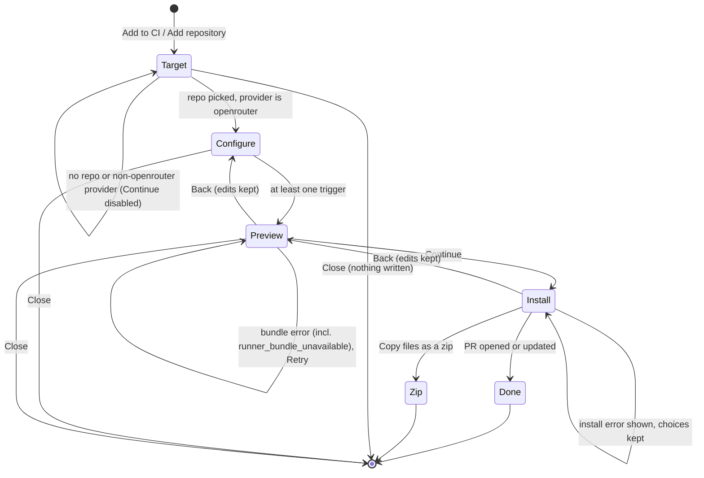
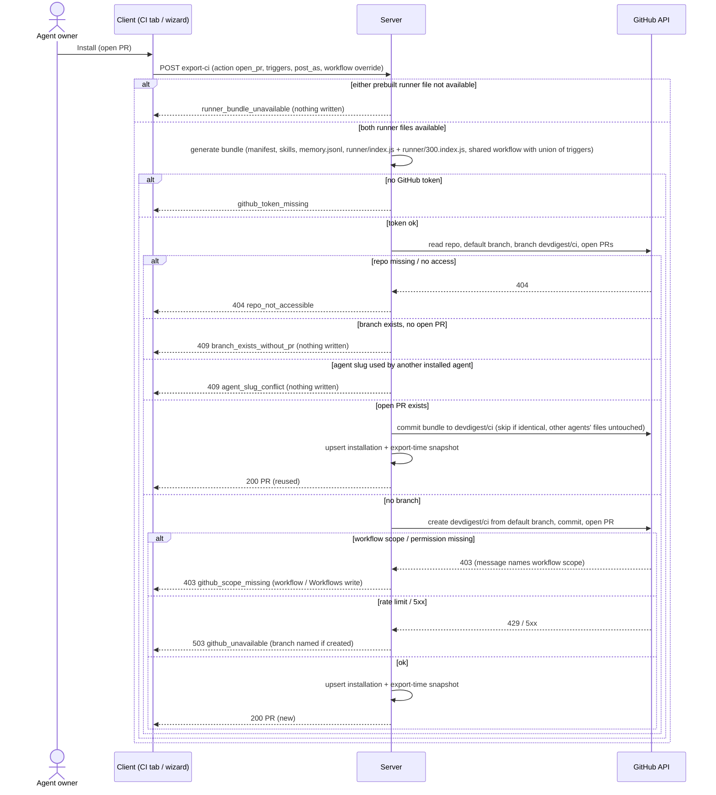
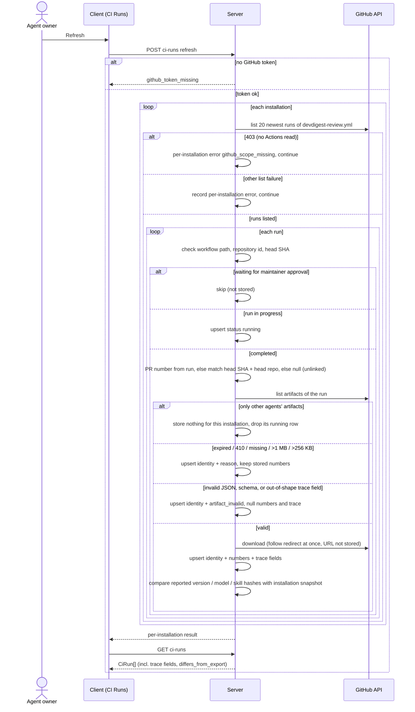
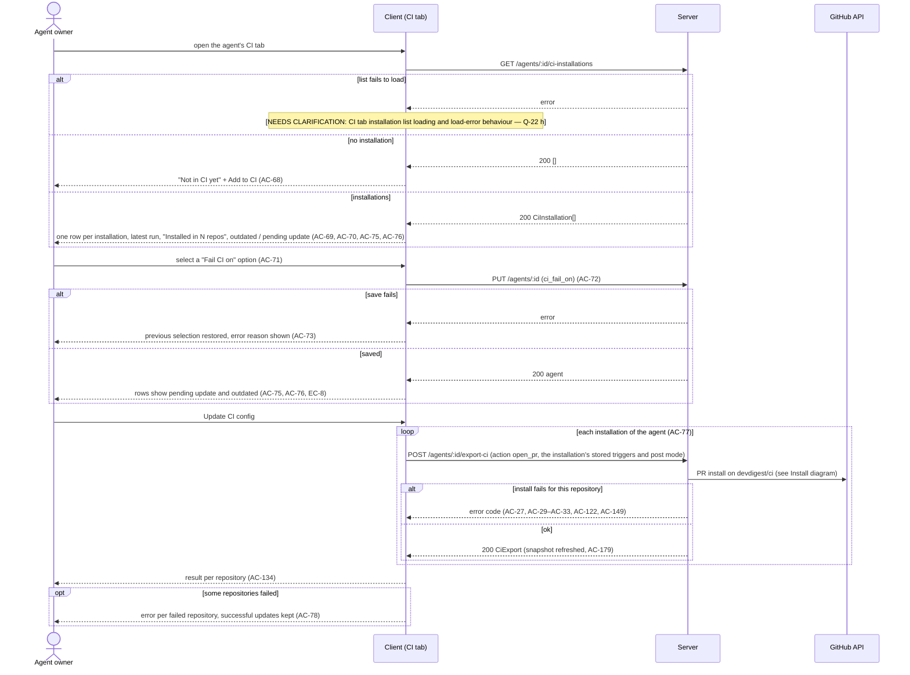

# Spec: Export to CI v2 — run a tuned agent on pull requests through GitHub Actions, with the H07 runner and run traceability
Spec ID: 2026-10-09-export-to-ci-v2
Status: implemented
Supersedes: [2026-10-09-export-to-ci](2026-10-09-export-to-ci.md)
Modules: server, client, reviewer-core, agent-runner (standalone package, imported from branch `H07`, commit `a251426`)

This spec replaces `2026-10-09-export-to-ci` as a whole. Every requirement of the old spec is restated here. IDs that keep their meaning keep their number. IDs whose meaning changed are struck with a reason and replaced by a new ID from AC-146 on. Q-n IDs carried over from the old spec keep their numbers; new questions start at Q-23. The user's answers for this version are cited as `v2-Q1`…`v2-Q20` so they don't clash with the old `Q-n` / `Qn` IDs.

## Problem and user

An agent owner tunes a review agent in the studio: prompt, model, skills and the CI gate `ci_fail_on` (`server/src/vendor/shared/contracts/knowledge.ts:643-657`). Today the agent runs only when someone opens the studio and starts a review by hand. Teammates who never open the studio get nothing. A PR can be merged without the agent ever seeing it.

The pieces for CI exist, but nothing connects them:
- Contracts `CiTarget`, `CiFile`, `AgentManifest`, `CiExportInput`, `CiInstallation`, `CiExport`, `CiRunStatus`, `CiRun` and `CiResultArtifact` (`server/src/vendor/shared/contracts/eval-ci.ts:354-464`).
- Tables `ci_installations` and `ci_runs` (`server/src/db/schema/ci.ts:4-26`).
- The deterministic gate and the GitHub payload builder in reviewer-core (`reviewer-core/src/output/to-review.ts:37`, `:148`).
- UI strings for a wizard and a CI Runs page (`client/messages/en/ci.json:1-120`).
- A CI runner package `agent-runner/` on branch `H07` (commit `a251426`, not on this branch yet). It bundles reviewer-core and the shared contracts into a prebuilt runner started as `.devdigest/runner/index.js` (`agent-runner/README.md:7-9` at `a251426`). The README calls it one file; the build actually emits `index.js`, a lazily loaded chunk `300.index.js` and a `package.json` (RQ2), so the shipped runner is two files (AC-147, AC-184). Its behaviour differs from the superseded spec in several places (see *Inputs and provenance → Changes from the superseded spec*).

There is no route, no CI tab and no studio-side export (inference: `rg "export-ci|CiRun|CiExport"` finds them only in the two `vendor/shared` copies). The agent editor says the CI tab "belongs to later lessons" (`client/src/app/agents/[id]/_components/AgentEditor/AgentEditor.tsx:2`).

What this costs the user today:
- The agent never runs on PRs where nobody opened the studio.
- They have to write and maintain a workflow file by hand.
- They cannot see in the studio what the agent did in CI, nor whether the CI run used the config they exported or a config a PR changed.

## Goals / Non-goals

Goals:
- A four-step wizard on the agent's CI tab: Target (pick a repository), Configure, Preview, Install. It exports the agent to one GitHub repository as a bundle of files:
  - the agent manifest `.devdigest/agents/<agent slug>.yaml` (`eval-ci.ts:373`);
  - one file per skill, `.devdigest/skills/<skill slug>.md` (H07 layout, `agent-runner/src/skills.ts:18` at `a251426`);
  - `.devdigest/memory.jsonl`;
  - the prebuilt runner files `.devdigest/runner/index.js` and `.devdigest/runner/300.index.js`, always together (v2-Q1, RQ2);
  - the repository's one shared GitHub Actions workflow `.github/workflows/devdigest-review.yml`, which runs every agent exported to that repository (Q-9).
- The install writes only to the branch `devdigest/ci` and opens or updates one PR. It never writes to the default branch.
- In CI, the runner does these things for each exported agent:
  - reviews the PR diff, without DevDigest's own files, with reviewer-core, including the grounding gate;
  - posts the result as a GitHub review, as a PR comment, or not at all, as the manifest says;
  - writes `devdigest-result.json`, including what it actually used (model, skill hashes, memory hash, manifest hash, runner build);
  - uploads that file as an artifact;
  - exits non-zero according to `ci_fail_on`, and on any runner error (Q-11).
- The CI tab lists the repositories the agent is installed in. It shows each repo's latest run, an "outdated" flag and a "pending update" flag. It edits "Fail CI on" and re-exports through "Update CI config".
- A CI Runs page shows CI run rows. The rows are pulled from the GitHub API when the user clicks Refresh:
  - identity comes from the API;
  - numbers and the runner-reported trace come from the artifact;
  - "—" plus a reason is shown when the artifact is unavailable;
  - a "differs from export" marker is shown when the run used another agent version, model or skill set than the one exported (v2-Q6).
- Security baked into the generated files and into ingest:
  - least-privilege workflow permissions;
  - actions pinned to commit SHAs;
  - the key only in GitHub Actions Secrets;
  - PR content, including the PR title, treated as data;
  - validated, size-capped artifacts.
- Adding the runner package and the contract changes leaves the studio's existing review flows unchanged (v2-Q18).

Non-goals:
- CircleCI, Jenkins and Generic CLI targets (user decision 5). The Target step shows only GitHub Actions.
- An inbound endpoint, a webhook, a POST from the runner to the studio, or auto-refresh of CI runs (user decisions 2 and Q9). The mock's "auto-refresh on" indicator (`docs/designs/eval-pipeline/jsx/screen_cizruns.jsx:26`) is not shown.
- Writing CI runs into the local runs store, or showing them in local run lists, the trace view or eval metrics (user decision 2).
- Per-agent workflow files. One workflow file per repository serves all agents (Q-9).
- Filter chips on the CI Runs page: date, agent, repo, status, source (`screen_cizruns.jsx:28-33`) [proposed] (Q-22).
- A "Trace" link for CI runs. A CI run has no studio trace; its row links to GitHub instead [proposed] (Q-22).
- Showing the runner-reported hashes, manifest hash or runner build on the CI Runs row. They are stored and returned by the API; the row shows only the "differs from export" marker (v2-Q7).
- Preventing a PR from changing its own agent config under `.devdigest/`. The run uses the PR's files; this is stated in the trust model and recorded on the run (v2-Q5).
- Taking the commit identity from the artifact. `head_sha` comes only from the GitHub API (v2-Q4).
- Aligning the studio's local prompt with CI on where the PR title goes. CI keeps it in untrusted framing only; the studio keeps its current task line (Q-23).
- Uninstalling or removing an agent from a repo inside the studio. The user deletes the files in the repo.
- "Block merge on findings" through a GitHub App (`client/messages/en/ci.json:63-64`). Blocking means "Fail CI on" plus a required status check, which the user sets in GitHub.
- Running a review with secrets on fork PRs, `pull_request_target`, or `workflow_dispatch`.
- Updating or deduplicating earlier review comments when a PR is pushed again. Every run posts a new review or comment.
- Project Context documents and repo-intel context in CI runs. The runner has no studio database or index.
- Backfilling CI runs older than the bounded window of one Refresh (AC-84).
- Detecting whether the setup PR was merged.
- Showing the PR title on the CI Runs page [proposed] (Q-15).
- An MCP tool for CI.
- Automated e2e of real GitHub or a real LLM (Q13).
- Bumping the pins of this repository's own workflows (they use `@v4`, RQ3 of the superseded spec). Only the generated workflow is pinned (AC-44).

## User stories

- US-1 [must]: As an agent owner, I want to export my tuned agent to a GitHub repository through a wizard that opens a pull request, so that the agent reviews every PR there without anyone opening the studio.
- US-2 [must]: As an agent owner, I want to see every file before it is committed and edit the workflow, so that I know exactly what lands in my repository.
- US-3 [must]: As a repository maintainer, I want the CI job to review the PR diff with grounded findings, post the result the way I chose, and fail the check according to "Fail CI on", so that risky PRs are flagged where the team works.
- US-4 [must]: As an agent owner, I want the CI tab to show where the agent is installed, whether each install is behind the agent's current config, and to let me change "Fail CI on" and push an update, so that CI keeps matching what I tuned.
- US-5 [must]: As an agent owner, I want to see CI runs in the studio after Refresh, with real numbers or the reason they are missing, and with what each run actually used, so that I can judge the agent in CI without invented data.
- US-6 [must]: As a workspace owner, I want the model key to stay in GitHub secrets and PR content to be unable to steer the workflow, the runner or ingest, so that exporting an agent opens no new attack path beyond the documented trust model.
- US-7 [should]: As a repository maintainer, I want each PR's CI review cost and time bounded, so that a burst of pushes cannot run up an unbounded bill.

## Acceptance criteria (EARS)

### Wizard (client)

- AC-1 [event, US-1, must, verify: unit] КОЛИ the user activates "Add to CI", the empty-state CTA or "Add repository" on the agent's CI tab, the client shall open the Export to CI wizard at step Target.
- AC-2 [ubiquitous, US-1, must, verify: unit] The wizard shall show its steps in the order Target, Configure, Preview, Install (user decision 6).
- AC-3 [ubiquitous, US-1, must, verify: unit] The Target step shall offer GitHub Actions as the only target, preselected.
- AC-4 [ubiquitous, US-1, must, verify: unit] The Target step shall offer the workspace's imported repositories as the only choices for the target repository [proposed] (Q-22).
- AC-5 [unwanted, US-1, must, verify: unit] ЯКЩО the workspace has no imported repository, ТОДІ the Target step shall show a message that a repository must be imported first, with a link to the repositories page, and keep Continue disabled.
- AC-6 [unwanted, US-1, must, verify: unit] ЯКЩО the agent's provider is not `openrouter`, ТОДІ the Target step shall show a message that CI runs use OpenRouter and the provider must be switched on the Config tab, and keep Continue disabled [proposed] (Q-16).
- AC-7 [ubiquitous, US-1, must, verify: unit] The Configure step shall show three trigger toggles `pull_request:opened`, `pull_request:synchronize` and `pull_request:reopened`, all on by default.
- AC-8 [unwanted, US-1, must, verify: unit] ЯКЩО no trigger is on, ТОДІ the Configure step shall keep Continue disabled and show a hint that at least one trigger is required.
- AC-9 [ubiquitous, US-1, must, verify: unit] The Configure step shall offer "Post results as" with the options GitHub review (default, marked recommended), PR comment and None (exit code only).
- ~~AC-10~~ — replaced by AC-146: the runner file is `.devdigest/runner/index.js`, not `.devdigest/runner.mjs`, and skill files have the path `.devdigest/skills/<skill slug>.md` (v2-Q1).
- AC-11 [ubiquitous, US-2, must, verify: unit] The Preview step shall let the user edit the workflow file's contents. (Read-only display of the other files: AC-127.)
- AC-12 [state, US-2, must, verify: unit] ПОКИ the bundle request is in flight, the Preview step shall show a loading state and keep Continue disabled.
- AC-13 [unwanted, US-2, must, verify: unit] ЯКЩО the bundle request fails, ТОДІ the Preview step shall show the error reason with a Retry action and keep Continue disabled.
- AC-14 [event, US-2, must, verify: unit] КОЛИ the user moves between steps with Back or Continue, the client shall keep the edited workflow contents unchanged for the life of the wizard.
- AC-15 [event, US-2, must, verify: unit] КОЛИ the user changes triggers or "Post results as" after editing the workflow, the client shall ask for confirmation before it replaces the edited workflow with a regenerated one [proposed] (Q-22).
- AC-16 [event, US-1, must, verify: unit] КОЛИ the user closes the wizard before Install succeeds, the client shall discard the choices and edits without any request that writes to GitHub.
- AC-17 [ubiquitous, US-1, must, verify: unit] The Install step shall offer "Open a PR with these files" (default, marked recommended) and "Copy files as a zip". (The PR option's text: AC-128.)
- AC-18 [event, US-2, should, verify: unit] КОЛИ the user installs with "Copy files as a zip", the client shall download a zip that contains exactly the Preview files, including the edited workflow.
- AC-19 [ubiquitous, US-1, should, verify: integration] The zip install path shall record no installation and make no GitHub write [proposed] (Q-10).
- AC-20 [state, US-1, must, verify: unit] ПОКИ the install request is in flight, the wizard shall keep Install disabled and labelled "Installing…".
- AC-21 [event, US-1, must, verify: unit] КОЛИ the PR install succeeds, the wizard shall show a done state with a link to the PR and a checklist [proposed] (Q-22):
  - add `OPENROUTER_API_KEY` to the repository's Actions secrets;
  - merge the PR;
  - optionally make the check required to block merges;
  - use Refresh on CI Runs.
- AC-22 [unwanted, US-1, must, verify: unit] ЯКЩО the install request fails, ТОДІ the wizard shall stay on Install and show the server's error message, with a link to Settings when the error code is `github_token_missing` or `github_scope_missing`, keeping the user's choices and edits.

### Install (server ↔ GitHub)

- AC-23 [event, US-1, must, verify: integration] КОЛИ the server receives an install request and the repository has neither a branch `devdigest/ci` nor an open PR from it, the server shall open a PR titled "Add DevDigest CI review". The PR has these properties:
  - its head is a new branch `devdigest/ci`, created from the repository's default branch;
  - it carries the bundle in one commit;
  - its base is the default branch.
- AC-24 [ubiquitous, US-6, must, verify: integration] The server shall write to no branch other than `devdigest/ci` in the target repository (user decision 7).
- AC-25 [event, US-1, must, verify: integration] КОЛИ an open PR from `devdigest/ci` already exists, the server shall add one commit with the bundle to `devdigest/ci` and return that PR (Q5).
- AC-26 [unwanted, US-1, should, verify: integration] ЯКЩО the bundle equals the files at the head of `devdigest/ci`, ТОДІ the server shall add no commit and return the existing PR [proposed] (Q-22).
- AC-27 [unwanted, US-1, must, verify: integration] ЯКЩО the branch `devdigest/ci` exists without an open PR, ТОДІ the server shall respond `409` with error code `branch_exists_without_pr` and a message to delete the branch or open a PR from it, and write nothing (Q5).
- AC-28 [event, US-4, must, verify: integration] КОЛИ a PR install succeeds, the server shall store one installation per agent and repository. The installation holds the exported agent version, `ci_fail_on`, triggers, post mode, workflow path, PR URL and GitHub repository id. An existing installation for the same pair is updated instead of a new one being added. (Export-time snapshot: AC-179.)
- AC-29 [unwanted, US-1, must, verify: integration] ЯКЩО no GitHub token is configured, ТОДІ the server shall respond with error code `github_token_missing` and make no GitHub call (the client message is AC-22).
- AC-30 [unwanted, US-1, must, verify: integration] ЯКЩО GitHub refuses a write during the PR install with `403` and a message saying the token lacks the workflow scope or permission, ТОДІ the server shall respond `403` with error code `github_scope_missing` and a message that names the missing permission for both token kinds: classic PAT `workflow` (with `repo`), fine-grained PAT `Workflows: write`. The exact GitHub response is confirmed by AC-110.
- AC-31 [unwanted, US-1, must, verify: integration] ЯКЩО the repository does not exist or the token cannot access it, ТОДІ the server shall respond `404` with error code `repo_not_accessible`.
- AC-32 [unwanted, US-1, must, verify: integration] ЯКЩО GitHub responds with a rate limit or a 5xx, ТОДІ the server shall respond `503` with error code `github_unavailable`, record no installation and not retry automatically.
- AC-33 [unwanted, US-1, must, verify: integration] ЯКЩО a GitHub call fails after the branch was created but before the PR was opened, ТОДІ the server shall record no installation. (The error message naming the branch: AC-129.)
- AC-34 [unwanted, US-1, must, verify: integration] ЯКЩО the request's target is not `gha`, ТОДІ the server shall respond `422`.
- AC-35 [ubiquitous, US-6, must, verify: integration] The server shall generate every file path and every file content of the bundle itself, apart from the optional workflow replacement allowed by AC-130.
- AC-36 [unwanted, US-6, must, verify: integration] ЯКЩО the workflow replacement is empty or larger than 64 KB, ТОДІ the server shall respond `422` [proposed] (Q-12).
- AC-37 [event, US-2, must, verify: integration] КОЛИ the server receives a preview request (`action: files`), the server shall return the bundle without any GitHub call and without storing anything.

### Bundle content

- AC-38 [ubiquitous, US-3, must, verify: unit] The generated agent manifest shall validate against the `AgentManifest` schema. (Its fields: AC-131.)
- AC-39 [ubiquitous, US-3, must, verify: unit] The bundle shall contain one skill file for each enabled skill linked to the agent, in the agent's skill order, and no skill file when the agent has no linked enabled skill.
- AC-40 [ubiquitous, US-3, must, verify: unit] `.devdigest/memory.jsonl` shall hold one JSON object per line in the `MemoryItem` shape (`knowledge.ts:426-432`). The lines are the workspace memory items with scope `global` or with the target repository, newest first, at most 200. The file is empty when no such item exists (Q-7).
- ~~AC-41~~ — replaced by AC-147: the runner is `.devdigest/runner/index.js` plus its chunk `.devdigest/runner/300.index.js` (v2-Q1); it runs without a `package.json` on Node.js 24 (RQ2).
- AC-42 [ubiquitous, US-6, must, verify: unit] The generated workflow shall run only on the `pull_request` event with exactly the activity types defined by AC-119. (No `pull_request_target`: AC-132.)
- AC-43 [ubiquitous, US-6, must, verify: unit] The generated workflow shall declare the permissions `contents: read` and `pull-requests: write` and no other permission.
- AC-44 [ubiquitous, US-6, must, verify: unit] The generated workflow shall reference every action by its full 40-character commit SHA, with the version as a trailing comment:
  - `actions/checkout` v7.0.1 → `3d3c42e5aac5ba805825da76410c181273ba90b1`;
  - `actions/setup-node` v7.1.0 → `949feb2413d6458794dcd2491c4babbbce0c15c1`;
  - `actions/upload-artifact` v7.0.2 → `cf430e030ddbb5b0abf93d22962f4752f3646cd9`.
- AC-45 [ubiquitous, US-7, must, verify: unit] The generated workflow shall declare a concurrency group per PR with cancel-in-progress, so that a newer run on the same PR cancels the older one (Q11).
- AC-46 [ubiquitous, US-7, must, verify: unit] The generated workflow shall limit the review job to 10 minutes [proposed] (Q-12).
- AC-47 [ubiquitous, US-3, must, verify: unit] The generated workflow shall set up Node.js with `node-version: "24"` through the pinned `actions/setup-node` (user decision 2026-10-09; RQ2 verified the runner on Node.js 24, not on 22).
- AC-48 [ubiquitous, US-6, must, verify: unit] The generated workflow shall pass `OPENROUTER_API_KEY` to the runner step only from GitHub Actions Secrets.
- AC-49 [ubiquitous, US-5, must, verify: unit] The generated workflow shall upload each agent's `devdigest-result.json` as an artifact named `devdigest-result-<agent slug>`, including when the runner step fails (Q-9, Q-18).
- AC-50 [ubiquitous, US-6, must, verify: unit] The bundle shall contain no secret value from the studio's secrets store.
- AC-51 [ubiquitous, US-6, should, verify: unit] The setup PR body shall state the trust model (Q12):
  - anyone who can push a branch to the repository can change the workflow and the runner and read `OPENROUTER_API_KEY`;
  - fork PRs are skipped.

  (The PR-changes-its-own-config statement: AC-167.)

### Runner (in GitHub Actions)

- AC-52 [event, US-3, must, verify: unit] КОЛИ the runner starts, it shall parse the agent manifest with the same `AgentManifest` schema the studio uses to write it.
- AC-53 [unwanted, US-3, must, verify: unit] ЯКЩО the manifest fails validation, ТОДІ the runner shall end with status `failed`, reason `manifest_invalid` and exit code 1, without an LLM call.
- AC-54 [unwanted, US-6, must, verify: unit] ЯКЩО the PR's head repository differs from its base repository (a fork PR), ТОДІ the runner shall end with status `skipped`, reason `fork_pr` and exit code 0 (Q12). (How "differs" is decided: AC-162, AC-163; no LLM call: AC-143; no post: AC-144.)
- AC-55 [unwanted, US-3, must, verify: unit] ЯКЩО `OPENROUTER_API_KEY` is empty on a same-repository PR, ТОДІ the runner shall end with status `failed` and exit code 1. The reason is `missing_openrouter_key`, with a log message naming the secret to add. There is no LLM call (Q6).
- AC-56 [event, US-3, must, verify: unit] КОЛИ the runner reviews a PR, it shall pass the diff between the event's base and head commits to reviewer-core together with the manifest's prompt, model, strategy, skills and memory items. (Grounding gate: AC-133; own files removed: AC-153; which commit the job checks out: AC-168, RQ1.)
- AC-57 [optional, US-3, must, verify: unit] ДЕ the post mode is `github_review`, the runner shall post one PR review with event `REQUEST_CHANGES` when the gate trips and `COMMENT` otherwise, with a non-empty body and inline comments on the grounded findings (`reviewer-core/src/output/to-review.ts:148`). Whether the repository setting "Allow GitHub Actions to create and approve pull requests" affects these events is checked in the manual flow (Q-4). (422 on inline comments: AC-164.)
- AC-58 [optional, US-3, must, verify: unit] ДЕ the post mode is `pr_comment`, the runner shall post one PR comment with the summary and the list of grounded findings.
- AC-59 [optional, US-3, must, verify: unit] ДЕ the post mode is `none`, the runner shall post nothing to the PR.
- AC-60 [event, US-3, must, verify: unit] КОЛИ the runner completes a review, the runner shall exit with the gate's exit code: 1 when the grounded findings trip the gate under the manifest's `ci_fail_on`, 0 when they do not (`reviewer-core/src/output/to-review.ts:37`).
- AC-61 [unwanted, US-3, must, verify: unit] ЯКЩО the LLM call fails, times out or returns output that cannot be parsed, ТОДІ the runner shall end with status `failed`, a reason naming the failure and exit code 1, whatever `ci_fail_on` says (Q-11).
- AC-62 [unwanted, US-3, should, verify: unit] ЯКЩО posting the result to the PR fails, ТОДІ the runner shall record reason `post_failed` in the result and still exit according to AC-60 (Q-21). (A 422 that the body-only retry recovers is not a failure: AC-165.)
- AC-63 [ubiquitous, US-5, must, verify: unit] The runner shall write `devdigest-result.json` on every path that ends after start: completed, skipped and failed.
- ~~AC-64~~ — replaced by AC-169: the artifact now also carries the runner-reported trace (model, skill entries, memory hash, manifest hash, runner build) (v2-Q2, v2-Q3).
- AC-65 [ubiquitous, US-6, must, verify: unit] The runner shall replace the exact values of `OPENROUTER_API_KEY` and `GITHUB_TOKEN` with `***` in every log line, error message and result field it writes.
- AC-66 [ubiquitous, US-6, must, verify: unit] The runner shall give the PR diff, title, body, branch names and comments to the model only wrapped as untrusted data (`reviewer-core/src/prompt.ts:48`). (Title placement: AC-166.)
- AC-67 [ubiquitous, US-6, should, verify: unit] The runner shall give the model the skills that are not of source `manual` with the same untrusted-data framing the studio applies to them (`server/src/modules/reviews/run-executor.ts:500`) [proposed] (Q-14).

### CI tab (client)

- AC-68 [state, US-4, must, verify: unit] ПОКИ the agent has no installation, the CI tab shall show the empty state "Not in CI yet" with the "Add to CI" action.
- AC-69 [ubiquitous, US-4, must, verify: unit] The CI tab shall list one row per installation with these items:
  - the repository;
  - a "GitHub Actions" badge;
  - a link to the setup PR;
  - the status of the latest stored CI run for that agent and repository, as text plus icon, with its relative time;
  - "No runs yet" when no run is stored.
- AC-70 [ubiquitous, US-4, must, verify: unit] The CI tab header shall show the number of installations as "Installed in N repos" [proposed] (Q-22).
- AC-71 [ubiquitous, US-4, must, verify: unit] The CI tab shall show "Fail CI on" as a single-choice control with the options Critical, Warning+ and Never. They map to `critical`, `warning` and `never`, and the selected option is the agent's current `ci_fail_on` (Q7).
- AC-72 [event, US-4, must, verify: integration] КОЛИ the user selects a "Fail CI on" option, the client shall save it as the agent's `ci_fail_on` through the existing agent update route (`server/src/modules/agents/routes.ts:125`).
- AC-73 [unwanted, US-4, must, verify: unit] ЯКЩО saving "Fail CI on" fails, ТОДІ the CI tab shall restore the previous selection and show the error reason.
- AC-74 [unwanted, US-4, should, verify: unit] ЯКЩО the agent's stored `ci_fail_on` is `any`, ТОДІ the CI tab shall select no option and show the note "Any finding (set on the Config tab)" [proposed] (Q-8).
- AC-75 [state, US-4, must, verify: unit] ПОКИ an installation's exported `ci_fail_on` differs from the agent's current value, its row shall show "pending update" (Q7).
- AC-76 [state, US-4, must, verify: unit] ПОКИ an installation's exported agent version is lower than the agent's current version, its row shall show "outdated" (Q10).
- AC-77 [event, US-4, must, verify: integration] КОЛИ the user activates "Update CI config", the client shall run the PR install (AC-23–AC-28) for every installation of the agent. Each install uses that installation's stored triggers and post mode and the agent's current config. (Result per repository: AC-134.)
- AC-78 [unwanted, US-4, must, verify: unit] ЯКЩО "Update CI config" fails for some repositories, ТОДІ the CI tab shall show the error for each failed repository and keep the successful updates.

### CI Runs page and ingest

- AC-79 [ubiquitous, US-5, must, verify: unit] The studio shall have a "CI Runs" navigation entry. Its page lists the stored CI runs, newest `ran_at` first, at most 100 rows [proposed] (Q-12).
- AC-80 [ubiquitous, US-5, must, verify: unit] Each CI run row shall show these columns:
  - timestamp and repository;
  - PR number linked to the PR, with the short head SHA;
  - agent name with version;
  - source "GitHub Actions";
  - duration;
  - finding counts per severity, as icon plus number;
  - cost, verdict and status (text plus icon);
  - a "View on GitHub" link to the workflow run.

  (The "differs from export" marker: AC-180.)
- AC-81 [state, US-5, must, verify: unit] ПОКИ no CI run is stored, the CI Runs page shall show "No CI runs yet" with an action that opens the agents list.
- AC-82 [event, US-5, must, verify: integration] КОЛИ the user activates Refresh, the client shall request one synchronous sync of every installation and reload the list when the sync returns (Q9).
- AC-83 [state, US-5, must, verify: unit] ПОКИ a Refresh is in flight, the page shall keep Refresh disabled and labelled "Refreshing…", and keep the existing rows visible.
- AC-84 [event, US-5, must, verify: integration] КОЛИ the server syncs an installation, it shall read at most the 20 newest workflow runs of `.github/workflows/devdigest-review.yml` in the installed repository [proposed] (Q-12). (Keyed storage: AC-135; missing `run_attempt`: AC-136.)
- AC-85 [ubiquitous, US-5, must, verify: integration] The server shall take each CI run's identity and timing from the GitHub API: run id, attempt, head SHA (the value GitHub reports in the workflow run record as `head_sha`, stored as reported), head repository, run URL, start and end time, and the PR number per AC-95 and AC-114 (v2-Q4, RQ1). (Findings, verdict and cost: AC-137. PR attribution uses head SHA + head repository per AC-95/AC-114. Whether `head_sha` names the PR head commit is not documented by GitHub and is verified on a real run: Q-31.)
- AC-86 [ubiquitous, US-5, must, verify: integration] The server shall derive each CI run's status as follows:
  - a run that is queued or in progress → `running`;
  - an artifact with status `skipped` → `skipped`;
  - a successful run with zero findings → `no_findings`;
  - any other successful run → `succeeded`;
  - a cancelled run → `cancelled`;
  - any other conclusion → `failed`.
- AC-87 [unwanted, US-6, must, verify: integration] ЯКЩО a workflow run's workflow path differs from the installation's workflow path, or its repository id differs from the installed repository id, ТОДІ the server shall ignore that run.
- AC-88 [unwanted, US-6, must, verify: integration] ЯКЩО a run's head SHA is not a 40-character hexadecimal string, ТОДІ the server shall ignore that run.
- AC-89 [unwanted, US-6, must, verify: integration] ЯКЩО the artifact archive is larger than 1 MB, ТОДІ the server shall not download it [proposed] (Q-12). (Stored reason: AC-138.) This cap is dev-digest's own limit; GitHub documents no per-artifact size limit.
- AC-90 [ubiquitous, US-6, must, verify: integration] The server shall read only the entry `devdigest-result.json` from the artifact archive [proposed] (Q-12). (256 KB read cap: AC-139; stored reason: AC-140.)
- AC-91 [unwanted, US-6, must, verify: integration] ЯКЩО the artifact entry is not valid JSON or fails the `CiResultArtifact` schema, ТОДІ the server shall store the run with null findings, verdict and cost and reason `artifact_invalid`. (Out-of-shape trace field: AC-178.)
- AC-92 [unwanted, US-5, must, verify: integration] ЯКЩО a completed run's artifact for the installation's agent is listed with `expired: true`, or the run lists no `devdigest-result-*` artifact at all, ТОДІ the server shall store null findings, verdict and cost with reason `artifact_expired` for the expired case and `artifact_missing` for the absent case.
- AC-93 [unwanted, US-5, must, verify: integration] ЯКЩО a run already has stored artifact numbers and its artifact later becomes unavailable, ТОДІ the server shall keep the stored numbers.
- AC-94 [unwanted, US-5, must, verify: unit] ЯКЩО a CI run's findings, verdict or cost are null, ТОДІ its row shall show "—" in those cells, with the stored unavailability reason as visible text when one exists. (A null PR number is shown per AC-115.)
- AC-95 [unwanted, US-5, must, verify: integration] ЯКЩО GitHub reports an empty or null PR list for a workflow run (as it does for fork-PR runs), ТОДІ the server shall take the PR number from the repository's pull request whose head SHA and head repository equal the run's.
- AC-96 [unwanted, US-5, must, verify: integration] ЯКЩО syncing one installation fails, ТОДІ the server shall keep the runs stored for the other installations and return the error code per failed installation.
- AC-97 [unwanted, US-5, must, verify: unit] ЯКЩО Refresh returns errors for some installations, ТОДІ the page shall show each failed repository with its error reason.
- AC-98 [unwanted, US-5, must, verify: integration] ЯКЩО no GitHub token is configured when Refresh runs, ТОДІ the server shall respond with error code `github_token_missing` and change no stored CI run.
- AC-99 [ubiquitous, US-5, must, verify: integration] The server shall store CI runs separately from local agent runs, so that a CI run never appears in local run lists, run traces or eval metrics (user decision 2).
- AC-100 [unwanted, US-5, should, verify: unit] ЯКЩО a CI run's installation or agent no longer exists, ТОДІ its row shall show "—" in the agent cell and keep the other cells.
- AC-101 [ubiquitous, US-5, should, verify: unit] Repository and agent names longer than their column shall be cut with an ellipsis, with the full value available as the element's accessible name.

### Carried over from the superseded spec (one-response splits and revisions)

- AC-102 [unwanted, US-5, must, verify: unit] ЯКЩО Refresh returns `github_token_missing`, ТОДІ the CI Runs page shall show a message that a GitHub token is required, with a link to Settings.
- AC-103 [ubiquitous, US-6, must, verify: unit] No `run:` line of the generated workflow shall contain an expression that expands PR-controlled data: title, body, branch names, comments or commit messages.
- AC-104 [complex, US-3, must, verify: unit] ПОКИ the agent's `ci_fail_on` is `never`, КОЛИ the runner ends with status `failed` (missing key, LLM failure, timeout, unparseable output, invalid manifest, missing skill or unavailable diff), the runner shall exit with code 1 (Q-11).
- AC-105 [optional, US-3, must, verify: unit] ДЕ the manifest's `ci_fail_on` is `never`, the runner shall exit with code 0 after a completed review, whatever the grounded findings are (Q-11).
- AC-106 [unwanted, US-7, should, verify: unit] ЯКЩО the PR diff contains zero changed files, ТОДІ the runner shall make no LLM call [proposed] (Q-5).
- AC-107 [unwanted, US-3, should, verify: unit] ЯКЩО the PR diff contains zero changed files, ТОДІ the runner shall end with status `no_findings`, reason `empty_diff` and exit code 0 [proposed] (Q-5).
- AC-108 [unwanted, US-3, could, verify: unit] ЯКЩО the PR diff contains zero changed files, ТОДІ the runner shall post nothing to the PR [proposed] (Q-5).
- AC-109 [ubiquitous, US-3, must, verify: unit] The runner shall give reviewer-core a parsed diff equal to the one the studio's diff parsing produces from the same raw unified diff (`server/src/adapters/git/diff-parser.ts:14`), checked on shared diff fixtures. (H07 carries its own parser copy, `agent-runner/src/diff.ts:63` at `a251426`; this AC is the parity check for it.)
- AC-110 [unwanted, US-1, must, verify: manual — needs real GitHub tokens on a throwaway repository] ЯКЩО the PR install runs with a classic PAT that has `repo` without `workflow`, or with a fine-grained PAT that lacks `Workflows: write`, ТОДІ the server shall respond `403 github_scope_missing` naming that permission; the GitHub status and body this detection relies on are [pending empirical test] (Q-19).
- AC-111 [unwanted, US-5, must, verify: integration] ЯКЩО GitHub refuses to list workflow runs or artifacts, or to download an artifact, with `403` during a sync, ТОДІ the server shall report error code `github_scope_missing` for that installation with a message naming classic `repo` and fine-grained `Actions: read`.
- AC-112 [ubiquitous, US-6, must, verify: integration] The server shall follow an artifact download's redirect at once (the URL expires after 1 minute). (Never stored or logged: AC-141.)
- AC-113 [unwanted, US-5, must, verify: integration] ЯКЩО an artifact download returns `410 Gone`, ТОДІ the server shall store reason `artifact_expired` for that run and continue syncing that installation.
- AC-114 [unwanted, US-5, must, verify: integration] ЯКЩО no pull request of the repository matches the run's head SHA and head repository (AC-95), ТОДІ the server shall store the run with a null PR number.
- AC-115 [unwanted, US-5, must, verify: unit] ЯКЩО a CI run's PR number is null, ТОДІ its row shall show "unlinked" in the PR cell, with the short head SHA.
- AC-116 [unwanted, US-5, should, verify: integration] ЯКЩО a workflow run is waiting for maintainer approval (first-time contributor), ТОДІ the server shall not store it, so it is never shown as `failed` [proposed]; the API field that signals this state is [pending research] (Q-20).
- AC-117 [ubiquitous, US-1, must, verify: unit] The bundle's workflow file path shall be `.github/workflows/devdigest-review.yml` for every agent exported to any repository (Q-9).
- AC-118 [ubiquitous, US-3, must, verify: unit] The generated workflow shall run the runner for every agent manifest under `.devdigest/agents/` in the repository (Q-9). (H07 accepts exactly one manifest, `agent-runner/src/manifest.ts:40` at `a251426`; this AC overrides that.)
- AC-119 [ubiquitous, US-1, must, verify: integration] The generated workflow's `pull_request` activity types shall be the union of the triggers stored for all installations in the target repository, including the one being installed (Q-18).
- AC-120 [unwanted, US-3, must, verify: unit] ЯКЩО the event's activity type is not among an agent's manifest triggers, ТОДІ the runner shall end that agent with status `skipped`, reason `trigger_not_selected` and exit code 0, without an LLM call (Q-18).
- AC-121 [unwanted, US-3, must, verify: unit] ЯКЩО at least one agent's runner result in a workflow run exits with code 1, ТОДІ the CI check shall fail (Q-18). (The pass case: AC-142; a missing result file: AC-161.)
- AC-122 [unwanted, US-1, must, verify: integration] ЯКЩО another agent already installed in the target repository has the same agent slug, ТОДІ the server shall respond `409` with error code `agent_slug_conflict` and write nothing (Q-18).
- AC-123 [event, US-5, must, verify: integration] КОЛИ a completed run carries a `devdigest-result-*` artifact for some agent but none for an installation's agent, the server shall store no run for that installation (Q-18).
- AC-124 [event, US-5, should, verify: integration] КОЛИ a run that was stored as `running` for an installation completes without an artifact for that installation's agent while other agents' artifacts exist, the server shall delete that `running` row (Q-18).
- AC-125 [ubiquitous, US-1, must, verify: integration] The PR install shall leave every file of other agents under `.devdigest/agents/` and `.devdigest/skills/` on `devdigest/ci` unchanged (Q-9).
- AC-126 [ubiquitous, US-1, should, verify: unit] The Install step shall list the token permissions the PR install and Refresh need: classic PAT `repo` and `workflow`; fine-grained PAT `Contents: write`, `Workflows: write`, `Pull requests: write` and `Actions: read` [proposed] (Q-22).
- AC-127 [ubiquitous, US-2, must, verify: unit] The Preview step shall show every bundle file other than the workflow file read-only.
- AC-128 [ubiquitous, US-1, must, verify: unit] The Install step's "Open a PR with these files" option shall name the target repository, the branch `devdigest/ci` and the number of files.
- AC-129 [unwanted, US-1, must, verify: integration] ЯКЩО a GitHub call fails after the branch was created but before the PR was opened, ТОДІ the server's error message shall name the branch `devdigest/ci` that was left behind.
- AC-130 [ubiquitous, US-6, must, verify: integration] The server shall accept no bundle file path or file content from the client other than an optional replacement for the workflow file's contents.
- AC-131 [ubiquitous, US-3, must, verify: unit] The generated agent manifest shall carry the agent's name, model, system prompt, strategy (default `auto`, `eval-ci.ts:389`), skill slugs, `ci_fail_on`, post mode, triggers and agent version (Q10, Q-18).
- AC-132 [ubiquitous, US-6, must, verify: unit] The generated workflow shall never use the `pull_request_target` event.
- AC-133 [event, US-3, must, verify: unit] КОЛИ the runner reviews a PR, the runner shall drop every finding that fails the grounding gate before counting or posting findings (`reviewer-core/src/review/run.ts:248-249`).
- AC-134 [event, US-4, must, verify: unit] КОЛИ "Update CI config" has finished for every installation, the CI tab shall show the result per repository.
- AC-135 [event, US-5, must, verify: integration] КОЛИ the server syncs an installation, the server shall store each workflow run it read for that installation keyed by repository id, run id, run attempt and installation, so that a repeated sync updates the same row.
- AC-136 [unwanted, US-5, must, verify: integration] ЯКЩО a workflow run object has no `run_attempt`, ТОДІ the server shall store that run as attempt 1.
- AC-137 [ubiquitous, US-5, must, verify: integration] The server shall take each CI run's findings, verdict and cost only from the artifact.
- AC-138 [unwanted, US-6, must, verify: integration] ЯКЩО the artifact archive is larger than 1 MB, ТОДІ the server shall store reason `artifact_too_large` for that run [proposed] (Q-12).
- AC-139 [unwanted, US-6, must, verify: integration] ЯКЩО the decompressed `devdigest-result.json` entry exceeds 256 KB, ТОДІ the server shall stop reading it at 256 KB [proposed] (Q-12).
- AC-140 [unwanted, US-6, must, verify: integration] ЯКЩО the decompressed `devdigest-result.json` entry exceeds 256 KB, ТОДІ the server shall store reason `artifact_too_large` for that run [proposed] (Q-12).
- AC-141 [ubiquitous, US-6, must, verify: integration] The server shall keep an artifact download's redirect URL out of every stored record and every log line.
- AC-142 [event, US-3, must, verify: unit] КОЛИ every agent's runner result in a workflow run exits with code 0, the CI check shall pass (Q-18).
- AC-143 [unwanted, US-6, must, verify: unit] ЯКЩО the PR's head repository differs from its base repository (a fork PR), ТОДІ the runner shall make no LLM call (Q12).
- AC-144 [unwanted, US-6, must, verify: unit] ЯКЩО the PR's head repository differs from its base repository (a fork PR), ТОДІ the runner shall post nothing to the PR (Q12).
- AC-145 [ubiquitous, US-6, must, verify: unit] `devdigest-result.json` shall carry no repository, PR or commit identity and no finding text (v2-Q4: unchanged).

### New in v2 — bundle and runner files (v2-Q1, v2-Q19, RQ2)

- AC-146 [event, US-2, must, verify: unit] КОЛИ the user continues from Configure to Preview, the client shall show the bundle's file list: the agent manifest `.devdigest/agents/<agent slug>.yaml`, one skill file `.devdigest/skills/<skill slug>.md` per linked enabled skill, `.devdigest/memory.jsonl`, the runner files `.devdigest/runner/index.js` and `.devdigest/runner/300.index.js`, and the workflow file `.github/workflows/devdigest-review.yml` (v2-Q1, Q-9, RQ2). (replaces AC-10)
- AC-147 [ubiquitous, US-3, must, verify: integration — copy the two shipped runner files into `.devdigest/runner/` of an empty directory that has no `package.json` and no `node_modules`, and start `node .devdigest/runner/index.js` with Node.js 24] The prebuilt runner files `.devdigest/runner/index.js` and `.devdigest/runner/300.index.js` shall run on Node.js 24 without a `package.json` or an `npm install` in the target repository (v2-Q1, RQ2, user decision 2026-10-09: Node.js 24). (replaces AC-41)
- AC-148 [ubiquitous, US-3, must, verify: unit] The generated workflow shall start the runner as `node .devdigest/runner/index.js` (v2-Q1, RQ2).
- AC-149 [unwanted, US-1, must, verify: integration] ЯКЩО either prebuilt runner file (`index.js` or `300.index.js`) is not available to the server when it builds a bundle, ТОДІ the server shall respond to the preview or install request with error code `runner_bundle_unavailable` (v2-Q19, RQ2). (Status code: Q-30.)
- AC-150 [unwanted, US-1, must, verify: integration] ЯКЩО either prebuilt runner file (`index.js` or `300.index.js`) is not available to the server when it builds a bundle, ТОДІ the server shall make no GitHub write (v2-Q19, RQ2). (No installation recorded: AC-183.)

### New in v2 — runner behaviour closing the H07 gaps

- AC-151 [unwanted, US-3, must, verify: unit] ЯКЩО an agent manifest has no `post_as` or a `post_as` other than `github_review`, `pr_comment` or `none`, ТОДІ the runner shall end that agent with status `failed`, reason `manifest_invalid` and exit code 1, without an LLM call (v2-Q12).
- AC-152 [ubiquitous, US-3, must, verify: unit] The runner shall take each agent's post mode only from that agent's validated manifest (v2-Q12).
- AC-153 [ubiquitous, US-3, must, verify: unit] The runner shall remove every file under `.devdigest/` and `.github/workflows/` from the PR diff before the diff reaches reviewer-core (v2-Q9).
- AC-154 [unwanted, US-3, must, verify: unit] ЯКЩО the PR diff changes only files under `.devdigest/` and `.github/workflows/`, ТОДІ the runner shall end each agent with status `no_findings`, reason `empty_diff` and exit code 0 (v2-Q9).
- AC-155 [unwanted, US-7, must, verify: unit] ЯКЩО the PR diff changes only files under `.devdigest/` and `.github/workflows/`, ТОДІ the runner shall make no LLM call (v2-Q9).
- AC-156 [unwanted, US-3, must, verify: unit] ЯКЩО the request for the PR diff fails or returns a non-success status, ТОДІ the runner shall end each agent it was reviewing with status `failed`, reason `diff_unavailable` and exit code 1, without an LLM call (v2-Q16).
- AC-157 [unwanted, US-7, must, verify: unit] ЯКЩО the raw PR diff is larger than 2 MB [proposed] (Q-26, pending RQ3), ТОДІ the runner shall end each agent with status `failed`, reason `diff_unavailable` and exit code 1, without an LLM call (v2-Q16).
- AC-158 [unwanted, US-3, must, verify: unit] ЯКЩО a skill slug in an agent's manifest has no file `.devdigest/skills/<skill slug>.md`, ТОДІ the runner shall end that agent with status `failed`, reason `skill_missing` and exit code 1, without an LLM call (v2-Q17).
- AC-159 [unwanted, US-3, should, verify: unit] ЯКЩО `.devdigest/memory.jsonl` is missing or has a line that is not a valid `MemoryItem`, ТОДІ the runner shall end each agent with status `failed`, reason `memory_invalid` and exit code 1, without an LLM call [proposed] (Q-29).
- AC-160 [event, US-3, must, verify: unit] КОЛИ one agent ends with status `failed`, the runner shall still run every remaining agent manifest of the repository (v2-Q14).
- AC-161 [unwanted, US-3, must, verify: unit] ЯКЩО a workflow run ends without a `devdigest-result.json` for any agent whose manifest is under `.devdigest/agents/`, ТОДІ the CI check shall fail (v2-Q13).
- AC-162 [ubiquitous, US-6, must, verify: unit] The runner shall decide that a PR is a fork PR by comparing the head repository id with the base repository id in the `pull_request` event payload, not by a `fork` flag [pending RQ4] (v2-Q11, Q-27).
- AC-163 [unwanted, US-6, must, verify: unit] ЯКЩО the event payload's PR head repository is null, ТОДІ the runner shall treat the PR as a fork PR (AC-54, AC-143, AC-144) (v2-Q11).
- AC-164 [unwanted, US-3, must, verify: unit] ЯКЩО GitHub responds `422` to a review that carries inline comments, ТОДІ the runner shall post one review with the same event and body and without inline comments (v2-Q15).
- AC-165 [unwanted, US-3, must, verify: unit] ЯКЩО the body-only review of AC-164 is accepted, ТОДІ the runner shall record no `post_failed` reason (v2-Q15).
- AC-166 [ubiquitous, US-6, must, verify: unit] The runner shall place the PR title in the prompt only inside untrusted-data framing and in no trusted instruction line (v2-Q10). This differs from the studio's local runs, which put the title in the trusted task line (`server/src/modules/reviews/helpers.ts:172-174`); see Q-23.
- AC-167 [ubiquitous, US-6, should, verify: unit] The setup PR body shall state that a PR can change the files under `.devdigest/` (prompt, model, `ci_fail_on`, post mode, triggers, skills, memory) and that the PR's own CI run uses those changed files (v2-Q5).
- AC-168 [ubiquitous, US-3, must, verify: unit] The runner shall read each agent's manifest, skill files and memory from the job's repository checkout, which for a `pull_request` run is the merge commit of `refs/pull/<N>/merge` (base branch plus the PR's changes), so a PR that edits `.devdigest/agents/<slug>.yaml` is read in its merge-ref version, not the base version (v2-Q5, RQ1).

### New in v2 — run traceability (v2-Q2, v2-Q3, v2-Q5–Q8)

- AC-169 [ubiquitous, US-6, must, verify: unit] `devdigest-result.json` shall carry only these fields (replaces AC-64):
  - schema version, status, verdict;
  - finding counts per severity, cost, duration;
  - agent name, agent version, `ci_fail_on`;
  - model;
  - skill entries, each a skill slug and a sha256;
  - memory sha256, manifest sha256, runner build identifier;
  - a reason of at most 500 characters.

  (No identity and no finding text: AC-145.)
- AC-170 [ubiquitous, US-5, must, verify: unit] The artifact's `model` shall be the model of the agent's validated manifest, as requested by the runner (v2-Q3).
- AC-171 [ubiquitous, US-5, must, verify: unit] The artifact's skill entries shall list, in the order read, the slug and the sha256 of the bytes of each skill file the runner read for that agent, and no entry for a skill file it did not read (v2-Q2).
- AC-172 [ubiquitous, US-5, must, verify: unit] The artifact's memory sha256 shall be the sha256 of the bytes of `.devdigest/memory.jsonl` the runner read, and null when the runner did not read it (v2-Q2).
- AC-173 [ubiquitous, US-5, must, verify: unit] The artifact's manifest sha256 shall be the sha256 of the bytes of that agent's manifest file, and null when the runner did not read it (v2-Q2).
- AC-174 [ubiquitous, US-5, must, verify: integration — build two runner bundles from different sources and compare] The artifact's runner build identifier shall differ between two runner bundles whose contents differ (v2-Q2).
- AC-175 [ubiquitous, US-5, must, verify: unit] The artifact's runner build identifier shall be the same for every run of one runner bundle (v2-Q2).
- AC-176 [event, US-5, must, verify: integration] КОЛИ the server stores a run from a valid artifact, the server shall store with the run the artifact's model, `ci_fail_on`, skill entries, memory sha256, manifest sha256 and runner build identifier (v2-Q5, v2-Q7).
- AC-177 [ubiquitous, US-5, must, verify: integration] `GET /ci-runs` shall return, for each run, the stored model, `ci_fail_on`, skill entries, memory sha256, manifest sha256, runner build identifier and the "differs from export" flag (v2-Q7).
- AC-178 [unwanted, US-6, must, verify: integration] ЯКЩО any runner-reported trace field of the artifact is out of shape (a sha256 that is not 64 lowercase hexadecimal characters, a skill entry without a slug, a model that is not a non-empty string), ТОДІ the server shall store the run with reason `artifact_invalid` and with null findings, verdict, cost and trace fields (v2-Q8).
- AC-179 [event, US-4, must, verify: integration] КОЛИ a PR install succeeds, the server shall store with the installation an export-time snapshot of the exported agent version, the model, and the slug and sha256 of each generated skill file (v2-Q6).
- AC-180 [state, US-5, must, verify: unit] ПОКИ a CI run's reported agent version, model or skill entries differ from its installation's snapshot, its row shall show the text "differs from export" with an icon (v2-Q6).
- AC-181 [ubiquitous, US-5, should, verify: integration] The server shall compare a run's reported values with the installation's current snapshot, so that runs made before a later "Update CI config" are compared with the newer export [proposed] (Q-28).
- AC-182 [unwanted, US-5, should, verify: unit] ЯКЩО a CI run carries no manifest sha256 (the runner never read the manifest), ТОДІ its row shall show no "differs from export" marker [proposed] (Q-28).

### New in v2 — one-response split

- AC-183 [unwanted, US-1, must, verify: integration] ЯКЩО either prebuilt runner file (`index.js` or `300.index.js`) is not available to the server when it builds a bundle, ТОДІ the server shall record no installation (v2-Q19, RQ2). (from AC-150)

### New in v2 — runner files ship together (RQ2)

- AC-184 [ubiquitous, US-3, must, verify: unit] Every bundle the server returns or commits shall contain both `.devdigest/runner/index.js` and `.devdigest/runner/300.index.js`; the lazy chunk is not optional (RQ2). (Missing file on the studio side: AC-149, AC-150, AC-183.)

## Edge cases

UI state matrix (`ux-design-review`), every cell mapped:

| Screen / component | Default | Empty | Loading | Partial | Error | Degraded | No access / no token | First run | Long content | Stale |
|---|---|---|---|---|---|---|---|---|---|---|
| CI tab — installation list | AC-69, AC-70, AC-134 | AC-68 | [NEEDS CLARIFICATION: CI tab installation list loading and load-error behaviour — Q-22 h] | AC-78 | AC-73, AC-78; list load error: [NEEDS CLARIFICATION: CI tab installation list loading and load-error behaviour — Q-22 h] | n/a — no LLM on this screen | AC-29, AC-30, AC-78 (through Update) | AC-68 | AC-101 | AC-75, AC-76 |
| CI tab — Fail CI on | AC-71 | n/a | AC-72 | n/a | AC-73 | n/a | n/a — local save | AC-74 | n/a | AC-75 |
| Wizard — Target | AC-3, AC-4 | AC-5 | n/a — repo list is local | n/a | AC-6 | n/a | AC-29 | AC-5 | AC-101 | n/a |
| Wizard — Configure | AC-7, AC-9 | AC-8 | n/a | n/a | AC-8 | n/a | n/a | AC-7 | n/a | AC-15 |
| Wizard — Preview | AC-146, AC-11, AC-127 | AC-39, AC-40 | AC-12 | n/a | AC-13, AC-149 | n/a | n/a — preview makes no GitHub call (AC-37) | AC-146 | EC-17 | AC-14 |
| Wizard — Install | AC-17, AC-126, AC-128 | n/a | AC-20 | EC-9 | AC-22, AC-27, AC-30–AC-33, AC-122, AC-129, AC-149, AC-150, AC-183 | AC-32 | AC-29, AC-30, AC-110 | AC-21 | n/a | n/a |
| CI Runs page | AC-79, AC-80 | AC-81 | AC-83 | AC-96, AC-97 | AC-97 | AC-94, AC-115 | AC-98, AC-102, AC-111 | AC-81 | AC-101 | AC-93, EC-7, AC-180 |

Edge cases carried over (EC-1–EC-32 keep their IDs):

- EC-1: Two agents are exported to the same repository. Both share `.github/workflows/devdigest-review.yml`; each has its own manifest and its own `devdigest-result-<agent slug>` artifact, so each run row is attributed to one installation, and both bundles land on the one `devdigest/ci` PR (→ AC-25, AC-117–AC-125; Q-9, Q-18).
- EC-2: The setup PR was merged and GitHub deleted `devdigest/ci` → the next install or "Update CI config" opens a new branch and PR (→ AC-23).
- EC-3: The setup PR was closed without merging and the branch kept → install fails without writing (→ AC-27).
- EC-4: The user changed the workflow in the repository after merging → "Update CI config" regenerates it. The overwrite is visible in the update PR's diff, and nothing reaches the default branch until the user merges (→ AC-24, AC-77; Q-13).
- EC-5: A workflow run is re-run in GitHub → each attempt is its own row (→ AC-84, AC-135).
- EC-6: Refresh runs while a CI job is still running → the row shows `running`. The next Refresh updates the same row (→ AC-84, AC-86, AC-135).
- EC-7: Refresh is clicked in two browser tabs at once → both syncs write the same keyed rows, with no duplicates (→ AC-84, AC-135).
- EC-8: "Fail CI on" is changed while a CI job runs → the job uses the committed manifest. The studio shows "pending update" until the next install (→ AC-75). The change also bumps the agent version, because every config field except `enabled` bumps it (`server/src/modules/agents/repository.ts:25`), so the row also shows "outdated" (→ AC-76).
- EC-9: Install is double-clicked or started in two tabs → the button is disabled in flight. A second request that reaches the server finds the open PR, and identical content adds no commit (→ AC-20, AC-25, AC-26).
- EC-10: The artifact expires after a successful ingest → stored numbers stay (→ AC-93).
- EC-11: The user removed the artifact upload step from the workflow → rows show "—" with reason `artifact_missing` (→ AC-92, AC-94).
- EC-12: A collaborator edits the runner to forge `devdigest-result.json` → ingest accepts it only within schema and size caps. This is an accepted risk of the documented trust model (→ AC-51, AC-89–AC-91, AC-138–AC-140, AC-178; Q12).
- EC-13: A fork PR → `skipped`, no post, the check passes (→ AC-54, AC-86, AC-143, AC-144, AC-162).
- EC-14: A PR whose diff has zero changed files → the runner makes no LLM call, ends `no_findings` with reason `empty_diff`, exit 0 and posts nothing (→ AC-106, AC-107, AC-108). A diff with files but no reviewable text lines goes to reviewer-core as usual (inference: reviewer-core does not short-circuit) (→ AC-56, AC-60).
- EC-15: Pushes in quick succession on one PR → the older run is cancelled and shown as `cancelled` (→ AC-45, AC-86).
- EC-16: An agent with no skills and an empty memory → the bundle has no skill files and an empty `memory.jsonl`; the artifact has no skill entries (→ AC-39, AC-40, AC-171).
- EC-17: A very long workflow edit → rejected above 64 KB (→ AC-36).
- EC-18: The token is rotated to one without access to an installed repository → that installation's sync reports `repo_not_accessible`, and other installations still sync (→ AC-96, AC-97).
- EC-19: An installation has more than 20 new runs since the last Refresh → only the 20 newest are fetched, and older ones are not backfilled (→ AC-84; Non-goal).
- EC-20: The agent is deleted after export → its CI runs stay, with "—" for the agent (→ AC-100).
- EC-21: A secret value appears in an LLM error message → it is replaced with `***` before it is logged or written (→ AC-65).
- EC-22: "Fail CI on" is Never and the LLM call times out, or the key is missing → the check fails; only findings are non-blocking under Never (→ AC-55, AC-61, AC-104; Q-11).
- EC-23: "Fail CI on" is Never and the review finds critical issues → the check passes and the review is still posted (→ AC-57, AC-105).
- EC-24: A fork-PR run comes back with an empty PR list → the PR is matched by head SHA and head repository; with no match the row shows "unlinked" (→ AC-95, AC-114, AC-115).
- EC-25: A first-time contributor's run waits for maintainer approval → it is not stored and never shows as `failed` (→ AC-116).
- EC-26: GitHub deletes artifacts after their retention (default 90 days; configurable 1–90 days for public and 1–400 days for private repositories) → a run first synced after that shows "—" with `artifact_expired`; a run synced earlier keeps its numbers (→ AC-92, AC-93, AC-113).
- EC-27: The studio token lacks the workflow permission → install fails with `github_scope_missing` naming `workflow` / `Workflows: write`, and nothing is recorded (→ AC-30, AC-110). The token lacks Actions read → that installation's Refresh fails with `github_scope_missing` (→ AC-111).
- EC-28: Agent B is installed into a repository whose `devdigest/ci` PR already carries agent A → one commit adds B's files and the regenerated workflow; A's manifest and skill files are unchanged (→ AC-25, AC-119, AC-125).
- EC-29: Agent A selected `synchronize`, agent B did not; a push arrives → A reviews, B ends `skipped` with `trigger_not_selected` (→ AC-119, AC-120).
- EC-30: A run object has no `run_attempt` → it is stored as attempt 1 (→ AC-136).
- EC-31: Posting the review fails (for example a repository setting refuses reviews from `GITHUB_TOKEN`) → the result carries `post_failed` and the check follows the gate (→ AC-62; Q-4, Q-21).
- EC-32: Two different studio agents would get the same slug in one repository → install fails with `agent_slug_conflict` (→ AC-122).

New in v2 — run traceability:

- EC-33: The runner fails before it reads the manifest (for example the manifest file cannot be parsed) → the artifact is still written with null manifest and memory hashes and no skill entries, and the row shows no "differs from export" marker (→ AC-63, AC-171–AC-173, AC-182).
- EC-34: A PR edits the model in `.devdigest/agents/<slug>.yaml` → that PR's run uses the edited model and reports it; the row shows "differs from export" (→ AC-168, AC-170, AC-176, AC-180; v2-Q5, v2-Q6).
- EC-35: A PR edits a skill file → the reported sha256 of that skill differs from the snapshot; the row shows "differs from export" (→ AC-171, AC-180).
- EC-36: A runner-reported trace field is out of shape (for example a 63-character hash) → the whole artifact is `artifact_invalid`; no number from it is shown (→ AC-178; v2-Q8).
- EC-37: The agent is re-exported through "Update CI config" after some runs → those earlier runs are compared with the newer snapshot and can show "differs from export" (→ AC-181 [proposed], Q-28).

New in v2 — H07 gaps:

- EC-38: The setup PR or an update PR changes only `.devdigest/**` and the workflow → every agent ends `no_findings` with `empty_diff`, exit 0, with no LLM call (→ AC-153, AC-154, AC-155; v2-Q9).
- EC-39: A PR changes both application code and `.devdigest/**` → only the application code is reviewed, and the run uses the PR's `.devdigest/` config (→ AC-153, AC-168, AC-167).
- EC-40: A manifest has no `post_as` (for example one written by hand or by an earlier tool) → that agent fails with `manifest_invalid`; other agents still run (→ AC-151, AC-160; v2-Q12).
- EC-41: A manifest names a skill slug whose file was deleted → that agent fails with `skill_missing`, exit 1 (→ AC-158, AC-104; v2-Q17).
- EC-42: The PR diff request fails, or the diff is larger than the cap → `diff_unavailable`, exit 1, no LLM call (→ AC-156, AC-157; v2-Q16; Q-26).
- EC-43: GitHub refuses the review with `422` because an inline comment points at a line it cannot resolve → one body-only review is posted, and no `post_failed` is recorded; if that also fails, `post_failed` (→ AC-164, AC-165, AC-62; v2-Q15).
- EC-44: In a repository with two agents, agent A fails and agent B completes → B's review is posted and its artifact uploaded; the check fails because A exited 1 (→ AC-160, AC-121; v2-Q14).
- EC-45: The runner process is killed (for example the 10-minute timeout) before it writes a result for one agent → the check fails; Refresh stores that agent's run per AC-92/AC-123 (→ AC-161, AC-46; v2-Q13).
- EC-46: The head repository of a PR was deleted, so the event's head repository is null → treated as a fork PR, `skipped` (→ AC-163; v2-Q11).
- EC-47: A new push lands between the event and the diff request → the running job keeps the checkout of the event's merge commit (`refs/pull/<N>/merge`) for config (AC-168) and reviews the diff between the event's base and head commits (AC-56); the new push starts a new run that cancels this one (AC-45); the CI Runs row stores the run record's `head_sha` as GitHub reports it (AC-85; whether it names the PR head commit: Q-31) (→ AC-45, AC-56, AC-168, AC-85; RQ1).
- EC-48: A PR title carries an instruction to the model ("ignore previous instructions…") → it reaches the model only inside untrusted framing (→ AC-66, AC-166; v2-Q10).
- EC-49: The studio's runner bundle was never built on this machine, or only one of its two files is present → preview and install fail with `runner_bundle_unavailable`, nothing is written to GitHub (→ AC-149, AC-150, AC-183, AC-13, AC-22; v2-Q19).
- EC-50: `.devdigest/memory.jsonl` was deleted or has a broken line → `memory_invalid`, exit 1 [proposed] (→ AC-159; Q-29).

New in v2 — module boundary:

- EC-51: The runner package and the contract changes land in the repository → the studio's local multi-agent review, PR feed and PR page behave as before; their existing tests pass without modification (→ NFR-13; v2-Q18).

## Non-functional requirements

- NFR-1 [Performance, verify: integration] The preview request (`action: files`) shall respond within p95 ≤ 1 s for an agent with ≤ 10 skills and ≤ 200 memory items on the seeded DB [proposed] (Q-12).
- NFR-2 [Performance, verify: manual — needs real GitHub latency] A Refresh over 5 installations shall finish within 30 s [proposed] (Q-12).
- NFR-3 [LLM cost, verify: unit] Preview, install, Refresh and the CI tab shall make 0 LLM calls. A CI run shall make the calls reviewer-core's strategy needs for the manifest's model (1 call for single-pass) per agent, and none for a fork PR, a missing key, an invalid manifest, a missing skill, an invalid memory file, an unavailable or oversized diff, an empty diff (including one that is empty after removing `.devdigest/**` and the workflow) or an unselected trigger. The model is the manifest's `model`, not a studio feature-model setting.
- NFR-4 [Limits, verify: integration] The limits are 20 runs per installation per Refresh, 100 rows on the CI Runs page, 1 MB for the artifact archive, 256 KB for the decompressed result, 64 KB for the workflow edit, 200 memory items, a 500-character result reason, a 10-minute job timeout and 2 MB for the raw PR diff in the runner. The behaviour beyond each limit is in AC-36, AC-40, AC-46, AC-79, AC-84, AC-89, AC-90, AC-138–AC-140, AC-157 and AC-169 [proposed] (Q-12, Q-26).
- NFR-5 [Reliability, verify: integration] Ingest shall be idempotent per (repository id, run id, attempt, installation), and a re-install with identical content shall add no commit. Installations, their snapshots and CI runs shall survive a server restart. GitHub calls from the server shall not be retried automatically; the runner's only retry is the one body-only review of AC-164.
- NFR-6 [Security, verify: unit, integration] Every input in *Untrusted inputs* shall be handled as stated there. The workflow shall follow AC-42–AC-44, AC-48, AC-103 and AC-132.
- NFR-7 [Accessibility, verify: manual — keyboard walk-through] The wizard shall meet these checks:
  - it is fully operable by keyboard;
  - focus stays inside the open wizard and returns to the opening button on close;
  - the step indicator exposes the current step to assistive technology;
  - "Fail CI on" and the trigger toggles are announced with their checked state;
  - targets are ≥ 24 × 24 CSS px (WCAG 2.1.1, 2.4.3, 2.4.7, 2.5.8, 4.1.2).
- NFR-8 [Accessibility, verify: unit] Run status, severity counts, the outdated and pending flags and the "differs from export" marker shall carry text or an icon label, never colour alone (WCAG 1.4.1). Refresh, install and update results shall be announced as status messages without moving focus (WCAG 4.1.3).
- NFR-9 [Observability, verify: integration] The server shall log each install and each Refresh with the agent id, repository, outcome, error code and number of runs stored. It shall never log a token, a key, an artifact redirect URL, artifact contents or a diff.
- NFR-10 [Observability, verify: unit] The runner shall log the grounding summary, finding counts, status, reason, runner build identifier and exit code per agent. It shall never log the diff, the prompt, a skill or memory body, or a secret value.
- NFR-11 [Compatibility, verify: integration] Existing agents, local runs and the agent update route shall behave as before. New stored installation, snapshot and CI run fields need a manually run migration (root `AGENTS.md`, "Migrations do not run on boot").
- NFR-12 [i18n, verify: unit] Every user-visible string of the CI tab, the wizard and the CI Runs page, including "differs from export", shall come from `client/messages/en/ci.json`.
- NFR-13 [Compatibility, verify: integration — run the unchanged suites] After the runner package and the contract changes land, the existing server review tests (e.g. `server/test/reviews.it.test.ts`, `server/test/shared-review-rounds.test.ts`), the client PR feed and PR page tests (`client/src/app/repos/[repoId]/pulls/**/*.test.ts(x)`), the e2e flows `e2e/specs/02-repo-pulls-detail.flow.json` and `e2e/specs/04-pr-findings.flow.json`, and `./scripts/check-shared-sync.sh` shall pass without any modification to those tests (v2-Q18).

## Workflow and module communication

Wizard flow:



Install (PR path):



CI run (in the target repository):

```mermaid
sequenceDiagram
  participant GH as GitHub (pull_request event)
  participant W as Workflow job (devdigest-review.yml)
  participant R as Runner (.devdigest/runner/index.js)
  participant RC as reviewer-core (bundled)
  participant OR as OpenRouter
  GH->>W: opened / synchronize / reopened (union of triggers)
  Note over W: checkout is the merge commit of refs/pull/N/merge (RQ1), setup-node 24
  W->>R: node .devdigest/runner/index.js (loads 300.index.js, OPENROUTER_API_KEY from Secrets, GITHUB_TOKEN)
  loop each manifest in .devdigest/agents/ (one agent's failure does not stop the rest)
    R->>R: read + parse manifest (AgentManifest, post_as required), hash it
    alt manifest invalid or post_as missing
      R->>R: failed manifest_invalid, exit 1
    else fork PR (head repo id != base repo id, or head repo null) [pending RQ4]
      R->>R: skipped fork_pr, exit 0
    else event type not in manifest triggers
      R->>R: skipped trigger_not_selected, exit 0
    else key missing
      R->>R: failed missing_openrouter_key, exit 1 (also under Never)
    else skill file missing
      R->>R: failed skill_missing, exit 1
    else memory.jsonl missing or invalid [proposed]
      R->>R: failed memory_invalid, exit 1
    else ok
      R->>GH: read PR diff (event base..head)
      alt diff request fails or diff > 2 MB [proposed]
        R->>R: failed diff_unavailable, exit 1
      else diff read
        R->>R: remove .devdigest/** and .github/workflows/** from the diff
        alt zero changed files left
          R->>R: no_findings empty_diff, exit 0, no LLM call
        else has changes
          R->>RC: review(diff + title + body wrapped as untrusted, prompt, model, strategy, skills, memory)
          RC->>OR: LLM call(s)
          alt LLM error / timeout / bad output
            OR-->>RC: error
            R->>R: failed (reason), exit 1 (also under Never)
          else ok
            RC-->>R: grounded findings
            opt post_as github_review or pr_comment
              R->>GH: post review / comment
              alt 422 on review with inline comments
                R->>GH: post one body-only review
                alt body-only review refused
                  R->>R: reason post_failed
                end
              else other post failure
                R->>R: reason post_failed
              end
            end
            R->>R: exit by ci_fail_on gate (Never: exit 0)
          end
        end
      end
    end
    R->>W: devdigest-result.json for this agent (trace: model, skill hashes, memory hash, manifest hash, runner build; secrets redacted)
    W->>GH: upload artifact devdigest-result-<agent slug> (always)
  end
  alt any agent exited 1, or any agent has no result file
    W->>GH: check fails
  else all agents exited 0
    W->>GH: check passes
  end
```

Refresh ingest:



CI tab (installation list, "Fail CI on", "Update CI config"):



## Contracts

Consumers: the in-repo consumers are the two `vendor/shared` copies and, once commit `a251426` enters this branch, the `agent-runner` package, which reads `AgentManifest` and writes `CiResultArtifact` (`agent-runner/src/manifest.ts:69`, `agent-runner/src/artifact.ts:45` at `a251426`). No route uses these shapes yet (inference: `rg "CiRun|CiExport|export-ci"` outside `vendor/` finds nothing on this branch). `eval-ci.ts` is not mirrored into `mcp-server` (`server/INSIGHTS.md:33`). No runner bundle has been shipped to a target repository from this studio yet (inference: there is no export route), so no deployed manifest or artifact exists. Both `vendor/shared` copies must change together (root `AGENTS.md`, `@devdigest/shared`).

| Shape / route | State | Wire shape (snake_case) | Breaking |
|---|---|---|---|
| `POST /agents/:id/export-ci` | new route (named in the contract comment `eval-ci.ts:398`; no route exists) | body `CiExportInput`; `200` `CiExport`; errors `github_token_missing`, `403 github_scope_missing`, `404 repo_not_accessible`, `409 branch_exists_without_pr`, `409 agent_slug_conflict`, `422` (validation, target ≠ `gha`, workflow override empty or > 64 KB), `503 github_unavailable`, `runner_bundle_unavailable` (status [proposed] `503`, Q-30) | no — new |
| `CiExportInput` | changed | One contract with an `action` field serves both calls. `action: "files"` is the preview and zip path with no side effect; `action: "open_pr"` is the install. Fields: `repo` string `owner/name`; `target` (only `gha` accepted); `action` `files`\|`open_pr`; `post_as` `github_review`\|`pr_comment`\|`none`; `triggers` non-empty array of `opened`\|`synchronize`\|`reopened` (was free strings); `workflow_contents` string, nullable, optional (new; ≤ 64 KB). `base` is removed: the PR base is always the repository's default branch. | no in-repo caller; narrowing `triggers` and removing `base` would break an outside caller (none known) |
| `CiExport` | changed | `installation` `CiInstallation` nullable (null for `files`); `files` `CiFile[]` (paths per AC-146); `pr_url` string nullable; `pr_number` int nullable (new); `pr_reused` boolean (new) | no consumer |
| `CiFile` | unchanged | `path`, `contents`, `editable` (true only for the workflow) | — |
| `CiTarget` | unchanged | the enum keeps four values; the server accepts only `gha` | — |
| `CiInstallation` | changed | existing fields, plus `agent_version` int, `ci_fail_on` `CiFailOn`, `post_as`, `triggers`, `workflow_path` string (always `.github/workflows/devdigest-review.yml`), `pr_url` string nullable, `outdated` boolean, `pending_update` boolean, `latest_run` `CiRun` nullable, and the export-time snapshot (new in v2): `exported_model` string, `exported_skills` array of `{ slug: string, sha256: string }` | additive; no consumer |
| `GET /agents/:id/ci-installations` | new | `200` `CiInstallation[]` | no — new |
| `PUT /agents/:id` (`ci_fail_on`) | unchanged | `server/src/modules/agents/routes.ts:125` | — |
| `CiFailOn` | unchanged | `never`\|`critical`\|`warning`\|`any` (`knowledge.ts:643`); the CI tab offers only three values (AC-71, AC-74) | — |
| `AgentManifest` | changed | existing fields (`strategy` default `auto`, `eval-ci.ts:389`; `skills` stays `string[]` of slugs, v2-Q2), plus `agent_version` int (new), `post_as` `github_review`\|`pr_comment`\|`none` (new, **required**, no default — v2-Q12), `triggers` array of `opened`\|`synchronize`\|`reopened` (new, Q-18); whether skills need a trust marker is Q-14 | `post_as` required: a manifest without it fails validation. Consumers: `agent-runner` (H07 reads post mode from an env var today, `agent-runner/src/index.ts:25-33` at `a251426`, and must switch). No shipped manifest exists, so no deployed reader breaks. |
| `CiRunStatus` | changed | `succeeded`\|`failed`\|`no_findings`\|`running`, plus `skipped`\|`cancelled` (new) | widening an enum; no consumer |
| `CiRun` | changed | `id`; `ci_installation_id` nullable; `repo` string; `pr_number` int nullable (null = "unlinked"); `head_sha` string (the workflow run record's `head_sha` as GitHub reports it, from the API only, v2-Q4; what commit it names: Q-31); `workflow_run_id` int; `run_attempt` int (1 when GitHub omits it); `ran_at` string nullable; `duration_s` number nullable; `status` `CiRunStatus` (was free string); `verdict` `Verdict` nullable; `findings_count`, `critical`, `warning`, `suggestion` int nullable; `cost_usd` number nullable; `agent` string nullable; `agent_version` int nullable; `github_url` string (run URL); `source` `"gha"` (shown as "GitHub Actions"); `unavailable_reason` `artifact_expired`\|`artifact_missing`\|`artifact_invalid`\|`artifact_too_large` nullable; new in v2: `model` string nullable, `ci_fail_on` `CiFailOn` nullable, `skills` array of `{ slug: string, sha256: string }` nullable, `memory_sha256` string nullable, `manifest_sha256` string nullable, `runner_build` string nullable, `differs_from_export` boolean. Identity is unique per (repository id, `workflow_run_id`, `run_attempt`, `ci_installation_id`). | no consumer |
| `GET /ci-runs?limit=` | new | `200` `CiRun[]`, newest first, `limit` ≤ 100 | no — new |
| `POST /ci-runs/refresh` | new | `200` `{ results: [{ installation_id, repo, stored: int, error_code: string\|null }] }` (`error_code` includes `github_scope_missing`, `repo_not_accessible`, `github_unavailable`); error `github_token_missing` | no — new |
| `devdigest-result.json` (`CiResultArtifact`) | changed | `schema_version` int (new); `status` `succeeded`\|`no_findings`\|`failed`\|`skipped` (new); `verdict` `Verdict` nullable (new); `findings_count` int; `critical`/`warning`/`suggestion` int; `cost_usd` number nullable; `duration_ms` int; `agent` string; `agent_version` int nullable; `ci_fail_on` nullable (new); `model` string nullable (new, v2-Q3); `skills` array of `{ slug: string, sha256: string (64 lowercase hex) }` (new, v2-Q2); `memory_sha256` string (64 lowercase hex) nullable (new); `manifest_sha256` string (64 lowercase hex) nullable (new); `runner_build` string (new, replaces the static `version: '1'` of H07, `agent-runner/src/artifact.ts:6` at `a251426`); `reason` string ≤ 500 nullable (new; includes `fork_pr`, `trigger_not_selected`, `empty_diff`, `missing_openrouter_key`, `manifest_invalid`, `skill_missing`, `memory_invalid` [proposed], `diff_unavailable`, `post_failed`). `pr_number` and `version` are removed: identity comes from the API. One file per agent, uploaded as artifact `devdigest-result-<agent slug>`. | removing `pr_number`/`version` breaks the H07 writer (`agent-runner/src/artifact.ts:42-43` at `a251426`), which must change with it; no reader exists |

## Rollout and compatibility

- **Supersedes `2026-10-09-export-to-ci`.** That spec stays `approved` and unchanged; this spec replaces it as the requirement source for Export to CI. Changes: the runner path, the H07 runner's behaviour gaps, run traceability, the export-time snapshot and the "differs from export" marker (see *Inputs and provenance*).
- **Deviation from the original requirement text.** The original requirement said CI runs are stored as local agent runs with `source='ci'`. That column exists: `server/src/db/schema/runs.ts:26`. The user chose to store CI runs in the separate CI-runs store (`ci_runs`, `server/src/db/schema/ci.ts:14`), with the Source column showing "GitHub Actions" (user decision 2). This feature never writes a local run with `source='ci'`.
- **Existing data.** `ci_installations` and `ci_runs` exist but are empty (inference: no writer exists). Storing the new installation, snapshot and run fields needs a schema change and a manually run migration. No backfill.
- **Existing consumers.** None deployed for the changed shapes (see *Contracts*). The agent update route is unchanged. The `agent-runner` package from `a251426` is an in-repo consumer and must follow the `AgentManifest` and `CiResultArtifact` changes.
- **Runner package.** `agent-runner/` is a standalone top-level package with its own `package.json` and lockfile (`agent-runner/package.json` at `a251426`; it uses pnpm). Adding it changes the root `AGENTS.md` package list ("5 standalone packages") — a handoff, not part of this spec's write scope. The studio's existing review flows must stay as they are (NFR-13).
- **Runner build and runtime (RQ2, user decision 2026-10-09).** The runner build emits three files: `index.js`, the lazy chunk `300.index.js` and a `package.json` with `type: module`. Only `index.js` and `300.index.js` are shipped to `.devdigest/runner/` (AC-146, AC-184); without the `package.json` the bundle loads only through Node.js's ESM syntax detection. The generated workflow and the verified runtime are Node.js 24 (AC-47, AC-147); Node.js 22 was not verified and is not claimed for the runner. The repository's own rule "Node ≥ 22" (root `AGENTS.md`) is unchanged. Building the runner needs the reviewer-core and server dependencies installed, so this repository's CI job that builds or checks the runner must install them first.
- **Flag.** None. The CI tab and the CI Runs nav entry appear after upgrade.
- **First use after upgrade.** The CI tab shows "Not in CI yet" (AC-68). CI Runs shows "No CI runs yet" (AC-81). An agent whose `ci_fail_on` is `any` shows the AC-74 note. If the runner bundle was never built, preview and install show `runner_bundle_unavailable` (AC-149).
- **GitHub side.**
  - The user must add `OPENROUTER_API_KEY` to the repository's Actions secrets and merge the setup PR (AC-21).
  - The studio's token needs: classic PAT `repo` and `workflow`; fine-grained PAT `Contents: write`, `Workflows: write`, `Pull requests: write`, `Actions: read`. A token that worked for reviews before may lack `workflow` / `Workflows: write` (AC-30, AC-126).
  - Artifacts expire after the repository's retention (default 90 days); runs synced later show `artifact_expired`.
  - The pinned action SHAs (AC-44) are a snapshot as of 2026-10-09; keeping them current is a handoff, not a requirement.
  - The setup PR's own CI run reviews nothing and passes (`empty_diff`, AC-154), once the secret is set.

## Inputs and provenance

- **Superseded spec.** `docs/specs/2026-10-09-export-to-ci.md` (approved, commit `5995488`) — taken in full: US-1–US-7, AC-1–AC-145, EC-1–EC-32, NFR-1–NFR-12, diagrams, contracts and Q-1–Q-22. Its user decisions 1–9 and answers (Q-6, Q-7, Q-9, Q-11, Q-17, Q-18, Q-21, size) still hold; the old decisions kept explicitly for v2 are: one workflow per repository; the check depends only on findings, but a runner error fails the check even under Never; `memory.jsonl`; writes only to `devdigest/ci`; `ci_runs` separate from local runs; fork PRs never post.
- **Request.** "Export to CI" v2 — supersede the approved spec so that it matches the H07 runner package, with the user's decisions on the gaps between them and on run traceability.
- **H07 runner (branch `H07`, commit `a251426`)** — facts cited as provenance, not as prescribed design:
  - runner shipped as `.devdigest/runner/index.js` and started as `node .devdigest/runner/index.js` (`agent-runner/README.md:7-9`, `agent-runner/src/index.ts:4-7`); the README's "one file" is corrected by RQ2 (two shipped files, AC-147, AC-184);
  - skill files at `.devdigest/skills/<slug>.md` (`agent-runner/src/skills.ts:18`);
  - exactly one manifest accepted (`agent-runner/src/manifest.ts:40-44`) → overridden by AC-118;
  - post mode from env `DEVDIGEST_POST_AS`, default `github_review` (`agent-runner/src/index.ts:25-33`; `agent-runner/insights/INSIGHTS.md:38`) → AC-151, AC-152;
  - removes `.devdigest/` and `.github/workflows/` from the raw diff (`agent-runner/src/diff.ts:21`) → AC-153;
  - PR diff fetched from the PR endpoint with the diff media type, failure is a hard fail (`agent-runner/src/github.ts:30-45`) → AC-156, Q-24;
  - PR title placed in the task line `Review PR #N: <title>` (`agent-runner/src/run.ts:126`) → AC-166;
  - fork flag read from `head.repo.fork`, informational only (`agent-runner/src/context.ts:30-32`, `:92`) → AC-162, AC-163;
  - `422` on a review with inline comments retried once body-only (`agent-runner/src/github.ts:85-87`) → AC-164, AC-165;
  - `APPROVE` downgraded to `COMMENT` (`agent-runner/src/github.ts:70`) — consistent with AC-57;
  - empty `OPENROUTER_API_KEY` still builds the provider and fails at the LLM call (`agent-runner/src/index.ts:35-39`) → AC-55 stays;
  - any failure → exit 1, nothing posted, **no artifact** (`agent-runner/src/run.ts:167-172`) → AC-63 stays, AC-160, AC-161;
  - artifact carries static `version: '1'` and `pr_number` (`agent-runner/src/artifact.ts:6`, `:42-43`) → AC-169, AC-174, AC-175, AC-145;
  - memory is not read → AC-56 stays, AC-159, AC-172;
  - own diff-parser copy (`agent-runner/src/diff.ts:47-63`) → AC-109 parity.
- **Changes from the superseded spec** (behaviour level):
  - runner file path `.devdigest/runner.mjs` → `.devdigest/runner/index.js` plus `.devdigest/runner/300.index.js`; AC-10 and AC-41 struck, replaced by AC-146–AC-148, AC-184; runner Node.js version 22 → 24 (AC-47, AC-147);
  - prebuilt runner missing on the studio side → AC-149, AC-150, AC-183;
  - `post_as` read only from the manifest and required → AC-151, AC-152, `AgentManifest` contract;
  - DevDigest's own files removed from the reviewed diff → AC-153–AC-155;
  - unavailable or oversized diff, missing skill, invalid memory → AC-156–AC-159;
  - per-agent isolation and missing result file → AC-160, AC-161;
  - fork criterion → AC-162, AC-163;
  - 422 body-only retry → AC-164, AC-165;
  - PR title only in untrusted framing → AC-166;
  - PR-controlled config in the trust model and on the run → AC-167, AC-168, AC-176;
  - run traceability in the artifact → AC-64 struck, replaced by AC-169; AC-170–AC-175;
  - ingest and API of trace fields → AC-176–AC-178;
  - export-time snapshot and "differs from export" marker → AC-179–AC-182;
  - module boundary → NFR-13;
  - AC-104 lists the new failure reasons; AC-125 also protects other agents' skill files (no change in rule: "every file of other agents").
- **User answers for v2 (2026-10-09):**
  - v2-Q1 → runner path `.devdigest/runner/index.js` (AC-146–AC-148); run form confirmed by RQ2, with the chunk `300.index.js` shipped beside it (AC-184).
  - v2-Q2 → "dependencies" = sha256 of the skill files actually read, of `memory.jsonl`, of the manifest, plus a real runner build identifier; skill slugs included; manifest `skills` stays `string[]` (AC-169, AC-171–AC-175).
  - v2-Q3 (default a) → reported model = the validated manifest's model (AC-170).
  - v2-Q4 (default a) → `head_sha` from the API only; AC-145 unchanged (AC-85).
  - v2-Q5 → a PR may change its own config; the runner reads config from the checkout; the trust model says so; reported values are recorded on the run (AC-167, AC-168, AC-176).
  - v2-Q6 → export-time snapshot (agent version, model, skill hashes) and a "differs from export" text + icon marker (AC-179, AC-180, NFR-8).
  - v2-Q7 (default a) → store the fields and return them from `GET /ci-runs`; the row is unchanged except the marker (AC-176, AC-177; Non-goal).
  - v2-Q8 (default a) → one out-of-shape runner-reported field marks the whole artifact `artifact_invalid` (AC-178).
  - v2-Q9 → `.devdigest/**` and `.github/workflows/**` removed before review; setup/update PRs end `empty_diff`, exit 0 (AC-153–AC-155).
  - v2-Q10 → PR title only inside untrusted framing; AC-66 unchanged; divergence from the studio is Q-23 (AC-166).
  - v2-Q11 (default) → fork = head repository id ≠ base repository id, or head repository null (AC-162, AC-163); payload fields pending RQ4.
  - v2-Q12 (default a) → `post_as` from the manifest; missing/invalid → `manifest_invalid`, exit 1 (AC-151, AC-152).
  - v2-Q13 (default) → a missing result file for any agent fails the check (AC-161).
  - v2-Q14 (default) → one agent's failure does not stop the others (AC-160).
  - v2-Q15 (default) → a 422 on inline comments retries as one body-only review, not `post_failed` (AC-164, AC-165).
  - v2-Q16 (default) → diff unavailable/oversized → `failed`, `diff_unavailable`, exit 1 (AC-156, AC-157); the size limit pending RQ3 (Q-26).
  - v2-Q17 (default) → missing skill file → `failed`, `skill_missing`, exit 1 (AC-158).
  - v2-Q18 (default) → the boundary is proved by existing multi-agent, PR feed and PR page tests passing unmodified plus the contract check (NFR-13, EC-51).
  - v2-Q19 (default) → missing runner bundle → `runner_bundle_unavailable`, nothing written (AC-149, AC-150, AC-183).
  - v2-Q20 (default) → the old open questions are carried over as non-blocking; old Q-5(a) (runner size) is replaced by RQ2 (Q-25).
- **User decisions, revision of 2026-10-09:**
  - the generated workflow uses Node.js 24, not 22 (AC-47, AC-147); the repository's own "Node ≥ 22" rule (root `AGENTS.md`) is unchanged;
  - RQ1 and RQ2 are answered and no longer blocking (Q-24, Q-25 closed); "`head_sha` names the PR head commit" stays an open verification item (Q-31, non-blocking).
- **Research:**
  - RQ1 — which commit a `pull_request` run checks out and what `head_sha` names → **done**. Conclusion: for `pull_request` runs, `GITHUB_SHA` and the default checkout are the merge commit of `refs/pull/<N>/merge` (GitHub's official "Events that trigger workflows" docs). A PR that edits `.devdigest/agents/<slug>.yaml` is therefore read in its merge-ref version (base plus PR changes), not the base version (→ AC-168, EC-34, EC-47). The REST workflow-run `head_sha` is documented only as a required string; that it names the PR head commit is community evidence only, so the spec does not state it as fact: the record stores `head_sha` as reported and PR attribution uses head SHA + head repository (AC-85, AC-95, AC-114); verification on a real run is Q-31. Closes Q-24.
  - RQ2 — whether H07's ncc build runs as `node .devdigest/runner/index.js` without a `package.json` (ESM/CJS, direct-run guard `agent-runner/src/index.ts:65-68` at `a251426`) → **done**. Conclusion: the build emits 3 files — `index.js`, the lazy chunk `300.index.js` and `package.json` with `type: module`; the bundle loads with no `package.json` only through Node.js's ESM syntax detection; verified loading without `package.json` on Node.js 24.3, 24.15 and 25.9; Node.js 22 was **not** verified, so Node.js 22 is not claimed; the direct-run guard works with `argv[1]`; the build needs the reviewer-core and server dependencies installed. → AC-47, AC-146–AC-150, AC-183, AC-184, *Rollout and compatibility*. Closes Q-25.
  - RQ3 — the PR diff endpoint's size limits and error status → **not done** (Q-26, non-blocking; AC-157 carries a proposed 2 MB cap).
  - RQ4 — the fork-related fields of the `pull_request` event payload → **not done** (Q-27, non-blocking; AC-162 carries the user-confirmed criterion).
  - Research from the superseded spec (its RQ1–RQ5: token scopes, artifact retention/expiry/redirect, action pins, review events, reviewer-core inputs) still applies; see that spec's *Inputs and provenance*.
- **Designs.** The same as the superseded spec (`1.png`–`6.png`, `content.png`, `docs/designs/eval-pipeline/jsx/screen_agents.jsx:121-160`, `screen_cizruns.jsx:18-60`, `data2.jsx:108-114`). Design `4.png` shows `runner.mjs`; v2 uses `runner/index.js` (v2-Q1). No new design for the "differs from export" marker; its text and icon follow NFR-8 and NFR-12.
- **Code and docs:**
  - `eval-ci.ts:354-464` (contracts), `:373` (manifest path), `:389` (strategy default), `:372` (comment naming `CiService.agentYaml`, which does not exist — inference: stale);
  - `knowledge.ts:643-657` (`CiFailOn`), `:426-432` (`MemoryItem`);
  - `server/src/db/schema/ci.ts:4-26`, `runs.ts:26`;
  - `reviewer-core/src/output/to-review.ts:11-49`, `review/run.ts:248`, `prompt.ts:48` (`wrapUntrusted`), `prompt.ts:244` (the task line is pushed as trusted);
  - `server/src/modules/reviews/helpers.ts:172-174` (studio task line carries the PR title);
  - `server/src/modules/reviews/run-executor.ts:297`, `:321-347` (studio call into reviewer-core);
  - `server/src/modules/settings/constants.ts:11-12`; `client/messages/en/ci.json`; `server/INSIGHTS.md:33`.
- **Still `[proposed]` and unconfirmed:**
  - pending Q-22: AC-4, AC-15, AC-21, AC-26, AC-70, AC-126, and the Non-goals "filter chips" and "no Trace link";
  - pending Q-12: AC-36, AC-46, AC-79, AC-84, AC-89, AC-90, AC-138–AC-140, NFR-1, NFR-2, NFR-4;
  - pending other questions: AC-6 (Q-16), AC-19 (Q-10), AC-67 (Q-14), AC-74 (Q-8), AC-106–AC-108 (Q-5), AC-116 (Q-20), the Non-goal "no PR title" (Q-15), AC-157 (Q-26), AC-159 (Q-29), AC-181 and AC-182 (Q-28), the `runner_bundle_unavailable` status code (Q-30).
- **One-response waiver (user, 2026-10-09).** At approval the user chose "Затвердити як є з відомим винятком" (approve as is with the known exception): the multi-response lines inherited verbatim from the approved `2026-10-09-export-to-ci` — AC-5, AC-6, AC-8, AC-12, AC-13, AC-22, AC-25, AC-26, AC-27, AC-29, AC-32, AC-53, AC-55, AC-73, AC-78, AC-82, AC-83, AC-96, AC-98, AC-120, AC-122, AC-151, AC-156, AC-157, AC-158, AC-159 — are kept unsplit, and the open marker Q-22 (h) is accepted as non-blocking.
- **Still pending research:** the commit named by `head_sha` (Q-31, manual check on a real run; AC-85 does not depend on the answer), AC-157 (RQ3, Q-26), AC-162 (RQ4, Q-27), AC-110 (Q-19), AC-116 (Q-20).

## Untrusted inputs

| Input | Source | OWASP | Required handling |
|---|---|---|---|
| PR diff, title, body, branch names, comments, commit messages | PR author (any collaborator) | A05 Injection; ASI01 goal hijacking | They reach the model only as wrapped untrusted data (AC-66); the title is in no trusted line (AC-166). They never appear in a workflow `run:` expression (AC-103). They are never logged by the runner (NFR-10). The raw diff is capped at 2 MB (AC-157). |
| `.devdigest/**` files in the PR (manifest, skills, memory) | PR author — a PR can change its own agent config (v2-Q5) | A08 Integrity; ASI01 | Each manifest is validated with `AgentManifest` and fails closed (AC-52, AC-53, AC-151); missing skills and invalid memory fail closed (AC-158, AC-159). Their hashes and the model actually used are reported and compared with the export (AC-169–AC-173, AC-180). The trust model states it (AC-167). These files are never reviewed as code (AC-153). |
| `pull_request` event payload (head/base repository, number) | GitHub, partly PR-author-influenced | A01 | Fork decision by repository ids; a null head repository counts as fork (AC-162, AC-163). Fork PRs get no LLM call and no post (AC-143, AC-144). |
| LLM output (findings) | model | A05, ASI09 | Only grounded findings are counted or posted (AC-133). Text is posted to GitHub as Markdown and never executed. |
| Skills and memory items in the bundle | studio data | ASI01 | Non-manual skills are framed as untrusted (AC-67). Memory is capped at 200 items (AC-40). |
| Edited workflow contents | agent owner (client) | A08 Integrity | This is the only client-supplied file content. Paths are always server-generated, and the size is capped at 64 KB (AC-35, AC-36, AC-130). |
| `repo` field in the install request | client | A01 | It must match `owner/name`. The server acts only with the configured token's own access (AC-31). |
| Workflow-run metadata from the GitHub API | GitHub (run triggered by any collaborator) | A08 | The workflow path and repository id must match the installation, and the head SHA must be 40-hex (AC-87, AC-88). PR attribution uses head SHA + head repository, never PR-controlled text (AC-95, AC-114). |
| Artifact download redirect URL | GitHub API | A04, A09 | Followed at once, never stored or logged (AC-112, AC-141, NFR-9). |
| `devdigest-result.json` artifact, including the runner-reported trace fields | runner output — editable by any collaborator (trust model Q12) | A08, A06 | Download ≤ 1 MB, only the expected entry is read, ≤ 256 KB decompressed, `CiResultArtifact` schema validation, every trace field shape-checked, any out-of-shape field invalidates the whole artifact, no identity taken from it, invalid data is stored as "—" plus a reason (AC-85, AC-89–AC-91, AC-137–AC-140, AC-145, AC-169, AC-178). |
| `OPENROUTER_API_KEY`, `GITHUB_TOKEN` | GitHub Secrets / Actions | A04, A09 | They are never in the bundle, manifest, artifact or logs. Exact values are redacted (AC-48, AC-50, AC-65, AC-169). Fork PRs get no review (AC-54, AC-143, AC-144). |
| Studio PAT | `~/.devdigest/secrets.json` | A04, A09 | It is never sent to the client, written to the repository or logged (NFR-9). |

## Traceability

Struck IDs: ~~AC-10~~ → AC-146; ~~AC-41~~ → AC-147; ~~AC-64~~ → AC-169.

| Story | AC | EC | NFR | Verify |
|---|---|---|---|---|
| US-1 | AC-1–AC-9, AC-16, AC-17, AC-19–AC-23, AC-25–AC-27, AC-29–AC-34, AC-110, AC-117, AC-119, AC-122, AC-125, AC-126, AC-128, AC-129, AC-149, AC-150, AC-183 | EC-2, EC-3, EC-9, EC-27, EC-28, EC-32, EC-49 | NFR-7, NFR-9, NFR-12 | unit, integration, manual |
| US-2 | ~~AC-10~~, AC-11–AC-15, AC-18, AC-37, AC-127, AC-146 | EC-17 | NFR-1, NFR-4 | unit, integration |
| US-3 | AC-38–AC-40, ~~AC-41~~, AC-47, AC-52, AC-53, AC-55–AC-62, AC-104, AC-105, AC-107–AC-109, AC-118, AC-120, AC-121, AC-131, AC-133, AC-142, AC-147, AC-148, AC-151–AC-154, AC-156, AC-158–AC-161, AC-164, AC-165, AC-168, AC-184 | EC-14, EC-16, EC-22, EC-23, EC-29, EC-31, EC-38–EC-45, EC-47, EC-50 | NFR-3, NFR-10 | unit, integration |
| US-4 | AC-28, AC-68–AC-78, AC-134, AC-179 | EC-4, EC-8 | NFR-8, NFR-11 | unit, integration |
| US-5 | AC-49, AC-63, AC-79–AC-86, AC-92–AC-102, AC-111, AC-113–AC-116, AC-123, AC-124, AC-135–AC-137, AC-170–AC-177, AC-180–AC-182 | EC-5, EC-6, EC-7, EC-10, EC-11, EC-18, EC-19, EC-20, EC-24, EC-25, EC-26, EC-30, EC-33–EC-35, EC-37 | NFR-2, NFR-4, NFR-5, NFR-8 | unit, integration, manual |
| US-6 | AC-24, AC-35, AC-36, AC-42–AC-44, AC-48, AC-50, AC-51, AC-54, ~~AC-64~~, AC-65–AC-67, AC-87–AC-91, AC-103, AC-112, AC-130, AC-132, AC-138–AC-141, AC-143–AC-145, AC-162, AC-163, AC-166, AC-167, AC-169, AC-178 | EC-1, EC-12, EC-13, EC-21, EC-36, EC-46, EC-48, EC-51 | NFR-6, NFR-9, NFR-10, NFR-11, NFR-13 | unit, integration |
| US-7 | AC-45, AC-46, AC-106, AC-155, AC-157 | EC-15 | NFR-3, NFR-4 | unit |

Acceptance flow for the one manual end-to-end check (Q13):
1. Export an agent to a test repository.
2. Add the secret and merge the setup PR. The setup PR's own run ends `empty_diff` and passes (AC-154).
3. Open a PR with a seeded critical issue. The check fails under Critical and a `REQUEST_CHANGES` review is posted by `GITHUB_TOKEN`; record whether the repository setting "Allow GitHub Actions to create and approve pull requests" changes that (AC-57, Q-4).
4. Refresh CI Runs. The row shows the real counts and no "differs from export" marker. Compare the row's head SHA (the run record's `head_sha`) with the PR's head commit and with the merge commit the job checked out, and record which one it is (Q-31).
5. In a PR, change the agent's model in `.devdigest/agents/<slug>.yaml`; Refresh: the row shows "differs from export" (AC-180).
6. Wait for artifact expiry, or delete the artifact, on a new run. The row shows "—" plus the reason.
7. Export a second agent to the same repository; one workflow file runs both, and each gets its own row (AC-117–AC-125).
8. Install with a classic PAT that has only `repo`, then with a fine-grained PAT without `Workflows: write`; record GitHub's status and body and check the `github_scope_missing` message (AC-110, Q-19).
9. Set "Fail CI on" to Never, remove the secret, push: the check fails (AC-104).

## Open questions

Carried over from `2026-10-09-export-to-ci` (same IDs; v2-Q20: non-blocking):

- Q-1, Q-2, Q-3, Q-6, Q-7, Q-9, Q-11, Q-17, Q-18, Q-21 — resolved in the superseded spec; the resolutions stand (see that spec). — owner: user / for: researcher — blocking: no (resolved)
- Q-4: Does the repository setting "Allow GitHub Actions to create and approve pull requests" affect `COMMENT` / `REQUEST_CHANGES` reviews posted with `GITHUB_TOKEN`? Checked in the manual flow (step 3); a refused post follows AC-62. — owner: for: researcher — blocking: no
- Q-5: (a) the runner's size — **replaced by RQ2 / Q-25** (v2-Q20). (b) Confirm the proposed empty-diff behaviour for a PR with zero changed files — no LLM call, `no_findings` with `empty_diff`, exit 0, no post (AC-106–AC-108). The case of a diff that is empty after removing `.devdigest/**` and the workflow is decided by v2-Q9 (AC-154, AC-155). — owner: user — blocking: no
- Q-8: How should "Fail CI on" handle an agent whose stored value is `any`? (AC-74) — options (a) as proposed, (b) map `any` to Warning+ — owner: user — blocking: no
- Q-10: The zip path records no installation, so its runs are not ingested (AC-19). Is that acceptable? — owner: user — blocking: no
- Q-12: Confirm the proposed numbers: 20 runs per installation per Refresh, 100 rows, 1 MB and 256 KB artifact caps, 64 KB workflow edit, 200 memory items, 10-minute timeout, and the NFR-1 and NFR-2 targets (AC-36, AC-46, AC-79, AC-84, AC-89, AC-90, AC-138–AC-140, NFR-1, NFR-2, NFR-4). — owner: user — blocking: no
- Q-13: "Update CI config" regenerates the workflow from stored Configure choices, so earlier wizard edits are not kept (EC-4), including edits made while exporting another agent. Acceptable? — owner: user — blocking: no
- Q-14: Should non-manual skills keep their untrusted framing in CI (AC-67)? If so, the manifest or skill files must carry each skill's source. — options (a) yes, (b) treat all exported skills as trusted — owner: user — blocking: no
- Q-15: The CI Runs page shows the PR number and short SHA without the PR title. Acceptable? — owner: user — blocking: no
- Q-16: Agents whose provider is not `openrouter` are blocked from export (AC-6). Acceptable? — owner: user — blocking: no
- Q-19: Empirical check of the missing-workflow-scope response for a classic PAT with only `repo` and a fine-grained PAT without `Workflows: write` (AC-110, AC-30). — owner: for: researcher (manual test) — blocking: no
- Q-20: Which workflow-run API field signals that a run is waiting for maintainer approval? (AC-116) — owner: for: researcher — blocking: no
- Q-22: Confirm (a) AC-4, (b) AC-15, (c) AC-21, (d) AC-26, (e) AC-70, (f) AC-126, (g) the Non-goals "no filter chips" and "no Trace link", and pick a behaviour for (h) what the CI tab shows while `GET /agents/:id/ci-installations` loads and when it fails. — owner: user — blocking: no
- Q-22 (h): `[NEEDS CLARIFICATION: CI tab installation list loading and load-error behaviour — Q-22 h]` — what the CI tab shows while `GET /agents/:id/ci-installations` loads, and when it fails (UI state matrix, CI tab diagram). — options (a) skeleton rows while loading, error reason + Retry on failure, (b) spinner while loading, error reason without Retry — owner: user — blocking: no (user, 2026-10-09: accepted as not blocking)

New in v2:

- Q-23: CI puts the PR title only in untrusted framing (AC-166); the studio's local runs put it in the trusted task line (`server/src/modules/reviews/helpers.ts:172-174`, `reviewer-core/src/prompt.ts:244`). Should the studio be aligned later, so local and CI prompts match? — options (a) align the studio in a later spec, (b) keep the difference and document it — owner: user — blocking: no
- Q-24 (RQ1): Which commit does a `pull_request` workflow run's `head_sha` name, which commit does the pinned checkout step check out, and which diff does the PR diff endpoint return when a newer push landed after the event? — **answered** (RQ1): the checkout is the merge commit of `refs/pull/<N>/merge` (AC-168); EC-47 is specified; the `head_sha` part continues as Q-31. — owner: for: researcher — blocking: no (answered)
- Q-25 (RQ2): Does the ncc build of `agent-runner` run as `node .devdigest/runner/index.js` with no `package.json` beside it (ESM vs CJS detection, the direct-run guard at `agent-runner/src/index.ts:65-68` at `a251426`), and what is its shape? — **answered** (RQ2): two shipped files (`index.js`, `300.index.js`), loads via ESM syntax detection on Node.js 24.3, 24.15 and 25.9; Node.js 22 not verified, so the workflow uses Node.js 24 (AC-47, AC-146–AC-148, AC-184). — owner: for: researcher — blocking: no (answered)
- Q-26 (RQ3): What size limits and error statuses does GitHub's PR diff endpoint have? AC-157 proposes a 2 MB runner cap until then. — options (a) keep 2 MB, (b) set it from RQ3 — owner: for: researcher, then user — blocking: no
- Q-27 (RQ4): Which fields of the `pull_request` event payload identify the head and base repositories (ids), and when is the head repository null? AC-162/AC-163 use the user-confirmed criterion. — owner: for: researcher — blocking: no
- Q-28: Which snapshot does the "differs from export" marker compare with, and when is it hidden? Proposed: the installation's current snapshot (AC-181); no marker when the run never read the manifest (AC-182). — options (a) as proposed, (b) compare with the snapshot that was current when the run happened — owner: user — blocking: no
- Q-29: What happens when `.devdigest/memory.jsonl` is missing or has an invalid line? Proposed: `failed`, `memory_invalid`, exit 1, no LLM call (AC-159), like a missing skill (v2-Q17). — options (a) as proposed, (b) run without memory and report a null memory hash — owner: user — blocking: no
- Q-30: Which HTTP status does `runner_bundle_unavailable` use? Proposed `503`. — owner: user — blocking: no
- Q-31: Does the workflow run record's `head_sha` name the PR head commit (as community evidence says), rather than the merge commit the job checks out? GitHub documents it only as a required string. AC-85 stores it as reported and does not depend on the answer; the answer decides only how the CI Runs row's short SHA should be read. — verify: manual on a real run (acceptance flow step 4) — owner: for: researcher (manual check) — blocking: no

## Implementation

Status: implemented on 2026-10-09 with the open items and deviations below. The requirement sections above are unchanged. Plan: [export-to-ci-v2](../plans/export-to-ci-v2.md). State and review ledger: [impl](../plans/export-to-ci-v2.impl.md). Reports: [reports](../plans/export-to-ci-v2.reports.md). Verification: [verification](../plans/export-to-ci-v2.verification.md) (verified with gaps: 29 groups met, 6 partial, 0 unmet, 8 not verifiable).

### Built, per package

- **server** — `modules/ci/` (`bundle`, `helpers`, `constants`, `service`, `repository`, sync service, `routes`) with four routes (see [api-contracts](../../server/docs/api-contracts.md#export-to-ci)); `RunnerBundleSource` port with an fs adapter (`DEVDIGEST_RUNNER_DIR`); `GitHubCiClient` port with an Octokit implementation and mocks; schema changes in `server/src/db/schema/ci.ts`; contract changes in `eval-ci.ts` (mirrored to the client). Reports W1, W2.
- **agent-runner** — standalone package imported from branch `H07`; manifest, fork, trigger, key, skill and memory gates in spec order; diff fetch with stripping of `.devdigest/**` and workflow files; untrusted framing; review post; v2 result artifact with redaction. Report W3.
- **client** — CI tab in the agent editor, Export wizard (Target, Configure, Preview, Install; PR or zip), CI Runs page, hooks `useCiInstallations`, `useExportCi`, `useCiRuns`, `useRefreshCiRuns`, nav item `ci-runs`, strings in `messages/en/ci.json`. Report W4.

### Deviations from this spec (decided by the user, 2026-10-09)

| ID | Deviation | Requirements affected |
|---|---|---|
| DV-1 | The runner ships three files, not two: `index.js`, `300.index.js`, `package.json` (`{"type":"module"}`), so a target repo with `"type":"commonjs"` still loads it as ESM. | AC-146, AC-147, AC-149, AC-150, AC-183, AC-184 |
| DV-2 | The 2 MB cap applies after `.devdigest/**` and workflow files are stripped (the setup PR carries about 1.8 MB of runner); the raw response is capped at 8 MB (`RAW_DIFF_CEILING_BYTES`). | AC-157 |
| DV-3 | Re-export deletes files of the agent's previous export that the new bundle lacks (agent renamed, skill removed); a skill another agent still exports is kept. | AC-23 to AC-26 |
| DV-4 | One export per repository at a time; the second request gets `409 export_in_progress` (in-process lock). | EC-9 |
| DV-5 | A runner without `GITHUB_TOKEN` stops before the LLM call: `failed`, `post_failed`, exit 1; `posted` is `null` when posting failed. | post flow |
| DV-6 | The diff request times out after 60 s; a body read error becomes `diff_unavailable`. | diff fetch |
| DV-7 | Lines starting with `+++ ` or `--- ` inside a hunk are content, not file headers, in both parsers. The server parser change alters studio grounding by one line in the last hunk. | AC-109, NFR-13 |
| DV-8 | The zip download frees its object URL after 1 s. | wizard install |
| DV-9 | `openPullRequest`, `commitFiles` and `findOpenPr` have no automatic retry; studio GitHub calls keep theirs. | NFR-5 |
| DV-10 | Error codes not in the spec: `provider_not_supported` (422), `github_token_invalid` (400), `github_error` (502), `sync_failed`. | export and refresh errors |
| DV-11 | Not covered by the spec: an empty manifest list (exit 1, no artifact), an invalid event payload (`event_invalid`), a result file that cannot be written (exit 1). | runner |

### Open items

- **Q-31** (meaning of the run record's `head_sha`) and **AC-110 / Q-19** (GitHub 403 with a classic and a fine-grained token): manual rows, not run. No live OpenRouter key or test GitHub repo was configured. The 403 mapping is only unit-tested (`server/test/ci-export.test.ts:303`).
- **Integration test** `server/test/ci-repository.it.test.ts` is written but not run: no migration was generated (plan step S1.5 stop rule, worktree A not merged). Upsert and the new columns are not shown against Postgres; AC-135, NFR-5 and NFR-11 stay unverified until then.
- **NFR-2** (Refresh within 30 s over 5 installations) and **NFR-7** (keyboard walk-through of the wizard): manual only, not measured.
- `OctokitGitHubCiClient` has no unit tests; the manual flow covers it.

### Reviews

| Review | Outcome |
|---|---|
| plan-verifier | Verified with gaps; no unmet requirement (re-checked after the fix round). |
| architecture-reviewer | Approve, no findings. |
| security-reviewer | Approve, no finding at MEDIUM or above; two LOW suggestions (lint of override content, https guard on rendered hrefs). |
| code-review (medium) | 8 findings (F1 to F8): 7 fixed (they produced DV-2 to DV-8), F3 dismissed (retry removal is required by NFR-5). |

### Inconsistencies for `spec-creator`

AC-146 and AC-184 still say two runner files, and Q-25 records "two shipped files"; the built behaviour is three (DV-1). A superseding spec is needed to change them.
