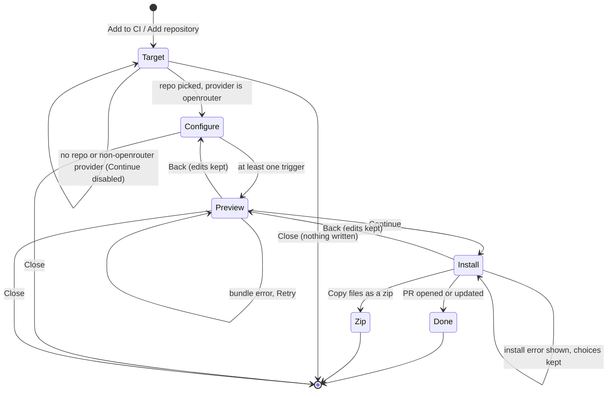
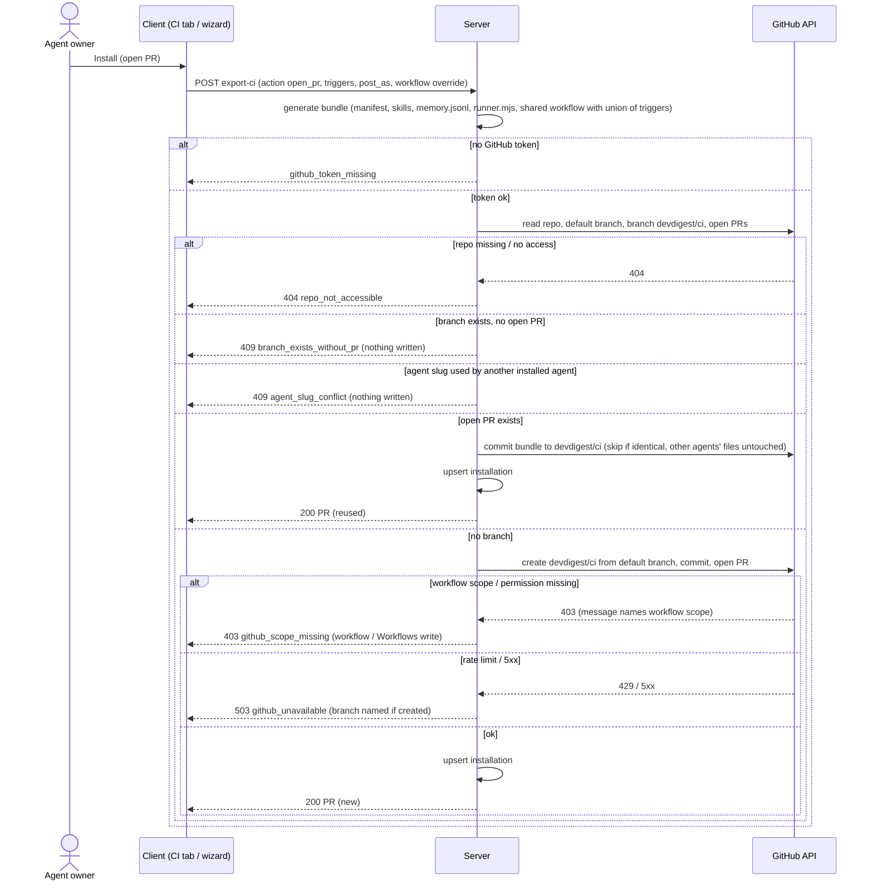
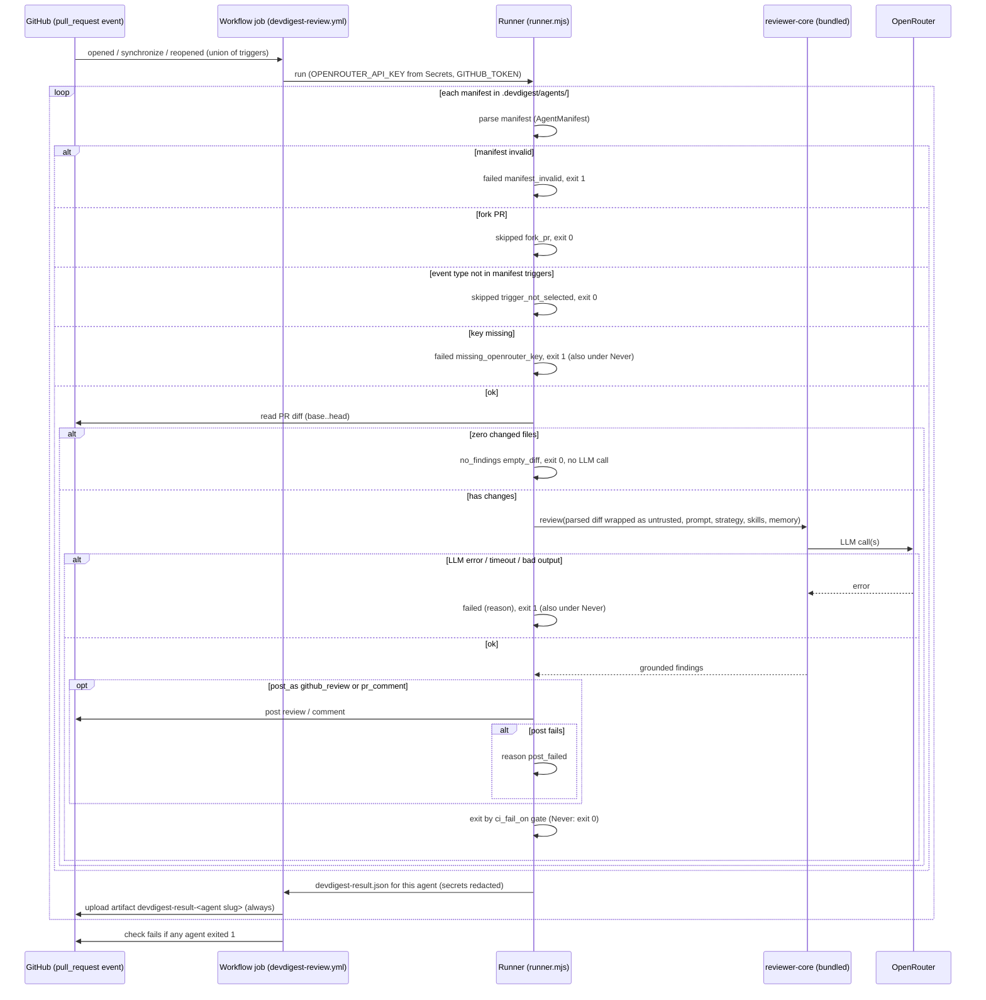
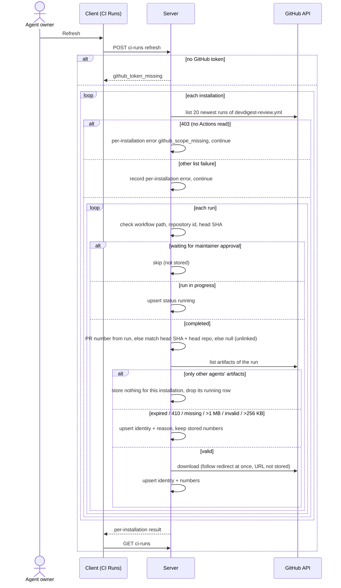
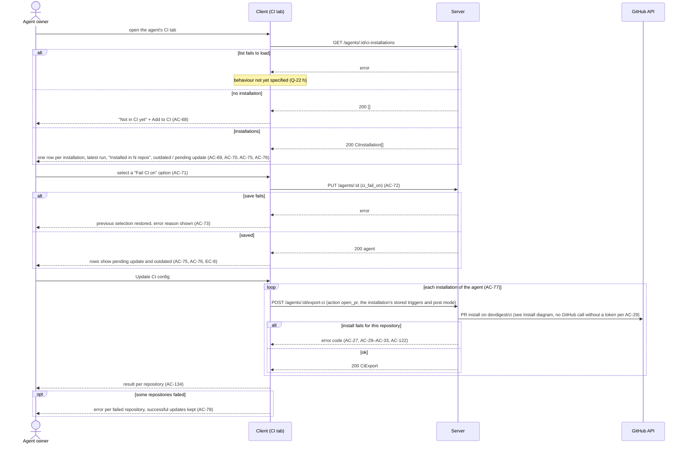

# Spec: Export to CI — run a tuned agent on pull requests through GitHub Actions
Spec ID: 2026-10-09-export-to-ci
Status: approved
Supersedes: none
Modules: server, client, reviewer-core, CI runner (new standalone package, Q-6)

## Problem and user

An agent owner tunes a review agent in the studio: prompt, model, skills and the CI gate `ci_fail_on` (`server/src/vendor/shared/contracts/knowledge.ts:643-657`). Today the agent runs only when someone opens the studio and starts a review by hand. Teammates who never open the studio get nothing. A PR can be merged without the agent ever seeing it.

The pieces for CI exist, but nothing connects them:
- Contracts `CiTarget`, `CiFile`, `AgentManifest`, `CiExportInput`, `CiInstallation`, `CiExport`, `CiRunStatus`, `CiRun` and `CiResultArtifact` (`server/src/vendor/shared/contracts/eval-ci.ts:354-464`).
- Tables `ci_installations` and `ci_runs` (`server/src/db/schema/ci.ts:4-26`).
- The deterministic gate and the GitHub payload builder in reviewer-core (`reviewer-core/src/output/to-review.ts:37`, `:148`).
- UI strings for a wizard and a CI Runs page (`client/messages/en/ci.json:1-120`).

There is no route, no CI tab and no runner (inference: `rg "export-ci|CiRun|CiExport"` finds them only in the two `vendor/shared` copies). The agent editor says the CI tab "belongs to later lessons" (`client/src/app/agents/[id]/_components/AgentEditor/AgentEditor.tsx:2`).

What this costs the user today:
- The agent never runs on PRs where nobody opened the studio.
- They have to write and maintain a workflow file by hand.
- They cannot see in the studio what the agent did in CI.

## Goals / Non-goals

Goals:
- A four-step wizard on the agent's CI tab: Target (pick a repository), Configure, Preview, Install. It exports the agent to one GitHub repository as a bundle of files:
  - the agent manifest `.devdigest/agents/<agent slug>.yaml` (`eval-ci.ts:373`);
  - one file per skill;
  - `memory.jsonl`;
  - a single-file runner;
  - the repository's one shared GitHub Actions workflow `.github/workflows/devdigest-review.yml`, which runs every agent exported to that repository (Q-9).
- The install writes only to the branch `devdigest/ci` and opens or updates one PR. It never writes to the default branch.
- In CI, the runner does five things for each exported agent:
  - reviews the PR diff with reviewer-core, including the grounding gate;
  - posts the result as a GitHub review, as a PR comment, or not at all;
  - writes `devdigest-result.json`;
  - uploads that file as an artifact;
  - exits non-zero according to `ci_fail_on`, and on any runner error (Q-11).
- The CI tab lists the repositories the agent is installed in. It shows each repo's latest run, an "outdated" flag and a "pending update" flag. It edits "Fail CI on" and re-exports through "Update CI config".
- A CI Runs page shows CI run rows. The rows are pulled from the GitHub API when the user clicks Refresh:
  - identity comes from the API;
  - numbers come from the artifact;
  - "—" plus a reason is shown when the artifact is unavailable.
- Security baked into the generated files and into ingest:
  - least-privilege workflow permissions;
  - actions pinned to commit SHAs;
  - the key only in GitHub Actions Secrets;
  - PR content treated as data;
  - validated, size-capped artifacts.

Non-goals:
- CircleCI, Jenkins and Generic CLI targets (user decision 5). The Target step shows only GitHub Actions.
- An inbound endpoint, a webhook, a POST from the runner to the studio, or auto-refresh of CI runs (user decisions 2 and Q9). The mock's "auto-refresh on" indicator (`docs/designs/eval-pipeline/jsx/screen_cizruns.jsx:26`) is not shown.
- Writing CI runs into the local runs store, or showing them in local run lists, the trace view or eval metrics (user decision 2).
- Per-agent workflow files. v1 uses one workflow file per repository for all agents (Q-9).
- Filter chips on the CI Runs page: date, agent, repo, status, source (`screen_cizruns.jsx:28-33`) [proposed] (Q-22).
- A "Trace" link for CI runs. A CI run has no studio trace; its row links to GitHub instead [proposed] (Q-22).
- Uninstalling or removing an agent from a repo inside the studio. The user deletes the files in the repo.
- "Block merge on findings" through a GitHub App (`client/messages/en/ci.json:63-64`). Blocking means "Fail CI on" plus a required status check, which the user sets in GitHub.
- Running a review with secrets on fork PRs, `pull_request_target`, or `workflow_dispatch`.
- Updating or deduplicating earlier review comments when a PR is pushed again. Every run posts a new review or comment.
- Project Context documents and repo-intel context in CI runs. The runner has no studio database or index.
- Backfilling CI runs older than the bounded window of one Refresh (AC-84).
- Detecting whether the setup PR was merged.
- Showing the PR title on the CI Runs page [proposed] (Q-15).
- An MCP tool for CI.
- Automated e2e of real GitHub or a real LLM (Q13).
- Bumping the pins of this repository's own workflows (they use `@v4`, RQ3). Only the generated workflow is pinned (AC-44); see *Handoff* in the spec report.

## User stories

- US-1 [must]: As an agent owner, I want to export my tuned agent to a GitHub repository through a wizard that opens a pull request, so that the agent reviews every PR there without anyone opening the studio.
- US-2 [must]: As an agent owner, I want to see every file before it is committed and edit the workflow, so that I know exactly what lands in my repository.
- US-3 [must]: As a repository maintainer, I want the CI job to review the PR diff with grounded findings, post the result the way I chose, and fail the check according to "Fail CI on", so that risky PRs are flagged where the team works.
- US-4 [must]: As an agent owner, I want the CI tab to show where the agent is installed, whether each install is behind the agent's current config, and to let me change "Fail CI on" and push an update, so that CI keeps matching what I tuned.
- US-5 [must]: As an agent owner, I want to see CI runs in the studio after Refresh, with real numbers or the reason they are missing, so that I can judge the agent in CI without invented data.
- US-6 [must]: As a workspace owner, I want the model key to stay in GitHub secrets and PR content to be unable to steer the workflow, the runner or ingest, so that exporting an agent opens no new attack path beyond the documented trust model.
- US-7 [should]: As a repository maintainer, I want each PR's CI review cost and time bounded, so that a burst of pushes cannot run up an unbounded bill.

## Acceptance criteria (EARS)

### Wizard (client)

- AC-1 [event, US-1, must, verify: unit] КОЛИ the user activates "Add to CI", the empty-state CTA or "Add repository" on the agent's CI tab, the client shall open the Export to CI wizard at step Target.
- AC-2 [ubiquitous, US-1, must, verify: unit] The wizard shall show its steps in the order Target, Configure, Preview, Install (user decision 6).
- AC-3 [ubiquitous, US-1, must, verify: unit] The Target step shall offer GitHub Actions as the only target, preselected.
- AC-4 [ubiquitous, US-1, must, verify: unit] The Target step shall offer the workspace's imported repositories as the only choices for the target repository [proposed] (Q-22).
- AC-5 [unwanted, US-1, must, verify: unit] ЯКЩО the workspace has no imported repository, ТОДІ the Target step shall show a message that a repository must be imported first, with a link to the repositories page, and keep Continue disabled.
- AC-6 [unwanted, US-1, must, verify: unit] ЯКЩО the agent's provider is not `openrouter`, ТОДІ the Target step shall show a message that CI runs use OpenRouter and the provider must be switched on the Config tab, and keep Continue disabled [proposed] (Q-16).
- AC-7 [ubiquitous, US-1, must, verify: unit] The Configure step shall show three trigger toggles `pull_request:opened`, `pull_request:synchronize` and `pull_request:reopened`, all on by default.
- AC-8 [unwanted, US-1, must, verify: unit] ЯКЩО no trigger is on, ТОДІ the Configure step shall keep Continue disabled and show a hint that at least one trigger is required.
- AC-9 [ubiquitous, US-1, must, verify: unit] The Configure step shall offer "Post results as" with the options GitHub review (default, marked recommended), PR comment and None (exit code only).
- AC-10 [event, US-2, must, verify: unit] КОЛИ the user continues from Configure to Preview, the client shall show the bundle's file list: the agent manifest `.devdigest/agents/<agent slug>.yaml`, one skill file per linked enabled skill, `.devdigest/memory.jsonl`, `.devdigest/runner.mjs` and the workflow file `.github/workflows/devdigest-review.yml` (Q-9).
- AC-11 [ubiquitous, US-2, must, verify: unit] The Preview step shall let the user edit the workflow file's contents. (Read-only display of the other files: AC-127.)
- AC-12 [state, US-2, must, verify: unit] ПОКИ the bundle request is in flight, the Preview step shall show a loading state and keep Continue disabled.
- AC-13 [unwanted, US-2, must, verify: unit] ЯКЩО the bundle request fails, ТОДІ the Preview step shall show the error reason with a Retry action and keep Continue disabled.
- AC-14 [event, US-2, must, verify: unit] КОЛИ the user moves between steps with Back or Continue, the client shall keep the edited workflow contents unchanged for the life of the wizard.
- AC-15 [event, US-2, must, verify: unit] КОЛИ the user changes triggers or "Post results as" after editing the workflow, the client shall ask for confirmation before it replaces the edited workflow with a regenerated one [proposed] (Q-22).
- AC-16 [event, US-1, must, verify: unit] КОЛИ the user closes the wizard before Install succeeds, the client shall discard the choices and edits without any request that writes to GitHub.
- AC-17 [ubiquitous, US-1, must, verify: unit] The Install step shall offer "Open a PR with these files" (default, marked recommended) and "Copy files as a zip". (The PR option's text: AC-128.)
- AC-18 [event, US-2, should, verify: unit] КОЛИ the user installs with "Copy files as a zip", the client shall download a zip that contains exactly the Preview files, including the edited workflow.
- AC-19 [ubiquitous, US-1, should, verify: integration] The zip install path shall record no installation and make no GitHub write [proposed] (Q-10).
- AC-20 [state, US-1, must, verify: unit] ПОКИ the install request is in flight, the wizard shall keep Install disabled and labelled "Installing…".
- AC-21 [event, US-1, must, verify: unit] КОЛИ the PR install succeeds, the wizard shall show a done state with a link to the PR and a checklist [proposed] (Q-22):
  - add `OPENROUTER_API_KEY` to the repository's Actions secrets;
  - merge the PR;
  - optionally make the check required to block merges;
  - use Refresh on CI Runs.
- AC-22 [unwanted, US-1, must, verify: unit] ЯКЩО the install request fails, ТОДІ the wizard shall stay on Install and show the server's error message, with a link to Settings when the error code is `github_token_missing` or `github_scope_missing`, keeping the user's choices and edits.

### Install (server ↔ GitHub)

- AC-23 [event, US-1, must, verify: integration] КОЛИ the server receives an install request and the repository has neither a branch `devdigest/ci` nor an open PR from it, the server shall open a PR titled "Add DevDigest CI review". The PR has these properties:
  - its head is a new branch `devdigest/ci`, created from the repository's default branch;
  - it carries the bundle in one commit;
  - its base is the default branch.
- AC-24 [ubiquitous, US-6, must, verify: integration] The server shall write to no branch other than `devdigest/ci` in the target repository (user decision 7).
- AC-25 [event, US-1, must, verify: integration] КОЛИ an open PR from `devdigest/ci` already exists, the server shall add one commit with the bundle to `devdigest/ci` and return that PR (Q5).
- AC-26 [unwanted, US-1, should, verify: integration] ЯКЩО the bundle equals the files at the head of `devdigest/ci`, ТОДІ the server shall add no commit and return the existing PR [proposed] (Q-22).
- AC-27 [unwanted, US-1, must, verify: integration] ЯКЩО the branch `devdigest/ci` exists without an open PR, ТОДІ the server shall respond `409` with error code `branch_exists_without_pr` and a message to delete the branch or open a PR from it, and write nothing (Q5).
- AC-28 [event, US-4, must, verify: integration] КОЛИ a PR install succeeds, the server shall store one installation per agent and repository. The installation holds the exported agent version, `ci_fail_on`, triggers, post mode, workflow path, PR URL and GitHub repository id. An existing installation for the same pair is updated instead of a new one being added.
- AC-29 [unwanted, US-1, must, verify: integration] ЯКЩО no GitHub token is configured, ТОДІ the server shall respond with error code `github_token_missing` and make no GitHub call (the client message is AC-22).
- AC-30 [unwanted, US-1, must, verify: integration] ЯКЩО GitHub refuses a write during the PR install with `403` and a message saying the token lacks the workflow scope or permission, ТОДІ the server shall respond `403` with error code `github_scope_missing` and a message that names the missing permission for both token kinds: classic PAT `workflow` (with `repo`), fine-grained PAT `Workflows: write` (RQ1, Q2). The condition is observable as a GitHub 403 whose message names the workflow scope or permission; the exact GitHub response is confirmed by AC-110.
- AC-31 [unwanted, US-1, must, verify: integration] ЯКЩО the repository does not exist or the token cannot access it, ТОДІ the server shall respond `404` with error code `repo_not_accessible`.
- AC-32 [unwanted, US-1, must, verify: integration] ЯКЩО GitHub responds with a rate limit or a 5xx, ТОДІ the server shall respond `503` with error code `github_unavailable`, record no installation and not retry automatically.
- AC-33 [unwanted, US-1, must, verify: integration] ЯКЩО a GitHub call fails after the branch was created but before the PR was opened, ТОДІ the server shall record no installation. (The error message naming the branch: AC-129.)
- AC-34 [unwanted, US-1, must, verify: integration] ЯКЩО the request's target is not `gha`, ТОДІ the server shall respond `422`.
- AC-35 [ubiquitous, US-6, must, verify: integration] The server shall generate every file path and every file content of the bundle itself, apart from the optional workflow replacement allowed by AC-130.
- AC-36 [unwanted, US-6, must, verify: integration] ЯКЩО the workflow replacement is empty or larger than 64 KB, ТОДІ the server shall respond `422` [proposed].
- AC-37 [event, US-2, must, verify: integration] КОЛИ the server receives a preview request (`action: files`), the server shall return the bundle without any GitHub call and without storing anything.

### Bundle content

- AC-38 [ubiquitous, US-3, must, verify: unit] The generated agent manifest shall validate against the `AgentManifest` schema. (Its fields: AC-131.)
- AC-39 [ubiquitous, US-3, must, verify: unit] The bundle shall contain one skill file for each enabled skill linked to the agent, in the agent's skill order, and no skill file when the agent has no linked enabled skill.
- AC-40 [ubiquitous, US-3, must, verify: unit] `.devdigest/memory.jsonl` shall hold one JSON object per line in the `MemoryItem` shape (`knowledge.ts:426-432`). The lines are the workspace memory items with scope `global` or with the target repository, newest first, at most 200. The file is empty when no such item exists (Q-7, accepted by user 2026-10-09).
- AC-41 [ubiquitous, US-3, must, verify: unit] `.devdigest/runner.mjs` shall be one prebuilt self-contained file that needs only Node.js ≥ 22 and no `npm install` in the target repository (user decision 4; root `AGENTS.md` Stack).
- AC-42 [ubiquitous, US-6, must, verify: unit] The generated workflow shall run only on the `pull_request` event with exactly the activity types defined by AC-119. (No `pull_request_target`: AC-132.)
- AC-43 [ubiquitous, US-6, must, verify: unit] The generated workflow shall declare the permissions `contents: read` and `pull-requests: write` and no other permission.
- AC-44 [ubiquitous, US-6, must, verify: unit] The generated workflow shall reference every action by its full 40-character commit SHA, with the version as a trailing comment (RQ3):
  - `actions/checkout` v7.0.1 → `3d3c42e5aac5ba805825da76410c181273ba90b1`;
  - `actions/setup-node` v7.1.0 → `949feb2413d6458794dcd2491c4babbbce0c15c1`;
  - `actions/upload-artifact` v7.0.2 → `cf430e030ddbb5b0abf93d22962f4752f3646cd9`.
- AC-45 [ubiquitous, US-7, must, verify: unit] The generated workflow shall declare a concurrency group per PR with cancel-in-progress, so that a newer run on the same PR cancels the older one (Q11).
- AC-46 [ubiquitous, US-7, must, verify: unit] The generated workflow shall limit the review job to 10 minutes [proposed] (Q11).
- AC-47 [ubiquitous, US-3, must, verify: unit] The generated workflow shall set up Node.js with `node-version: "22"` through the pinned `actions/setup-node` (RQ3: supported; the `ubuntu-24.04` runner preinstalls Node 22).
- AC-48 [ubiquitous, US-6, must, verify: unit] The generated workflow shall pass `OPENROUTER_API_KEY` to the runner step only from GitHub Actions Secrets.
- AC-49 [ubiquitous, US-5, must, verify: unit] The generated workflow shall upload each agent's `devdigest-result.json` as an artifact named `devdigest-result-<agent slug>`, including when the runner step fails (Q-9, Q-18).
- AC-50 [ubiquitous, US-6, must, verify: unit] The bundle shall contain no secret value from the studio's secrets store.
- AC-51 [ubiquitous, US-6, should, verify: unit] The setup PR body shall state the trust model (Q12):
  - anyone who can push a branch to the repository can change the workflow and the runner and read `OPENROUTER_API_KEY`;
  - fork PRs are skipped.

### Runner (in GitHub Actions)

- AC-52 [event, US-3, must, verify: unit] КОЛИ the runner starts, it shall parse the agent manifest with the same `AgentManifest` schema the studio uses to write it.
- AC-53 [unwanted, US-3, must, verify: unit] ЯКЩО the manifest fails validation, ТОДІ the runner shall end with status `failed`, reason `manifest_invalid` and exit code 1, without an LLM call.
- AC-54 [unwanted, US-6, must, verify: unit] ЯКЩО the PR's head repository differs from its base repository (a fork PR), ТОДІ the runner shall end with status `skipped`, reason `fork_pr` and exit code 0 (Q12; RQ4: fork runs get a read-only `GITHUB_TOKEN` and no secrets). (No LLM call: AC-143; no post: AC-144.)
- AC-55 [unwanted, US-3, must, verify: unit] ЯКЩО `OPENROUTER_API_KEY` is empty on a same-repository PR, ТОДІ the runner shall end with status `failed` and exit code 1. The reason is `missing_openrouter_key`, with a log message naming the secret to add. There is no LLM call (Q6).
- AC-56 [event, US-3, must, verify: unit] КОЛИ the runner reviews a PR, it shall pass the diff between the event's base and head commits to reviewer-core together with the manifest's prompt, model, strategy, skills and memory items. (Grounding gate: AC-133.)
- AC-57 [optional, US-3, must, verify: unit] ДЕ the post mode is `github_review`, the runner shall post one PR review with event `REQUEST_CHANGES` when the gate trips and `COMMENT` otherwise, with a non-empty body and inline comments on the grounded findings (`reviewer-core/src/output/to-review.ts:148`; RQ4: both events need a body). Whether the repository setting "Allow GitHub Actions to create and approve pull requests" affects these events is checked in the manual flow (Q-4).
- AC-58 [optional, US-3, must, verify: unit] ДЕ the post mode is `pr_comment`, the runner shall post one PR comment with the summary and the list of grounded findings.
- AC-59 [optional, US-3, must, verify: unit] ДЕ the post mode is `none`, the runner shall post nothing to the PR.
- AC-60 [event, US-3, must, verify: unit] КОЛИ the runner completes a review, the runner shall exit with the gate's exit code: 1 when the grounded findings trip the gate under the manifest's `ci_fail_on`, 0 when they do not (`reviewer-core/src/output/to-review.ts:37`).
- AC-61 [unwanted, US-3, must, verify: unit] ЯКЩО the LLM call fails, times out or returns output that cannot be parsed, ТОДІ the runner shall end with status `failed`, a reason naming the failure and exit code 1, whatever `ci_fail_on` says (Q-11).
- AC-62 [unwanted, US-3, should, verify: unit] ЯКЩО posting the result to the PR fails, ТОДІ the runner shall record reason `post_failed` in the result and still exit according to AC-60 (Q-21).
- AC-63 [ubiquitous, US-5, must, verify: unit] The runner shall write `devdigest-result.json` on every path that ends after start: completed, skipped and failed.
- AC-64 [ubiquitous, US-6, must, verify: unit] `devdigest-result.json` shall carry only these fields:
  - schema version, status, verdict;
  - finding counts per severity, cost, duration;
  - agent name, agent version, `ci_fail_on`;
  - a reason of at most 500 characters.

  (No identity and no finding text: AC-145.)
- AC-65 [ubiquitous, US-6, must, verify: unit] The runner shall replace the exact values of `OPENROUTER_API_KEY` and `GITHUB_TOKEN` with `***` in every log line, error message and result field it writes.
- AC-66 [ubiquitous, US-6, must, verify: unit] The runner shall give the PR diff, title, body, branch names and comments to the model only wrapped as untrusted data (`reviewer-core/src/prompt.ts:48`).
- AC-67 [ubiquitous, US-6, should, verify: unit] The runner shall give the model the skills that are not of source `manual` with the same untrusted-data framing the studio applies to them (`server/src/modules/reviews/run-executor.ts:500`) [proposed] (Q-14).

### CI tab (client)

- AC-68 [state, US-4, must, verify: unit] ПОКИ the agent has no installation, the CI tab shall show the empty state "Not in CI yet" with the "Add to CI" action.
- AC-69 [ubiquitous, US-4, must, verify: unit] The CI tab shall list one row per installation with these items:
  - the repository;
  - a "GitHub Actions" badge;
  - a link to the setup PR;
  - the status of the latest stored CI run for that agent and repository, as text plus icon, with its relative time;
  - "No runs yet" when no run is stored.
- AC-70 [ubiquitous, US-4, must, verify: unit] The CI tab header shall show the number of installations as "Installed in N repos" [proposed] (Q-22).
- AC-71 [ubiquitous, US-4, must, verify: unit] The CI tab shall show "Fail CI on" as a single-choice control with the options Critical, Warning+ and Never. They map to `critical`, `warning` and `never`, and the selected option is the agent's current `ci_fail_on` (Q7).
- AC-72 [event, US-4, must, verify: integration] КОЛИ the user selects a "Fail CI on" option, the client shall save it as the agent's `ci_fail_on` through the existing agent update route (`server/src/modules/agents/routes.ts:125`).
- AC-73 [unwanted, US-4, must, verify: unit] ЯКЩО saving "Fail CI on" fails, ТОДІ the CI tab shall restore the previous selection and show the error reason.
- AC-74 [unwanted, US-4, should, verify: unit] ЯКЩО the agent's stored `ci_fail_on` is `any`, ТОДІ the CI tab shall select no option and show the note "Any finding (set on the Config tab)" [proposed] (Q-8).
- AC-75 [state, US-4, must, verify: unit] ПОКИ an installation's exported `ci_fail_on` differs from the agent's current value, its row shall show "pending update" (Q7).
- AC-76 [state, US-4, must, verify: unit] ПОКИ an installation's exported agent version is lower than the agent's current version, its row shall show "outdated" (Q10).
- AC-77 [event, US-4, must, verify: integration] КОЛИ the user activates "Update CI config", the client shall run the PR install (AC-23–AC-28) for every installation of the agent. Each install uses that installation's stored triggers and post mode and the agent's current config. (Result per repository: AC-134.)
- AC-78 [unwanted, US-4, must, verify: unit] ЯКЩО "Update CI config" fails for some repositories, ТОДІ the CI tab shall show the error for each failed repository and keep the successful updates.

### CI Runs page and ingest

- AC-79 [ubiquitous, US-5, must, verify: unit] The studio shall have a "CI Runs" navigation entry. Its page lists the stored CI runs, newest `ran_at` first, at most 100 rows [proposed].
- AC-80 [ubiquitous, US-5, must, verify: unit] Each CI run row shall show these columns:
  - timestamp and repository;
  - PR number linked to the PR, with the short head SHA;
  - agent name with version;
  - source "GitHub Actions";
  - duration;
  - finding counts per severity, as icon plus number;
  - cost, verdict and status (text plus icon);
  - a "View on GitHub" link to the workflow run.
- AC-81 [state, US-5, must, verify: unit] ПОКИ no CI run is stored, the CI Runs page shall show "No CI runs yet" with an action that opens the agents list.
- AC-82 [event, US-5, must, verify: integration] КОЛИ the user activates Refresh, the client shall request one synchronous sync of every installation and reload the list when the sync returns (Q9).
- AC-83 [state, US-5, must, verify: unit] ПОКИ a Refresh is in flight, the page shall keep Refresh disabled and labelled "Refreshing…", and keep the existing rows visible.
- AC-84 [event, US-5, must, verify: integration] КОЛИ the server syncs an installation, it shall read at most the 20 newest workflow runs of `.github/workflows/devdigest-review.yml` in the installed repository [proposed] (Q-12). (Keyed storage: AC-135; missing `run_attempt`: AC-136.)
- AC-85 [ubiquitous, US-5, must, verify: integration] The server shall take each CI run's identity and timing from the GitHub API: run id, attempt, head SHA, head repository, run URL, start and end time, and the PR number per AC-95 and AC-114 (RQ2). (Findings, verdict and cost: AC-137.)
- AC-86 [ubiquitous, US-5, must, verify: integration] The server shall derive each CI run's status as follows:
  - a run that is queued or in progress → `running`;
  - an artifact with status `skipped` → `skipped`;
  - a successful run with zero findings → `no_findings`;
  - any other successful run → `succeeded`;
  - a cancelled run → `cancelled`;
  - any other conclusion → `failed`.
- AC-87 [unwanted, US-6, must, verify: integration] ЯКЩО a workflow run's workflow path differs from the installation's workflow path, or its repository id differs from the installed repository id, ТОДІ the server shall ignore that run.
- AC-88 [unwanted, US-6, must, verify: integration] ЯКЩО a run's head SHA is not a 40-character hexadecimal string, ТОДІ the server shall ignore that run.
- AC-89 [unwanted, US-6, must, verify: integration] ЯКЩО the artifact archive is larger than 1 MB, ТОДІ the server shall not download it [proposed] (Q-12). (Stored reason: AC-138.) This cap is dev-digest's own limit; GitHub documents no per-artifact size limit (RQ2).
- AC-90 [ubiquitous, US-6, must, verify: integration] The server shall read only the entry `devdigest-result.json` from the artifact archive [proposed] (Q-12). (256 KB read cap: AC-139; stored reason: AC-140.)
- AC-91 [unwanted, US-6, must, verify: integration] ЯКЩО the artifact entry is not valid JSON or fails the `CiResultArtifact` schema, ТОДІ the server shall store the run with null findings, verdict and cost and reason `artifact_invalid`.
- AC-92 [unwanted, US-5, must, verify: integration] ЯКЩО a completed run's artifact for the installation's agent is listed with `expired: true`, or the run lists no `devdigest-result-*` artifact at all, ТОДІ the server shall store null findings, verdict and cost with reason `artifact_expired` for the expired case and `artifact_missing` for the absent case (RQ2: `expired` is a required boolean on the artifact object; default retention 90 days).
- AC-93 [unwanted, US-5, must, verify: integration] ЯКЩО a run already has stored artifact numbers and its artifact later becomes unavailable, ТОДІ the server shall keep the stored numbers.
- AC-94 [unwanted, US-5, must, verify: unit] ЯКЩО a CI run's findings, verdict or cost are null, ТОДІ its row shall show "—" in those cells, with the stored unavailability reason as visible text when one exists. (A null PR number is shown per AC-115.)
- AC-95 [unwanted, US-5, must, verify: integration] ЯКЩО GitHub reports an empty or null PR list for a workflow run (as it does for fork-PR runs, RQ2), ТОДІ the server shall take the PR number from the repository's pull request whose head SHA and head repository equal the run's.
- AC-96 [unwanted, US-5, must, verify: integration] ЯКЩО syncing one installation fails, ТОДІ the server shall keep the runs stored for the other installations and return the error code per failed installation.
- AC-97 [unwanted, US-5, must, verify: unit] ЯКЩО Refresh returns errors for some installations, ТОДІ the page shall show each failed repository with its error reason.
- AC-98 [unwanted, US-5, must, verify: integration] ЯКЩО no GitHub token is configured when Refresh runs, ТОДІ the server shall respond with error code `github_token_missing` and change no stored CI run.
- AC-99 [ubiquitous, US-5, must, verify: integration] The server shall store CI runs separately from local agent runs, so that a CI run never appears in local run lists, run traces or eval metrics (user decision 2).
- AC-100 [unwanted, US-5, should, verify: unit] ЯКЩО a CI run's installation or agent no longer exists, ТОДІ its row shall show "—" in the agent cell and keep the other cells.
- AC-101 [ubiquitous, US-5, should, verify: unit] Repository and agent names longer than their column shall be cut with an ellipsis, with the full value available as the element's accessible name.

### Appended (one-response splits)

- AC-102 [unwanted, US-5, must, verify: unit] ЯКЩО Refresh returns `github_token_missing`, ТОДІ the CI Runs page shall show a message that a GitHub token is required, with a link to Settings.
- AC-103 [ubiquitous, US-6, must, verify: unit] No `run:` line of the generated workflow shall contain an expression that expands PR-controlled data: title, body, branch names, comments or commit messages.

### Appended (revision 2026-10-09: Q-6, Q-7, Q-9, Q-11, RQ1–RQ5)

- AC-104 [complex, US-3, must, verify: unit] ПОКИ the agent's `ci_fail_on` is `never`, КОЛИ the runner ends with status `failed` (missing key, LLM failure, timeout or unparseable output), the runner shall exit with code 1 (Q-11).
- AC-105 [optional, US-3, must, verify: unit] ДЕ the manifest's `ci_fail_on` is `never`, the runner shall exit with code 0 after a completed review, whatever the grounded findings are (Q-11).
- AC-106 [unwanted, US-7, should, verify: unit] ЯКЩО the PR diff contains zero changed files, ТОДІ the runner shall make no LLM call [proposed] (RQ5: reviewer-core does not short-circuit an empty diff; Q-5).
- AC-107 [unwanted, US-3, should, verify: unit] ЯКЩО the PR diff contains zero changed files, ТОДІ the runner shall end with status `no_findings`, reason `empty_diff` and exit code 0 [proposed] (Q-5).
- AC-108 [unwanted, US-3, could, verify: unit] ЯКЩО the PR diff contains zero changed files, ТОДІ the runner shall post nothing to the PR [proposed] (Q-5).
- AC-109 [ubiquitous, US-3, must, verify: unit] The runner shall give reviewer-core a parsed diff equal to the one the studio's diff parsing produces from the same raw unified diff (`server/src/adapters/git/diff-parser.ts:14`), checked on shared diff fixtures (RQ5).
- AC-110 [unwanted, US-1, must, verify: manual — needs real GitHub tokens on a throwaway repository] ЯКЩО the PR install runs with a classic PAT that has `repo` without `workflow`, or with a fine-grained PAT that lacks `Workflows: write`, ТОДІ the server shall respond `403 github_scope_missing` naming that permission; the GitHub status and body this detection relies on are [pending RQ1 empirical test] (Q-19).
- AC-111 [unwanted, US-5, must, verify: integration] ЯКЩО GitHub refuses to list workflow runs or artifacts, or to download an artifact, with `403` during a sync, ТОДІ the server shall report error code `github_scope_missing` for that installation with a message naming classic `repo` and fine-grained `Actions: read` (RQ1).
- AC-112 [ubiquitous, US-6, must, verify: integration] The server shall follow an artifact download's redirect at once (RQ2: the URL expires after 1 minute). (Never stored or logged: AC-141.)
- AC-113 [unwanted, US-5, must, verify: integration] ЯКЩО an artifact download returns `410 Gone`, ТОДІ the server shall store reason `artifact_expired` for that run and continue syncing that installation (RQ2).
- AC-114 [unwanted, US-5, must, verify: integration] ЯКЩО no pull request of the repository matches the run's head SHA and head repository (AC-95), ТОДІ the server shall store the run with a null PR number.
- AC-115 [unwanted, US-5, must, verify: unit] ЯКЩО a CI run's PR number is null, ТОДІ its row shall show "unlinked" in the PR cell, with the short head SHA (RQ2).
- AC-116 [unwanted, US-5, should, verify: integration] ЯКЩО a workflow run is waiting for maintainer approval (first-time contributor), ТОДІ the server shall not store it, so it is never shown as `failed` [proposed]; the API field that signals this state is [pending RQ2-detail] (Q-20).
- AC-117 [ubiquitous, US-1, must, verify: unit] The bundle's workflow file path shall be `.github/workflows/devdigest-review.yml` for every agent exported to any repository (Q-9).
- AC-118 [ubiquitous, US-3, must, verify: unit] The generated workflow shall run the runner for every agent manifest under `.devdigest/agents/` in the repository (Q-9).
- AC-119 [ubiquitous, US-1, must, verify: integration] The generated workflow's `pull_request` activity types shall be the union of the triggers stored for all installations in the target repository, including the one being installed (Q-18).
- AC-120 [unwanted, US-3, must, verify: unit] ЯКЩО the event's activity type is not among an agent's manifest triggers, ТОДІ the runner shall end that agent with status `skipped`, reason `trigger_not_selected` and exit code 0, without an LLM call (Q-18).
- AC-121 [unwanted, US-3, must, verify: unit] ЯКЩО at least one agent's runner result in a workflow run exits with code 1, ТОДІ the CI check shall fail (Q-18). (The pass case: AC-142.)
- AC-122 [unwanted, US-1, must, verify: integration] ЯКЩО another agent already installed in the target repository has the same agent slug, ТОДІ the server shall respond `409` with error code `agent_slug_conflict` and write nothing (Q-18).
- AC-123 [event, US-5, must, verify: integration] КОЛИ a completed run carries a `devdigest-result-*` artifact for some agent but none for an installation's agent, the server shall store no run for that installation (Q-18).
- AC-124 [event, US-5, should, verify: integration] КОЛИ a run that was stored as `running` for an installation completes without an artifact for that installation's agent while other agents' artifacts exist, the server shall delete that `running` row (Q-18).
- AC-125 [ubiquitous, US-1, must, verify: integration] The PR install shall leave every file of other agents under `.devdigest/agents/` on `devdigest/ci` unchanged (Q-9).
- AC-126 [ubiquitous, US-1, should, verify: unit] The Install step shall list the token permissions the PR install and Refresh need: classic PAT `repo` and `workflow`; fine-grained PAT `Contents: write`, `Workflows: write`, `Pull requests: write` and `Actions: read` (RQ1) [proposed] (Q-22).

### Appended (revision 2026-10-09: one-response splits, round 2)

Each line below was split off an earlier AC with no change in behaviour; the source AC is named in brackets at the end.

- AC-127 [ubiquitous, US-2, must, verify: unit] The Preview step shall show every bundle file other than the workflow file read-only. (from AC-11)
- AC-128 [ubiquitous, US-1, must, verify: unit] The Install step's "Open a PR with these files" option shall name the target repository, the branch `devdigest/ci` and the number of files. (from AC-17)
- AC-129 [unwanted, US-1, must, verify: integration] ЯКЩО a GitHub call fails after the branch was created but before the PR was opened, ТОДІ the server's error message shall name the branch `devdigest/ci` that was left behind. (from AC-33)
- AC-130 [ubiquitous, US-6, must, verify: integration] The server shall accept no bundle file path or file content from the client other than an optional replacement for the workflow file's contents. (from AC-35)
- AC-131 [ubiquitous, US-3, must, verify: unit] The generated agent manifest shall carry the agent's name, model, system prompt, strategy (default `auto`, `eval-ci.ts:389`), skill slugs, `ci_fail_on`, post mode, triggers and agent version (Q10, Q-18). (from AC-38)
- AC-132 [ubiquitous, US-6, must, verify: unit] The generated workflow shall never use the `pull_request_target` event. (from AC-42)
- AC-133 [event, US-3, must, verify: unit] КОЛИ the runner reviews a PR, the runner shall drop every finding that fails the grounding gate before counting or posting findings (`reviewer-core/src/review/run.ts:248-249`). (from AC-56)
- AC-134 [event, US-4, must, verify: unit] КОЛИ "Update CI config" has finished for every installation, the CI tab shall show the result per repository. (from AC-77)
- AC-135 [event, US-5, must, verify: integration] КОЛИ the server syncs an installation, the server shall store each workflow run it read for that installation keyed by repository id, run id, run attempt and installation, so that a repeated sync updates the same row. (from AC-84)
- AC-136 [unwanted, US-5, must, verify: integration] ЯКЩО a workflow run object has no `run_attempt`, ТОДІ the server shall store that run as attempt 1 (RQ2: the field is optional). (from AC-84)
- AC-137 [ubiquitous, US-5, must, verify: integration] The server shall take each CI run's findings, verdict and cost only from the artifact. (from AC-85)
- AC-138 [unwanted, US-6, must, verify: integration] ЯКЩО the artifact archive is larger than 1 MB, ТОДІ the server shall store reason `artifact_too_large` for that run [proposed] (Q-12). (from AC-89)
- AC-139 [unwanted, US-6, must, verify: integration] ЯКЩО the decompressed `devdigest-result.json` entry exceeds 256 KB, ТОДІ the server shall stop reading it at 256 KB [proposed] (Q-12). (from AC-90)
- AC-140 [unwanted, US-6, must, verify: integration] ЯКЩО the decompressed `devdigest-result.json` entry exceeds 256 KB, ТОДІ the server shall store reason `artifact_too_large` for that run [proposed] (Q-12). (from AC-90)
- AC-141 [ubiquitous, US-6, must, verify: integration] The server shall keep an artifact download's redirect URL out of every stored record and every log line (RQ2). (from AC-112)
- AC-142 [event, US-3, must, verify: unit] КОЛИ every agent's runner result in a workflow run exits with code 0, the CI check shall pass (Q-18). (from AC-121)
- AC-143 [unwanted, US-6, must, verify: unit] ЯКЩО the PR's head repository differs from its base repository (a fork PR), ТОДІ the runner shall make no LLM call (Q12; RQ4). (from AC-54)
- AC-144 [unwanted, US-6, must, verify: unit] ЯКЩО the PR's head repository differs from its base repository (a fork PR), ТОДІ the runner shall post nothing to the PR (Q12; RQ4). (from AC-54)
- AC-145 [ubiquitous, US-6, must, verify: unit] `devdigest-result.json` shall carry no repository, PR or commit identity and no finding text. (from AC-64)

## Edge cases

UI state matrix (`ux-design-review`), every cell mapped:

| Screen / component | Default | Empty | Loading | Partial | Error | Degraded | No access / no token | First run | Long content | Stale |
|---|---|---|---|---|---|---|---|---|---|---|
| CI tab — installation list | AC-69, AC-70, AC-134 | AC-68 | n/a — data arrives with the agent page | AC-78 | AC-73, AC-78 | n/a — no LLM on this screen | AC-29, AC-30, AC-78 (through Update) | AC-68 | AC-101 | AC-75, AC-76 |
| CI tab — Fail CI on | AC-71 | n/a | AC-72 | n/a | AC-73 | n/a | n/a — local save | AC-74 | n/a | AC-75 |
| Wizard — Target | AC-3, AC-4 | AC-5 | n/a — repo list is local | n/a | AC-6 | n/a | AC-29 | AC-5 | AC-101 | n/a |
| Wizard — Configure | AC-7, AC-9 | AC-8 | n/a | n/a | AC-8 | n/a | n/a | AC-7 | n/a | AC-15 |
| Wizard — Preview | AC-10, AC-11, AC-127 | AC-39, AC-40 | AC-12 | n/a | AC-13 | n/a | n/a — preview makes no GitHub call (AC-37) | AC-10 | EC-17 | AC-14 |
| Wizard — Install | AC-17, AC-126, AC-128 | n/a | AC-20 | EC-9 | AC-22, AC-27, AC-30–AC-33, AC-122, AC-129 | AC-32 | AC-29, AC-30, AC-110 | AC-21 | n/a | n/a |
| CI Runs page | AC-79, AC-80 | AC-81 | AC-83 | AC-96, AC-97 | AC-97 | AC-94, AC-115 | AC-98, AC-102, AC-111 | AC-81 | AC-101 | AC-93, EC-7 |

- EC-1: Two agents are exported to the same repository. Both share `.github/workflows/devdigest-review.yml`; each has its own manifest and its own `devdigest-result-<agent slug>` artifact, so each run row is attributed to one installation, and both bundles land on the one `devdigest/ci` PR (→ AC-25, AC-117–AC-125; Q-9, Q-18).
- EC-2: The setup PR was merged and GitHub deleted `devdigest/ci` → the next install or "Update CI config" opens a new branch and PR (→ AC-23).
- EC-3: The setup PR was closed without merging and the branch kept → install fails without writing (→ AC-27).
- EC-4: The user changed the workflow in the repository after merging → "Update CI config" regenerates it. The overwrite is visible in the update PR's diff, and nothing reaches the default branch until the user merges (→ AC-24, AC-77; Q-13).
- EC-5: A workflow run is re-run in GitHub → each attempt is its own row (→ AC-84, AC-135).
- EC-6: Refresh runs while a CI job is still running → the row shows `running`. The next Refresh updates the same row (→ AC-84, AC-86, AC-135).
- EC-7: Refresh is clicked in two browser tabs at once → both syncs write the same keyed rows, with no duplicates (→ AC-84, AC-135).
- EC-8: "Fail CI on" is changed while a CI job runs → the job uses the committed manifest. The studio shows "pending update" until the next install (→ AC-75). The change also bumps the agent version, because every config field except `enabled` bumps it (`server/src/modules/agents/repository.ts:25`), so the row also shows "outdated" (→ AC-76).
- EC-9: Install is double-clicked or started in two tabs → the button is disabled in flight. A second request that reaches the server finds the open PR, and identical content adds no commit (→ AC-20, AC-25, AC-26).
- EC-10: The artifact expires after a successful ingest → stored numbers stay (→ AC-93).
- EC-11: The user removed the artifact upload step from the workflow → rows show "—" with reason `artifact_missing` (→ AC-92, AC-94).
- EC-12: A collaborator edits the runner to forge `devdigest-result.json` → ingest accepts it only within schema and size caps. This is an accepted risk of the documented trust model (→ AC-51, AC-89–AC-91, AC-138–AC-140; Q12).
- EC-13: A fork PR → `skipped`, no post, the check passes (→ AC-54, AC-86, AC-143, AC-144).
- EC-14: A PR whose diff has zero changed files → the runner makes no LLM call, ends `no_findings` with reason `empty_diff`, exit 0 and posts nothing (→ AC-106, AC-107, AC-108). A diff with files but no reviewable text lines goes to reviewer-core as usual (inference from RQ5: no short-circuit) (→ AC-56, AC-60).
- EC-15: Pushes in quick succession on one PR → the older run is cancelled and shown as `cancelled` (→ AC-45, AC-86).
- EC-16: An agent with no skills and an empty memory → the bundle has no skill files and an empty `memory.jsonl` (→ AC-39, AC-40).
- EC-17: A very long workflow edit → rejected above 64 KB (→ AC-36).
- EC-18: The token is rotated to one without access to an installed repository → that installation's sync reports `repo_not_accessible`, and other installations still sync (→ AC-96, AC-97).
- EC-19: An installation has more than 20 new runs since the last Refresh → only the 20 newest are fetched, and older ones are not backfilled (→ AC-84; Non-goal).
- EC-20: The agent is deleted after export → its CI runs stay, with "—" for the agent (→ AC-100).
- EC-21: A secret value appears in an LLM error message → it is replaced with `***` before it is logged or written (→ AC-65).
- EC-22: "Fail CI on" is Never and the LLM call times out, or the key is missing → the check fails; only findings are non-blocking under Never (→ AC-55, AC-61, AC-104; Q-11).
- EC-23: "Fail CI on" is Never and the review finds critical issues → the check passes and the review is still posted (→ AC-57, AC-105).
- EC-24: A fork-PR run comes back with an empty PR list → the PR is matched by head SHA and head repository; with no match the row shows "unlinked" (→ AC-95, AC-114, AC-115).
- EC-25: A first-time contributor's run waits for maintainer approval → it is not stored and never shows as `failed` (→ AC-116).
- EC-26: GitHub deletes artifacts after their retention (default 90 days; configurable 1–90 days for public and 1–400 days for private repositories, RQ2) → a run first synced after that shows "—" with `artifact_expired`; a run synced earlier keeps its numbers (→ AC-92, AC-93, AC-113).
- EC-27: The studio token lacks the workflow permission → install fails with `github_scope_missing` naming `workflow` / `Workflows: write`, and nothing is recorded (→ AC-30, AC-110). The token lacks Actions read → that installation's Refresh fails with `github_scope_missing` (→ AC-111).
- EC-28: Agent B is installed into a repository whose `devdigest/ci` PR already carries agent A → one commit adds B's files and the regenerated workflow; A's manifest is unchanged (→ AC-25, AC-119, AC-125).
- EC-29: Agent A selected `synchronize`, agent B did not; a push arrives → A reviews, B ends `skipped` with `trigger_not_selected` (→ AC-119, AC-120).
- EC-30: A run object has no `run_attempt` → it is stored as attempt 1 (→ AC-136).
- EC-31: Posting the review fails (for example a repository setting refuses reviews from `GITHUB_TOKEN`) → the result carries `post_failed` and the check follows the gate (→ AC-62; Q-4, Q-21).
- EC-32: Two different studio agents would get the same slug in one repository → install fails with `agent_slug_conflict` (→ AC-122).

## Non-functional requirements

- NFR-1 [Performance, verify: integration] The preview request (`action: files`) shall respond within p95 ≤ 1 s for an agent with ≤ 10 skills and ≤ 200 memory items on the seeded DB [proposed].
- NFR-2 [Performance, verify: manual — needs real GitHub latency] A Refresh over 5 installations shall finish within 30 s [proposed].
- NFR-3 [LLM cost, verify: unit] Preview, install, Refresh and the CI tab shall make 0 LLM calls. A CI run shall make the calls reviewer-core's strategy needs for the manifest's model (1 call for single-pass) and none for a fork PR, a missing key, an invalid manifest, an empty diff or an unselected trigger. The model is the manifest's `model`, not a studio feature-model setting.
- NFR-4 [Limits, verify: integration] The limits are 20 runs per installation per Refresh, 100 rows on the CI Runs page, 1 MB for the artifact archive (dev-digest's own cap, RQ2), 256 KB for the decompressed result, 64 KB for the workflow edit, 200 memory items, a 500-character result reason and a 10-minute job timeout. The behaviour beyond each limit is in AC-36, AC-40, AC-46, AC-64, AC-79, AC-84, AC-89, AC-90 and AC-138–AC-140 [proposed] (Q-12).
- NFR-5 [Reliability, verify: integration] Ingest shall be idempotent per (repository id, run id, attempt, installation), and a re-install with identical content shall add no commit. Installations and CI runs shall survive a server restart. GitHub calls shall not be retried automatically.
- NFR-6 [Security, verify: unit, integration] Every input in *Untrusted inputs* shall be handled as stated there. The workflow shall follow AC-42–AC-44, AC-48, AC-103 and AC-132.
- NFR-7 [Accessibility, verify: manual — keyboard walk-through] The wizard shall meet these checks:
  - it is fully operable by keyboard;
  - focus stays inside the open wizard and returns to the opening button on close;
  - the step indicator exposes the current step to assistive technology;
  - "Fail CI on" and the trigger toggles are announced with their checked state;
  - targets are ≥ 24 × 24 CSS px (WCAG 2.1.1, 2.4.3, 2.4.7, 2.5.8, 4.1.2).
- NFR-8 [Accessibility, verify: unit] Run status, severity counts and the outdated and pending flags shall carry text or an icon label, never colour alone (WCAG 1.4.1). Refresh, install and update results shall be announced as status messages without moving focus (WCAG 4.1.3).
- NFR-9 [Observability, verify: integration] The server shall log each install and each Refresh with the agent id, repository, outcome, error code and number of runs stored. It shall never log a token, a key, an artifact redirect URL, artifact contents or a diff.
- NFR-10 [Observability, verify: unit] The runner shall log the grounding summary, finding counts, status and exit code per agent. It shall never log the diff, the prompt or a secret value.
- NFR-11 [Compatibility, verify: integration] Existing agents, local runs and the agent update route shall behave as before. New stored installation and CI run fields need a manually run migration (root `AGENTS.md`, "Migrations do not run on boot").
- NFR-12 [i18n, verify: unit] Every user-visible string of the CI tab, the wizard and the CI Runs page shall come from `client/messages/en/ci.json`.

## Workflow and module communication

Wizard flow:

Install (PR path):

CI run (in the target repository):

Refresh ingest:

CI tab (installation list, "Fail CI on", "Update CI config"):

## Contracts

Consumers: the only in-repo consumers of these shapes are the two `vendor/shared` copies (inference: `rg "CiRun|CiExport|export-ci"` outside `vendor/` finds nothing). `eval-ci.ts` is not mirrored into `mcp-server` (`server/INSIGHTS.md:33`), and no route uses these shapes yet. The new standalone CI runner package becomes a consumer of `AgentManifest` and a producer of `CiResultArtifact` (Q-6). So no change below breaks a deployed consumer. Both `vendor/shared` copies must change together (root `AGENTS.md`, `@devdigest/shared`).

| Shape / route | State | Wire shape (snake_case) | Breaking |
|---|---|---|---|
| `POST /agents/:id/export-ci` | new route (named in the contract comment `eval-ci.ts:398`; no route exists) | body `CiExportInput`; `200` `CiExport`; errors `github_token_missing`, `403 github_scope_missing`, `404 repo_not_accessible`, `409 branch_exists_without_pr`, `409 agent_slug_conflict`, `422` (validation, target ≠ `gha`, workflow override empty or > 64 KB), `503 github_unavailable` | no — new |
| `CiExportInput` | changed | One contract with an `action` field serves both calls. `action: "files"` is the preview and zip path with no side effect; `action: "open_pr"` is the install. Fields: `repo` string `owner/name`; `target` (only `gha` accepted); `action` `files`\|`open_pr`; `post_as` `github_review`\|`pr_comment`\|`none`; `triggers` non-empty array of `opened`\|`synchronize`\|`reopened` (was free strings); `workflow_contents` string, nullable, optional (new; ≤ 64 KB). `base` is removed: the PR base is always the repository's default branch. | no in-repo consumer; narrowing `triggers` and removing `base` would break an outside caller (none known) |
| `CiExport` | changed | `installation` `CiInstallation` nullable (null for `files`); `files` `CiFile[]`; `pr_url` string nullable; `pr_number` int nullable (new); `pr_reused` boolean (new) | no consumer |
| `CiFile` | unchanged | `path`, `contents`, `editable` (true only for the workflow) | — |
| `CiTarget` | unchanged | the enum keeps four values; the server accepts only `gha` | — |
| `CiInstallation` | changed | existing fields, plus `agent_version` int, `ci_fail_on` `CiFailOn`, `post_as`, `triggers`, `workflow_path` string (always `.github/workflows/devdigest-review.yml`), `pr_url` string nullable, `outdated` boolean, `pending_update` boolean, `latest_run` `CiRun` nullable | additive; no consumer |
| `GET /agents/:id/ci-installations` | new | `200` `CiInstallation[]` | no — new |
| `PUT /agents/:id` (`ci_fail_on`) | unchanged | `server/src/modules/agents/routes.ts:125` | — |
| `CiFailOn` | unchanged | `never`\|`critical`\|`warning`\|`any` (`knowledge.ts:643`); the CI tab offers only three values (AC-71, AC-74) | — |
| `AgentManifest` | changed | existing fields (`strategy` default `auto`, `eval-ci.ts:389`), plus `agent_version` int (new), `post_as` (new, default `github_review`), `triggers` array of `opened`\|`synchronize`\|`reopened` (new, Q-18); whether skills need a trust marker is Q-14 | additive; the runner is a new consumer |
| `CiRunStatus` | changed | `succeeded`\|`failed`\|`no_findings`\|`running`, plus `skipped`\|`cancelled` (new) | widening an enum; no consumer |
| `CiRun` | changed | `id`; `ci_installation_id` nullable; `repo` string; `pr_number` int nullable (null = "unlinked"); `head_sha` string; `workflow_run_id` int; `run_attempt` int (1 when GitHub omits it); `ran_at` string nullable; `duration_s` number nullable; `status` `CiRunStatus` (was free string); `verdict` `Verdict` nullable; `findings_count`, `critical`, `warning`, `suggestion` int nullable; `cost_usd` number nullable; `agent` string nullable; `agent_version` int nullable; `github_url` string (run URL); `source` `"gha"` (shown as "GitHub Actions"); `unavailable_reason` `artifact_expired`\|`artifact_missing`\|`artifact_invalid`\|`artifact_too_large` nullable. Identity is unique per (repository id, `workflow_run_id`, `run_attempt`, `ci_installation_id`). | no consumer |
| `GET /ci-runs?limit=` | new | `200` `CiRun[]`, newest first, `limit` ≤ 100 | no — new |
| `POST /ci-runs/refresh` | new | `200` `{ results: [{ installation_id, repo, stored: int, error_code: string\|null }] }` (`error_code` includes `github_scope_missing`, `repo_not_accessible`, `github_unavailable`); error `github_token_missing` | no — new |
| `devdigest-result.json` (`CiResultArtifact`) | changed | `schema_version` int (new); `status` `succeeded`\|`no_findings`\|`failed`\|`skipped` (new); `verdict` `Verdict` nullable (new); `findings_count` int; `critical`/`warning`/`suggestion` int; `cost_usd` number nullable; `duration_ms` int; `agent` string; `agent_version` int nullable; `ci_fail_on` (new); `reason` string ≤ 500 nullable (new; includes `fork_pr`, `trigger_not_selected`, `empty_diff`, `missing_openrouter_key`, `manifest_invalid`, `post_failed`). `pr_number` and `version` are removed: identity comes from the API. One file per agent, uploaded as artifact `devdigest-result-<agent slug>`. | removing `pr_number` is breaking for a reader; there is none |

## Rollout and compatibility

- **Deviation from the requirement text.** The original requirement said CI runs are stored as local agent runs with `source='ci'`. That column exists: `server/src/db/schema/runs.ts:26`. The user chose to store CI runs in the separate CI-runs store (`ci_runs`, `server/src/db/schema/ci.ts:14`), with the Source column showing "GitHub Actions" (user decision 2). This feature never writes a local run with `source='ci'`.
- **Existing data.** `ci_installations` and `ci_runs` exist but are empty (inference: no writer exists). Storing the new installation and run fields needs a schema change and a manually run migration. No backfill.
- **Existing consumers.** None for the changed shapes (see *Contracts*). The agent update route is unchanged.
- **New package.** The CI runner is a new standalone top-level package with its own `AGENTS.md` (Q-6). Adding it changes the root `AGENTS.md` package list ("5 standalone packages") — a handoff, not part of this spec's write scope.
- **Flag.** None. The CI tab and the CI Runs nav entry appear after upgrade.
- **First use after upgrade.** The CI tab shows "Not in CI yet" (AC-68). CI Runs shows "No CI runs yet" (AC-81). An agent whose `ci_fail_on` is `any` (settable on the Config tab today) shows the AC-74 note.
- **GitHub side.**
  - The user must add `OPENROUTER_API_KEY` to the repository's Actions secrets and merge the setup PR (AC-21).
  - The studio's token needs (RQ1): classic PAT `repo` and `workflow`; fine-grained PAT `Contents: write`, `Workflows: write`, `Pull requests: write`, `Actions: read`. A token that worked for reviews before may lack `workflow` / `Workflows: write` (AC-30, AC-126).
  - Artifacts expire after the repository's retention (default 90 days, RQ2); runs synced later show `artifact_expired`.
  - The pinned action SHAs (AC-44) are a snapshot as of 2026-10-09; keeping them current is a handoff (Dependabot idea, RQ3), not a requirement.

## Inputs and provenance

- **Request.** "Export to CI" — a tuned review agent is exported into a GitHub repository and runs on PRs via GitHub Actions. This is a minimal first version.
- **Designs:**
  - `1.png`/`2.png` and `content.png` (CI tab):
    - CI deployment header, "Active in N repos" (reworded, AC-70);
    - "Fail CI on" Critical / Warning + / Never;
    - repo rows, Update CI config, Add to CI, Add repository.
  - `3.png`: the Target step. Only GitHub Actions kept.
  - `4.png`: the Preview file list and editable workflow:
    - `runner.mjs` added (decision 4);
    - the design's `node-version: 20` is replaced by 22 (AC-47);
    - the unpinned `@v4` actions are replaced by SHAs (AC-44);
    - the single `devdigest-review.yml` file name is kept (Q-9).
  - `5.png`: Configure triggers and post modes, plus the "To block merges" note. `reopened` is drawn off; it is on by default per `eval-ci.ts:405` (AC-7).
  - `6.png`: Install options and the PR title "Add DevDigest CI review".
  - `docs/designs/eval-pipeline/jsx/screen_agents.jsx:121-160` (CITab), `screen_cizruns.jsx:18-60` (CI Runs), `data2.jsx:108-114` (source = CI target name).
- **User decisions 1–9** in this session (one spec; pull ingest into `ci_runs`; minimal runner; `runner.mjs` committed; GitHub Actions only; wizard order and editing; `devdigest/ci` only; defaults Q2/Q5/Q6/Q7/Q9/Q10/Q11/Q12/Q13; security rules).
- **User answers (2026-10-09):**
  - Q-6 → the runner is a new standalone package (Modules line; *Rollout*).
  - Q-7 → `memory.jsonl` definition accepted as proposed (AC-40).
  - Q-9 → one workflow file `.github/workflows/devdigest-review.yml` for all agents in a repository; manifests stay at `.devdigest/agents/<slug>.yaml`; per-agent workflow files are a Non-goal (AC-10, AC-42, AC-49, AC-84, AC-117, AC-118, AC-125). The multi-agent mechanics that follow from it are AC-49, AC-119–AC-124 and AC-142 (Q-18).
  - Q-18 → all agents of a repository run in one workflow as written in AC-49, AC-119–AC-124 (resolved by user 2026-10-09; `[proposed]` dropped on those lines).
  - Q-21 → a failed review post does **not** fail the check; AC-62 stands (resolved by user 2026-10-09; `[proposed]` dropped).
  - Size → 126 AC / 32 EC approved as is by the user on 2026-10-09; no split into several specs. The later one-response splits (AC-127–AC-145) add IDs without adding behaviour.
  - Q-11 → a runner error (configuration, manifest, LLM) fails the check under every `ci_fail_on`, including Never; under Never only findings are non-blocking (AC-61, AC-104, AC-105, EC-22, EC-23).
  - Q-17 → session defaults Q2/Q5/Q6/Q7/Q9/Q10/Q11/Q12/Q13 confirmed by the user implicitly (no objection when the main session presented them).
- **Research:**
  - RQ1 → classic PAT needs `repo` + `workflow` to write under `.github/workflows/`; fine-grained needs `Contents: write` + `Workflows: write` (contents PUT and git refs create/update), `Pull requests: write` for the PR, `Actions: read` for runs and artifacts. The missing-scope response is a `403` whose message says the token cannot create or update a workflow without the workflow scope/permission — from community reports, not official docs (confidence medium); one unverified report of a `404` on git trees. Evidence: GitHub docs "Scopes for OAuth apps" and "Permissions required for fine-grained personal access tokens". → AC-30, AC-110, AC-111, AC-126, Q-19.
  - RQ2 → artifact retention default 90 days (public 1–90, private 1–400); artifact object has required `expired` boolean and nullable `expires_at`; download can return `410`; the zip download answers `302` with a URL valid for 1 minute; no per-artifact size limit documented; fork-PR runs report an empty `pull_requests` array (docs issue #22501), so PRs are matched by head SHA + head repository; `run_attempt` is optional; first-time contributor runs may wait for approval (field not confirmed). → AC-84, AC-85, AC-89, AC-92, AC-95, AC-112–AC-116, Q-20.
  - RQ3 → latest pins as of 2026-10-09 (checked via API tag refs): checkout v7.0.1 `3d3c42e5…`, setup-node v7.1.0 `949feb24…`, upload-artifact v7.0.2 `cf430e03…` (download-artifact v8.0.2 is not used by the generated workflow); `node-version: "22"` supported, `ubuntu-24.04` preinstalls Node 22. → AC-44, AC-47.
  - RQ4 → the review endpoint needs `pull-requests: write`; `COMMENT` and `REQUEST_CHANGES` require a body (high confidence); the effect of "Allow GitHub Actions to create and approve pull requests" on those events is undocumented (inference, manual check); fork runs get a read-only token and no secrets. → AC-54, AC-57, EC-31, Q-4.
  - RQ5 → `reviewPullRequest` needs `systemPrompt`, `model`, a parsed `diff` and `llm`; strategy defaults to `auto` with a 400-line map-reduce threshold; no I/O besides the LLM (`reviewer-core/src/review/run.ts:15-28`, `:31`, `:45-117`); the diff parser lives in the server (`server/src/adapters/git/diff-parser.ts:14`); an empty diff is not short-circuited; no bundling exists yet, so the runner's size is unknown. → AC-56, AC-106–AC-109, EC-14, Q-5.
- **Code and docs:**
  - `eval-ci.ts:354-464` (contracts), `:373` (manifest path `.devdigest/agents/<slug>.yaml`), `:389` (strategy default);
  - `knowledge.ts:643-657` (`CiFailOn`), `:426-432` (`MemoryItem`), `:627` (`Provider`);
  - `server/src/db/schema/ci.ts:4-26`, `runs.ts:26`, `knowledge.ts:20-41` (memory), `agents.ts:38-49` (agent versions);
  - `reviewer-core/src/index.ts:1-12` (the runner is a named consumer), `:82-84` (`OpenRouterProvider` for the CI runner);
  - `reviewer-core/src/output/to-review.ts:11-49` (deterministic gate), `review/run.ts:248` (grounding), `prompt.ts:48` (`wrapUntrusted`), `prompt.ts:164-165` (memory slot);
  - `reviewer-core/AGENTS.md` (memory slot unfed by the server — the runner feeds it, Q-7);
  - `server/src/vendor/shared/adapters.ts:140-143` (the GitHub port has `postReview` but no branch, commit, PR, workflow-run or artifact operations — inference: the port must grow);
  - `server/src/modules/settings/constants.ts:11-12` (`OPENROUTER_API_KEY`, `GITHUB_TOKEN`);
  - `client/messages/en/ci.json` (existing strings);
  - `server/INSIGHTS.md:33` (`eval-ci.ts` is not mirrored to mcp-server).
- **Still `[proposed]` and unconfirmed:**
  - pending Q-22: AC-4, AC-15, AC-21, AC-26, AC-70, AC-126, and the two Non-goals "filter chips" and "no Trace link";
  - pending Q-12 (numbers and artifact caps): AC-36, AC-46, AC-79, AC-84, AC-89, AC-90, AC-138–AC-140, NFR-1, NFR-2, NFR-4;
  - pending other questions: AC-6 (Q-16), AC-19 (Q-10), AC-67 (Q-14), AC-74 (Q-8), AC-106–AC-108 (Q-5), AC-116 (Q-20), the Non-goal "no PR title" (Q-15).
- **Still pending:** AC-110 [pending RQ1 empirical test] (Q-19); AC-116 [pending RQ2-detail] (Q-20).

## Untrusted inputs

| Input | Source | OWASP | Required handling |
|---|---|---|---|
| PR diff, title, body, branch names, comments, commit messages | PR author (any collaborator) | A05 Injection; ASI01 goal hijacking | They reach the model only as wrapped untrusted data (AC-66). They never appear in a workflow `run:` expression (AC-103). They are never logged by the runner (NFR-10). |
| LLM output (findings) | model | A05, ASI09 | Only grounded findings are counted or posted (AC-133). Text is posted to GitHub as Markdown and never executed. |
| Skills and memory items in the bundle | studio data | ASI01 | Non-manual skills are framed as untrusted (AC-67). Memory is capped at 200 items (AC-40). |
| Edited workflow contents | agent owner (client) | A08 Integrity | This is the only client-supplied file content. Paths are always server-generated, and the size is capped at 64 KB (AC-35, AC-36, AC-130). |
| `repo` field in the install request | client | A01 | It must match `owner/name`. The server acts only with the configured token's own access (AC-31). |
| Workflow-run metadata from the GitHub API | GitHub (run triggered by any collaborator) | A08 | The workflow path and repository id must match the installation, and the head SHA must be 40-hex (AC-87, AC-88). PR attribution uses head SHA + head repository, never PR-controlled text (AC-95, AC-114). |
| Artifact download redirect URL | GitHub API | A04, A09 | Followed at once, never stored or logged (AC-112, AC-141, NFR-9). |
| `devdigest-result.json` artifact | runner output — editable by any collaborator (trust model Q12) | A08, A06 | Download ≤ 1 MB, only the expected entry is read, ≤ 256 KB decompressed, `CiResultArtifact` schema validation, no identity taken from it, invalid data is stored as "—" plus a reason (AC-64, AC-85, AC-89–AC-91, AC-137–AC-140, AC-145). |
| Agent manifests in the repository | committed files, editable by collaborators | A08 | The runner validates each with `AgentManifest` and fails closed (AC-52, AC-53). |
| `OPENROUTER_API_KEY`, `GITHUB_TOKEN` | GitHub Secrets / Actions | A04, A09 | They are never in the bundle, manifest, artifact or logs. Exact values are redacted (AC-48, AC-50, AC-64, AC-65). Fork PRs get no review (AC-54, AC-143, AC-144). |
| Studio PAT | `~/.devdigest/secrets.json` | A04, A09 | It is never sent to the client, written to the repository or logged (NFR-9). |

## Traceability

| Story | AC | EC | NFR | Verify |
|---|---|---|---|---|
| US-1 | AC-1–AC-9, AC-16, AC-17, AC-19–AC-23, AC-25–AC-27, AC-29–AC-34, AC-110, AC-117, AC-119, AC-122, AC-125, AC-126, AC-128, AC-129 | EC-2, EC-3, EC-9, EC-27, EC-28, EC-32 | NFR-7, NFR-9, NFR-12 | unit, integration, manual |
| US-2 | AC-10–AC-15, AC-18, AC-37, AC-127 | EC-17 | NFR-1, NFR-4 | unit, integration |
| US-3 | AC-38–AC-41, AC-47, AC-52, AC-53, AC-55–AC-62, AC-104, AC-105, AC-107–AC-109, AC-118, AC-120, AC-121, AC-131, AC-133, AC-142 | EC-14, EC-16, EC-22, EC-23, EC-29, EC-31 | NFR-3, NFR-10 | unit |
| US-4 | AC-28, AC-68–AC-78, AC-134 | EC-4, EC-8 | NFR-8, NFR-11 | unit, integration |
| US-5 | AC-49, AC-63, AC-79–AC-86, AC-92–AC-102, AC-111, AC-113–AC-116, AC-123, AC-124, AC-135–AC-137 | EC-5, EC-6, EC-7, EC-10, EC-11, EC-18, EC-19, EC-20, EC-24, EC-25, EC-26, EC-30 | NFR-2, NFR-4, NFR-5, NFR-8 | unit, integration, manual |
| US-6 | AC-24, AC-35, AC-36, AC-42–AC-44, AC-48, AC-50, AC-51, AC-54, AC-64–AC-67, AC-87–AC-91, AC-103, AC-112, AC-130, AC-132, AC-138–AC-141, AC-143–AC-145 | EC-1, EC-12, EC-13, EC-21 | NFR-6, NFR-9, NFR-10 | unit, integration |
| US-7 | AC-45, AC-46, AC-106 | EC-15 | NFR-3, NFR-4 | unit |

Acceptance flow for the one manual end-to-end check (Q13):
1. Export an agent to a test repository.
2. Add the secret and merge the setup PR.
3. Open a PR with a seeded critical issue. The check fails under Critical and a `REQUEST_CHANGES` review is posted by `GITHUB_TOKEN`; record whether the repository setting "Allow GitHub Actions to create and approve pull requests" changes that (AC-57, Q-4).
4. Refresh CI Runs. The row shows the real counts.
5. Wait for artifact expiry, or delete the artifact, on a new run. The row shows "—" plus the reason.
6. Export a second agent to the same repository; one workflow file runs both, and each gets its own row (AC-117–AC-125).
7. Install with a classic PAT that has only `repo`, then with a fine-grained PAT without `Workflows: write`; record GitHub's status and body and check the `github_scope_missing` message (AC-110, Q-19).
8. Set "Fail CI on" to Never, remove the secret, push: the check fails (AC-104).

## Open questions

- Q-1: Which PAT scopes are needed, and what does GitHub return when the workflow scope is missing? — **resolved by RQ1**: classic `repo` + `workflow`; fine-grained `Contents: write`, `Workflows: write`, `Pull requests: write`, `Actions: read`; missing scope → `403` with a "without workflow scope/permission" message (AC-30, AC-111, AC-126). The empirical confirmation of the exact response is Q-19. — owner: for: researcher — blocking: no (resolved)
- Q-2: Artifact retention and expiry signal, fork-PR artifacts, PR number for fork runs — **resolved by RQ2** (AC-84, AC-85, AC-92, AC-95, AC-112–AC-115). The approval-waiting signal is Q-20. — owner: for: researcher — blocking: no (resolved)
- Q-3: Full SHAs of the pinned actions and the setup-node input for Node 22 — **resolved by RQ3** (AC-44, AC-47). Keeping the pins current is a handoff. — owner: for: researcher — blocking: no (resolved)
- Q-4: Does the repository setting "Allow GitHub Actions to create and approve pull requests" affect `COMMENT` / `REQUEST_CHANGES` reviews posted with `GITHUB_TOKEN`? RQ4 found the endpoint needs `pull-requests: write` and a body; the setting's effect is undocumented. Checked in the manual flow (step 3); a refused post follows AC-62. — owner: for: researcher — blocking: no
- Q-5: Partly resolved by RQ5 (inputs, empty-diff behaviour, strategy default). Still open: (a) the size of the bundled `runner.mjs` (no bundling exists yet); (b) confirm the proposed empty-diff behaviour — no LLM call, `no_findings` with `empty_diff`, exit 0, no post (AC-106–AC-108). — owner: for: researcher (a), user (b) — blocking: no
- Q-6: Runner location — **resolved by user**: a new standalone package; root `AGENTS.md` package list updated by handoff. — owner: user — blocking: no (resolved)
- Q-7: `memory.jsonl` definition — **resolved by user**: accepted as proposed on 2026-10-09 (AC-40). — owner: user — blocking: no (resolved)
- Q-8: How should "Fail CI on" handle an agent whose stored value is `any`? The proposal shows no selection plus a note (AC-74). — options (a) as proposed, (b) map `any` to Warning+ — owner: user — blocking: no
- Q-9: One workflow per agent vs one per repository — **resolved by user**: one `.github/workflows/devdigest-review.yml` for all agents; manifests at `.devdigest/agents/<slug>.yaml`. — owner: user — blocking: no (resolved)
- Q-10: The zip path records no installation, so its runs are not ingested (AC-19). Is that acceptable? — owner: user — blocking: no
- Q-11: Runner error under Never — **resolved by user**: the check fails; only findings are non-blocking under Never (AC-61, AC-104, AC-105). — owner: user — blocking: no (resolved)
- Q-12: Confirm the proposed numbers: 20 runs per installation per Refresh, 100 rows, 1 MB and 256 KB artifact caps, 64 KB workflow edit, 200 memory items, 10-minute timeout, and the NFR-1 and NFR-2 targets; also the artifact reading rules that carry those caps (AC-84, AC-89, AC-90, AC-138–AC-140, NFR-4). — owner: user — blocking: no
- Q-13: "Update CI config" regenerates the workflow from stored Configure choices, so earlier wizard edits are not kept (EC-4). With one shared workflow, this also drops edits made while exporting another agent. Is that acceptable for v1? — owner: user — blocking: no
- Q-14: Should non-manual skills keep their untrusted framing in CI (AC-67)? If so, the manifest or skill files must carry each skill's source. — options (a) yes, (b) treat all exported skills as trusted — owner: user — blocking: no
- Q-15: The CI Runs page shows the PR number and short SHA without the PR title. Is that acceptable? — owner: user — blocking: no
- Q-16: Agents whose provider is not `openrouter` are blocked from export (AC-6), because the only CI secret is `OPENROUTER_API_KEY`. Is that acceptable? — owner: user — blocking: no
- Q-17: Session defaults Q2/Q5/Q6/Q7/Q9/Q10/Q11/Q12/Q13 — **resolved**: confirmed by the user implicitly (no objection, 2026-10-09). — owner: user — blocking: no (resolved)
- Q-18: How does the single shared workflow serve several agents (follows from Q-9)? — **resolved by user 2026-10-09**: all agents of a repository run in one workflow as written; (a)–(e) accepted, `[proposed]` dropped on AC-49 and AC-119–AC-124; the pass case of (c) is AC-142. Original proposal: (a) the workflow's activity types are the union of all installations' triggers in the repo, and each manifest carries its own triggers so the runner skips an agent with `trigger_not_selected` (AC-119, AC-120); (b) one artifact per agent named `devdigest-result-<agent slug>` (AC-49); (c) the check fails when any agent exits 1 (AC-121); (d) a slug clash between two studio agents in one repo is refused with `409 agent_slug_conflict` (AC-122); (e) a run is attributed to an installation only through that agent's artifact, and a stale `running` row is deleted when the run completed without it (AC-123, AC-124). — owner: user — blocking: no (resolved)
- Q-19: Empirical check of RQ1: on a throwaway repository, record the status and body GitHub returns to (i) a classic PAT with only `repo` and (ii) a fine-grained PAT without `Workflows: write`, for a contents write under `.github/workflows/` and for the git-data commit flow (blob, tree, commit, ref update — including the reported `404` on trees). Governs AC-110 and the matching rule of AC-30. — owner: for: researcher (manual test) — blocking: no
- Q-20: Which workflow-run API field signals that a run is waiting for maintainer approval (first-time contributor)? Governs AC-116. — owner: for: researcher — blocking: no
- Q-21: Q-11 says runner errors fail the check; does a failed post (e.g. refused by a repository setting, Q-4) fail it too? — **resolved by user 2026-10-09**: option (a) — a failed review post does **not** fail the check; the check follows the gate, AC-62 stands and its `[proposed]` tag is dropped. — owner: user — blocking: no (resolved)
- Q-22: Confirm these proposed items, each now pending Q-22: (a) AC-4 — the Target step offers only the workspace's imported repositories; (b) AC-15 — confirm before a trigger or post-mode change regenerates an edited workflow; (c) AC-21 — the done-state checklist (add the secret, merge the PR, optionally require the check, use Refresh); (d) AC-26 — an identical bundle adds no commit and returns the existing PR; (e) AC-70 — the header text "Installed in N repos"; (f) AC-126 — the token-permission list on the Install step; (g) the two Non-goals "no filter chips on CI Runs" and "no Trace link for CI runs"; (h) not yet specified: what the CI tab shows while `GET /agents/:id/ci-installations` is loading and when it fails (the UI state matrix marks Loading `n/a — data arrives with the agent page`, but the list has its own route; see the CI tab diagram). — options: accept (a)–(g) as written and pick a behaviour for (h), or name changes — owner: user — blocking: no
