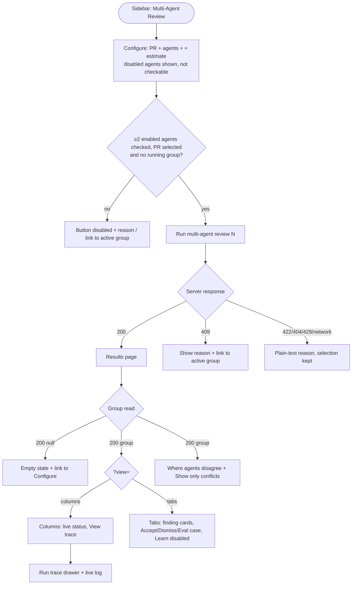
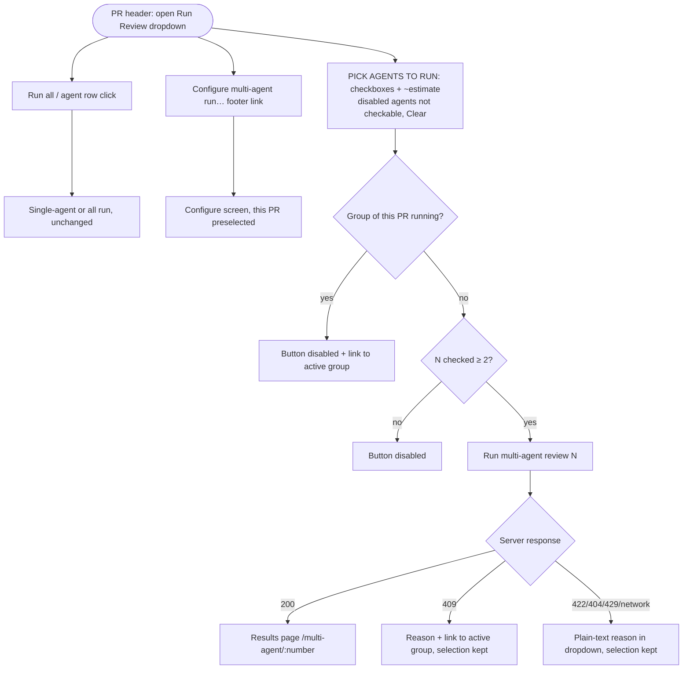
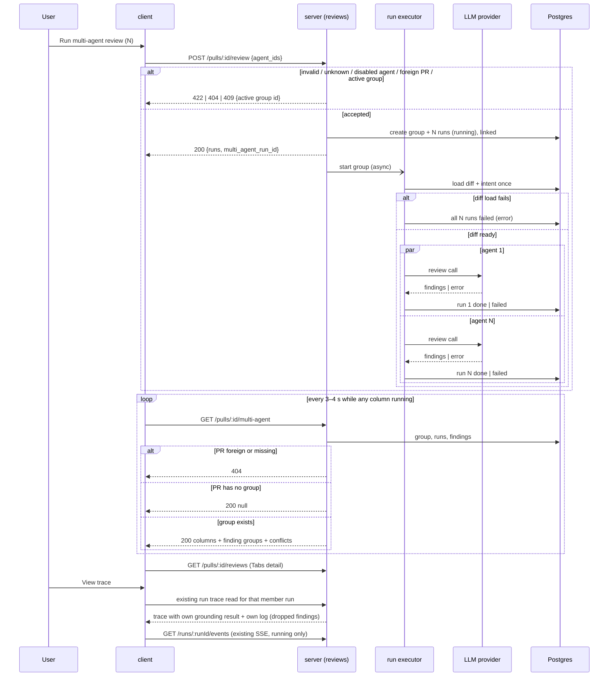
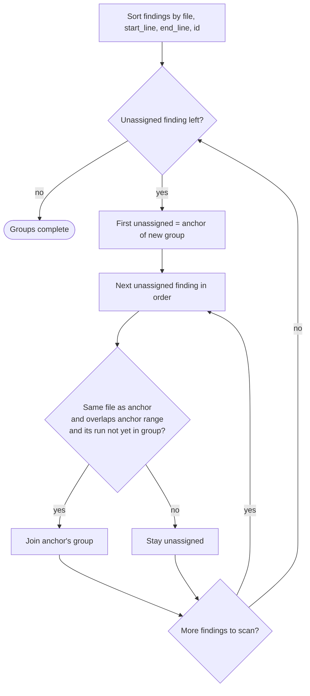
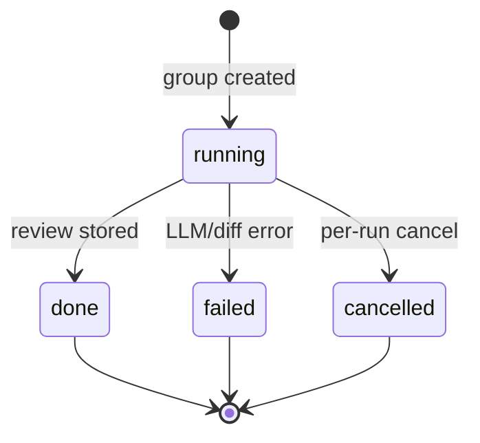

# Spec: Multi-Agent Review — parallel run of chosen agents on one PR, grouped findings, disagreements, live results
Spec ID: 2026-10-09-multi-agent-review
Status: implemented
Supersedes: none
Modules: server, client
Approval: Approved by user on 2026-10-09 (explicit approval after Pass 3 revisions)

## Problem and user

A reviewer who has several review agents (the seed ships General, Security and Performance plus two skill agents, `server/src/db/seed.ts:347-369`, `:493-501`) wants a PR reviewed by a chosen subset of them at once. They also want to see where those agents agree and where they disagree.

Today this is not possible:
- `POST /pulls/:id/review` accepts only one `agentId` or `all: true` (`server/src/vendor/shared/contracts/platform.ts:289-293`, `server/src/modules/reviews/routes.ts:47-73`). There is no way to pick a subset.
- The executor runs the agents one after another (`server/src/modules/reviews/run-executor.ts:203`). So a three-agent review takes about the sum of three run times.
- Runs started together are not linked. The `multi_agent_runs` table exists (`server/src/db/schema/runs.ts:43-51`), but no code writes it, and `agent_runs` has no reference to it (`server/src/db/schema/runs.ts:8-33`).
- Findings from different agents about the same lines show up as unrelated cards. Nothing shows that one agent flagged a location and another did not.
- No page shows the agents side by side. No estimate of time or cost is shown before an expensive N-agent run.

The cost today: the user runs agents one by one, waits for the sum of their durations, and compares the results by eye.

## Goals / Non-goals

Goals
- From a Configure screen, pick a PR and two or more enabled agents, see an estimate of time and cost based on past runs, and start them in one action.
- From the PR page's existing Run Review dropdown, check two or more enabled agents and start them as one group, with the existing single-agent and "Run all" actions unchanged.
- Run the chosen agents in parallel on one shared diff. One agent's failure must not cancel the others.
- Link the runs of one action into one group. Read the group's state back, including while it runs.
- Group similar findings with a fixed, deterministic anchor rule, and keep every original finding and its author unchanged.
- Show, for each code location, what each agent said, including "did not flag", with a "Show only conflicts" toggle.
- Show the results in two modes: Columns with live statuses, and Tabs with the full finding detail and actions.
- Record a manual measurement of one agent against three agents on the demo PR.

Non-goals
- Learn and Reply-to-author actions. Learn is shown only as a disabled "coming soon" stub. Reply is not shown. (Deviation D-1.)
- Semantic, embedding-based or LLM-based matching of findings.
- Transitive (chained) grouping of findings: a finding that overlaps only another member of a group, not its anchor, does not join that group (Q-4).
- Running a disabled agent as part of a group (Q-2). Disabled agents are visible in the picker but cannot be checked.
- An SSE stream for the group. The results page polls instead.
- A "PR changed since this run" stale banner.
- Retrying or re-running a single agent inside a group.
- An agent-count cap beyond the number of enabled agents in the workspace and the existing route rate limit (Q-3).
- Server-side truncation of finding text, paths, agent names or error text (Q-5a). Truncation is display-only.
- A stored snapshot of an agent's name on its runs. A deleted agent's column is labelled "Deleted agent" (Q-5b).
- A separate `multi-agent-run` route. The existing `MultiAgentRun` doc comment that mentions one (`server/src/vendor/shared/contracts/observability.ts:73`) is not a requirement.
- Grouping for `all: true` or single-agent runs. Those stay ungrouped.
- Cancelling a whole group in one action. Per-run cancel stays as it is today (`server/src/modules/reviews/routes.ts:157-161`).
- Tooling for the 1-vs-3 measurement, or tuning to reach any speed-up target.
- Changes to `ci/` or `agent-runner/`. Neither exists in this checkout.
- The "Review Agents" page with a logs toggle and a missing sidebar from the course brief. No such page exists in the code. The new results page fills that role.

## User stories

US-1 [must]: As a reviewer, I want to choose a PR and several agents and see an estimated time and cost before I start, so that I can decide whether the run is worth it.
US-2 [must]: As a reviewer, I want the chosen agents to run in parallel as one group, so that the review takes about as long as the slowest agent and one failure does not lose the other results.
US-3 [must]: As a reviewer, I want to watch each agent's status change while the group runs and open its trace, so that I know what is happening and can see tokens, cost and grounding decisions.
US-4 [must]: As a reviewer, I want similar findings from different agents grouped by location without losing who said what, so that I don't read the same issue three times.
US-5 [must]: As a reviewer, I want to see where agents disagree about a location, so that I can focus on contested code.
US-6 [must]: As a reviewer, I want to open each agent's findings with confidence and suggested fix, and Accept, Dismiss or turn them into eval cases, so that triage works the same as on the PR page.
US-7 [should]: As the course author, I want a recorded 1-agent vs 3-agent measurement on the demo PR, so that the parallel speed-up is shown with real numbers.

## Acceptance criteria (EARS)

Trigger and validation (server)

AC-1 [event, US-2, must, verify: integration] КОЛИ `POST /pulls/:id/review` receives `agent_ids` with 2 or more distinct ids of the workspace's enabled agents, the server shall create one multi-agent group for the PR with one run per distinct agent linked to that group.
AC-2 [unwanted, US-2, must, verify: integration] ЯКЩО `agent_ids` contains duplicate ids, ТОДІ the server shall start exactly one run per distinct id.
AC-3 [unwanted, US-2, must, verify: integration] ЯКЩО `agent_ids` contains a string id that is not an agent of the caller's workspace (an unknown id or an agent of another workspace), ТОДІ the server shall respond 422 with the plain-text reason "agent not found" — identical for unknown and foreign-workspace ids, and taking precedence over "agent is disabled" when the same request also contains a disabled agent's id (Q-8) — and shall start no run.
AC-4 [unwanted, US-2, must, verify: integration] ЯКЩО `agent_ids` contains a value that is not a string id, holds fewer than 2 distinct ids, or is sent together with `agentId` or `all`, ТОДІ the server shall respond 422 and shall start no run.
AC-5 [unwanted, US-2, must, verify: integration] ЯКЩО the PR in the path does not belong to the caller's workspace, ТОДІ the server shall respond 404 and shall start no run.
AC-6 [unwanted, US-2, must, verify: integration] ЯКЩО a request with `agent_ids` arrives while the PR's latest group still has a member run with status `running`, ТОДІ the server shall respond 409 with the active group's id in the error details and shall start no run.
AC-7 [ubiquitous, US-2, must, verify: integration] The server shall handle a `POST /pulls/:id/review` body with `agentId` or `all: true` as before this feature, with `multi_agent_run_id` returned as `null` and no group created.

Parallel execution (server)

AC-8 [event, US-2, must, verify: integration] КОЛИ a group starts, the server shall load the PR diff and derive the PR intent once, and shall start every member agent's run on that shared input without waiting for another member to finish.
AC-9 [unwanted, US-2, must, verify: integration] ЯКЩО one member run fails or is cancelled, ТОДІ the server shall let every other member run continue to its own final status.
AC-10 [unwanted, US-2, must, verify: integration] ЯКЩО loading the PR diff fails, ТОДІ the server shall mark every member run `failed` with the diff-load error text.
AC-11 [ubiquitous, US-3, must, verify: integration] The server shall keep each member run's trace and live event stream limited to that run's own agent events, plus the shared diff/intent steps, with no event of another member mixed in.

Group read (server)

AC-12 [event, US-3, must, verify: integration] КОЛИ the client requests `GET /pulls/:id/multi-agent` for a PR that has a group, the server shall return 200 with the PR's latest group, with one column per member run, giving status (`running` | `done` | `failed` | `cancelled`), `error`, duration, cost and findings.
AC-13 [ubiquitous, US-2, must, verify: unit] The server shall report the group's `total_duration_ms` as the maximum of its members' known durations (0 when none is known) and `total_cost_usd` as the sum of its members' known costs (`null` when none is known).
AC-14 [unwanted, US-3, must, verify: integration] ЯКЩО the PR in the path does not exist or belongs to another workspace, ТОДІ `GET /pulls/:id/multi-agent` shall respond 404.

Grouping and disagreement (server)

AC-15 [ubiquitous, US-4, must, verify: unit] The server shall add a finding to a finding group only when it is in the same file as the group's anchor, its line range `[start_line, end_line]` overlaps the anchor's range (a missing `end_line` counts as `start_line`), and no finding of the group comes from the same member run.
AC-16 [ubiquitous, US-4, must, verify: unit] The server shall build finding groups by the anchor rule of EC-6 — sort by (file, start_line, end_line, finding id); the first unassigned finding becomes the anchor; each later unassigned finding that passes AC-15 joins it; repeat until every finding is in exactly one group — so the same stored findings always give the same groups.
AC-17 [ubiquitous, US-4, must, verify: integration] The server shall build finding groups from references to finding ids only, leaving every original finding's text, severity, agent attribution and accept/dismiss state unchanged.
AC-18 [ubiquitous, US-5, must, verify: unit] The server shall return, for every finding group, one take per member run: that run's highest severity in the group if it flagged it, `ignored` if the run is `done` and did not flag it, or `no_result` if the run is `failed` or `cancelled`.
AC-19 [ubiquitous, US-5, must, verify: unit] The server shall mark a finding group as a conflict when at least one `done` member did not flag it, or when the flagging agents gave different severities. `no_result` takes do not count.

Configure screen (client)

AC-20 [event, US-1, must, verify: e2e] КОЛИ the user opens `/repos/:repoId/multi-agent`, the Configure screen shall show a PR selector for that repo and one checkbox per workspace agent.
AC-21 [ubiquitous, US-1, must, verify: unit] The Configure screen shall show per selected agent an estimate prefixed with "≈": the average `duration_ms` and average `cost_usd` over that agent's last 5 runs with status `done`.
AC-22 [unwanted, US-1, must, verify: unit] ЯКЩО a selected agent has no `done` run, ТОДІ the Configure screen shall show "no data" for that agent and shall leave it out of the totals.
AC-23 [ubiquitous, US-1, must, verify: unit] The Configure screen shall show the total estimate as the maximum of the selected agents' average durations and the sum of their average costs, both prefixed with "≈".
AC-24 [ubiquitous, US-1, must, verify: unit] The Configure screen shall label the start button "Run multi-agent review (N)", where N is the number of checked agents.
AC-25 [state, US-1, must, verify: unit] ПОКИ fewer than 2 agents are checked or no PR is selected, the Configure screen shall keep the start button disabled with a visible reason beside it (for 1 agent the reason points to Run Review on the PR page).
AC-26 [state, US-2, must, verify: e2e] ПОКИ the selected PR's latest group has a `running` member, the Configure screen shall disable the start button and shall link to that group's results page.
AC-27 [event, US-2, must, verify: e2e] КОЛИ the user starts a run, the client shall send the checked agent ids as `agent_ids` and shall open `/repos/:repoId/multi-agent/:number` for that PR.
AC-28 [unwanted, US-2, must, verify: unit] ЯКЩО the start request is rejected (409, 422, 404, 429 or network error), ТОДІ the Configure screen shall show the reason as plain text with the agent and PR selection kept.

Results page (client)

AC-29 [state, US-3, must, verify: e2e] ПОКИ any column of the shown group has status `running`, the results page shall re-read the group every 3–4 s, and shall stop once no column is `running`.
AC-30 [ubiquitous, US-3, must, verify: unit] The results page shall show each column's status as a text label plus an icon, never by colour alone.
AC-31 [event, US-3, must, verify: e2e] КОЛИ the user activates "View trace" on a column, the results page shall open the existing run trace drawer for that column's run.
AC-32 [ubiquitous, US-3, must, verify: unit] The results page shall offer a Columns mode and a Tabs mode, keep the mode in `?view=` and the selected agent tab in `?agent=` as that tab's member run id (`run_id`, not `agent_id`), and restore both after a reload.
AC-33 [ubiquitous, US-6, must, verify: e2e] In Tabs mode, the results page shall show the selected agent's full findings, read from the PR's existing reviews by run id, as the existing finding cards with confidence, suggested fix, Accept, Dismiss and Turn into eval case.
AC-34 [event, US-6, must, verify: unit] КОЛИ the user accepts or dismisses a finding on the results page, the client shall refresh the PR's reviews data and the group data, so the change shows in both modes.
AC-35 [ubiquitous, US-6, must, verify: unit] The results page shall show a Learn control on each finding as disabled with the text "coming soon", and shall show no Reply-to-author control.
AC-36 [ubiquitous, US-4, must, verify: unit] The results page shall show each finding group of 2 or more findings as one entry listing every member finding's agent name and original title, each openable to its original finding.
AC-37 [ubiquitous, US-5, must, verify: unit] The "Where agents disagree" block shall list per finding group its file and lines and one cell per member agent: severity, "did not flag" (for `ignored`) or "no result" (for `no_result`).
AC-38 [event, US-5, must, verify: unit] КОЛИ the user turns on "Show only conflicts", the block shall list only the finding groups marked as conflicts.
AC-39 [unwanted, US-5, must, verify: unit] ЯКЩО "Show only conflicts" is on and no group is a conflict, ТОДІ the block shall say that all agents agree, distinct from the empty state with no findings at all.
AC-40 [unwanted, US-3, must, verify: unit] ЯКЩО every member run ended `failed` or `cancelled`, ТОДІ the results page shall show a group-level "all agents failed" message with each column's error, and no disagreement block.
AC-41 [unwanted, US-3, must, verify: unit] ЯКЩО reading the group fails during polling, ТОДІ the results page shall keep the last data shown, display a plain-text error, and retry at the next poll.
AC-42 [event, US-3, must, verify: unit] КОЛИ the group read for the opened PR returns `null` (the PR has no group), the results page shall show an empty state with a link to the Configure screen.

Navigation and copy (client)

AC-43 [ubiquitous, US-1, must, verify: unit] The sidebar shall show one new GLOBAL section with one item "Multi-Agent Review" linking to the Configure screen of the current repo.
AC-44 [ubiquitous, US-2, must, verify: unit] The results page header shall describe the run as "parallel", not "fan-out via worktrees".

Measurement

AC-45 [event, US-7, should, verify: manual — needs a real LLM; a human checks the table] КОЛИ the feature is implemented, the implementer shall record in `docs/multi-agent-review-measurement.md` a table for the demo PR: 1 agent alone vs the same agent plus 2 others in one group, with wall time, per-run `duration_ms`, tokens in/out and `cost_usd` taken from the stored runs/traces, as measured, without tuning.

Added during write (single-response split)

AC-46 [unwanted, US-3, must, verify: unit] ЯКЩО a column's status is `failed`, ТОДІ the results page shall show that column's `error` as plain text.
AC-47 [state, US-3, must, verify: e2e] ПОКИ the run opened in the trace drawer has status `running`, the drawer shall show that run's live log stream.
AC-48 [unwanted, US-2, must, verify: unit] ЯКЩО the start request is rejected with 409, ТОДІ the Configure screen shall link to the active group's results page.
AC-49 [event, US-2, must, verify: integration] КОЛИ the server accepts a request with `agent_ids`, the server shall return 200 with the started runs and `multi_agent_run_id` set to the new group's id.

Added in revise pass 3 (Q-1..Q-5 resolved)

AC-50 [unwanted, US-2, must, verify: integration] ЯКЩО `agent_ids` contains the id of a disabled agent of the caller's workspace and every id in it is an agent of the caller's workspace, ТОДІ the server shall respond 422 with the plain-text reason "agent is disabled" and shall start no run (a request that also holds an unknown or foreign-workspace id gets "agent not found" instead, AC-3, Q-8).
AC-51 [event, US-3, must, verify: integration] КОЛИ the client requests `GET /pulls/:id/multi-agent` for a PR of the caller's workspace that has no group, the server shall respond 200 with the body `null`.
AC-52 [unwanted, US-3, must, verify: unit] ЯКЩО a column's agent no longer exists (`agent_id` is `null`), ТОДІ the results page shall label that column, its tab and its disagreement cells "Deleted agent" (the tab stays addressable as `?agent=<run_id>`, AC-32).
AC-53 [unwanted, US-3, must, verify: integration] ЯКЩО a member run's agent has been deleted, ТОДІ `GET /pulls/:id/multi-agent` shall still return that run's column, takes and findings, with `agent_id` and `agent_name` set to `null`.
AC-54 [ubiquitous, US-3, must, verify: unit] The results page, the Configure screen and the PR-page agent picker (AC-57) shall show finding titles, file paths, agent names and error text on one line ending in an ellipsis when they overflow, and shall show the full text when the user expands the item.
AC-55 [ubiquitous, US-3, must, verify: integration] The server shall return finding titles, file paths and run error text in `GET /pulls/:id/multi-agent` in full, without truncation.
AC-56 [ubiquitous, US-1, must, verify: unit] The Configure screen shall show each disabled agent with a disabled checkbox and the label "disabled", and shall not let the user check it.

Added in revise pass 3, fourth revision — PR-page agent picker (G1)

The PR-page agent picker is a section of the existing "Run Review" split-button dropdown in the PR header (`client/src/app/repos/[repoId]/pulls/[number]/_components/PrDetailHeader/PrDetailHeader.tsx:90`). Today that dropdown lists every agent as a click-to-run row with a "disabled" hint, plus "Run all" and "Configure agents" (`RunReviewDropdown.tsx:54-82`); it has no checkboxes yet.

AC-57 [event, US-1, must, verify: e2e] КОЛИ the user opens the Run Review dropdown on the PR page, the dropdown shall show, under the heading "PICK AGENTS TO RUN", a "Clear" control and one checkbox per workspace agent.
AC-58 [ubiquitous, US-1, must, verify: unit] The PR-page agent picker shall show beside each agent's checkbox that agent's estimated duration prefixed with "~" (for example "~6s"), using the same per-agent average `duration_ms` over the agent's last 5 `done` runs as AC-21, not a separately computed value.
AC-59 [unwanted, US-1, must, verify: unit] ЯКЩО an agent listed in the PR-page agent picker has no `done` run, ТОДІ the picker shall show "no data" in place of that agent's estimate (AC-22 rule).
AC-60 [ubiquitous, US-1, must, verify: unit] The PR-page agent picker shall show each disabled agent with a disabled checkbox and the label "disabled", and shall not let the user check it (AC-56 rule).
AC-61 [event, US-1, must, verify: unit] КОЛИ the user activates "Clear" in the PR-page agent picker, the picker shall uncheck every agent.
AC-62 [ubiquitous, US-1, must, verify: unit] The PR-page agent picker shall label its primary button "Run multi-agent review (N)", where N is the number of checked agents.
AC-63 [state, US-1, must, verify: unit] ПОКИ fewer than 2 agents are checked in the PR-page agent picker, the picker shall keep the "Run multi-agent review (N)" button disabled.
AC-64 [ubiquitous, US-2, must, verify: unit] The Run Review dropdown shall keep "Run all" and the per-agent single run (activating an agent's row outside its checkbox, disabled agents included) sending `all: true` or `agentId` exactly as before this feature.
AC-65 [event, US-1, must, verify: unit] КОЛИ the user checks or unchecks an agent in the PR-page agent picker, the dropdown shall change only the selection and shall start no run.
AC-66 [event, US-2, must, verify: e2e] КОЛИ the user activates "Run multi-agent review (N)" with N ≥ 2 in the PR-page agent picker, the client shall send the checked agent ids as `agent_ids` and shall open `/repos/:repoId/multi-agent/:number` for this PR (AC-27 rule).
AC-67 [event, US-1, must, verify: e2e] КОЛИ the user activates the picker's footer link "Configure multi-agent run…", the client shall open the Configure screen of the current repo with this PR preselected in its PR selector.
AC-68 [unwanted, US-2, must, verify: unit] ЯКЩО the start request from the PR-page agent picker is rejected (409, 422, 404, 429 or network error), ТОДІ the dropdown shall show the reason as plain text inside the dropdown with the checked agents kept (AC-28 rule).
AC-69 [unwanted, US-2, must, verify: unit] ЯКЩО the start request from the PR-page agent picker is rejected with 409, ТОДІ the dropdown shall link to the active group's results page (AC-48 rule).
AC-70 [state, US-2, must, verify: e2e] ПОКИ this PR's latest group has a `running` member, the PR-page agent picker shall disable "Run multi-agent review (N)" and shall link to that group's results page (AC-26 rule).
AC-71 [unwanted, US-1, must, verify: unit] ЯКЩО the Configure screen is opened with a preselected PR number that is not a PR of that repo, ТОДІ the Configure screen shall show no PR preselected.

Added in revise pass 3, fourth revision — grounding gate in the group trace (G3)

AC-72 [event, US-3, must, verify: integration (the member run's stored trace and run carry its own grounding result) + e2e (drawer shows it)] КОЛИ the user opens the trace drawer for a member run of a group, the drawer shall show that run's own grounding result as "N/M passed", as stored on that run (`agent_runs.grounding`).
AC-73 [event, US-3, must, verify: integration (the member run's stored log holds one dropped line per dropped finding, none from another member) + e2e (drawer shows the dropped-finding line)] КОЛИ the user opens the trace drawer for a member run of a group, the drawer shall show one log line per finding that run's grounding gate dropped, with the finding title and the drop reason, as recorded in that run's log.

## Edge cases

UI state matrix (`ux-design-review`):

| Screen / component | Default | Empty | Loading | Partial / streaming | Error | Degraded | No access / no token | First run | Long content | Stale |
|---|---|---|---|---|---|---|---|---|---|---|
| Configure — agent list + estimate | AC-20, AC-21, AC-56 | EC-1 | EC-2 | n/a | AC-28 | AC-22 | EC-3 | EC-1 | AC-54, EC-4 | n/a — out of scope (Non-goal) |
| Configure — start button | AC-24 | AC-25 | EC-2 | AC-26 | AC-28, EC-15 | n/a | EC-3 | AC-25 | n/a | n/a |
| Results — Columns | AC-12, AC-30 | AC-42, EC-5 | EC-2 | AC-29, AC-31 | AC-41, AC-40 | AC-40, EC-7, EC-12 | EC-3 | AC-42 | AC-54, EC-4 | n/a — out of scope (Non-goal) |
| Results — Tabs + detail | AC-33 | EC-5 | EC-2 | EC-8 | AC-41 | EC-7, EC-12 | EC-3 | AC-42 | AC-54, EC-4 | n/a — out of scope |
| Results — grouped findings | AC-36 | EC-5 | EC-2 | EC-8 | AC-41 | EC-7 | n/a | AC-42 | AC-54, EC-4 | n/a — out of scope |
| Where agents disagree | AC-37 | AC-39, EC-5 | EC-2 | EC-8 | AC-41 | AC-40, EC-12 | n/a | AC-42 | AC-54, EC-4 | n/a — out of scope |
| PR page — Run Review dropdown, agent picker | AC-57, AC-58, AC-60, AC-62, AC-64 | EC-18 | EC-2 | AC-70 | AC-68, AC-69, EC-19 | AC-59 | EC-3 | EC-18 | AC-54, EC-4 | n/a — out of scope (Non-goal) |

EC-1: Workspace has fewer than 2 enabled agents → Configure shows every agent (disabled ones with a disabled checkbox labelled "disabled"), a disabled start button, and a note that a group needs 2 enabled agents. (→ AC-25, AC-56)
EC-2: Group or agent data is loading → skeleton placeholders. The Configure start button stays disabled until agents and PRs are loaded; the PR-page "Run multi-agent review (N)" button stays disabled until agents are loaded. (→ AC-25, AC-63)
EC-3: No LLM key for an agent's provider → that member run fails with its error, the others continue. The column shows the error text. (→ AC-9, AC-46)
EC-4: Long agent names, file paths, titles or error text → the server returns them in full; the UI shows one line with an ellipsis and the full value on expand, never cut off without a way to read it. (→ AC-54, AC-55)
EC-5: A `done` agent returned 0 findings → its column shows "No findings" (not an error). It contributes `ignored` takes to every finding group. (→ AC-18, AC-30)
EC-6: Grouping algorithm. Findings of the group's runs are sorted by (file, start_line, end_line, finding id), with a missing `end_line` read as `start_line` and ids compared as strings. The first unassigned finding becomes the anchor of a new finding group. Every later unassigned finding, in sort order, joins that group when it is in the anchor's file, its range overlaps the anchor's range, and the group holds no finding from its member run. Findings that do not join stay unassigned. The loop repeats with the next unassigned finding as the anchor until none is left. A finding from the same run as a member, even if it overlaps the anchor, starts or joins a later group. A group's `start_line`/`end_line` is the minimum start and maximum end of its members. (→ AC-15, AC-16)
EC-7: Some members failed and others are done → done columns show findings. Failed columns show "no result" in the disagreement block and their error in the column. The conflict rule ignores them. (→ AC-9, AC-18, AC-19)
EC-8: Group still running → finding groups and disagreement are computed from the findings stored so far, and refresh on each poll. (→ AC-29)
EC-9: Double click on Start or a second tab → the second request gets 409 and the UI links to the active group. (→ AC-6, AC-48)
EC-10: The route rate limit (10/min) is exceeded → 429. The Configure screen shows the reason and keeps the selection. (→ AC-28)
EC-11: User cancels one member run through the existing per-run cancel → that column becomes `cancelled`, the others continue. (→ AC-9, AC-12)
EC-12: An agent is deleted after the group ran → its run, trace, review and findings are kept (the run's agent link is set to null on agent deletion, `server/src/db/schema/runs.ts:13`; a review's `agent_id` has no foreign key, `server/src/db/schema/reviews.ts:17`). The column, its tab and its takes are labelled "Deleted agent"; no name snapshot is shown. (→ AC-52, AC-53)
EC-13: Server restarts while a group is running → member runs are left in whatever status the existing run recovery gives them. The group shows those statuses and polling stops once none is `running`. (→ AC-29) (inference: same as today's single runs)
EC-14: Chain without transitivity. Different agents a, b, c; finding A (a) lines 1–5, B (b) lines 4–8, C (c) lines 7–10, same file. A is the anchor; B overlaps A and joins; C overlaps B but not A, so C is not in A's group and becomes the anchor of its own group. Result: {A, B} and {C}. A unit test asserts exactly these two groups. (→ AC-15, AC-16)
EC-15: A disabled agent's id is sent in `agent_ids` (stale page, hand-made request, or the agent was disabled after the page loaded) → 422 with the reason "agent is disabled", no run starts, and the Configure screen shows that reason as plain text with the selection kept. An unknown or foreign-workspace id instead gets "agent not found", the same text for both, so another workspace's agents are not revealed (D-9). (→ AC-50, AC-3, AC-28)
EC-16: `agent_ids` contains both a disabled agent's id and an unknown or foreign-workspace id → 422, no run starts, with the reason "agent not found": not-found takes precedence over disabled, because enabling the disabled agent alone would not make the request valid (Q-8 → a). The Configure screen shows that reason as plain text with the selection kept. (→ AC-3, AC-50, AC-28)
EC-17: Double click on "Run multi-agent review (N)" in the PR-page picker, or a group started for the same PR from another tab or from the Configure screen → the later request gets 409, and the dropdown shows the reason and links to the active group, with the checked agents kept. (→ AC-6, AC-68, AC-69)
EC-18: Workspace has fewer than 2 enabled agents, or no agents → the PR-page picker's "Run multi-agent review (N)" button stays disabled; with no agents at all the dropdown keeps its existing "No agents yet — create one" item (`RunReviewDropdown.tsx:61`). The single-agent run stays available. (→ AC-60, AC-63, AC-64)
EC-19: An agent checked in the PR-page picker is disabled (or deleted) after the dropdown loaded → the request gets 422 "agent is disabled" (or "agent not found"), no run starts, and the dropdown shows that reason as plain text with the checked agents kept. (→ AC-3, AC-50, AC-68)

## Non-functional requirements

NFR-1 [Performance, verify: manual — real LLM] For the 3-agent group on the demo PR, the group's wall time shall be recorded next to the sum of the three single-run durations (AC-45). No target ratio is set, by decision.
NFR-2 [Performance, verify: integration] `GET /pulls/:id/multi-agent` shall respond in p95 ≤ 300 ms for a group of 5 agents with ≤ 200 findings in total, on the seeded DB.
NFR-3 [LLM cost, verify: integration] A group request shall cost exactly one LLM review call per distinct agent, plus the PR intent derivation done once per group. The cost estimate is shown before the run (AC-21–AC-23).
NFR-4 [Limits, verify: integration] Group size has no separate cap: it is bounded by the number of enabled agents in the caller's workspace (a request can name at most that many distinct valid ids; AC-3, AC-50). `POST /pulls/:id/review` keeps its existing limit of 10 requests per minute (→ 429, EC-10). Finding text, paths and error text are not truncated by the server (AC-55); length is handled in the UI (AC-54).
NFR-5 [Reliability, verify: integration] Member runs are isolated: concurrent runs shall not share mutable per-run state (run log buffer, live event channel, per-run digests/counters). A test running 3 agents in parallel shall show each trace contains only its own agent's events (AC-11).
NFR-6 [Reliability, verify: integration] The 409 guard (AC-6) is the only dedupe. There is no automatic retry of a failed member.
NFR-7 [Security, verify: integration, unit] Untrusted inputs are handled as in *Untrusted inputs*.
NFR-8 [Accessibility, verify: manual + e2e] Every checkbox (on Configure and in the PR-page picker), the picker's "Clear" control, the conflicts toggle, the mode switch, the tabs and "View trace" are reachable and operable by keyboard in visual order with a visible focus ring. Disabled agent checkboxes expose their disabled state and the "disabled" label to assistive technology. Targets are ≥ 24×24 CSS px (WCAG 2.5.8). Status is never colour-only (1.4.1). Column status changes are announced through a polite `aria-live` region without moving focus (4.1.3). Tabs follow the WAI-ARIA tabs keyboard pattern. The expand control for truncated text is keyboard-operable.
NFR-9 [Observability, verify: integration] Each member run keeps its own trace with tokens, cost and grounding decisions, as today; for a group this is bound by AC-72 (grounding result) and AC-73 (dropped findings with reasons), and the group read does not carry it. Server logs record group id, member run ids and their final statuses. Logs never contain diffs, prompts or secrets in full.
NFR-10 [Compatibility, verify: integration] Existing `agent_runs` rows get no group link and behave as before. Single-agent and `all: true` requests, the MCP server's `triggerReview` and the PR page's existing Run all / single-agent actions are unchanged (AC-64). The new link from a run to a group is nullable, and deleting a group keeps its runs (link set to null). Deleting an agent keeps its runs and their group links (the run's agent link is already set to null, `server/src/db/schema/runs.ts:13`). The schema migration is generated by the project's tool and applied manually.
NFR-11 [i18n, verify: unit] All user-visible strings on Configure, results, the PR-page agent picker and the sidebar item (including "PICK AGENTS TO RUN", "Clear", "Configure multi-agent run…", "disabled", "no data" and "Deleted agent") come from `client/messages/en` catalogs.

## Workflow and module communication

User workflow:

PR-page agent picker (Run Review dropdown, AC-57–AC-70):

Module communication (start, run, poll):

The start sequence is the same when the request comes from the PR-page agent picker instead of the Configure screen (AC-66).

Finding grouping (anchor rule, EC-6):

Member run states:

## Contracts

`POST /pulls/:id/review` — **changed (additive, non-breaking)**
- Request body adds `agent_ids: string[]` (optional). The existing `agentId` (camelCase) and `all` stay. The case mismatch between `agentId` and `agent_ids` is deliberate (Deviation D-3).
- Exactly one of `agentId`, `all`, `agent_ids` may be present. `agent_ids` must hold ≥ 2 distinct ids (AC-4), each the id of an **enabled** agent of the caller's workspace (AC-1, AC-3, AC-50). When a request fails both checks, "agent not found" wins over "agent is disabled" (AC-3, EC-16, Q-8). Duplicates are collapsed (AC-2). There is no other size cap (NFR-4).
- Response 200 adds `multi_agent_run_id: string | null`. It is `null` for `agentId` / `all`.
- Errors for `agent_ids`, in the existing `ApiErrorBody` envelope (`error.message` carries the plain-text reason; `server/src/vendor/shared/contracts/platform.ts:296-301`):

  | Status | When | `error.message` | Details |
  |---|---|---|---|
  | 422 | value not a string id, fewer than 2 distinct ids, sent with `agentId`/`all` (AC-4) | not fixed by this spec | — |
  | 422 | id not an agent of the caller's workspace — unknown or another workspace's, same response for both (AC-3, D-9) | "agent not found" | — |
  | 422 | id of a disabled agent of the workspace (AC-50) | "agent is disabled" | — |
  | 422 | both a disabled and an unknown/foreign id (EC-16, Q-8) | "agent not found" (not-found takes precedence over disabled) | — |
  | 404 | PR not in the caller's workspace (AC-5) | not fixed by this spec | — |
  | 409 | a group of this PR still has a `running` member (AC-6) | not fixed by this spec | `details.multi_agent_run_id: string` |
  | 429 | route limit of 10 requests/min exceeded (existing) | existing | — |

- Existing behaviour stays: an unknown single `agentId` still gives 404 "Agent not found", and an empty body still gives 400 (`server/src/modules/reviews/service.ts`, `resolveTargets`). A disabled single `agentId` can still be run alone, as today (`client/src/app/repos/[repoId]/pulls/[number]/_components/RunReviewDropdown/RunReviewDropdown.tsx:51-53`).
- Consumers:
  - client (PR page Run Review);
  - MCP server `triggerReview` (`mcp-server/src/api/client.ts:46-50`), whose response schema `ReviewRunResponse` (`mcp-server/src/vendor/shared/contracts/review-api.ts:55-59`) ignores the extra field (inference: default Zod object parsing);
  - e2e seed flows.
- Not breaking.

`GET /pulls/:id/multi-agent` — **new**

| Status | When | Body |
|---|---|---|
| 200 | PR of the caller's workspace with ≥ 1 group (AC-12) | `MultiAgentRun` for the latest group |
| 200 | PR of the caller's workspace with no group (AC-51) | `null` |
| 404 | PR does not exist or belongs to another workspace (AC-14) | `ApiErrorBody` |

`MultiAgentRun` and nested types (`contracts/observability.ts`, both vendor copies) — **changed**. They have no consumers today (inference: no route returns them; `server/src/vendor/shared/contracts/observability.ts:73` names a route that does not exist), so the nullability changes below are not breaking for any caller.

| Type | Field | Change |
|---|---|---|
| `MultiAgentRun` | `total_duration_ms` | definition fixed: max of known member durations, 0 if none |
| `MultiAgentRun` | `total_cost_usd` | definition fixed: sum of known member costs, `null` if none |
| `MultiAgentRun` | `finding_groups: FindingGroup[]` | new |
| `AgentColumn` | `status` | adds `cancelled` |
| `AgentColumn` | `error: string \| null` | new |
| `AgentColumn` | `agent_id: string \| null` | was `string`; `null` when the agent was deleted (AC-53) |
| `AgentColumn` | `agent_name: string \| null` | was `string`; `null` when the agent was deleted (AC-53) |
| `AgentColumnFinding` | `end_line: number \| null` | new |
| `Conflict` | entries | one entry per finding group, not only contested ones |
| `Conflict` | `group_id: string`, `end_line: number`, `is_conflict: boolean` | new |
| `ConflictTake` | `run_id: string` | new — identifies the member run (stable when the agent is deleted) |
| `ConflictTake` | `agent_id: string \| null` | was `string`; `null` when the agent was deleted |
| `ConflictTake` | `verdict` | adds `no_result` |

- `FindingGroup` (new) = `{ id: string, file: string, start_line: number, end_line: number, finding_ids: string[], run_ids: string[] }`. `id` is stable for the same input; it is not persisted. `start_line`/`end_line` are the minimum start and maximum end of the members (EC-6). `run_ids` has no duplicates (AC-15).
- `Conflict` keeps `file`, `line` (= group start line) and `title` (the anchor's title), and `takes` has one entry per member run.
- `ConflictTake.note` is an empty string for `ignored` and `no_result` (no reason is given, Q-answer 8).
- All string fields (titles, paths, `error`) are returned in full (AC-55).

Results page URL state (client): `?view=columns|tabs` and `?agent=<run_id>`, where `<run_id>` is `AgentColumn.run_id` of a member of the shown group (already present, `server/src/vendor/shared/contracts/observability.ts:36`). Keying by run id keeps a deleted agent's tab (`agent_id` `null`) addressable (AC-32, AC-52).

Configure screen URL state (client) — **new**: the PR preselected from the PR-page footer link "Configure multi-agent run…" travels in the Configure screen's URL as the PR number, so a reload keeps it (AC-67). A value that is not a PR of the repo preselects nothing (AC-71).

Group trace: `GET /pulls/:id/multi-agent` does not carry grounding results or dropped-finding lines. The trace drawer reads them from the member run's existing trace (`RunStats.grounding`, `server/src/vendor/shared/contracts/trace.ts:66-74`; run summary `grounding`, `:150`) and its persisted log (AC-72, AC-73) — **unchanged**.

Estimate data: the spec fixes the behaviour (AC-21–AC-23, AC-58, AC-59) but not the read that feeds it. The Configure screen and the PR-page agent picker show the same per-agent average from one definition (last 5 `done` runs); the picker shows only the duration part. The existing `AgentStats.avg_*` fields (`server/src/vendor/shared/contracts/observability.ts:96-118`) are averaged over all runs, not the last 5 `done` runs (inference from their names). Any new read must be additive.

## Rollout and compatibility

- **DB:** one nullable link from `agent_runs` to `multi_agent_runs`, set to null when the group is deleted. Deleting an agent does not delete its runs: `agent_runs.agent_id` is already set to null on agent deletion (`server/src/db/schema/runs.ts:13`), so the run keeps its group link and shows as "Deleted agent". No agent-name snapshot is added. The migration is generated by drizzle-kit (never hand-named) and applied manually with `pnpm db:migrate`. Existing rows stay unlinked and never appear in a group.
- **API:** additive changes for existing consumers (see *Contracts*). The MCP server's logic needs no change.
- **PR page:** the Run Review dropdown gains the agent picker section (AC-57–AC-70); its existing Run all, single-agent rows and "Configure agents" item keep their behaviour (AC-64).
- **No flag.** The new sidebar section and the PR-page picker appear after upgrade.
- **First use:** the PR has no group, so the group read returns `null` and the results page shows the AC-42 empty state. Agents with no `done` run show "no data" in the estimate.
- **Shared contracts:** edited in both `server/src/vendor/shared` and `client/src/vendor/shared`, and checked by `scripts/check-shared-sync.sh`. The MCP server has its own copy of `platform.ts` (`mcp-server/src/vendor/shared/contracts/platform.ts:290`). The change is additive for MCP behaviour, but `scripts/check-shared-sync.sh` requires every file present in `mcp-server/src/vendor/shared/contracts/` to byte-match the server copy (`scripts/check-shared-sync.sh:68-87`), so if the server's `platform.ts` changes, the MCP copy of that one file must be re-copied unchanged from the server (see *Ownership, merge order and checks*).

## Inputs and provenance

- **Course brief (Part 2, worktree A), relayed by the main session:**
  - agent picker and Configure screen with an estimate from past runs, and the button "Run multi-agent review (N)";
  - parallel run via `POST /pulls/:id/review`;
  - `multi_agent_runs` grouping;
  - heuristic grouping of findings;
  - "Where agents disagree" block with a toggle;
  - Columns and Tabs modes;
  - reuse of LiveLogStream and RunTraceDrawer;
  - a 1-vs-3 measurement.
- **Designs:** described in Pass 1 only. This pass had no design file. The "fan-out via worktrees" header text and a "(0)" button state come from that description (Q-answers 15, 17).
- **User answers (binding), Q1–Q22 of Pass 1:**
  - 1 → one spec;
  - 2 → `agent_ids` on the existing route plus `GET /pulls/:id/multi-agent`;
  - 3 → Learn disabled, Reply hidden;
  - 4 → new results page, existing drawer;
  - 5 → parallel members, shared diff/intent, NFR-5;
  - 6 → nullable link, aggregates on read;
  - 7 → same file + overlapping lines, different agents, references only;
  - 8 → "did not flag" / "no result";
  - 9 → last 5 `done` runs, "no data", "≈";
  - 10 → polling every 3–4 s;
  - 11 → `?view=` and `?agent=`, existing finding cards, reviews refresh;
  - 12 → `error` and `cancelled` on `AgentColumn`;
  - 13 → one GLOBAL item and the two routes;
  - 14 → 409;
  - 15 → minimum of 2 agents, real count;
  - 16 → no extra cap;
  - 17 → "parallel";
  - 18 → manual measurement table;
  - 19 → validation, 422/404, plain text;
  - 20 → accessibility;
  - 21 → compatibility;
  - 22 → state matrix, stale banner out of scope.
- **User answers (binding), Pass 3 — former open questions Q-1..Q-5:** see *Resolved decisions* under *Open questions*. They confirm AC-14, AC-15, AC-16, EC-4, EC-6, EC-12 and add AC-50–AC-56, EC-14, EC-15.
- **User answers (binding), Pass 3 second revision — Q-6, Q-7:** Q-6 (b) distinct 422 reasons "agent is disabled" vs "agent not found", foreign ids answered like unknown ones (AC-3, AC-4, AC-50, EC-15, *Contracts*); Q-7 (a) `?agent=` keyed by member run id (AC-32, AC-52, *Contracts*, *Untrusted inputs*). Decision 11's "`?agent=`" is refined by Q-7.
- **User answers (binding), Pass 3 third revision — Q-8:** (a) "agent not found" takes precedence over "agent is disabled" for a request holding both kinds of invalid id (AC-3, AC-50, EC-16, *Contracts*).
- **User requests (binding), Pass 3 fourth revision — G1–G3 (coverage check against the course lab):**
  - G1 → PR-page agent picker in the existing Run Review dropdown: heading "PICK AGENTS TO RUN", "Clear", checkbox per agent with "~" estimate from the AC-21 read, disabled agents not checkable, "Run multi-agent review (N)" enabled at N ≥ 2, `agent_ids` + navigation as AC-27, footer "Configure agents…" with the PR preselected (label changed to "Configure multi-agent run…" per D-12), AC-28/AC-26/AC-48 error and running rules, single-agent behaviour unchanged (AC-57–AC-71, EC-17–EC-19, AC-54/EC-2/NFR-8/NFR-11 extended).
  - G2 → section *Ownership, merge order and checks*: owned paths, shared-contract rule, untouched areas, merge order, check commands from the package `AGENTS.md` files.
  - G3 → grounding result and dropped findings per member run in the trace (AC-72, AC-73; NFR-9 bound).
- **Code (fourth revision):**
  - the dropdown is mounted in the PR header: `client/src/app/repos/[repoId]/pulls/[number]/_components/PrDetailHeader/PrDetailHeader.tsx:90`;
  - the dropdown has no checkboxes today: agent rows run on click, "Run all", "Configure agents" → `/agents`, "No agents yet" item: `RunReviewDropdown.tsx:54-82`; pending state shown on the trigger: `:94`;
  - grounding result stored per run: `server/src/db/schema/runs.ts:28`; trace `RunStats.grounding`: `server/src/vendor/shared/contracts/trace.ts:66-74`; the drawer shows it: `client/src/app/repos/[repoId]/pulls/[number]/_components/RunTraceDrawer/_components/TraceBody/TraceBody.tsx:86`;
  - dropped-finding log lines are emitted per dropped finding with title and reason, then the summary: `reviewer-core/src/review/run.ts:250-254`; the drawer maps a persisted trace log into its log view: `client/src/app/repos/[repoId]/pulls/[number]/_components/RunTraceDrawer/helpers.ts:15`;
  - the shared-contract check also byte-compares the MCP server's mirrored subset, which includes `platform.ts`: `scripts/check-shared-sync.sh:68-87`, `mcp-server/src/vendor/shared/contracts/platform.ts`.
- **Code:**
  - sequential loop: `server/src/modules/reviews/run-executor.ts:203`;
  - shared diff/intent and fail-all: `:140-201`;
  - `RunRequest`: `server/src/vendor/shared/contracts/platform.ts:289-293`;
  - route with rate limit 10/min: `server/src/modules/reviews/routes.ts:47-73`;
  - per-run cancel: `server/src/modules/reviews/routes.ts:157-161`;
  - `multi_agent_runs`: `server/src/db/schema/runs.ts:43-51`;
  - `agent_runs` columns: `server/src/db/schema/runs.ts:8-33`; its agent link is `ON DELETE SET NULL`: `:13`;
  - `reviews.agent_id` / `run_id` without a foreign key: `server/src/db/schema/reviews.ts:17-19`;
  - agent delete route: `server/src/modules/agents/routes.ts:136-145`;
  - multi-agent contracts: `server/src/vendor/shared/contracts/observability.ts:19-86` (`AgentColumn.agent_id`/`agent_name` are non-null strings today, `:37-38`);
  - `AgentStats`: `:96-118`;
  - agent `enabled`: `server/src/db/schema/agents.ts:32`;
  - existing dropdown lists every agent and marks disabled ones "disabled", and lets a disabled agent run alone: `client/src/app/repos/[repoId]/pulls/[number]/_components/RunReviewDropdown/RunReviewDropdown.tsx:51-59`;
  - MCP consumer: `mcp-server/src/api/client.ts:46-50`;
  - drawer mount: `client/src/app/repos/[repoId]/pulls/[number]/page.tsx:18,225`.
- **Pass 1 facts relayed, not re-read this pass:**
  - LiveLogStream: `client/src/vendor/ui/LiveLogStream.tsx`;
  - the drawer is controlled by `?trace=`;
  - FindingCard actions;
  - `actOnFinding` supports only accept/dismiss;
  - grounding drops appear as log lines (`reviewer-core/src/review/run.ts:251-254`);
  - eval-pipeline lists Learn/Reply as non-goals (`docs/specs/2026-10-08-eval-pipeline.md:51`);
  - nav has no Multi-Agent item.
- **INSIGHTS:** no `server/INSIGHTS.md` or `client/INSIGHTS.md` entry covers parallel runs, RunBus or multi-agent behaviour (searched with `rg`).
- **Still `[proposed]`:** none.

## Untrusted inputs

| Input | Source | OWASP | Required handling |
|---|---|---|---|
| `agent_ids`, path `:id` | HTTP client | A01 Broken Access Control, A08 Integrity | Check each id is an enabled agent of the caller's workspace and the PR belongs to it. Dedupe. 422/404 before any run starts. No other body field is used (AC-1–AC-5, AC-50). |
| Group request volume | HTTP client | A06 Insecure Design (cost amplification: N LLM calls per request) | Group size is bounded by the workspace's enabled agent count. Keep the 10/min route limit. The 409 guard stops a second group on a PR while one runs. The estimate is shown before the run (AC-6, AC-23, NFR-4). |
| Finding titles, bodies, suggested fixes, summaries | LLM output (steered by PR content) | A05 Injection (XSS) | Render as text or through the existing finding card renderers. Never use `dangerouslySetInnerHTML`. Never treat it as markup (AC-33, AC-36, AC-37). |
| Run `error` text | Provider/LLM/Git error messages | A05 Injection, A09 Logging | Show as plain text, one line with ellipsis and full text on expand (AC-46, AC-54). Never echo secrets: keys are never part of the error text (existing behaviour, `server` secrets chokepoint). |
| File paths and line numbers in findings | LLM output, already grounded | A05 | Shown as text. Used only to compare ranges, never as a filesystem path (AC-15). |
| `?view=`, `?agent=` URL params | URL | A05 | Accept only `columns`/`tabs` and a `run_id` that is a member run of the shown group. Anything else falls back to the default (AC-32). |
| Preselected PR on the Configure screen URL | URL (from the PR-page footer link, or hand-edited) | A01, A05 | Accept only a PR number of the current repo; anything else preselects nothing (AC-71). It never starts a run by itself. |
| Dropped-finding titles and reasons in the trace log | LLM output (titles) and grounding gate text | A05 Injection (XSS) | Shown as plain log text in the existing log view, never as markup (AC-73). |

## Traceability

| Story | AC | EC | NFR | Verify |
|---|---|---|---|---|
| US-1 | AC-20, AC-21, AC-22, AC-23, AC-24, AC-25, AC-43, AC-56, AC-57, AC-58, AC-59, AC-60, AC-61, AC-62, AC-63, AC-65, AC-67, AC-71 | EC-1, EC-2, EC-18 | NFR-3, NFR-8, NFR-11 | unit, e2e |
| US-2 | AC-1, AC-2, AC-3, AC-4, AC-5, AC-6, AC-7, AC-8, AC-9, AC-10, AC-13, AC-26, AC-27, AC-28, AC-44, AC-48, AC-49, AC-50, AC-64, AC-66, AC-68, AC-69, AC-70 | EC-3, EC-9, EC-10, EC-11, EC-13, EC-15, EC-16, EC-17, EC-19 | NFR-1, NFR-4, NFR-5, NFR-6, NFR-7, NFR-10 | integration, unit, e2e |
| US-3 | AC-11, AC-12, AC-14, AC-29, AC-30, AC-31, AC-32, AC-40, AC-41, AC-42, AC-46, AC-47, AC-51, AC-52, AC-53, AC-54, AC-55, AC-72, AC-73 | EC-2, EC-3, EC-4, EC-7, EC-8, EC-12, EC-13 | NFR-2, NFR-4, NFR-8, NFR-9, NFR-10 | integration, unit, e2e |
| US-4 | AC-15, AC-16, AC-17, AC-36 | EC-6, EC-14 | NFR-2 | unit, integration |
| US-5 | AC-18, AC-19, AC-37, AC-38, AC-39 | EC-5, EC-7, EC-8 | NFR-8 | unit |
| US-6 | AC-33, AC-34, AC-35 | EC-4 | NFR-7, NFR-11 | e2e, unit |
| US-7 | AC-45 | — | NFR-1 | manual |

## Ownership, merge order and checks

This section was requested by the user (G2) for running this feature in parallel with another worktree. It names paths on purpose; it is a coordination boundary, not a design, and does not prescribe how the code inside these paths is built.

(a) Owned paths — this feature changes only these (tests beside them included):
- server: `server/src/modules/reviews/` (`run-executor.ts`, `routes.ts`, `service.ts`, and new multi-agent files in this module);
- server: `server/src/db/schema/runs.ts` and the one migration generated from it in `server/src/db/migrations/` (auto-named by drizzle-kit, never hand-named);
- server shared contracts: `server/src/vendor/shared/contracts/observability.ts`, `server/src/vendor/shared/contracts/platform.ts`;
- client shared contracts: `client/src/vendor/shared/contracts/observability.ts`, `client/src/vendor/shared/contracts/platform.ts`;
- client PR page: `client/src/app/repos/[repoId]/pulls/[number]/_components/RunReviewDropdown/`, and the PR header that mounts it (`client/src/app/repos/[repoId]/pulls/[number]/page.tsx` and `_components/PrDetailHeader/`, `PrDetailHeader.tsx:90`);
- client new pages: `client/src/app/repos/[repoId]/multi-agent/**`;
- client nav: `client/src/vendor/ui/nav.ts`;
- client data hooks for the new reads/start (`client/src/lib/hooks/`, `client/src/lib/api.ts`) — required because data fetching goes only through them (`client/AGENTS.md`, *Non-default conventions*);
- client copy: the keys for this feature in `client/messages/en/*.json` only;
- e2e: new flow files under `e2e/specs/` for the e2e-verified ACs of this spec;
- docs: `docs/multi-agent-review-measurement.md` (AC-45).

(b) Shared contracts: the server and client copies of `observability.ts` and `platform.ts` are changed together, byte-identical, and `./scripts/check-shared-sync.sh` must pass. That script also byte-compares every file the MCP server mirrors, and the MCP server mirrors `platform.ts` (`scripts/check-shared-sync.sh:68-87`). So if `platform.ts` changes, `mcp-server/src/vendor/shared/contracts/platform.ts` is re-copied from the server unchanged; no other MCP server file changes.

(c) Not touched: `ci/`, `agent-runner/` (neither exists in this checkout, D-11), any `mcp-server/` logic (only the mirrored contract copy in (b)), and every Export-to-CI path.

(d) Merge order: when this feature and another feature run in parallel worktrees, this worktree merges first; the other worktree rebases on the merged base. Only the shared contract files named in (b) and `client/src/vendor/ui/nav.ts` may conflict.

(e) Checks (commands taken from the package `AGENTS.md` files, run in that package's directory):

| Where | Command | Source |
|---|---|---|
| `server/` | `pnpm typecheck` | `server/AGENTS.md:17` |
| `server/` | `pnpm exec vitest run --exclude '**/*.it.test.ts'` (unit) | `server/AGENTS.md:21` |
| `server/` | `pnpm exec vitest run .it.test` (integration, for `verify: integration` ACs) | `server/AGENTS.md:22` |
| `server/` | `pnpm db:generate` (after the schema change, before migrate) | `server/AGENTS.md:20` |
| `client/` | `pnpm typecheck` | `client/AGENTS.md:17` |
| `client/` | `pnpm test` (vitest + jsdom) | `client/AGENTS.md:18` |
| repo root | `./scripts/check-shared-sync.sh` | `AGENTS.md:116`, `client/AGENTS.md` (*Non-default conventions*) |
| repo root | `./scripts/e2e.sh` (hermetic) — must include the flows for AC-20, AC-26 and AC-27, and the e2e ACs added in the fourth revision (AC-57, AC-66, AC-67, AC-70, AC-72, AC-73) | `AGENTS.md:51`, `e2e/AGENTS.md:14` |
| `e2e/` | `npm run typecheck` | `e2e/AGENTS.md:17` |

## Open questions

None. Every question up to Q-8 is resolved below.

### Resolved decisions (Pass 3)

- Q-1 → a PR with no group: `GET /pulls/:id/multi-agent` returns 200 with body `null`, not 404; 404 only for a missing or foreign PR (AC-12, AC-14, AC-42, AC-51, *Contracts*).
- Q-2 → only enabled agents are valid in `agent_ids`; a disabled id gets 422. Disabled agents are shown in the picker with a disabled checkbox and the label "disabled", like the existing dropdown (AC-1, AC-3, AC-20, AC-50, AC-56, EC-1, EC-15).
- Q-3 → no extra cap on group size; the bound is the workspace's enabled agent count, plus the existing 10/min route limit (NFR-4, Non-goals).
- Q-4 → anchor grouping without transitive chaining, sorted by (file, start_line, end_line, id); same-agent findings never share a group (AC-15, AC-16, EC-6, EC-14).
- Q-5 → (a) no server-side truncation; the UI uses a one-line ellipsis and shows the full text on expand (AC-54, AC-55, EC-4, NFR-4). (b) A column whose agent no longer exists is labelled "Deleted agent"; no name snapshot is stored; agent deletion keeps the run history because the run's agent link is set to null (AC-52, AC-53, EC-12, NFR-10).
- Q-6 → (b) the 422 says why: "agent is disabled" for a disabled agent of the workspace, "agent not found" for an unknown id and for another workspace's agent alike, so foreign agents are not revealed (D-9). The reason is plain text in `error.message` (AC-3, AC-4, AC-50, EC-15, *Contracts*).
- Q-7 → (a) `?agent=` holds the member run id (`run_id`), so a deleted agent's tab stays addressable (AC-32, AC-52, *Contracts*, *Untrusted inputs*).
- Q-8 → (a) when `agent_ids` holds both a disabled agent's id and an unknown or foreign-workspace id, the 422 reason is "agent not found": not-found takes precedence over disabled (AC-3, AC-50, EC-16, *Contracts*).

### Open / deviations (decisions that depart from the course brief or the design)

- D-1: Learn (course brief: Tabs detail with "Accept, Dismiss, Learn, Turn into eval case") is shown only as a disabled "coming soon" stub, with no backend. Reply-to-author is not shown. This was deferred by user decision 3, and matches the eval-pipeline non-goals (`docs/specs/2026-10-08-eval-pipeline.md:51`).
- D-2: The sidebar gets one GLOBAL item ("Multi-Agent Review") rather than the larger set in the design (decision 13).
- D-3: The new request field is `agent_ids` (snake_case wire convention), while the existing field on the same body is `agentId` (camelCase, `platform.ts:290`). Both are kept, and the mismatch is recorded, not fixed (decision 2).
- D-4: The header says "parallel", not the design's "fan-out via worktrees" (decision 17). Agents run in one process on one shared diff, not in worktrees.
- D-5: The course brief's "Review Agents" page with a logs toggle and missing sidebar was not found in code. The new results page plus the existing trace drawer fills that role (decision 4).
- D-6: The design's "(0)" button state is replaced by the real count, disabled below 2 (decision 15).
- D-7: Live status uses polling (decision 10), not the SSE the brief implies for "LIVE statuses". Per-run SSE is still used inside the trace drawer.
- D-8: The 1-vs-3 measurement is manual. It is recorded in `docs/multi-agent-review-measurement.md` with no tooling and no tuning toward 3× (decision 18).
- D-9: Decision 19's "404 for foreign workspace" is read as "the PR is not in the caller's workspace". An agent id from another workspace is "unknown" → 422, so the response does not reveal that it exists elsewhere.
- D-10: One spec with 73 ACs across server + client exceeds the ~15-AC split guideline. Kept as one spec by user decision 1.
- D-11: The course brief names `ci/` and `agent-runner/` as untouched. Neither directory exists in this checkout, so nothing applies.
- D-12 (accepted by the user): The PR-page picker's footer link is labelled "Configure multi-agent run…" (G1 drew "Configure agents…") and opens the multi-agent Configure screen (AC-67). The dropdown's existing "Configure agents" item stays unchanged and still opens `/agents` (`RunReviewDropdown.tsx:81`, AC-64). The two labels now differ, so the two targets are no longer confused.
- D-13: G1 described the existing dropdown as already having checkboxes; the code shows click-to-run agent rows only (`RunReviewDropdown.tsx:54-60`). The checkboxes are new; a row click outside its checkbox keeps the single-agent run (AC-64, AC-65).
- D-14 (accepted by the user): G2 described the MCP server's contract copy as untouched; the sync check requires its `platform.ts` to match the server's byte for byte, so it is re-copied to match the server's `platform.ts`, with no MCP logic change (*Ownership, merge order and checks* (b)).
